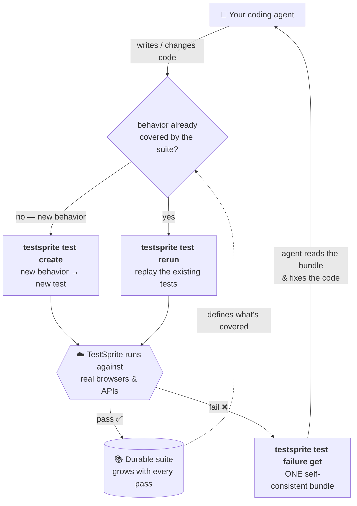

The CLI is built around one idea: **verification should be a loop your coding agent runs continuously, not a gate you hit at the end.** Every time the agent changes code, it verifies the behavior it just touched and banks the result. This page explains the mechanics behind that loop.

## The loop

<Frame>

</Frame>

## The four moves

<Steps>
  <Step title="Ask: is this behavior covered?">
    The durable suite *is* the answer. If the agent just wrote something new, it isn't covered yet. If it touched existing behavior, the suite already has a test for it.
  </Step>
  <Step title="Not covered → create">
    Describe the behavior — as a plan file for frontend tests (`planSteps[]`), or as code (typically Python) for backend tests — then create and run it:

    ```bash
    testsprite test create \
      --project proj_8f0f6 --type frontend \
      --plan-from ./checkout-flow.plan.json \
      --run --wait --output json
    ```

    `--run --wait` chains create → trigger → poll into one blocking command. Exit 0 means the new test passed and is banked.
  </Step>
  <Step title="Already covered → rerun">
    Replay the existing suite so nothing that used to work breaks silently:

    ```bash
    testsprite test rerun --all --project proj_8f0f6 --wait
    ```

    Frontend reruns replay the saved script verbatim — free unless [auto-heal](/cli/core/rerun-and-auto-heal) engages.
  </Step>
  <Step title="Something failed → read the bundle, fix, replay">
    On exit 1, pull the failure bundle — one self-consistent package the agent can act on directly:

    ```bash
    testsprite test failure get test_3a9f21c7 --out ./.testsprite/failure
    # agent reads the bundle, edits the code…
    testsprite test rerun test_3a9f21c7 --wait
    ```

    One bundle in, a code fix out, a replay to confirm. The confirmed pass is banked, and the next iteration reruns rather than recreates.
  </Step>
</Steps>

<Tip>
**Every pass is banked, not thrown away.** The rerun path is free and fast — use it aggressively. Your agent should rerun the relevant suite after every significant change, not just the test it created last.
</Tip>

## Why this design works

<AccordionGroup>
<Accordion title="Why one self-consistent bundle matters" icon="layer-group" defaultOpen>
An agent reasons over whatever context you hand it. If that context mixes a failing step from one run with source code from a *different* run, the agent will confidently "fix" the wrong thing.

`testsprite test failure get` (and `test artifact get`) return a bundle where **every artifact shares one `snapshotId`** — the failing step, its neighbors, the DOM snapshots rendered as text, the test source, and the root-cause hypothesis all describe the same moment. The CLI **refuses** to stitch data across runs or code versions. That's what makes the output safe to feed straight into an agent — no dashboard scraping, no manual screenshot-pasting.
</Accordion>

<Accordion title="Coverage compounds" icon="chart-line">
Every passing test joins a durable suite — a lasting record of every requirement the agent has ever gotten right, far bigger than any context window. As the project grows, the suite grows with it, and the "already covered?" question gets answered by real, replayable tests rather than the agent's memory. A regression is caught the next time the suite runs, not when a user reports it.
</Accordion>

<Accordion title="The cloud is a black box on purpose" icon="cloud">
You describe intent; the cloud does the work; you read structured results. Your agent never has to know *how* the test was driven — only what a real user experienced.

Tests run against your **live product**, not mocks. A frontend test opens a real browser, navigates your app exactly as a user would, and asserts against real behavior. A backend test executes your test code (typically Python) against real API endpoints. This has two consequences:

- **No environment setup on your side.** You don't install a browser engine, configure proxies, or manage versions. The cloud handles it.
- **Results reflect production reality.** If a test fails, something in the real app is wrong — not a test-harness artifact.

<Note>
The CLI does not support `localhost` targets. Testing a localhost app requires the MCP Server, which manages the tunnel for you. See [MCP Server](/mcp/getting-started/introduction).
</Note>
</Accordion>

<Accordion title="A machine-readable contract" icon="code">
`--output json` plus stable exit codes form a contract the loop depends on: every command emits the same JSON shape and the same exit codes across releases, so your agent can branch on results without defensive parsing or dashboard scraping. That stability is what makes the loop safe to run unattended.

See [Output & Scripting](/cli/reference/output-and-scripting#the-json-contract) for the JSON shape, `--dry-run`, jq, and branching patterns.
</Accordion>

<Accordion title="Safe retries" icon="rotate">
Write commands — `project create`, `test create`, `test run`, `test rerun` — all carry an **idempotency key**. The backend deduplicates on this key (time-bounded), so retrying a failed network request never creates a duplicate project, test, or run.

The CLI generates a random key per invocation by default. Pin your own key to make a command repeatable with guaranteed idempotency:

```bash
testsprite test create \
  --project proj_8f0f6 --type backend \
  --name "create order" --code-file ./tests/create_order.py \
  --idempotency-key my-agent-step-42
```

When you replace backend code, a `codeVersion` token guards against silent overwrites — see [Editing & Deleting Tests](/cli/core/editing-tests#editing-a-test).
</Accordion>

<Accordion title="Run-scoped vs latest" icon="code-branch">
The CLI gives you two ways to reach failure artifacts: `test failure get` follows the *latest* failing run (which can shift if a Portal or scheduled run fires mid-loop), while `test artifact get` is pinned to a specific `runId` and never moves. Which one you pick matters whenever multiple runs might overlap.

<Tip>
In agent loops and CI pipelines, always capture the `runId` from `--output json` after triggering a run, then use `test artifact get <run-id>` to download artifacts. This prevents the agent from reasoning over a mismatched bundle if another run lands concurrently.
</Tip>

See [Reading Results](/cli/core/reading-results#pinning-to-a-specific-run) for the full comparison.
</Accordion>
</AccordionGroup>

## Where the CLI fits

The CLI is one of three surfaces over the same backend and data.

<Card title="One Platform, Three Surfaces" href="/cli/getting-started/overview#one-platform-three-surfaces" icon="layer-group" horizontal>
  See how the Web Portal, MCP Server, and CLI compare.
</Card>

<Note>
Schedule creation, billing management, crawl/site discovery, and per-step regeneration stay in the Web Portal. The CLI surface is focused on the test lifecycle: create, run, read, fix, rerun.
</Note>

## Where to Go Next

<Columns cols={2}>
  <Card title="Key Terms" href="/cli/concepts/key-terms" icon="square-code">
    Projects, tests, runs, statuses, credits, scopes, and failure bundles defined
  </Card>
  <Card title="Quickstart" href="/cli/getting-started/quickstart" icon="play">
    Walk through your first test end to end in about 10 minutes
  </Card>
  <Card title="Running Tests" href="/cli/core/running-tests" icon="list-check">
    Triggering runs, waiting for verdicts, and handling every exit code
  </Card>
  <Card title="Agent Integration" href="/cli/core/agent-integration" icon="robot">
    Let your coding agent drive the loop on its own
  </Card>
</Columns>
