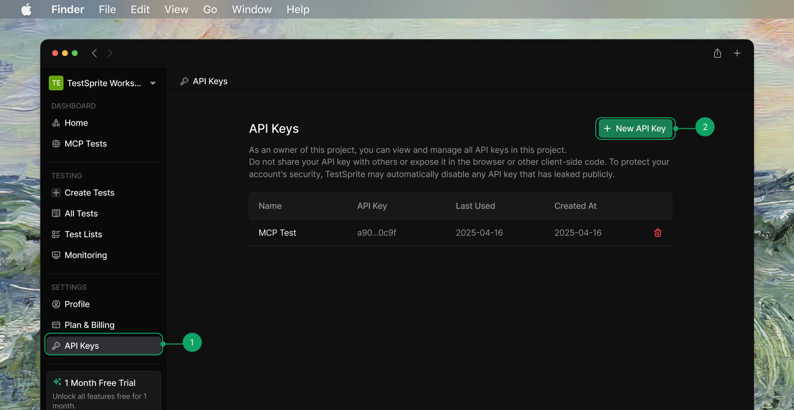
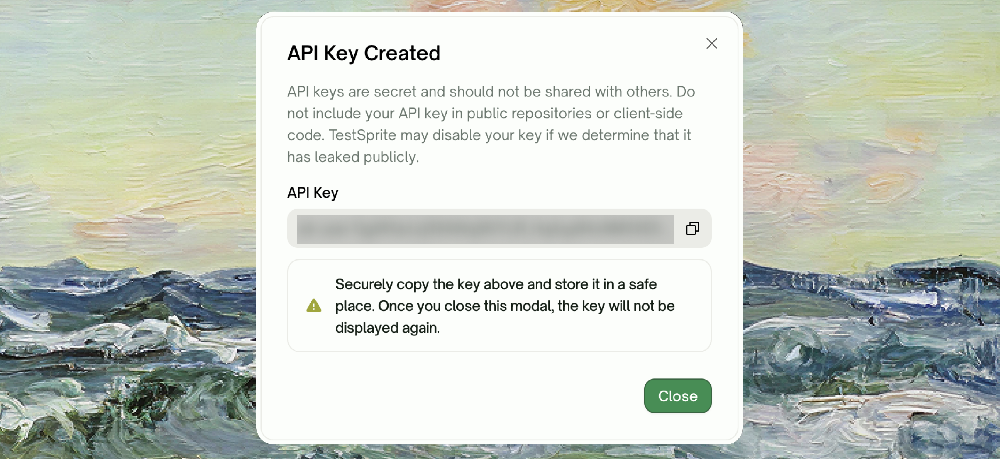

## Prerequisites

Before installing, make sure you have:

- **Node.js 20.19+, 22.13+, or 24+** (the odd-numbered releases 21.x and 23.x are not supported)
- A **TestSprite account** — [Sign up for free <Icon icon="arrow-up-right-from-square" size={12} />](https://www.testsprite.com/auth/cognito/sign-up)
- A **TestSprite API key** (you'll create one in the next section)

<AccordionGroup>
  <Accordion title="How do I check my Node version?">
    Run the following in your terminal:

    ```bash
    node --version
    ```

    The CLI requires **20.19+**, **22.13+**, or **24+** — the odd-numbered releases (21.x, 23.x) aren't supported. If your version doesn't fall in one of those ranges, download a newer release from [nodejs.org <Icon icon="arrow-up-right-from-square" size={12} />](https://nodejs.org/). The CLI also checks the Node version at startup and exits with a clear message if it's too old.
  </Accordion>
  <Accordion title="Where do I get an API key?">
    Sign in to your TestSprite dashboard, navigate to <kbd>Settings → API Keys</kbd>, and click <kbd>Create new key</kbd>. The key is shown exactly once — copy it before closing the dialog. The key you get is a **workspace key** (`sk-member-...`), bound to whichever workspace's page you were on, and capped at 2 active per member per workspace. (TestSprite also has an older **personal key** kind, `sk-user-...` — if you already hold one it keeps working, but new keys are always workspace keys.) If you lose it, revoke it and create a new one — revoke one of the existing keys first if you're already at the cap.

    See [API Keys](/web-portal/admin/api-keys) for the full walkthrough, including personal vs. workspace keys.
  </Accordion>
</AccordionGroup>

## Install

Install the CLI globally with npm:

```bash
npm install -g @testsprite/testsprite-cli
```

Alternatively, run it without installing using npx:

```bash
npx @testsprite/testsprite-cli --version
```

Verify the installation:

```bash
testsprite --version
```

```text
0.3.x
```

The CLI's source code, releases, and issue tracker live on [GitHub](https://github.com/TestSprite/testsprite-cli).

## Get Your API Key

1. Sign in to your [TestSprite dashboard <Icon icon="arrow-up-right-from-square" size={12} />](https://www.testsprite.com/dashboard).
2. Navigate to <kbd>Settings → API Keys</kbd> and click <kbd>Create new key</kbd>.

<Frame>
  
</Frame>

3. Copy the key — it is shown **once only**. If you lose it, revoke it and create a new one. (A workspace key is capped at 2 active per member per workspace — revoke one first if you're already at the limit.)

<Frame>
  
</Frame>

New and grandfathered keys both default to the scopes the CLI needs: `read:me`, `read:projects`, `read:tests`, `write:tests`, and `run:tests`.

## Sign In

<Tabs>
  <Tab title="With the agent skill (recommended)">
    Run `testsprite setup`. It prompts for your API key, verifies it against the platform, and installs the verification skill into your project's agent configuration — all in one step:

    ```bash
    testsprite setup
    ```

    ```text
    TestSprite API key: ********
    TestSprite initialized.

      profile:  default
      env:      production
      email:    alice@example.com
      scopes:   read:me, read:projects, read:tests, write:tests, run:tests

      agent:    claude (installed)

    Next steps:
      # 1. Create your first project (frontend example) — prints a projectId
      testsprite project create --type frontend --name "My App" --url https://your-app.com

      # 2. Generate tests: ask your coding agent (the testsprite-onboard skill is
      #    installed), or create one yourself, then run them:
      testsprite test run --all --project <projectId>

      # Manage installed agent skills
      testsprite agent list
      testsprite agent install --target=<t>   # re-install or install additional targets
    ```

    `setup` chains credential configuration → identity verification → agent skill install. You only need to run it once per project. Pass `--agent <target>` to pick a different coding agent (default `claude`).
  </Tab>
  <Tab title="Credentials only">
    Add `--no-agent` to configure credentials without installing the agent skill:

    ```bash
    testsprite setup --no-agent
    ```

    Then confirm the identity bound to the key:

    ```bash
    testsprite auth status
    ```
  </Tab>
</Tabs>

<Tip>
`testsprite setup` is the single onboarding command — it configures credentials, verifies them, and installs the agent skill in one pass. Add `--no-agent` when you only want credentials.
</Tip>

## Verify

After signing in, confirm the active profile:

```bash
testsprite auth status
```

```text
userId    u_01abc...
name      Alice Example
email     alice@example.com
keyId     key_01xyz...
env       production
scopes    read:me, read:projects, read:tests, write:tests, run:tests
```

If any scopes are missing, the CLI prints a `note:` line telling you which commands will be blocked.

## Using It in CI

In a CI environment, set `TESTSPRITE_API_KEY` as a secret and run setup non-interactively:

```bash
TESTSPRITE_API_KEY=$TS_KEY testsprite setup --from-env --yes
```

`--from-env` reads the key from the environment instead of prompting. `--yes` accepts all defaults without interactive prompts. The CLI never accepts the API key as a positional argument or writes it to logs.

<Card title="CI/CD Integration" href="/cli/integrations/ci-cd" icon="github">
  The full CI setup — pipeline examples and exit code handling
</Card>

## Where to Go Next

<Columns cols={2}>
  <Card title="Quickstart" href="/cli/getting-started/quickstart" icon="play">
    Create a test, run it, and read the failure bundle end to end
  </Card>
  <Card title="Authentication" href="/cli/core/authentication" icon="key">
    Profiles, env vars, scope errors, and rotating keys
  </Card>
  <Card title="Key Terms" href="/cli/concepts/key-terms" icon="book">
    Projects, tests, runs, and the object model
  </Card>
  <Card title="CI/CD Integration" href="/cli/integrations/ci-cd" icon="github">
    Pipeline examples and non-interactive setup
  </Card>
</Columns>
