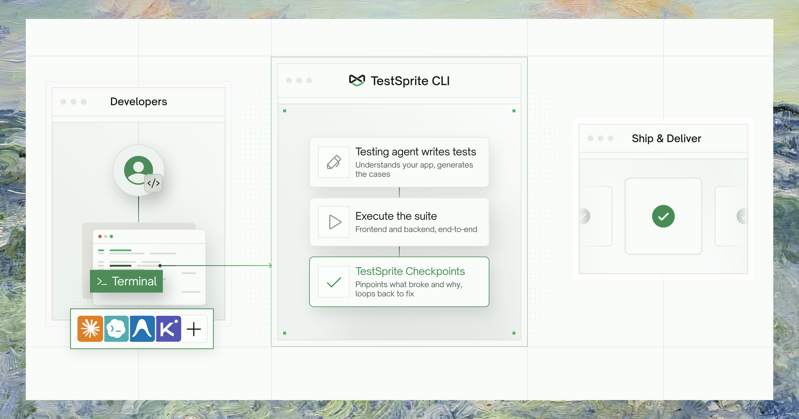

## What is the TestSprite CLI?

**The verification layer for the agentic coding era.** TestSprite is the AI testing platform 100,000+ teams use to test their software — frontend and backend — in the cloud, against the live product, not mocks. The CLI puts that platform in your coding agent's hands: structured output it can parse, exit codes it can branch on, and one self-consistent failure bundle it can act on — no dashboard scraping.
<Frame>
<iframe
  className="w-full aspect-video rounded-xl"
  height="400"
  src="https://www.youtube.com/embed/Le3ZvawrTuI?si=rLM9Y65WmgFRiWzJ"
  frameBorder="0"
  allow="accelerometer; clipboard-write; encrypted-media; gyroscope; picture-in-picture"
  allowFullScreen
></iframe>
</Frame>
The CLI shares the same backend, projects, and tests as the [Web Portal](/web-portal/getting-started/overview) and the [MCP Server](/mcp/getting-started/introduction). A test you create from the terminal shows up in the dashboard, and vice versa.

<Info>
The `--output json` response shape and exit codes are a **stable contract** your agents and CI can rely on — designed to stay backward-compatible as the CLI grows.
</Info>

### Why a CLI for coding agents?

Every step between "agent writes code" and "agent reads what broke" is a manual context-transfer tax. The CLI removes it: your agent describes intent and reads results, never needing to know how the test was driven — only what a real user experienced.
<Frame>
  
</Frame>
<Columns cols={2}>
  <Card title="The manual loop" icon="circle-xmark" horizontal>
    Agent writes code → **you** run the app, click around, screenshot the result, paste it back, and type _"the checkout button is broken on mobile."_
  </Card>
  <Card title="With the CLI" icon="circle-check" horizontal>
    Agent describes intent → triggers a real cloud run → **reads the verdict itself.** No human in the middle.
  </Card>
</Columns>

What broke comes back as **one self-consistent failure bundle** the agent can act on — all anchored to the same snapshot. The CLI refuses to stitch data from two different runs, so an agent never reasons over a frankenstein context:

| In the bundle | What it contains |
| :--- | :--- |
| <kbd>Failing step</kbd> | The exact step that broke, plus its neighbors for context. |
| <kbd>DOM snapshots</kbd> | The DOM at the point of failure — your agent can read it without a vision model. |
| <kbd>Fix guidance</kbd> | A root-cause hypothesis and a recommended fix target. |

<Tip>
**Run any command offline before you have an API key.** Prepend `--dry-run` to emit a canned sample matching the real response shape — no credentials needed. It's the fastest way to learn the surface.
</Tip>

## The verification loop

<Steps>
  <Step title="Install and onboard">
    Install once globally, then run `testsprite setup`. It prompts for your API key, verifies it against the platform, and installs the verification skill into your agent's project — so your agent already knows when and how to run tests.

    ```bash
    npm install -g @testsprite/testsprite-cli
    testsprite setup
    ```
  </Step>
  <Step title="Describe a behavior and create + run a test">
    Describe the behavior you want to verify as a plan file — write it yourself, have your coding agent author it, or let TestSprite generate it. One command then creates the test, triggers a real cloud run against your live app, and blocks until a verdict:

    ```bash
    testsprite test create \
      --project proj_8f0f6 --type frontend \
      --plan-from ./checkout-flow.plan.json \
      --run --wait --output json
    ```

    Exit 0 means the test passed, exit 1 means it failed — you (or your agent) branch on the exit code.
  </Step>
  <Step title="On failure, read the one bundle">
    Pull a self-contained failure bundle — no back-and-forth across endpoints:

    ```bash
    testsprite test failure get test_3a9f21c7 --out ./.testsprite/failure
    ```

    The bundle contains the failing step and its neighbors, DOM snapshots rendered as text, the test source, a root-cause hypothesis, and a recommended fix target.
  </Step>
  <Step title="Fix and rerun — coverage compounds">
    After fixing the code, replay the test cheaply (frontend replay costs no credits):

    ```bash
    testsprite test rerun test_3a9f21c7 --wait
    ```

    Every pass is banked into the durable suite. Next time you ship a change, you rerun rather than recreate — coverage compounds into a lasting record of every requirement you've verified, far bigger than any context window.
  </Step>
</Steps>

## Who It's For

| Audience | What they get |
| :--- | :--- |
| <kbd>AI coding agents</kbd> <br/> _Primary_ | Claude Code, Codex, Cursor, Cline, Antigravity, and similar — the agent drives the loop without a human in the middle. |
| <kbd>Developers at a terminal</kbd> | The same surface, with predictable commands, consistent flags, and machine-readable output. |
| <kbd>CI pipelines</kbd> | Stable `--output json` contract, stable exit codes, and non-interactive `--from-env` auth. |

## One Platform, Three Surfaces

All three surfaces hit the same backend and share the same tests, projects, and runs. Choose by context:

<Tabs>
  <Tab title="Web Portal">
    - **What it's for:** Humans — visual project setup, PRD uploads, test exploration, dashboards, scheduling, billing, and team management.
    - **Best when:** You're starting a new project, reviewing test coverage visually, managing schedules and monitors, or handling billing and credentials.
    - **Limitations:** Not scriptable; not designed for agent-driven loops.

    <Card title="Go to Web Portal docs" href="/web-portal/getting-started/overview" icon="browser" horizontal />
  </Tab>
  <Tab title="MCP Server">
    - **What it's for:** IDE integration for the localhost-dev loop. Lives in your IDE; the agent calls it as a tool during a session.
    - **Best when:** Your app is running on `localhost` — the MCP Server owns the tunnel that exposes it to the cloud runner.
    - **Limitations:** Session-scoped; not scriptable; not CI-compatible.

    <Card title="Go to MCP Server docs" href="/mcp/getting-started/introduction" icon="plug" horizontal />
  </Tab>
  <Tab title="CLI">
    - **What it's for:** The scriptable, agent-safe, CI-compatible surface. Structured JSON output, stable exit codes, non-interactive operation, and durable run artifacts.
    - **Best when:** An agent is driving the verify → fix loop, you're gating a CI pipeline on test results, or you want to read structured failure context without opening a browser.
    - **Limitations:** Does not support `localhost` targets (use MCP + tunnel). Does not create schedules or manage billing (use the Portal).
  </Tab>
</Tabs>

| Capability | Web Portal | MCP Server | CLI |
| :--- | :--- | :--- | :--- |
| Create and run tests | <Icon icon="check" /> | <Icon icon="check" /> | <Icon icon="check" /> |
| Visual dashboards & scheduling | <Icon icon="check" /> | — | — |
| `localhost` targets via tunnel | — | <Icon icon="check" /> | — |
| Agent-driven | — | <Icon icon="check" /> | <Icon icon="check" /> |
| Scriptable / CI | — | — | <Icon icon="check" /> |
| Structured failure bundles | — | <Icon icon="check" /> | <Icon icon="check" /> |
| Billing & org management | <Icon icon="check" /> | — | — |

## Where to Go Next

<Columns cols={2}>
  <Card title="Installation" href="/cli/getting-started/installation" icon="download">
    Install the CLI and sign in in under 2 minutes
  </Card>
  <Card title="Quickstart" href="/cli/getting-started/quickstart" icon="play">
    Create a test, run it, and read what broke — end to end
  </Card>
  <Card title="Key Terms" href="/cli/concepts/key-terms" icon="book">
    Projects, tests, runs, and the concepts behind them
  </Card>
  <Card title="Command Reference" href="/cli/reference/command-reference" icon="terminal">
    Every command, flag, and exit code
  </Card>
</Columns>
