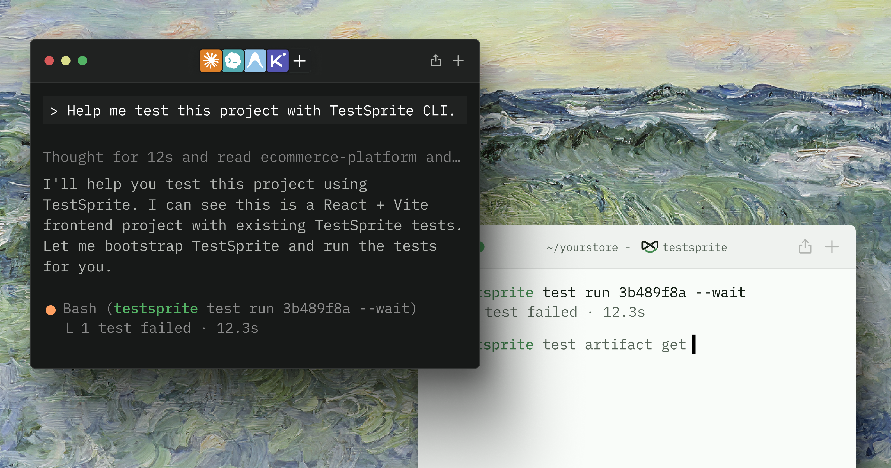

## Two ways to use the CLI

Both start with the same one-minute install.

<Frame>
  
</Frame>

**With your coding agent.** Most users let their coding agent — Claude Code, Codex, Cursor, Cline, Windsurf, Copilot — drive the CLI: you describe what you want in plain language, and the agent creates tests, triggers real cloud runs, reads what broke, fixes the code, and reruns.

**From the terminal.** Prefer typing commands yourself? Every command the agent runs is one you can run directly — switch to the **terminal** tab in Step 2.

## Step 1: Install and run setup

```bash
npm install -g @testsprite/testsprite-cli
testsprite setup
```

Run it once from your repo root and paste your API key when prompted. You're set when you see:

```text
TestSprite initialized.

  profile:  default
  email:    you@example.com
```

<Card title="API Keys" href="/web-portal/admin/api-keys" icon="key" horizontal>
  Create one in the Portal under <kbd>Settings → API Keys</kbd>
</Card>

## Step 2: Run your first test

<Tabs>
  <Tab title="With your coding agent" icon="wand-magic-sparkles">

### 1. Install the skills for your agent

<Note>
Every prompt below is powered by these skills, so take five seconds to install them for the agent you use.
</Note>

The CLI ships two **agent skills** — the instruction manual your coding agent follows: when to run tests, how to read failure bundles, and how to loop until green. Run the command from the root of the repo you're working on — that's where your agent looks for them:

<CodeGroup>

```bash Claude Code
testsprite agent install --target claude
```

```bash Codex
testsprite agent install --target codex
```

```bash Cursor
testsprite agent install --target cursor
```

```bash Other agents
testsprite agent install --target windsurf   # also: cline, antigravity, kiro, copilot
```

</CodeGroup>

<Card title="Coding Agent Integration" href="/cli/core/agent-integration#supported-agents" icon="robot" horizontal>
  All supported agents and where each skill file lands
</Card>

### 2. Say this to your agent

Open your coding agent in the repo and say:

```text icon="message"
Help me test this project with TestSprite CLI
```

That's the whole prompt. The skills you just installed carry the mechanics — your agent will:

1. **Read your codebase** to find the most important user flows (instead of blindly crawling).
2. **Ask you for your deployed app URL** — and login credentials, if your flows need them.
3. **Create a TestSprite project and author a test suite** (~8–15 tests with concrete assertions).
4. **Run the highest-value flows** in the cloud, against your live app, with a real browser.
5. **Report back** with pass/fail verdicts and dashboard links — and quote the credit cost before running anything more.

<Note>
Have the URL and credentials ready; it's the only thing the agent can't figure out from your code.

The CLI tests **deployed** `http(s)://` URLs and rejects `localhost`. If your app only runs locally, use the [MCP Server](/mcp/getting-started/introduction) instead — it owns the tunnel that exposes your local app to the cloud runner.
</Note>

### 3. Make it part of your workflow

This is where the CLI earns its keep: the `testsprite-verify` skill triggers **every time your agent finishes a change** — it finds or creates the covering test, runs it to a verdict, and won't report "done" on an unverified change. Make it a standing instruction:

```text icon="message"
Verify every functional change with TestSprite CLI before you call it done
```

And when a run fails, hand the agent the loop:

```text icon="message"
The TestSprite run failed — pull the failure bundle, fix the code, and rerun until it passes
```

The agent reads the failure bundle (failing step, DOM snapshots, root-cause hypothesis), fixes the code, and reruns. Every confirmed pass is banked into your durable suite, so the next change **reruns** rather than recreates — coverage compounds.

### 4. Keep the agent on track

- **Pin the project.** Commit `.testsprite/config.json` with `{ "projectId": "proj_8f0f6" }` at the repo root so the agent never guesses which project to run against.
- **Costs stay your call.** The agent smoke-runs a few tests, never the full suite — full-suite runs are always your explicit choice, with the credit cost quoted up front.
- **Honesty is by design.** If the agent can't run a test (no credentials, no reachable URL), it says *"shipped but unverified because X"* rather than pretending.

<Card title="Coding Agent Integration" href="/cli/core/agent-integration" icon="robot" horizontal>
  What the installed skills do in detail, all eight agent targets, and skill health checks
</Card>

  </Tab>
  <Tab title="From the terminal" icon="terminal">

<Tip>
Prepend `--dry-run` to any command to try the surface offline with no API key. The CLI emits a canned sample matching the real response shape.
</Tip>

### 1. Find or create your project

```bash
testsprite project list
```

```text
ID             NAME             TYPE       FROM      CREATED
proj_8f0f6...  Checkout App     frontend   portal    2026-05-01
proj_2c4a1...  Orders API       backend    cli       2026-05-10
```

To create a new frontend project, pass the target URL:

```bash
testsprite project create \
  --type frontend \
  --name "Checkout App" \
  --url https://app.example.com
```

<Note>
The CLI only supports public `http://` or `https://` URLs. For `localhost` targets, use the [MCP Server](/mcp/getting-started/introduction), which owns the tunnel that exposes your local app to the cloud runner.
</Note>

### 2. Create and run a test

Supply a plan file that describes the behavior to verify — a JSON file with `projectId`, `type`, `name`, and a `planSteps[]` array. Then `--run --wait` triggers a real cloud run and blocks until the verdict:

```bash
testsprite test create \
  --project proj_8f0f6 \
  --type frontend \
  --plan-from ./checkout-flow.plan.json \
  --run --wait \
  --output json
```

The test runs against your live app in a real browser — not mocks:

```text
exit 0  →  test passed
exit 1  →  test failed or blocked
```

Your CI pipeline or script branches on the exit code. The `--output json` shape is a stable contract you can parse, and includes a `dashboardUrl` field that deep-links into the Portal for human review.

### 3. When it fails, get the bundle

Start with a one-screen triage card:

```bash
testsprite test failure summary test_3a9f21c7
```

```text
testId              test_3a9f21c7
status              failed
failureKind         element_not_found
snapshotId          snap_9b2c...
rootCauseHypothesis The "Place Order" button selector changed after the recent redesign.
recommendedFixTarget checkout.tsx line 42 — button aria-label
```

Then download the full failure bundle — the failing step and its neighbors, DOM snapshots rendered as text, the test source, and a recommended fix target, all from the same run:

```bash
testsprite test failure get test_3a9f21c7 --out ./.testsprite/failure
```

<Note>
`test failure get` always fetches the **latest** failure. If multiple runs are in flight, use `testsprite test artifact get <run-id>` to pin the bundle to a specific run.
</Note>

### 4. Fix and rerun

After editing the code, replay the test:

```bash
testsprite test rerun test_3a9f21c7 --wait
```

```text
runId      run_5c1d...
status     passed
Dashboard: https://www.testsprite.com/dashboard/tests/proj_8f0f6/test/test_3a9f21c7
```

Exit 0. The test is banked into the durable suite — the next change reruns rather than recreates, and coverage compounds.

<Info>
**Auto-heal** is on by default and uses a small amount of credit only when it actually repairs a drifted step — see [Rerun & Auto-Heal](/cli/core/rerun-and-auto-heal#auto-heal).
</Info>

  </Tab>
</Tabs>

## Where to Go Next

<Columns cols={2}>
  <Card title="Coding Agent Integration" href="/cli/core/agent-integration" icon="robot">
    All eight agent targets, install flags, skill health checks, and what the skills teach your agent
  </Card>
  <Card title="The Agent Loop" href="/cli/concepts/the-agent-loop" icon="arrows-rotate">
    Why the loop is designed this way — self-consistent bundles and compounding coverage
  </Card>
  <Card title="Creating Tests" href="/cli/core/creating-tests" icon="file-circle-plus">
    Plan files, code files, batch create, and dependency authoring
  </Card>
  <Card title="Command Reference" href="/cli/reference/command-reference" icon="terminal">
    Every command, flag, and exit code in one place
  </Card>
</Columns>
