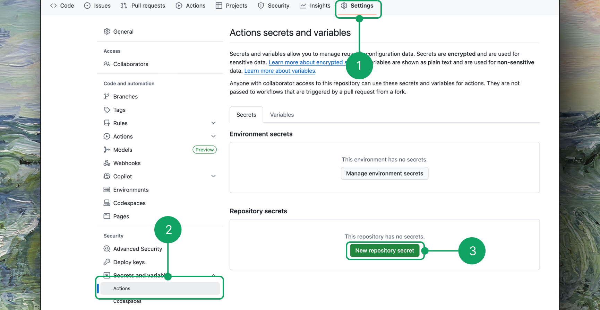

## Why the CLI is CI-friendly

The `testsprite` CLI is designed from the ground up for unattended execution:

- **Non-interactive auth** — set `TESTSPRITE_API_KEY` as a secret; the CLI never prompts when the variable is present.
- **Stable `--output json`** — every command emits a machine-readable JSON envelope that your pipeline can parse and forward.
- **Stable exit codes** — exit 0 means the run passed; any non-zero exit lets the shell fail the job. No text scraping required.

## Authenticating in CI

Set your API key as a repository or environment secret. In GitHub, go to <kbd>Settings → Secrets and variables → Actions</kbd> and click <kbd>New repository secret</kbd>:

<Frame>
  
</Frame>

Then expose it to the job:

```yaml
env:
  TESTSPRITE_API_KEY: ${{ secrets.TESTSPRITE_API_KEY }}
```

The CLI resolves `TESTSPRITE_API_KEY` before the credentials file, so no `testsprite auth configure` step is needed in CI.

<Warning>
**Important:** Never inline an API key in a workflow file or a script committed to version control. Always source it from a secret store.
</Warning>

In most pipelines the env var alone is enough — you don't need to run any auth command. If you do need a credentials file on disk (for other tooling), write one non-interactively from the same env var:

```bash
testsprite auth configure --from-env
```

Or run the full one-shot onboarding without the agent-skill install:

```bash
testsprite init --from-env --yes --no-agent
```

Both read `TESTSPRITE_API_KEY` from the environment and write `~/.testsprite/credentials`; `init` also verifies the key and prints an identity summary.

## Gating on the result

The CLI exits non-zero whenever a run does not pass — failed, blocked, cancelled, or timed out. Your shell or CI runner treats that as a job failure automatically.

```bash
testsprite test run test_3a9f21c7 --wait --output json > result.json
# exit 0 = passed; any other exit fails the step
```

On failure you can pull the artifact before the job ends:

```bash
testsprite test run test_3a9f21c7 --wait --output json > result.json || \
  testsprite test failure get test_3a9f21c7 --out ./.testsprite/failure
```

## A GitHub Actions workflow

The example below runs all backend tests in a project on every pull request and fails the job if any test does not pass:

```yaml
name: TestSprite

on:
  pull_request:

jobs:
  testsprite:
    runs-on: ubuntu-latest
    env:
      TESTSPRITE_API_KEY: ${{ secrets.TESTSPRITE_API_KEY }}
      PROJECT_ID: proj_8f0f6

    steps:
      - uses: actions/checkout@v4

      - uses: actions/setup-node@v4
        with:
          node-version: 20

      - name: Install TestSprite CLI
        run: npm install -g @testsprite/testsprite-cli

      - name: Run tests
        run: |
          testsprite test run --all --project "$PROJECT_ID" \
            --wait --output json > result.json

      - name: Download failure artifacts
        if: failure()
        run: |
          testsprite test failure get \
            "$(jq -r '.run.testId' result.json)" \
            --out ./.testsprite/failure

      - name: Upload failure bundle
        if: failure()
        uses: actions/upload-artifact@v4
        with:
          name: testsprite-failure
          path: ./.testsprite/failure
```

<Tip>
`--all` runs every backend test in the project in wave order — producers first, teardown last — so dependencies are always satisfied. For frontend tests, pass an explicit `test-id` or loop over `testsprite test list --project "$PROJECT_ID" --output json`.
</Tip>

## Parsing JSON output

Pipe `--output json` to `jq` to extract fields for downstream steps:

```bash
testsprite test run test_3a9f21c7 --wait --output json \
  | jq '.run.status'
```

```text
"passed"
```

Read the dashboard link for a PR comment or Slack notification:

```bash
testsprite test run test_3a9f21c7 --wait --output json \
  | jq -r '.run.dashboardUrl'
```

The top-level `run` object contains `status`, `runId`, `startedAt`, `finishedAt`, `codeVersion`, and `dashboardUrl` (when the backend returns a portal link).

## Rate limits and retries

The server caps run-triggers at **60 per minute per key**. The CLI throttles itself to **50 per minute** and automatically retries `RATE_LIMITED` responses, honoring the `Retry-After` header (capped at 3 retries).

For large batches, tune the in-flight concurrency:

```bash
testsprite test run --all --project "$PROJECT_ID" \
  --wait --max-concurrency 20
```

For slow networks or a slow first request, increase the per-request timeout:

```bash
testsprite test run test_3a9f21c7 --wait \
  --request-timeout 300
```

Reuse an `--idempotency-key` to make retries safe — if the server already accepted the request with that key, it returns the original response instead of triggering a duplicate run:

```bash
testsprite test run test_3a9f21c7 --wait \
  --idempotency-key "ci-run-${{ github.run_id }}-${{ github.run_attempt }}"
```

## Handling exit codes

The exit code is your primary signal. Two codes deserve special handling in a pipeline:

| Code | Meaning | Recommended action |
| :--- | :--- | :--- |
| `11` | Rate limited | Honor `Retry-After`; the CLI retries automatically, but if you hit it outside a run command, back off and retry |
| `12` | Insufficient credits | Non-retriable — top up your balance before re-queuing the job |

All other non-zero exits (auth error, test not found, network failure, test failed) should fail the job and surface the artifact.

<Card title="Exit Codes" href="/cli/reference/exit-codes" icon="square-code">
  The complete exit-code table
</Card>

## Where to Go Next

<Columns cols={2}>
  <Card title="Coding Agent Integration" href="/cli/core/agent-integration" icon="robot">
    Let your agent drive the verification loop without a human in the middle
  </Card>
  <Card title="Running Tests" href="/cli/core/running-tests" icon="list-check">
    All flags and modes for triggering and waiting on runs
  </Card>
  <Card title="Exit Codes" href="/cli/reference/exit-codes" icon="square-code">
    Full exit-code table for branching your pipeline
  </Card>
  <Card title="Configuration" href="/cli/reference/configuration" icon="gear">
    Env vars, profiles, and per-request timeouts
  </Card>
</Columns>
