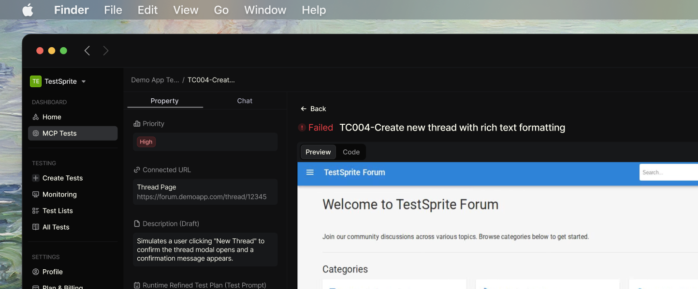
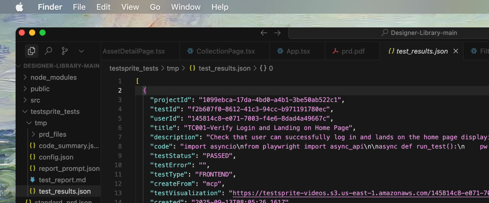
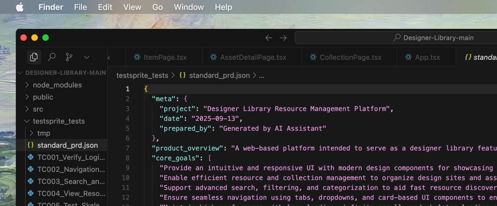
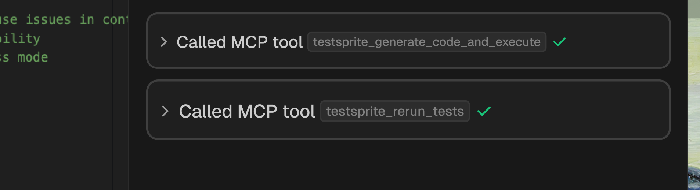

## Why Healing & Observability

Stable tests need two things:
- **Strong observability** to tell you what failed and why
- **Safe, automated healing** to fix brittle tests and non-functional drift without busywork

<Tip>TestSprite pairs both, so your suites stay reliable as the app evolves.</Tip>

## Observability Signals Collected

During planning, generation, and execution, TestSprite captures rich artifacts to explain outcomes and accelerate fixes.

<Tabs>
  <Tab title="Execution Artifacts">
       <Frame>
      
    </Frame>

    TestSprite captures detailed execution artifacts:

    - Screenshots and videos (for UI paths)
    - Console logs and network traces
    - HTTP requests/responses with headers and payloads
  </Tab>
  <Tab title="Structured Results">

       <Frame>
      
    </Frame>
    Test results are organized with structured data:

    - Per-test status with timestamps and duration
    - Assertions and failure locations
    - Categorization: functional, error handling, auth, boundary, edge, concurrency, UI/UX
  </Tab>
  <Tab title="Context Files">
       <Frame>
    
    </Frame>
    Context information helps understand test execution:

    - Code summary, normalized PRD, and test plans used
    - Environment details (frameworks, ports, config)
  </Tab>
</Tabs>

<Info>All artifacts are summarized into human-readable reports and machine-readable JSON under `testsprite_tests/`.</Info>

## Failure Classification

When a test fails, TestSprite classifies the root cause to determine the right remediation path:

- **Product Bug:** behavior contradicts PRD/plan expectations
- **Test Fragility:** locator drift, timing mismatch, transient UI state
- **Environment Issue:** service not running, port mismatch, credentials missing
- **Contract Violation:** response schema/shape breaks API guarantees

<Info>Classification drives both the report and any automated healing actions.</Info>

## Flakiness Detection

Intermittent failures are detected by patterns in timing, retries, and run-to-run variance:
- **Identical steps** failing at different points in time
- Pass/fail **toggling** without code changes
- **High sensitivity** to network latency, animations, or loading spinners

<Info>For flaky cases, TestSprite proposes stable waits, resilient selectors, and idempotent flows.</Info>

## Auto-Healing Strategies

Healing focuses on making tests robust without masking real bugs.

<Tabs>
  <Tab title="UI Selectors & Timing">
    Healing strategies for UI test stability:

    - Prefer **role/label/text-first selectors** over brittle CSS/XPath
    - Add **deterministic waits** (network idle, specific element visible)
    - Defer actions until the page reaches a **known ready state**
  </Tab>
  <Tab title="Test Data & State">
    Healing strategies for test data and state management:

    - Generate **deterministic test data** and fixtures
    - **Reset state between tests**; clean up leaked sessions
  </Tab>
  <Tab title="Env & Config">
    Healing strategies for environment and configuration issues:

    - Correct known port/app start issues with **targeted guidance**
    - Suggest **missing credentials/env vars** in the portal
  </Tab>
  <Tab title="API Contracts">
    Healing strategies for API contract validation:

    - Tighten schema assertions to **actual contract**
    - Add nullability and pagination **boundary cases** where appropriate
  </Tab>
</Tabs>

<Info>Healing is applied automatically when safe; otherwise, it’s proposed for review in your IDE.</Info>

## End-to-End Repair Flow

<Card>

</Card>

- **Execute and Collect**: Run tests, record artifacts, produce structured results
- **Analyze and Classify**: Determine bug vs. fragility vs. environment vs. contract issue
- **Decide Healing Path**: Apply safe auto-fixes (selectors, waits, fixtures). Propose code edits when human approval is prudent
- **Verify**: Re-run impacted tests to confirm stability and correctness
- **Report**: Update reports, annotate what was auto-healed vs. manually approved

## How This Connects to the Lifecycle

Healing and observability are embedded across the lifecycle:
- **Discover & Plan**: baseline PRD/plan informs assertions and oracles
- **Generate**: tests are authored with resilient defaults
- **Execute**: artifacts captured for every run
- **Analyze**: failures classified with actionable next steps
- **Heal & Maintain**: automated and proposed fixes applied
- **Report & Integrate**: signals flow to CI/CD quality gates

<Card title="Test Types & Lifecycle" href="/mcp/concepts/test-type-lifecycle" icon="arrows-spin">
  Learn more about test types and lifecycle stages
</Card>

## Using Healing with the MCP Tools

       <Frame>
      
    </Frame>

- The execution tool **generates artifacts** and **classifies failures**.
- The rerun tool **validates fixes** and **stabilizes previously failing flows**.

<Columns cols={3}>
  <Card title="MCP Tools Reference" href="/mcp/core/tools">
    Explore TestSprite MCP tools and commands
  </Card>
  <Card title="Test Types & Lifecycle" href="/mcp/concepts/test-type-lifecycle">
    Understand the complete testing workflow
  </Card>
  <Card title="Key Terms" href="/mcp/concepts/key-terms">
    Learn essential TestSprite concepts
  </Card>
</Columns>

## Best Practices

<AccordionGroup>
  <Accordion title="Prefer semantic selectors">
    Use roles, labels, test-ids maintained by the app for more resilient tests.
  </Accordion>
  <Accordion title="Make state explicit">
    Use login helpers, seeded data, and cleanup hooks to ensure consistent test state.
  </Accordion>
  <Accordion title="Treat retries as diagnostics">
    Use retries to identify issues, not as permanent solutions to test problems.
  </Accordion>
  <Accordion title="Keep contracts explicit">
    Include schemas and acceptance criteria in PRD and plans for better test reliability.
  </Accordion>
  <Accordion title="Review proposed healing diffs">
    Review and approve proposed healing diffs before approving large behavior changes.
  </Accordion>
</AccordionGroup>

## What You’ll See in Reports

       <Frame>
      
    </Frame>

- Clear **pass/fail** per test with **category and priority**
- **Linked screenshots/videos** for failing UI steps
- **Request/response diffs** for API mismatches
- **Next actions**: re-run scope, suggested code edits, and configuration tips

