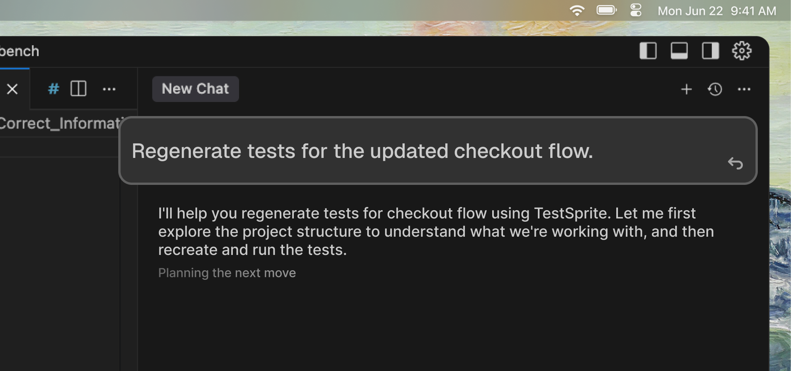
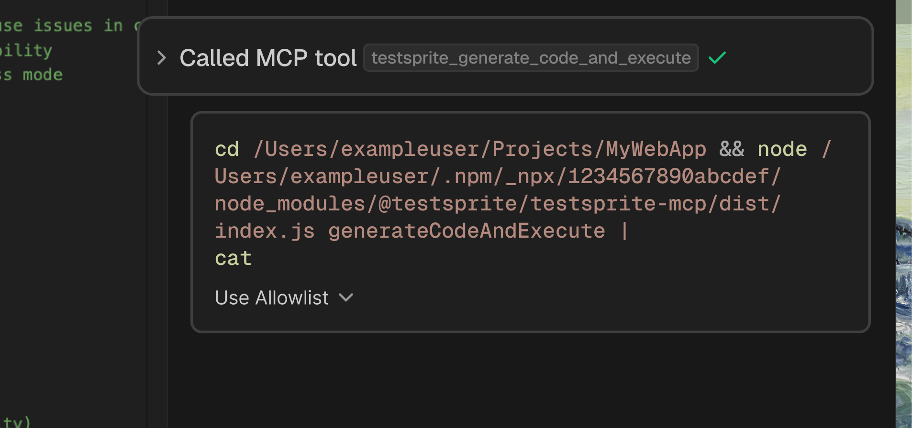
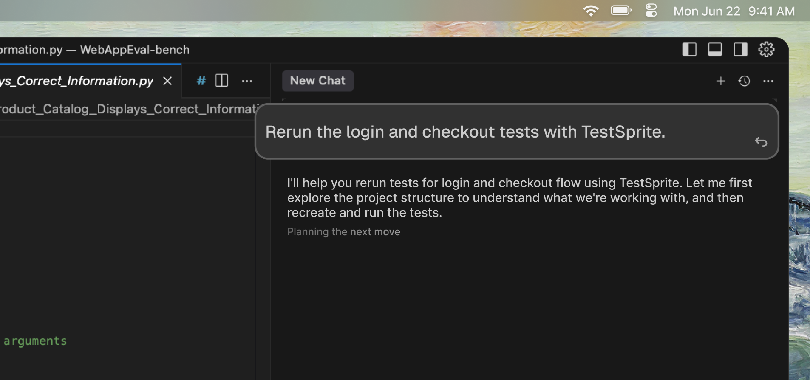
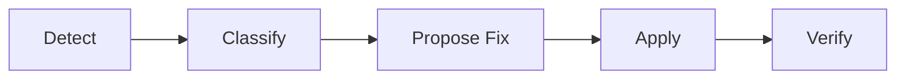
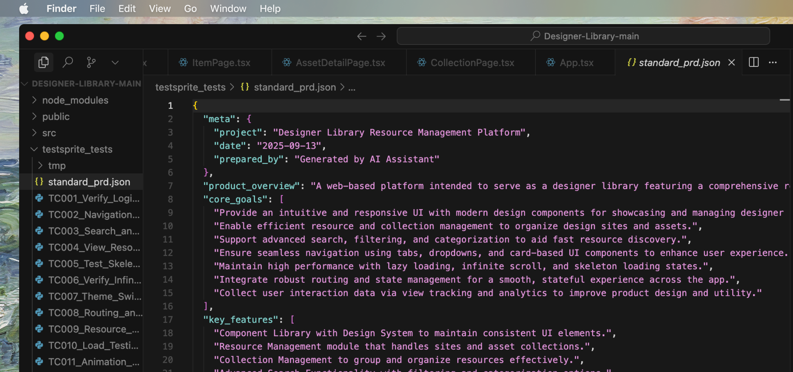
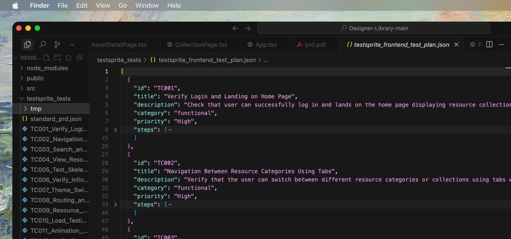

## Generate & Regenerate

These actions control how TestSprite creates and updates your test suite. <kbd>Generate</kbd> creates new tests for the first time, while <kbd>Regenerate</kbd> recreates existing tests from scratch when your application or requirements change significantly.

### Generate
Create tests for the **first time** based on your PRD and project.

 <Frame>
  
</Frame>
<br />
<Tabs>
  <Tab title="Example prompt">
    Use this prompt to get started with testing your project:

    ```text
    Help me test this project with TestSprite.
    ```
  </Tab>
  <Tab title="When to use">
    Use <kbd>Generate</kbd> when you need to create tests for the first time:

    - Starting with a new project
    - Adding tests to an existing project without tests
    - Creating initial test coverage
  </Tab>
  <Tab title="What happens">
    <kbd>Generate</kbd> follows this workflow:

    1. Analyzes your code
    2. Creates test plans
    3. Generates test files
    4. Executes the tests
  </Tab>
</Tabs>


### Regenerate
**Recreate tests** from scratch based on updated PRD and code.

 <Frame>
  
</Frame>
<br />
<Tabs>
  <Tab title="Example prompt">
    Use this prompt to regenerate tests after significant changes:

    ```text
    Regenerate tests for the updated checkout flow.
    ```
  </Tab>
  <Tab title="When to use">
    Use <kbd>Regenerate</kbd> when you need to recreate tests from scratch:

    - Your app changed significantly (new features, refactored flows)
    - Test plans need updating to match new requirements
    - You want fresh test coverage reflecting current state
  </Tab>
  <Tab title="What happens">
    <kbd>Regenerate</kbd> follows this workflow:

    1. Re-analyzes your code
    2. Updates test plans
    3. Generates new test files
    4. Executes the new tests
  </Tab>
</Tabs>

<Card title="Regenerate Tests" href="/mcp/core/regenerate-tests" icon= "repeat">
  Learn more about how to regenerate tests from scratch
</Card>

## Run & Rerun

These actions control how TestSprite executes your tests. <kbd>Run</kbd> executes newly generated tests for the first time, while <kbd>Rerun</kbd> executes previously generated tests again without regenerating them.

### Run
**Execute newly generated tests** for the first time.

 <Frame>
  
</Frame>
<br />

<Tabs>
  <Tab title="When to use">
    Use <kbd>Run</kbd> when executing tests for the first time:

    - After generating tests
    - Initial validation of your application
    - First-time test execution
  </Tab>
  <Tab title="What happens">
    <kbd>Run</kbd> follows this workflow:

    1. Executes generated test files
    2. Collects results and artifacts
    3. Generates test reports
  </Tab>
</Tabs>

### Rerun
Execute **previously generated tests** again without changing them.

 <Frame>
  
</Frame>
<br />

<Tabs>
  <Tab title="Example prompt">
    Use this prompt to rerun existing tests:

    ```text
    Rerun the login and checkout tests with TestSprite.
    ```
  </Tab>
  <Tab title="When to use">
    Use <kbd>Rerun</kbd> when executing existing tests again:

    - Validating fixes you just applied
    - Confirming tests pass after app restart
    - Quick smoke check with existing tests
  </Tab>
  <Tab title="What happens">
    <kbd>Rerun</kbd> follows this workflow:

    1. Uses existing test files (no regeneration)
    2. Runs them against current app state
    3. Reports updated results
  </Tab>
</Tabs>

<Card title="Rerun Tests" href="/mcp/core/rerun-tests" icon="forward">
  Learn more about how to rerun existing tests
</Card>

## Healing

Automatic or semi-automatic **fixes to brittle tests that fail due to non-functional changes** (not real bugs), making tests robust without masking actual product issues.

<Card>

</Card>

<Tabs>
  <Tab title="Common healing scenarios">
    <kbd>Healing</kbd> addresses these common test fragility issues:

    - **UI Selectors:** Updates when element IDs/classes change (e.g., `#login-btn` → `[data-testid="login"]`)
    - **Timing Issues:** Adjusts waits for slow-loading components or animations
    - **Test Data:** Updates fixtures when data schemas change
    - **Environment:** Corrects port mismatches, missing credentials, or configuration issues
    - **API Contracts:** Tightens schema assertions to match actual API responses
  </Tab>
  <Tab title="How it works">
    When a test fails for reasons that look like fragility (not a product bug), TestSprite proposes a fix and verifies it works. Low-risk fixes apply automatically; larger changes ask for approval.
  </Tab>
    <Tab title="Example">
    Here's an example of how healing works:

    ```
    Test failed: Login button reference outdated
    Healing: Updated test to match the new login element
    Status: Auto-applied, test now passing
    ```
  </Tab>
</Tabs>

### What Healing Is vs. What It's Not

Understanding the difference between healing and masking bugs is crucial. Healing only fixes test fragility caused by non-functional changes, never real product issues.

| What Healing is Not | What Healing Is |
| :--- | :--- |
| <Icon icon="x" size={16} color="#ef4444" /> Masking real product bugs | <Icon icon="check" size={16} color="#22c55e" /> Making tests resilient to non-functional code changes |
| <Icon icon="x" size={16} color="#ef4444" /> Making tests pass when they should fail | <Icon icon="check" size={16} color="#22c55e" /> Reducing test maintenance busywork |

## Test Scope

Defines **which parts of your codebase** TestSprite will analyze and test.

 <Frame>
  
</Frame>

TestSprite offers two scope options to balance between comprehensive coverage and speed. Choose based on your testing needs and development workflow.

| Features | Codebase | Code Diff |
| :--- | :--- | :--- |
| What it tests | Tests the entire project | Tests only changed files/features (based on git diff) |
| Use cases | New projects, major releases, comprehensive audits | Feature branches, incremental development, quick validation |
| Speed | Takes longer | Fast feedback |
| Coverage | Full coverage | Recent changes only |

<Info>Set the scope in the bootstrapping page when you call the `testsprite_bootstrap_tests` tool. </Info>

<Card title="MCP Tools Reference" href="/mcp/core/tools" icon="wrench">
  Learn more about TestSprite MCP tools and commands
</Card>

## PRD & Normalized PRD

TestSprite uses Product Requirements Documents (PRD) to understand your project and generate appropriate tests. While you can provide PRDs in any format, TestSprite converts them into a standardized Normalized PRD format for consistent test generation.

### PRD (Product Requirements Document)
Your **original documentation** describing what your product should do.

 <Frame>
  
</Frame>

**Can be:**
- Informal notes or README
- Formal specification documents
- Jira tickets or user stories
- Design docs or wikis

### Normalized PRD
TestSprite's **standardized Product Requirements Document format** that ensures consistent and smooth test generation regardless of your original PRD style.

 <Frame>
  
</Frame>

<Tabs>
  <Tab title="What's in it">
    The <kbd>Normalized PRD</kbd> contains structured information:

    - Product overview and goals
    - Core features with acceptance criteria
    - User flows and validation rules
    - Technical context from code analysis
  </Tab>
  <Tab title="Why it matters">
    Understanding why <kbd>Normalized PRD</kbd> exists:

    - Your PRD might be in any format
    - TestSprite converts it to a structured format
    - This normalized PRD drives test plan generation
  </Tab>
</Tabs>

<Tip>TestSprite **invented** this format to make test generation predictable across any project type.</Tip>

<Card title="Create Tests for New Projects" href="/mcp/core/create-tests-new-project" icon="bars-progress">
  Learn how to create tests using PRD and Normalized PRD
</Card>

## Test Plan

A **structured list** of test cases generated by TestSprite based on your normalized PRD and code analysis.

 <Frame>
  
</Frame>

<Tabs>
  <Tab title="Example">
    Here's an example of a test plan entry:

    ```json expandable
    {
      "id": "TC001",
      "title": "Login with valid credentials",
      "category": "functional",
      "priority": "High",
      "steps": [...]
    }
    ```
  </Tab>
  <Tab title="Contains">
    A <kbd>Test Plan</kbd> typically includes:

    - Test case IDs (TC001, TC002, etc.)
    - Descriptions and steps
    - Categories (functional, security, UI, etc.)
    - Priorities (High, Medium, Low)
    - Expected outcomes
  </Tab>
</Tabs>

<Info>Plans are saved as `frontend_test_plan.json` or `backend_test_plan.json`.</Info>

## Where to Learn More

<Columns cols={2}>
  <Card title="Test Types & Lifecycle" href="/mcp/concepts/test-type-lifecycle">
    Understand what we test and when
  </Card>
  <Card title="Healing & Observability" href="/mcp/concepts/healing-observability">
    Deep dive into auto-healing
  </Card>
  <Card title="MCP Tools Reference" href="/mcp/core/tools">
    Technical tool parameters
  </Card>
  <Card title="Create Tests for New Change" href="/mcp/core/create-tests-new-feature">
    Practical diff-scope usage
  </Card>
</Columns>

