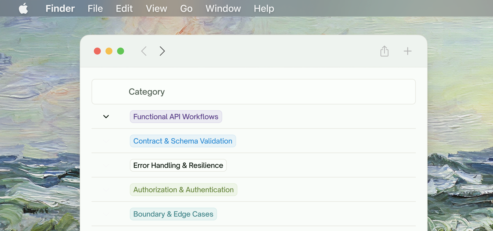
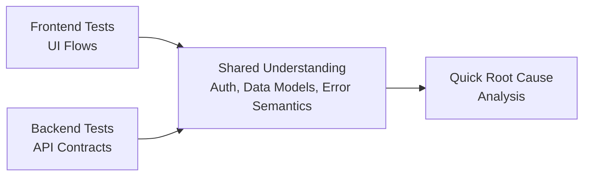

## Supported Test Types

TestSprite focuses on end-to-end value delivery, covering both frontend user journeys and backend service behaviors. The following categories map to what you saw in [Overview](/mcp/getting-started/overview) and are generated automatically by the MCP server.

 <Frame>
  
</Frame>

 

<Tabs>
  <Tab title="Frontend (UI & Business-Flow Integration)">
    - **User Journey Navigation**: Multi-step workflows, page transitions, deep linking, browser history, and route guards
    - **Form Flows & Validation**: Input validation, error messages, field dependencies, submission handling, and data persistence
    - **Visual States & Layouts**: Component rendering, responsive design, loading states, empty states, and accessibility compliance
    - **Interactive Components & Stateful UI**: Dropdowns, modals, tabs, accordions, drag-and-drop, state persistence, and real-time updates
    - **Authorization & Auth Flows**: Login/logout, protected routes, role-based UI visibility, session management, and token refresh
    - **Error Handling (UI)**: Toast notifications, modal dialogs, inline errors, validation feedback, and graceful degradation
  </Tab>
  <Tab title="Backend (API & Integration)">
    - **Functional API Workflows**: Endpoint behavior, multi-step workflows, service orchestration, and cross-service integration patterns
    - **Contract & Schema Validation**: Request/response schemas, data types, required fields, serialization formats, and API versioning
    - **Error Handling & Resilience**: Status codes, error response bodies, retry logic, backoff strategies, timeout handling, and graceful degradation
    - **Authorization & Authentication**: Token validation, role-based access control, permission scopes, session management, and credential handling
    - **Boundary & Edge Cases**: Payload size limits, pagination behavior, null/empty values, malformed inputs, and constraint validation
    - **Data Integrity & Persistence**: Data consistency, transaction handling, idempotency, state management, and database constraints
    - **Security Testing**: Common vulnerabilities (injection, XSS, CSRF), authentication bypass, authorization flaws, data exposure, and security misconfigurations
  </Tab>
</Tabs>

<Tip>The agent chooses the right mix per project, auto-generates plans, then produces executable tests (e.g., Playwright/Cypress for UI; language-appropriate clients for APIs).</Tip>

## Test Lifecycle

TestSprite’s lifecycle is designed to be continuous and IDE-native.

<Steps>
  <Step title="Discover & Understand">
    Analyze codebase structure, dependencies, and routes/endpoints. Normalize requirements into a TestSprite PRD.
  </Step>
  <Step title="Plan">
    Generate test plans per feature, mapping to the test types above. Prioritize critical paths and regressions.
  </Step>
  <Step title="Generate">
    Create runnable test code and fixtures. Synthesize data and environment configuration as needed.
  </Step>
  <Step title="Execute">
    Run tests in isolated environments with reliable orchestration. Capture artifacts: logs, traces, screenshots, videos.
  </Step>
  <Step title="Analyze">
    Classify failures (product bug vs. test fragility vs. environment). Summarize impact and correlate to code changes.
  </Step>
  <Step title="Heal & Maintain">
    Auto-update brittle selectors, data, and flows when safe. Propose edits when human approval is prudent.
  </Step>
  <Step title="Report & Integrate">
    Publish readable reports in your IDE and portal. Output signals for CI/CD quality gates.
  </Step>
</Steps>

## How Frontend and Backend Tests Work Together

<Card>

</Card>
- UI flows validate end-to-end behavior as a user would experience it
- API tests validate service contracts directly for faster feedback
- The two layers share understanding of auth, data models, and error semantics to pinpoint root causes quickly

## Where to Go Next

<Columns cols={2}>
  <Card title="Overview" href="/mcp/getting-started/overview">
    High-level capabilities and supported types
  </Card>
  <Card title="Create Tests for a New Project" href="/mcp/core/create-tests-new-project">
    First-time setup
  </Card>
  <Card title="Create Tests for a New Feature" href="/mcp/core/create-tests-new-feature">
    Expand coverage incrementally
  </Card>
  <Card title="Continuous Monitoring" href="/mcp/core/continuous-monitoring">
    Keep coverage healthy over time
  </Card>
  <Card title="Test Maintenance" href="/mcp/maintenance/test-maintenance">
    Strategies for stability and speed
  </Card>
  <Card title="Test Execution Issues" href="/mcp/troubleshooting/test-execution-issues">
    Diagnose and resolve failures
  </Card>
</Columns>