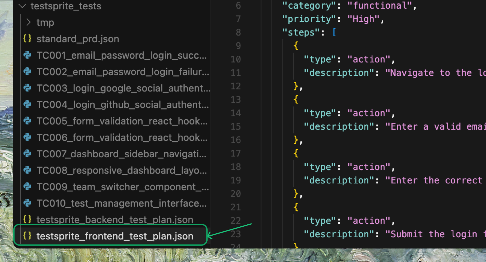

<Steps>
  <Step title="Open the TestSprite test plan file">
    Open the TestSprite test plan file (e.g.`testsprite_frontend_test_plan.json`).
    
    <Frame>
    
    </Frame>
  </Step>
  
  <Step title="Add new test cases">
    Append new test cases at the end, following the **same format** as the existing ones. If you have test cases from **another tool or platform**, paste them in and make sure they follow **the same style**.
    <Note>You can also use AI IDEs like Cursor or Trae to help reformat them to match TestSprite's standard.</Note>

    ```json Expandable Test Case Example
    ### New Test Case
    {
      "id": "TC013",
      "title": "Admin Dashboard User and Category Management",
      "description": "Verify that admin users can create, edit, and delete categories and manage user roles and content moderation from the admin dashboard with immediate effect.",
      "category": "functional",
      "priority": "High",
      "steps": [
        {
          "type": "action",
          "description": "Login as admin user"
        },
        {
          "type": "action",
          "description": "Navigate to the admin dashboard"
        },
        {
          "type": "action",
          "description": "Create a new forum category"
        },
        {
          "type": "assertion",
          "description": "New category appears in the category list"
        },
        {
          "type": "action",
          "description": "Edit an existing category's name or description"
        },
        {
          "type": "assertion",
          "description": "Edits are saved and reflected in the UI"
        },
        {
          "type": "action",
          "description": "Delete a category"
        },
        {
          "type": "assertion",
          "description": "Category is removed and related threads are handled appropriately"
        },
        {
          "type": "action",
          "description": "Change a user's role from user to moderator"
        },
        {
          "type": "assertion",
          "description": "Role changes take effect immediately and permissions update"
        }
      ]
    }
    ```
  </Step>
  
  <Step title="Prompt your IDE">
    Once added, prompt your IDE:

    ```text Example Prompt
    Rerun the xth test for me using testsprite_generate_code_and_execute
    ```
  </Step>
  
  <Step title="TestSprite generates test code">
    TestSprite will run the `generate_code_execute` tool again, generate test code for your new cases, and add them to your project and your TestSprite account.
  </Step>
</Steps>

