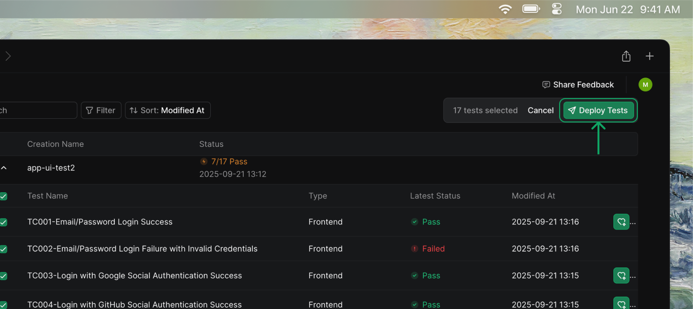
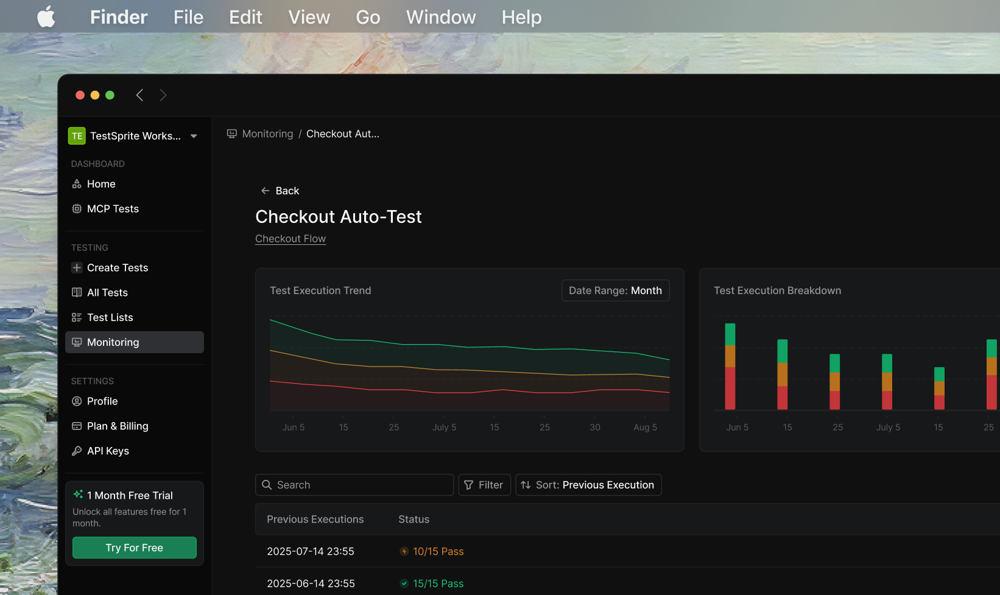

## Overview

Continuous monitoring enables you to automatically run your MCP tests against deployed environments on a regular schedule. This ensures your production applications remain stable and helps you catch issues before they impact users.

<Info>
**Two-Step Process:** Setting up continuous monitoring involves first deploying your tests to production, then configuring automated schedules.
</Info>

## Prerequisites

Before setting up continuous monitoring, ensure you have:

- Successfully created and tested your MCP tests
- Access to your deployed application URL (staging, testing, or production)
- Appropriate permissions to the TestSprite web portal

## Step 1: Deploy Tests to Production

First, you need to deploy your locally created MCP tests to run against your deployed environment.

        <Frame>
        
        </Frame>
         

<Card title="Deploy Your Tests" icon="paper-plane" href="/mcp/core/deploy-to-production">
  Follow the complete deployment workflow to push your local MCP tests to the web portal and configure them to run against your deployed application.
</Card>

## Step 2: Configure Continuous Monitoring

Once your tests are deployed and running successfully against your production environment, set up automated schedules to monitor your application continuously.

        <Frame>
        
        </Frame>
         

<Card title="Set Up Monitoring & Scheduling" icon="chart-simple" href="/web-portal/maintenance/monitoring">
  Configure automated test execution schedules to enable 24/7 continuous monitoring of your deployed application.
</Card>

### Key Monitoring Features

Continuous monitoring provides automated test execution with comprehensive tracking and alerting capabilities. The following features help you maintain visibility into your application's health:

  
Feature

  
Description

  
  
`Automated Execution`

  
Schedule tests to run daily, weekly, or monthly without manual intervention.

  
  
`Proactive Alerts`

  
Receive immediate notifications when tests fail or performance degrades.

  
  
`Historical Tracking`

  
Monitor trends and identify issues over time with detailed execution history.

  
  
`Flexible Scheduling`

  
Pause, modify, or delete schedules as your monitoring needs evolve.

## Best Practices

<AccordionGroup>
  <Accordion title="Start with Stable Tests">
    Ensure your tests run reliably before scheduling them. Flaky tests lead to alert fatigue and reduce confidence in your monitoring.
  </Accordion>
  
  <Accordion title="Choose Appropriate Frequency">
    Balance monitoring coverage with resource usage. Critical applications may need hourly checks, while others can be monitored daily or weekly.
  </Accordion>
  
  <Accordion title="Configure Smart Alerts">
    Set up notification channels that match your team's workflow. Consider using different channels for different severity levels.
  </Accordion>
  
  <Accordion title="Review Results Regularly">
    Even with automation, periodically review test results and execution trends to identify patterns and opportunities for improvement.
  </Accordion>
  
  <Accordion title="Keep Tests Updated">
    As your application evolves, update your test schedules accordingly. Remove obsolete tests and add new ones for new features.
  </Accordion>
</AccordionGroup>

<Warning>
**Important:** Always test your monitoring setup on a non-production environment first to ensure tests run correctly and notifications work as expected.
</Warning>
