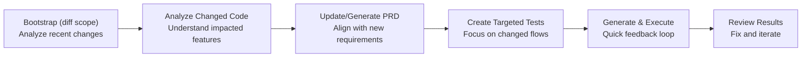

## When to Use This
Use this flow after making a change (feature, bugfix, refactor). It targets only impacted areas to keep feedback fast.

<Note>Shift Left: You can generate and run tests even before a feature is complete to surface gaps early. Use `testScope: "diff"` and run a small subset (`testIds`) frequently during development.</Note>

## Prerequisites
- TestSprite MCP [Installed and configured](/mcp/getting-started/installation) in your IDE
- Your application runs locally
- Git repo with recent commits for diff analysis

## Quick Start
```text
Test my new changes related to the Stripe payment features.
```

## Diff-Scoped Testing Workflow

TestSprite's diff-scoped workflow is optimized for speed and precision, focusing only on code impacted by recent changes:

<Card>

</Card>

### Step 1: Bootstrap with Diff Scope

The AI calls `testsprite_bootstrap` with `testScope: "diff"` to initialize testing for changed code only.

 <Frame>
  
</Frame>

<br />

<Tabs>
  <Tab title="Process">
    1. **Project Detection**: Reuses existing project type configuration (`frontend` or `backend`)
    2. **Port Discovery**: Finds running applications and their ports
    3. **Git Diff Analysis**: Identifies modified files and changed lines since last commit
    4. **Scope Definition**: Sets testing scope to `diff` (changed code only)
  </Tab>
  <Tab title="What Makes Diff Scope Different">
    - **Faster Setup**: Reuses existing project configuration from previous runs
    - **Git Integration**: Analyzes your recent commits to identify changes
    - **Smart Filtering**: Only considers files and features touched by your commits
    - **Quick Validation**: Perfect for iterative development and PR workflows
  </Tab>
</Tabs>

<CodeGroup>
```javascript Configuration expandable
testsprite_bootstrap({
  localPort: 5173, // or your port
  type: "frontend", // or "backend"
  projectPath: "/absolute/path/to/your/project",
  testScope: "diff" // analyze only recent changes
})
```

```json Sample Configuration expandable
{
  "projectType": "frontend",
  "localPort": 5173,
  "testScope": "diff",
  "needLogin": true,
  "credentials": {
    "username": "test@example.com",
    "password": "testpassword123"
  }
}
```
</CodeGroup>

### Step 2: Analyze Changed Code

The AI calls `testsprite_generate_code_summary` to analyze only the code impacted by your changes.

 <Frame>
  
</Frame>

**Diff-Aware Analysis:**
1. **Change Detection**: Focuses on modified files and their dependencies
2. **Impact Mapping**: Identifies affected features and components
3. **Dependency Tracking**: Detects new dependencies or framework changes
4. **Coverage Assessment**: Maps changes to existing test coverage gaps

<CodeGroup>
```javascript Tool Call
testsprite_generate_code_summary({
  projectRootPath: "/absolute/path/to/your/project"
})
```

```json Expandable Example Output for Changed Feature expandable
{
  "changed_features": [
    {
      "name": "Stripe Payment Integration",
      "description": "New payment flow with Stripe checkout",
      "files": [
        "src/components/Checkout.tsx",
        "src/api/payments.ts"
      ],
      "impact": "High - affects checkout flow and payment processing"
    }
  ],
  "dependencies_added": ["@stripe/stripe-js", "@stripe/react-stripe-js"],
  "files_changed": 2,
  "lines_added": 165,
  "lines_removed": 12
}
```
</CodeGroup>

### Step 3: Generate/Update Normalized PRD

The AI calls `testsprite_generate_standardized_prd` to update requirements based on code changes.

 <Frame>
  
</Frame>

**PRD Update Process:**
1. **Merge Changes**: Integrates new features into existing PRD
2. **Update Requirements**: Adjusts validation criteria for modified flows
3. **Maintain Context**: Preserves overall product goals and existing features
4. **Focus on Delta**: Emphasizes what changed rather than rewriting everything

```javascript Tool Called
testsprite_generate_standardized_prd({
  projectPath: "/absolute/path/to/your/project"
})
```

<Tip>For minor changes (bug fixes, small refactors), this step may be skipped to save time. For new features or significant changes, it ensures test requirements are aligned with your updates.</Tip>

### Step 4: Create Targeted Test Plans

The AI calls `testsprite_generate_frontend_test_plan` or `testsprite_generate_backend_test_plan` based on what changed.

 <Frame>
  
</Frame>

**Test Plan Focus:**
- **Targeted Coverage**: Tests only impacted features and their dependencies
- **Regression Detection**: Validates that existing flows still work
- **New Functionality**: Ensures new features work as expected
- **Edge Cases**: Covers boundary conditions in changed code

<CodeGroup>
```javascript Frontend UI/Business Flows expandable
// Covers: UI changes and new components, modified user flows and journeys,
// updated form validations, changed authentication logic
testsprite_generate_frontend_test_plan({
  projectPath: "/absolute/path/to/your/project",
  needLogin: true
})
```

```javascript Backend API/Integration
// Covers: New or modified API endpoints, changed request/response contracts,
// updated business logic, modified integrations and dependencies
testsprite_generate_backend_test_plan({
  projectPath: "/absolute/path/to/your/project"
})
```

```json Expandable Example Targeted Test Plan expandable
[
  {
    "id": "TC_DIFF_001",
    "title": "Stripe checkout initiates payment successfully",
    "description": "Verify new Stripe payment integration works end-to-end",
    "category": "functional",
    "priority": "High",
    "reason": "New feature in current diff",
    "steps": [
      {
        "type": "action",
        "description": "Add items to cart and proceed to checkout"
      },
      {
        "type": "action",
        "description": "Click 'Pay with Stripe' button"
      },
      {
        "type": "assertion",
        "description": "Verify Stripe payment modal opens"
      },
      {
        "type": "action",
        "description": "Complete test payment with Stripe test card"
      },
      {
        "type": "assertion",
        "description": "Verify payment confirmation and order success"
      }
    ]
  }
]
```
</CodeGroup>

### Step 5: Generate & Execute Focused Tests

The AI calls `testsprite_generate_code_and_execute` to create and run tests for impacted areas only.

 <Frame>
  
</Frame>

<Tabs>
  <Tab title="Test Code Generation Process">
  1. **Incremental Generation**: Creates or updates only tests for changed features
  2. **Smart Reuse**: Leverages existing test utilities and helpers
  3. **Focused Execution**: Runs only tests that could be affected by changes
  4. **Fast Feedback**: Completes in 3-5 minutes vs 10-20 minutes for full suite
  </Tab>
  <Tab title="Execution Benefits">
  - **Faster Runs**: Typically 3-5x faster than full `codebase` scope
  - **Immediate Feedback**: Quick validation of your changes
  - **Focused Reports**: Clear signal on what your change broke or fixed
  - **Iterative Development**: Run frequently during development
  </Tab>
</Tabs>

```javascript Tool Call expandable
testsprite_generate_code_and_execute({
  projectName: "your-project-name",
  projectPath: "/absolute/path/to/your/project",
  testIds: [], // empty = all diff-scoped tests
  additionalInstruction: "Focus only on changed modules and impacted flows"
})
```

#### Performance Comparison

| Scope | Typical Test Count | Execution Time | Use Case |
|-------|-------------------|----------------|----------|
| `codebase` | 20-50 tests | 10-20 min | Initial setup, major releases |
| `diff` | 3-10 tests | 3-5 min | During development, PR validation |

### Step 6: Review Diff-Focused Results

TestSprite provides targeted reports showing exactly what your changes affected:

**Report Highlights:**
- **Changed Features Status**: Did your changes work as expected?
- **Regression Detection**: Did your changes break existing flows?
- **New Test Coverage**: What new scenarios are now tested?
- **Healing Suggestions**: Any brittleness introduced by changes?

<Accordion title="Example Diff Report Summary">
**Your Changes:**
- Modified `src/components/Checkout.tsx` (+45, -12)
- Added `src/api/payments.ts` (+120)
- Updated `package.json` (added Stripe dependencies)

**Test Results:**
- ✅ **3 new tests passed** - Stripe payment flow works correctly
- ⚠️ **1 test needs update** - Checkout button selector changed
- ✅ **5 existing tests passed** - No regressions detected

**Recommendations:**
- Update test selector for new checkout button class
- Consider adding test for payment failure scenarios
- All critical paths validated successfully
</Accordion>

## Best Practices for Diff-Scoped Testing

<AccordionGroup>
  <Accordion title="When to Use Diff Scope">
    ✅ **Good Use Cases:**
    - During active feature development
    - After bug fixes or refactors
    - Before committing changes
    - In PR validation workflows

    ❌ **When to Use Codebase Scope Instead:**
    - Initial project onboarding
    - Major refactors affecting many files
    - Pre-release validation
    - When test plan doesn't exist yet
  </Accordion>

  <Accordion title="Iterative Development Tips">
    - **Commit frequently** - Accurate diffs require clean git state
    - **Run subset first** - Use `testIds` to test critical paths quickly
    - **Iterate fast** - Run diff tests every 15-30 minutes during dev
    - **Fix as you go** - Address failures immediately while context is fresh
  </Accordion>

  <Accordion title="Managing Test Scope">
    - Start with empty `testIds: []` to run all diff-scoped tests
    - Use specific `testIds: ["TC_001", "TC_005"]` for rapid iteration
    - Add `additionalInstruction` to guide test generation context
    - Keep PRD updated if feature requirements changed
  </Accordion>
</AccordionGroup>

## Shift-Left Testing Workflow

TestSprite enables true shift-left testing - run tests early and often, even on incomplete code:

<Steps>
  <Step title="Start Coding">
    Begin implementing your feature or fix
  </Step>
  <Step title="Early Test Run (Incomplete)">
    Run diff-scoped tests even if feature isn't complete. Ask your AI assistant: "Test my in-progress payment feature changes"

    Outcome: Discover missing validations, edge cases, UX gaps early
  </Step>
  <Step title="Iterate & Fix">
    Address gaps found by tests, continue coding
  </Step>
  <Step title="Final Test Run (Complete)">
    Run again when feature is ready

    Outcome: High confidence your change works correctly
  </Step>
  <Step title="Commit with Confidence">
    Commit knowing your change is thoroughly tested
  </Step>
</Steps>

## Next Steps

<Columns cols={2}>
  <Card title="Modify or Update Tests" href="/mcp/core/modify-tests">
    Adjust existing test plans
  </Card>
  <Card title="Create Tests for New Projects" href="/mcp/core/create-tests-new-project">
    Full codebase testing workflow
  </Card>
  <Card title="Deploy to Production" href="/mcp/core/deploy-to-production">
    CI/CD integration
  </Card>
  <Card title="Test Types & Lifecycle" href="/mcp/concepts/test-type-lifecycle">
    Understand test triggers
  </Card>
  <Card title="Healing & Observability" href="/mcp/concepts/healing-observability">
    Auto-repair brittle tests
  </Card>
</Columns>
