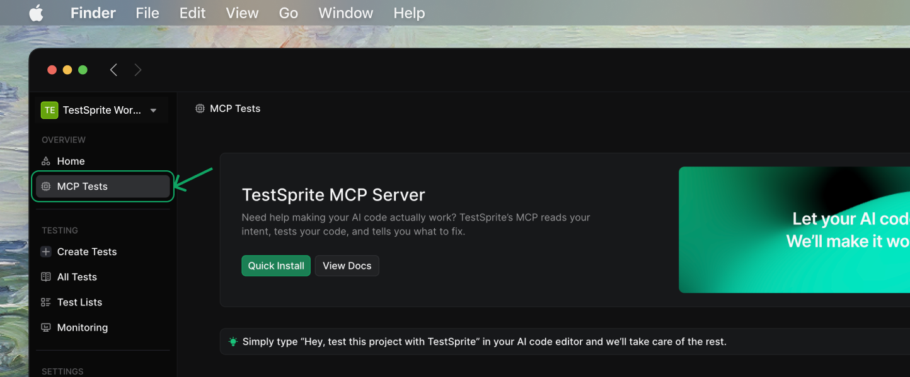
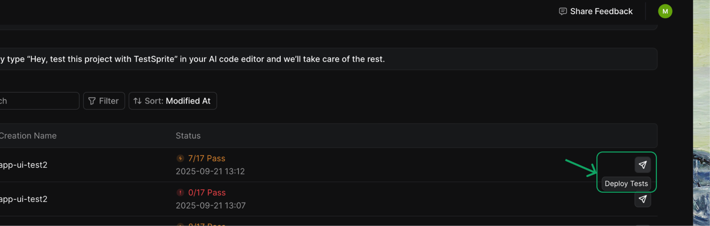
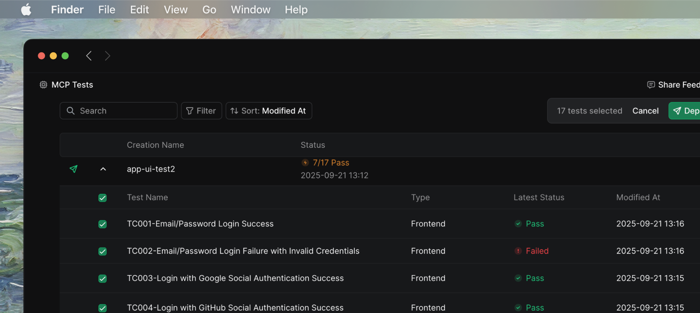
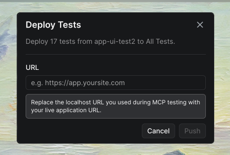
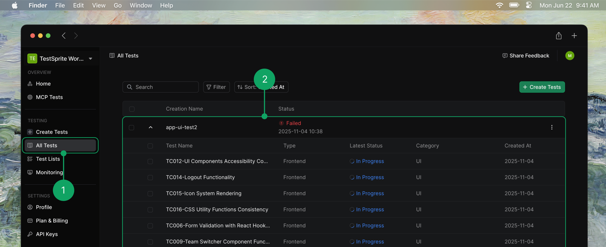

Once you've created and validated tests, you can deploy them to run against your staging or production environments. This guide walks you through pushing your tests to the MCP Tests web portal for continuous monitoring of your deployed applications.

## Prerequisites

Before deploying your tests, ensure you have:
- Successfully created and run tests locally using MCP
- Access to the MCP Tests web portal
- The URL of your deployed application (staging or production)

## Deployment Steps

<Steps>
    <Step title="Access the MCP Tests Web Portal">
        Log in to the MCP Tests web portal and navigate to your project. You'll see a list of all test suites that have been created locally.
        <Frame>
        
        </Frame>
    </Step>
    
    <Step title='Initiate Test Deployment'>
        Locate the test suite you want to deploy and click the **"Deploy Tests"** button next to it. This opens the test selection interface.
        <Frame>
        
        </Frame>
    </Step>
    
    <Step title="Select Tests to Deploy">
        Review the available tests and use the checkboxes to select which ones you want to deploy. You can select individual tests or multiple tests at once depending on your deployment strategy.
        
        <Tip>Consider starting with a subset of critical tests before deploying your entire test suite to production.</Tip>
        <Frame>
        
        </Frame>
    </Step>
    
    <Step title='Confirm Test Selection'>
        After selecting your tests, click the **"Deploy Tests"** button in the upper right corner to proceed with the deployment.
        <Frame>
        
        </Frame>
    </Step>

    <Step title="Configure Target Environment">
        Enter the URL of your deployed application where the tests will run (e.g., `https://your-app.com` or `https://staging.your-app.com`). This URL becomes the target environment for all test executions.
        
        <Warning>Ensure the URL is accessible and that any required authentication credentials are properly configured.</Warning>
        <Frame>
        
        </Frame>
    </Step>

    <Step title="Monitor Test Execution">
        Navigate to the **"All Tests"** page to monitor your test results in real-time. 

        <Frame>
        
        </Frame>
        
        Here you can:
        - View detailed test execution logs
        - Analyze test visualizations and screenshots
        - Review any failures or issues
        - Track test performance over time
    </Step>
</Steps>

## Next Steps

After deploying your tests to production, you can **configure alerts to notify your team of test failures**, or follow the steps below:

<Columns cols={2}>
  <Card title="Set up continuous monitoring" href="/mcp/core/continuous-monitoring">
    Run tests automatically on a schedule
  </Card>
  <Card title="Review test maintenance guide" href="/mcp/maintenance/test-maintenance">
    Best practices for keeping your tests up to date
  </Card>
</Columns>