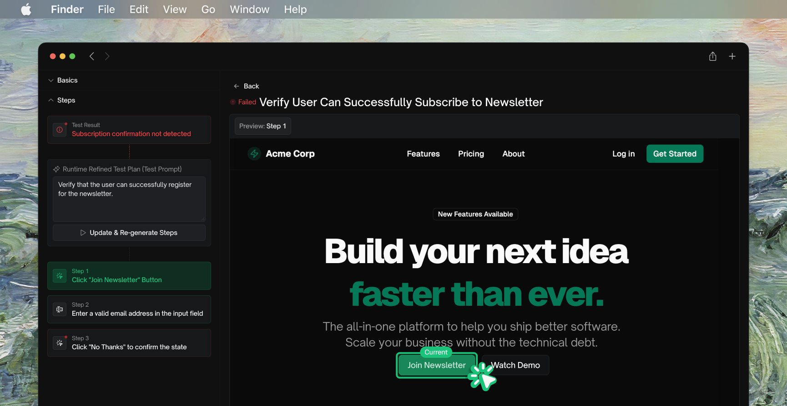
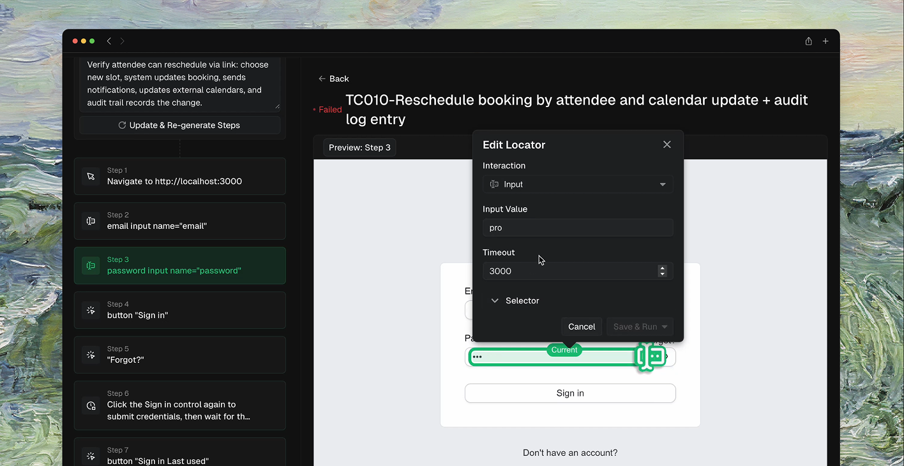
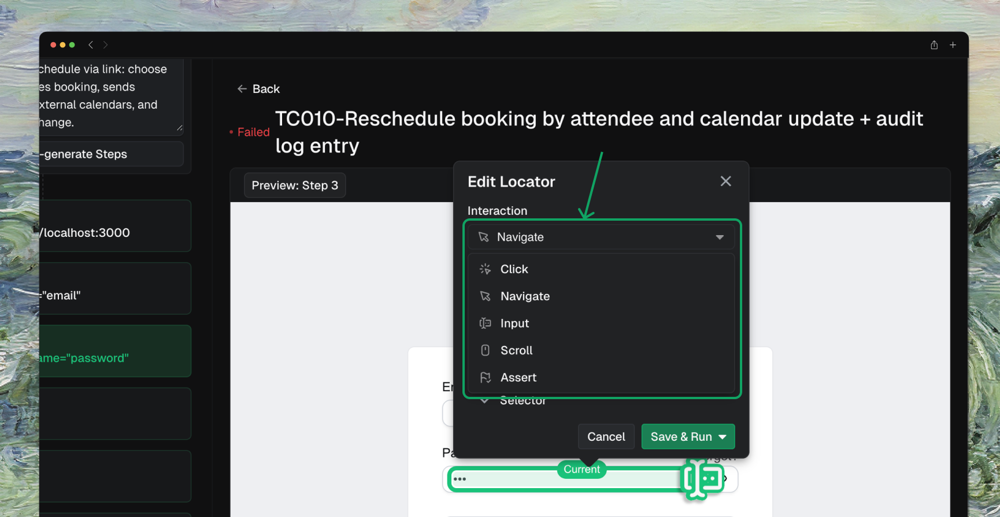
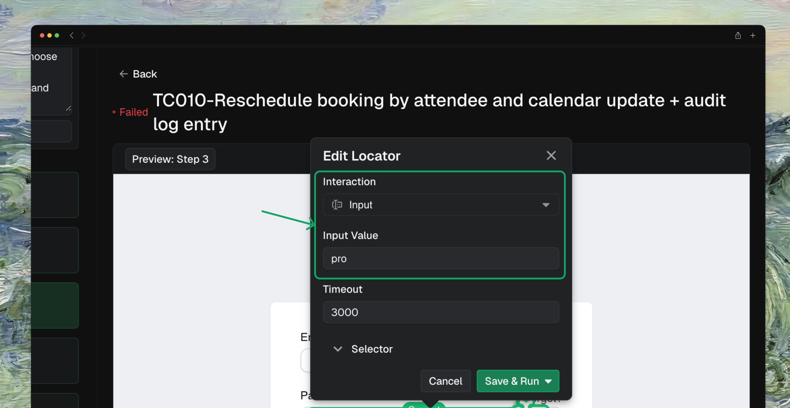
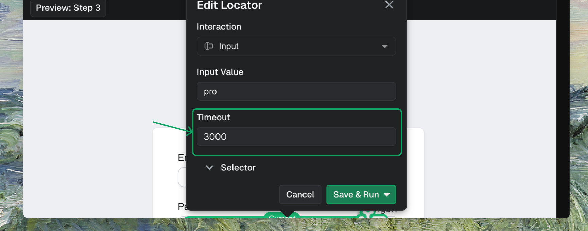
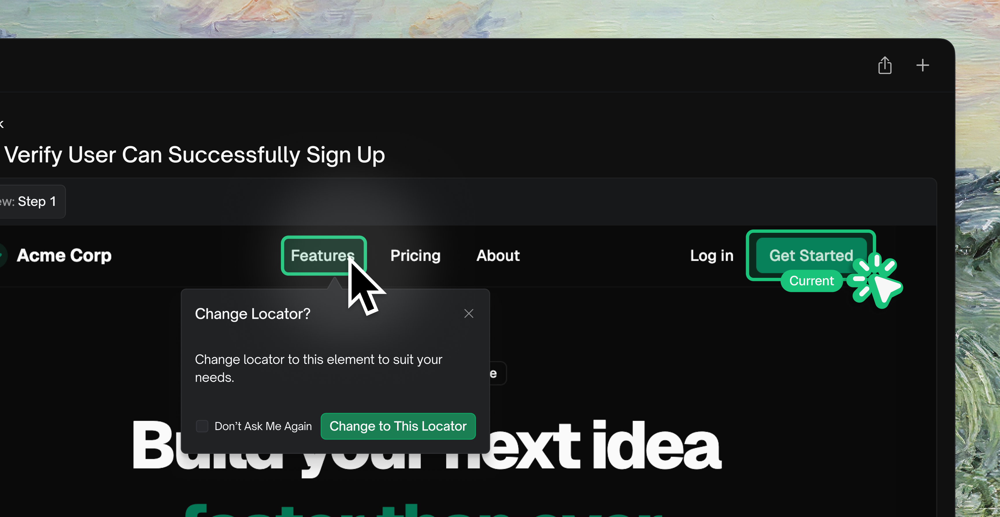
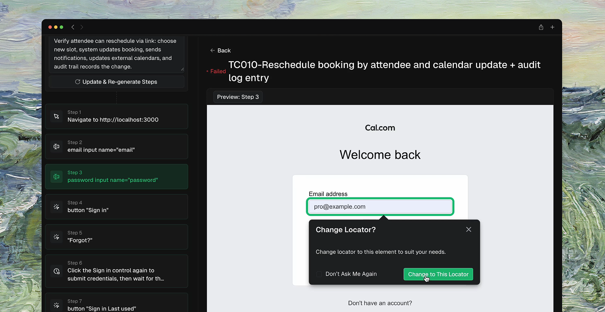
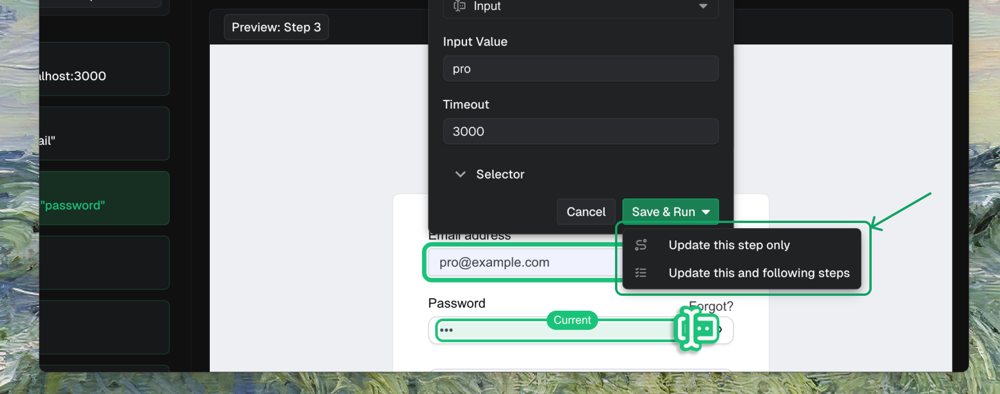

## Overview

TestSprite gives you full control over your automated test cases with powerful in-place editing. Whether you're watching tests run live or reviewing results days later, you can fine-tune every step to match your exact requirements.

<Frame>
  
</Frame>

## Interactive Step Editing

Click on any step to see a **snapshot** of that exact moment in your test, then modify it if needed.

<Frame>
  
</Frame>

### Edit Any Interaction

When you select a step, you can:

<Steps>
  <Step title="Change the Interaction Type">
    Switch between Click, Navigate, Input, Scroll, Assert, or modify the Selector.
    <Frame>
      
    </Frame>
  </Step>
  <Step title="Update Input Values">
    Change what text gets entered into form fields.
    <Frame>
      
    </Frame>
  </Step>
  <Step title="Adjust Timeouts">
    Fine-tune wait times for slow-loading elements.
    <Frame>
      
    </Frame>
  </Step>
  <Step title="Modify Interaction Element">
    Pick a new element on the page if the current one isn't right.
    <Frame>
      
    </Frame>
  </Step>
</Steps>

### Visual Element Selection

Don't like the current locator? Simply click any element on the page preview, and TestSprite will prompt you: *"Change locator to this element to suit your needs."*

This visual selection means you don't need to manually write CSS selectors or XPath—just point and click.

<Frame>
  
</Frame>

### Smart Regeneration Options

TestSprite will automatically regenerate the affected steps while preserving your customizations.

<Frame>
  
</Frame>

After making your edits, choose how TestSprite should handle the changes:

| Option | When to Use |
| --- | --- |
| <kbd>Update this step only</kbd> | Your change is isolated and doesn't affect subsequent steps |
| <kbd>Update this and following steps</kbd> | Your change impacts the test flow, and later steps need to adapt |

## Key Benefits

<AccordionGroup>
  <Accordion title="No More Black-Box Testing">
    See exactly what your tests are doing with video recordings and step-by-step snapshots.
  </Accordion>
  <Accordion title="Fix Tests Without Rewriting Them">
    Visual editing means you can adjust locators, inputs, and actions without touching code.
  </Accordion>
  <Accordion title="Maintain Test Suites Over Time">
    As your application evolves, easily update test steps to match new UI layouts or workflows.
  </Accordion>
  <Accordion title="Debug Failures Faster">
    Pinpoint issues instantly with detailed error messages and execution recordings.
  </Accordion>
</AccordionGroup>

## Quick Reference

| Tool | Purpose |
| --- | --- |
| `testsprite_generate_code_and_execute` | Generate and run tests with live progress tracking |
| `testsprite_open_test_result_dashboard` | Reopen dashboard to review/edit past test runs |

## Next Step

<Columns cols={2}>
  <Card title="Progress Dashboard" href="/mcp/core/test-progress-dashboard">
    Monitor real-time test execution
  </Card>
  <Card title="Create Tests for New Change" href="/mcp/core/create-tests-new-feature">
    Test diff-scoped changes
  </Card>
  <Card title="Healing & Observability" href="/mcp/concepts/healing-observability">
    Learn about auto-healing
  </Card>
  <Card title="MCP Tools Reference" href="/mcp/core/tools">
    Explore all available tools
  </Card>
</Columns>
