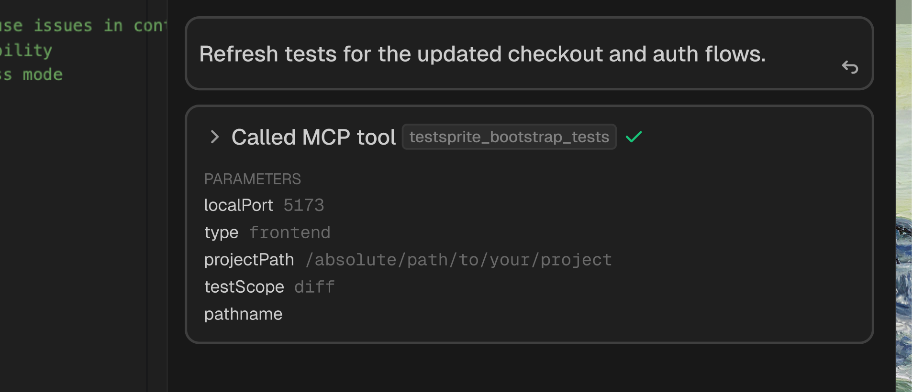
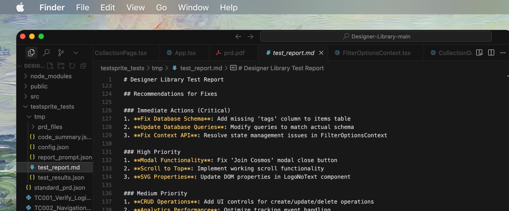
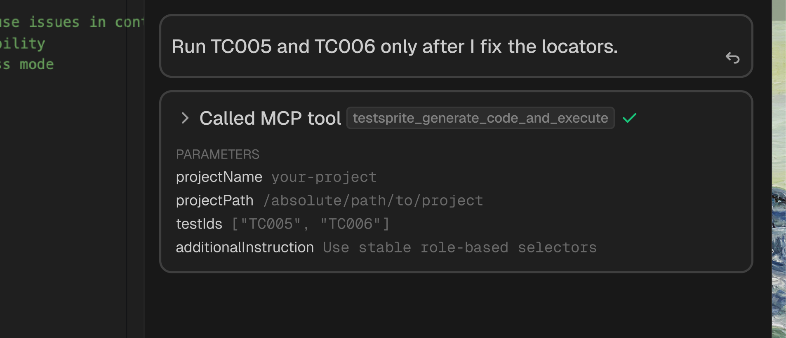

## When to Use This
Use this guide when your app changes and existing tests need updates: new UI structure, altered API responses, or refined acceptance criteria.

## Options at a Glance
- Regenerate impacted tests via plans (recommended for broad changes)
- Apply auto-healing suggestions (selectors, waits, fixtures)
- Manually adjust specific tests and rerun quickly

## Typical Workflows

### Step 1: Let the Agent Regenerate What Changed
Regenerates plans and tests based on current code and PRD.

 <Frame>
  
</Frame>

Steps:
1. Bootstrap in `diff` scope
2. Recreate test plans (frontend/backend as needed)
3. Generate and execute

<CodeGroup>
```text Example Prompt
Refresh tests for the updated checkout and auth flows.
```

```javascript Expandable Tool Calls
testsprite_bootstrap_tests({
  localPort: 5173,
  type: "frontend",
  projectPath: "/absolute/path/to/project",
  testScope: "diff"
})

testsprite_generate_frontend_test_plan({ projectPath: "/absolute/path/to/project", needLogin: true })
// or
testsprite_generate_backend_test_plan({ projectPath: "/absolute/path/to/project" })

testsprite_generate_code_and_execute({
  projectName: "your-project",
  projectPath: "/absolute/path/to/project",
  testIds: [],
  additionalInstruction: "Focus on updated modules"
})
```
</CodeGroup>

### Step 2: Use Auto-Healing Suggestions
For selector drift, timing, or test-data issues, apply safe healing.

 <Frame>
  
</Frame>

1. Review recommendations in the report under `testsprite_tests/`
2. Accept proposed edits in your IDE when prompted
3. Rerun to validate

### Step 3: Manually Edit and Rerun a Subset
When only a few tests need tweaks.

 <Frame>
  
</Frame> 

<CodeGroup>
```text Example Prompt
Run TC005 and TC006 only after I fix the locators.
```

```javascript Tool Call
testsprite_generate_code_and_execute({
  projectName: "your-project",
  projectPath: "/absolute/path/to/project",
  testIds: ["TC005", "TC006"],
  additionalInstruction: "Use stable role-based selectors"
})
```
</CodeGroup>

## Rerun Previously Generated Tests
Use rerun to validate fixes without re-planning.
```javascript
testsprite_rerun_tests({
  projectPath: "/absolute/path/to/project"
})
```

## Best Practices

<AccordionGroup>
  <Accordion title="Sync PRD with Product Decisions">
    Keep PRD and acceptance criteria in sync with product decisions
  </Accordion>
  <Accordion title="Use Semantic Selectors">
    Prefer semantic selectors and explicit waits
  </Accordion>
  <Accordion title="Commit Changes Regularly">
    Commit changes so diff-based regeneration stays accurate
  </Accordion>
  <Accordion title="Targeted Reruns for Speed">
    Use small targeted reruns for fast iteration
  </Accordion>
</AccordionGroup>

## Next Step

<Columns cols={2}>
  <Card title="Create Tests for New Change" href="/mcp/core/create-tests-new-feature">
    Test diff-scoped changes
  </Card>
  <Card title="Create Tests for New Projects" href="/mcp/core/create-tests-new-project">
    Full codebase testing workflow
  </Card>
  <Card title="Healing & Observability" href="/mcp/concepts/healing-observability">
    Learn about auto-healing
  </Card>
  <Card title="MCP Tools Reference" href="/mcp/core/tools">
    Explore all available tools
  </Card>
</Columns>
