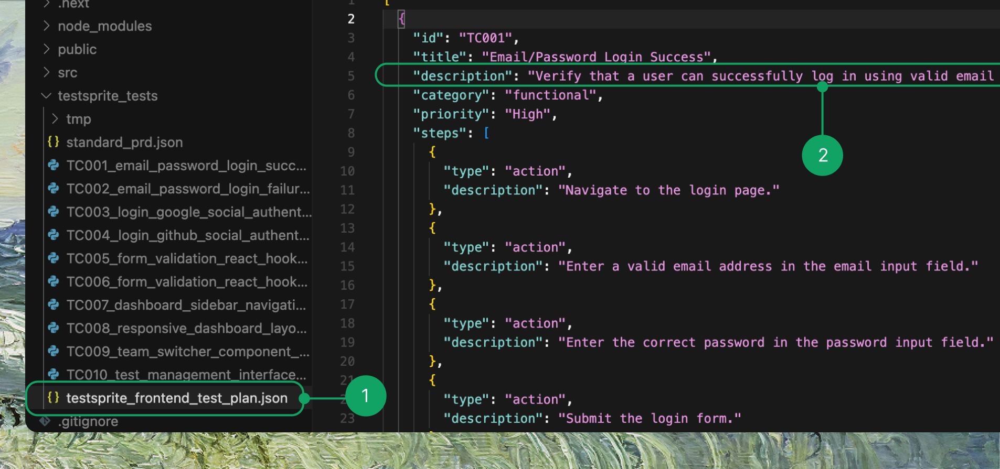

There are two different ways to regenerate tests depending on whether you want to update just a few cases or start over completely.

<Tabs>
  <Tab title="Regenerate Subset of Test Cases">
    <Frame>
      
    </Frame>
    
    <Steps>
      <Step title="Open your TestSprite test plan file">
        Open your TestSprite test plan file (e.g. `testsprite_frontend_test_plan.json`).
      </Step>
      
      <Step title="Edit the test case description">
        Find the test case you want to change, edit the descriptionand, and save the file ( <Tooltip tip="Cmd/Ctrl + S"><kbd>⌘S</kbd></Tooltip> ). For example:

        ```md Before/After Example
        Before: Verify user can log in with valid email and password
        After: Verify user can log in with email 'example@gmail.com', password 'xxxxxx'
        ```
      </Step>
      
      <Step title="Prompt in your IDE">
        ```text Example Prompt
         Rerun the Xth test for me using testsprite_generate_code_and_execute
        ```
      </Step>
      
      <Step title="TestSprite runs the updated tests">
        TestSprite will detect your change, update the relevant test code, and run the updated tests automatically.
      </Step>
    </Steps>

    <Info>
    **Key Point:** You only need to change the description in the plan. TestSprite handles the rest.
    </Info>
  </Tab>
  
  <Tab title="Regenerate Entire Project">
    If you want a clean start or have made major changes:

    <Steps>
      <Step title="Delete the testsprite_tests folder">
        Delete the `testsprite_tests` folder in your project.
        
        <Frame>
        
        </Frame>

        <Info>
        This ensures no outdated files remain.
        </Info>
      </Step>
      
      <Step title="Prompt in your IDE">
        In your IDE, type again:

        ```text Example Prompt
        Help me test this project with TestSprite
        ```
      </Step>
      
      <Step title="TestSprite generates new tests">
        TestSprite will generate a brand new test plan and test code for the whole project.
      </Step>
    </Steps>

    <Warning>
    **When to use this:** If your project has changed a lot and the old test plan no longer matches well.
    </Warning>
  </Tab>
</Tabs>
