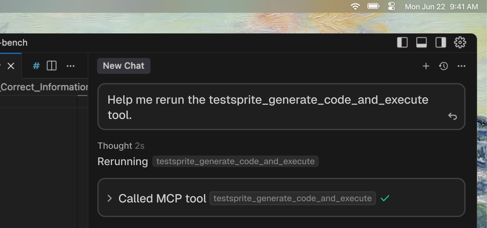
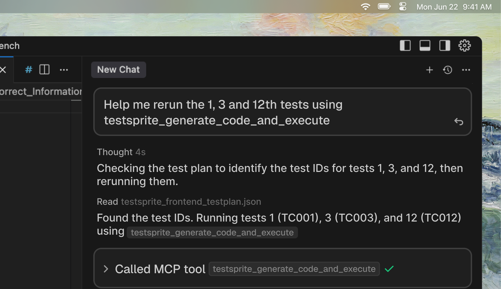

Sometimes you just want to rerun the same tests as the previous run—maybe to double-check after a bug fix.

<Tip>
This is useful after you fix a bug or change code and want to confirm nothing is broken.
</Tip>

<Tabs>
  <Tab title="Rerun All Tests">
   <Frame>
  
</Frame>
    In your coding IDE, simply type:  

    ```text Example Prompt
    Help me rerun all the tests with TestSprite.
    ```

    TestSprite will automatically detect your existing project test suite and execute all of the tests again with the `testsprite_generate_code_and_execute` tool (with an existing test plan, no re-planning happens). You'll see updated results directly in **your IDE** or **TestSprite dashboard**.
  </Tab>
  
  <Tab title="Rerun Subset of Tests">
    TestSprite gives you the flexibility to rerun only **a subset of your tests** instead of executing the entire suite. This is useful when you want to quickly validate specific scenarios without waiting for every test to finish.

       <Frame>
  
</Frame>

    You can annotate the tests you want to rerun, and your AI assistant will pass their IDs to `testsprite_generate_code_and_execute` through the `testIds` parameter. For example, to re-run only the 1st, 3rd, and 12th tests:

    ```text Example Prompt
    Help me rerun the 1, 3 and 12th tests with TestSprite.
    ```
  </Tab>
</Tabs>
