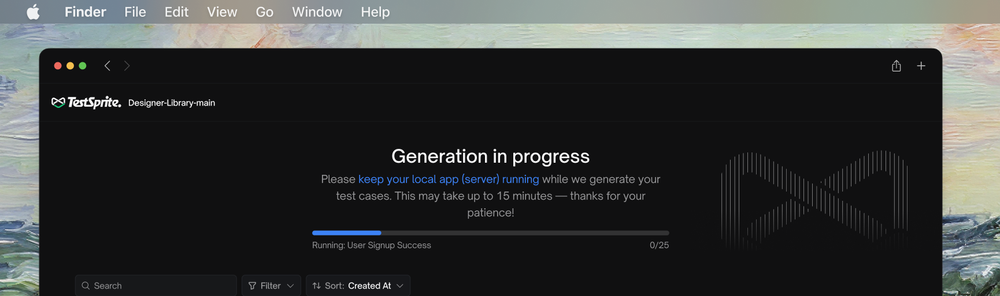
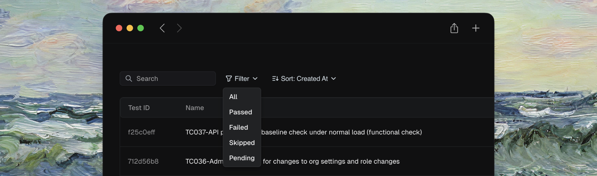
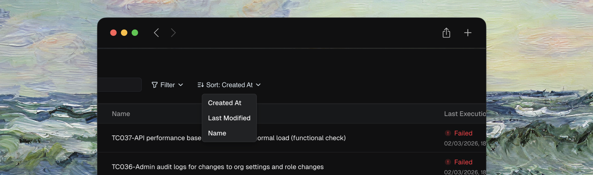
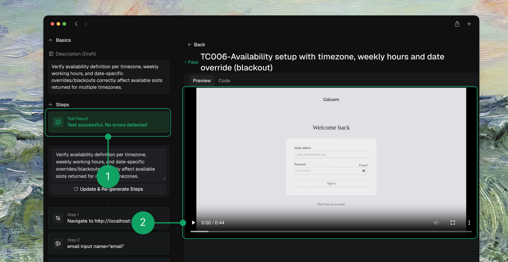
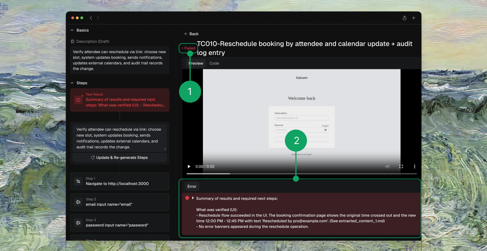
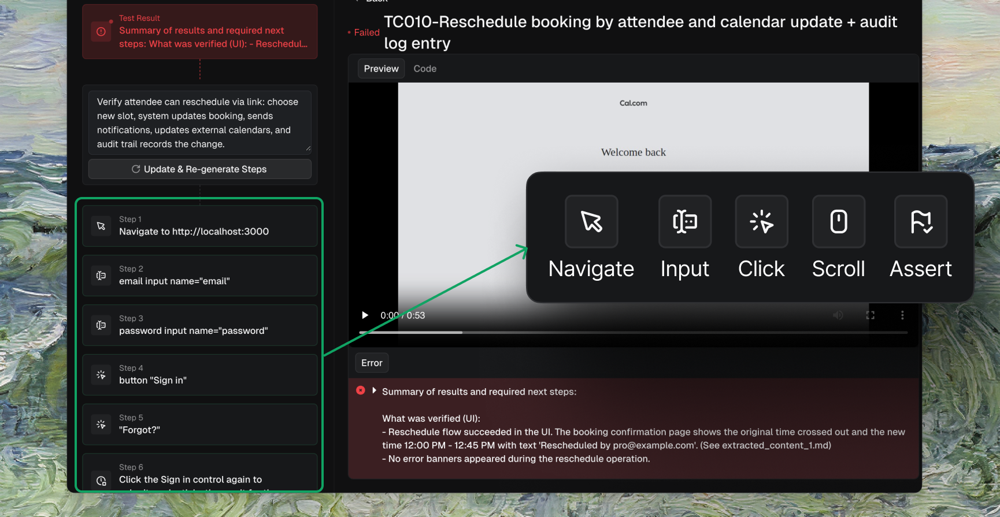
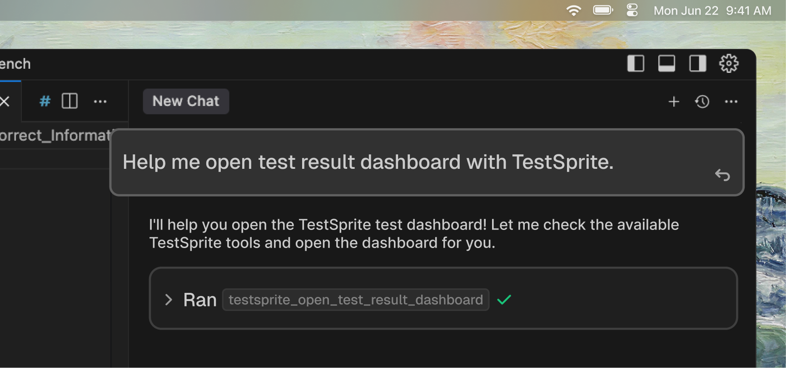

## Overview

When you trigger `testsprite_generate_code_and_execute`, TestSprite automatically opens a live progress dashboard where you can monitor your entire test suite as it runs.

<Frame>
  
</Frame>

<br />

<Tabs>
<Tab title="Real-Time Monitoring">
  Watch your test cases execute with live status updates. Each test displays its current state—whether it's still running, has passed, or encountered an issue.

  <Frame>
    
  </Frame>
</Tab>
  <Tab title="Search & Filter Tests">
    Quickly locate specific tests using the search bar by <kbd>Test Name</kbd> or <kbd>ID</kbd>. Filter your test suite by <kbd>Status</kbd>, <kbd>Creation Date</kbd>, or <kbd>Last Modified Time</kbd> to focus on what matters most.
    <Frame>
      
    </Frame>
  </Tab>
  <Tab title="Sort Your Way">
    Organize your test list by <kbd>Created Date</kbd>, <kbd>Last Execution Time</kbd>, or <kbd>Alphabetically</kbd> to streamline your review workflow.
    <Frame>
      
    </Frame>
  </Tab>
</Tabs>

## Test Detail View

Click on any test case to dive into its detailed execution results.

### Execution Recording

Every test run is recorded, giving you a complete video playback of exactly what happened during execution.

<Frame>
  
</Frame>

### Test Results at a Glance

Get a quick summary of each test's outcome, including pass/fail status, error details, and timing information.

<Frame>
  
</Frame>

The **Test Result** section shows you:

| Detail | Description |
| --- | --- |
| <kbd>Pass/Fail Status</kbd> | Clear visual indicators |
| <kbd>Error Messages</kbd> | Detailed messages when tests fail |

### Step-by-Step Breakdown

Drill into each test to see every action it performed, from navigation and input to assertions, so you can pinpoint exactly where things went right or wrong.

<Frame>
  
</Frame>
Each test displays its individual steps with the corresponding action type:

| Action | Description |
| --- | --- |
| <kbd>Navigate</kbd> | URL navigation actions |
| <kbd>Input</kbd> | Form field entries |
| <kbd>Click</kbd> | Button and link interactions |
| <kbd>Scroll</kbd> | Page scrolling actions |
| <kbd>Assert</kbd> | Verification checkpoints |

## Review Past Test Runs Anytime

Use the `testsprite_open_test_result_dashboard` tool to reopen the progress dashboard at any time. Simply prompt:

<Frame>
  
</Frame>

<CodeGroup>
```text Example Prompt
open test result dashboard of testsprite cases
```
</CodeGroup>

This brings back the full dashboard view where you can:

- Browse all your historical test suites
- Review execution recordings from previous runs
- Make modifications to any existing test case
- Re-run updated tests with your changes
