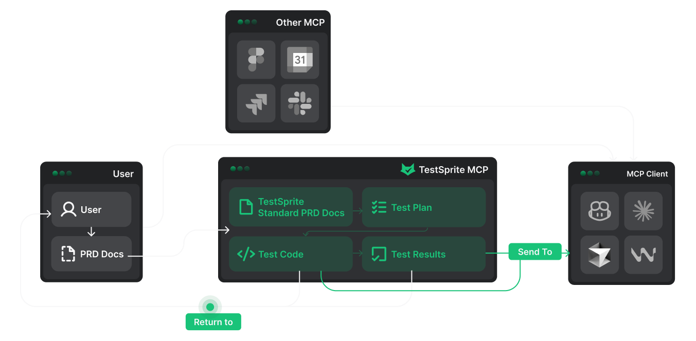
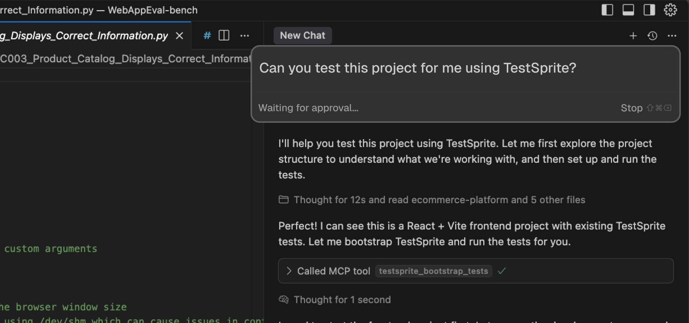
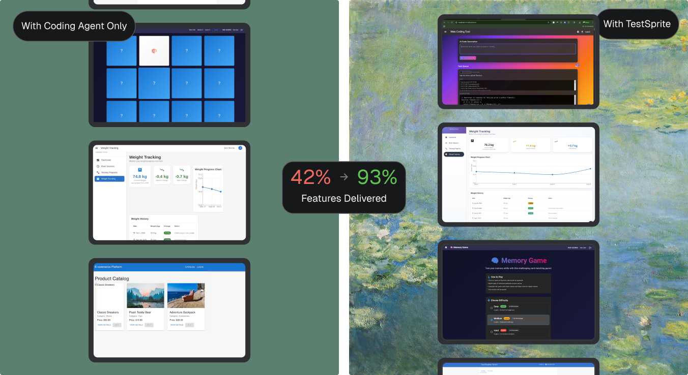

## What is TestSprite MCP Server?

TestSprite MCP Server is a 
 <Tooltip tip="an open-source standard for connecting AI applications to external systems." cta="Learn more about MCP" href="https://modelcontextprotocol.io/">Model Context Protocol</Tooltip>
 integration that connects your IDE's AI assistant (like Cursor or Windsurf) with TestSprite's intelligent testing engine. It enables **fully automated testing workflows** directly within your development environment.

  <Frame>
  
</Frame>
 
## How It Works

After installing TestSprite MCP in your IDE, you can use simple **natural language prompts** to let our AI testing agent handle the entire testing workflow for you. 

 <Frame>
  
</Frame>

Just use the following prompt, drag your project folder into the chat, or describe your testing requirements. TestSprite MCP Server handles the rest.

```text icon="file-lines"
Help me test this project with TestSprite.
```

<Accordion title="How TestSprite Works in 8 Simple Steps">
<Steps>
  <Step title="Reads User PRD">
    Understands your product requirements and goals.
  </Step>
  <Step title="Analyzes Your Code">
    Scans project structure, features, and implementation.
  </Step>
  <Step title="Generates TestSprite PRD">
    Creates normalized product requirements document.
  </Step>
  <Step title="Creates Test Plans">
    Generates comprehensive test cases based on PRD and code.
  </Step>
  <Step title="Generates Test Code">
    Creates executable test scripts (Playwright, Cypress, etc.).
  </Step>
  <Step title="Executes Tests">
    Runs tests in secure cloud environments.
  </Step>
  <Step title="Provides Results">
    Delivers detailed reports with actionable insights.
  </Step>
  <Step title="Enables Fixes">
    IDE uses our analysis to automatically patch issues.
  </Step>
</Steps>
</Accordion>

## Key Benefits

Depending on your role, TestSprite MCP Server delivers different advantages:

- **For Developers:** Ship faster with **zero test writing**, get **feedback in minutes** (not hours), and **fix issues automatically** with AI-powered analysis—all **without leaving your IDE**.

- **For Teams:** Achieve **predictable quality** and **faster releases** with **broad, consistent coverage**—including edge cases—while reducing manual QA effort and test maintenance overhead.

## What Makes It Different

TestSprite MCP Server transforms the testing experience by automating what traditionally requires manual effort. Here's how it compares to traditional testing approaches:

  <Frame>
  
</Frame>

<div className="full-width-table" style={{ gridTemplateColumns: '0.8fr 1.1fr 1.1fr' }}>
  <div className="table-header" style={{ padding: '12px', fontSize: '14px' }}>Features</div>
  <div className="table-header" style={{ padding: '12px', fontSize: '14px' }}>Traditional Testing</div>
  <div className="table-header" style={{ padding: '12px', fontSize: '14px' }}>TestSprite MCP Server</div>
  <div className="table-cell" style={{ padding: '12px', fontSize: '14px', borderBottom: '1px solid var(--table-border-color, #e5e7eb)' }}>`Test case creation`</div>
  <div className="table-cell" style={{ padding: '12px', fontSize: '14px', borderBottom: '1px solid var(--table-border-color, #e5e7eb)' }}>Writing test cases manually</div>
  <div className="table-cell" style={{ padding: '12px', fontSize: '14px', borderBottom: '1px solid var(--table-border-color, #e5e7eb)' }}>**AI generates test cases automatically**</div>
  <div className="table-cell" style={{ padding: '12px', fontSize: '14px', borderBottom: '1px solid var(--table-border-color, #e5e7eb)' }}>`Setup`</div>
  <div className="table-cell" style={{ padding: '12px', fontSize: '14px', borderBottom: '1px solid var(--table-border-color, #e5e7eb)' }}>Setting up complex frameworks</div>
  <div className="table-cell" style={{ padding: '12px', fontSize: '14px', borderBottom: '1px solid var(--table-border-color, #e5e7eb)' }}>Almost **zero setup required**</div>
  <div className="table-cell" style={{ padding: '12px', fontSize: '14px', borderBottom: '1px solid var(--table-border-color, #e5e7eb)' }}>`Debugging`</div>
  <div className="table-cell" style={{ padding: '12px', fontSize: '14px', borderBottom: '1px solid var(--table-border-color, #e5e7eb)' }}>Debugging failures by hand</div>
  <div className="table-cell" style={{ padding: '12px', fontSize: '14px', borderBottom: '1px solid var(--table-border-color, #e5e7eb)' }}>**Analyzes and fixes issues** for you</div>
  <div className="table-cell" style={{ padding: '12px', fontSize: '14px', borderBottom: '1px solid var(--table-border-color, #e5e7eb)' }}>`Integration`</div>
  <div className="table-cell" style={{ padding: '12px', fontSize: '14px', borderBottom: '1px solid var(--table-border-color, #e5e7eb)' }}>Running tests separately from development</div>
  <div className="table-cell" style={{ padding: '12px', fontSize: '14px', borderBottom: '1px solid var(--table-border-color, #e5e7eb)' }}>**Integrated into your coding workflow**</div>
  <div className="table-cell" style={{ padding: '12px', fontSize: '14px' }}>`Coverage`</div>
  <div className="table-cell" style={{ padding: '12px', fontSize: '14px' }}>**Limited coverage** that misses critical edge cases</div>
  <div className="table-cell" style={{ padding: '12px', fontSize: '14px' }}>**Comprehensive automated coverage**</div>
</div>


## Testing Capabilities

TestSprite MCP Server supports comprehensive testing for both frontend and backend applications, from UI flows to API integrations and security validation.

<Tabs>
  <Tab title="Frontend Testing (Business-Flow E2E)">
    - User Journey Navigation
    - Form Flows & Validation
    - Visual States & Layouts
    - Interactive Components & Stateful UI
    - Authorization & Auth Flows
    - Error Handling (UI)
  </Tab>
  <Tab title="Backend Testing (API & Integration)">
    - Functional API Workflows
    - Contract & Schema Validation
    - Error Handling & Resilience
    - Authorization & Authentication
    - Boundary & Edge Cases
    - Data Integrity & Persistence
    - Security Testing
  </Tab>
</Tabs>

## Supported Technologies

<Tabs>
  <Tab title="Frontend Frameworks" icon="code">
     <Columns cols={3}>
       <Card title="React">
         <div style={{ display: 'flex', alignItems: 'flex-start', justifyContent: 'flex-start', paddingTop: '8px' }}>
           
         </div>
       </Card>
       <Card title="Vue">
         <div style={{ display: 'flex', alignItems: 'flex-start', justifyContent: 'flex-start', paddingTop: '8px' }}>
           
         </div>
       </Card>
       <Card title="Angular">
         <div style={{ display: 'flex', alignItems: 'flex-start', justifyContent: 'flex-start', paddingTop: '8px' }}>
           
         </div>
       </Card>
       <Card title="Svelte">
         <div style={{ display: 'flex', alignItems: 'flex-start', justifyContent: 'flex-start', paddingTop: '8px' }}>
           
         </div>
       </Card>
       <Card title="Next.js">
         <div style={{ display: 'flex', alignItems: 'flex-start', justifyContent: 'flex-start', paddingTop: '8px' }}>
           
         </div>
       </Card>
       <Card title="Vite">
         <div style={{ display: 'flex', alignItems: 'flex-start', justifyContent: 'flex-start', paddingTop: '8px' }}>
           
         </div>
       </Card>
       <Card title="Vanilla JavaScript/TypeScript">
         <div style={{ display: 'flex', alignItems: 'flex-start', justifyContent: 'flex-start', paddingTop: '8px' }}>
           
         </div>
       </Card>
     </Columns>
  </Tab>
   <Tab title="Backend Technologies" icon="server">
       <Columns cols={3}>
        <Card title="Node.js">
          <div style={{ display: 'flex', alignItems: 'flex-start', justifyContent: 'flex-start', paddingTop: '8px' }}>
            
          </div>
        </Card>
        <Card title="Python">
          <div style={{ display: 'flex', alignItems: 'flex-start', justifyContent: 'flex-start', paddingTop: '8px' }}>
            
          </div>
        </Card>
        <Card title="Java">
          <div style={{ display: 'flex', alignItems: 'flex-start', justifyContent: 'flex-start', paddingTop: '8px' }}>
            
          </div>
        </Card>
        <Card title="Go">
          <div style={{ display: 'flex', alignItems: 'flex-start', justifyContent: 'flex-start', paddingTop: '8px' }}>
            
          </div>
        </Card>
        <Card title="Express.js">
          <div style={{ display: 'flex', alignItems: 'flex-start', justifyContent: 'flex-start', paddingTop: '8px' }}>
            
          </div>
        </Card>
        <Card title="FastAPI">
          <div style={{ display: 'flex', alignItems: 'flex-start', justifyContent: 'flex-start', paddingTop: '8px' }}>
            
          </div>
        </Card>
        <Card title="Spring Boot">
          <div style={{ display: 'flex', alignItems: 'flex-start', justifyContent: 'flex-start', paddingTop: '8px' }}>
            
          </div>
        </Card>
        <Card title="REST APIs">
          <div style={{ display: 'flex', alignItems: 'flex-start', justifyContent: 'flex-start', paddingTop: '8px' }}>
            
          </div>
        </Card>
        <Card title="GraphQL">
          <div style={{ display: 'flex', alignItems: 'flex-start', justifyContent: 'flex-start', paddingTop: '8px' }}>
            
          </div>
        </Card>
      </Columns>
  </Tab>
</Tabs>

## Real Results

TestSprite MCP Server delivers measurable improvements:

- **90%+ Code Quality** - Achieve professional-grade code quality
- **10x Faster Testing** - From hours to minutes
- **Zero Learning Curve** - No testing expertise required
- **Automatic Bug Fixes** - AI patches issues automatically