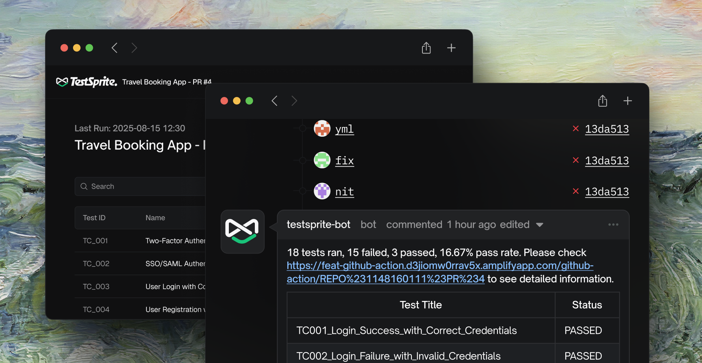
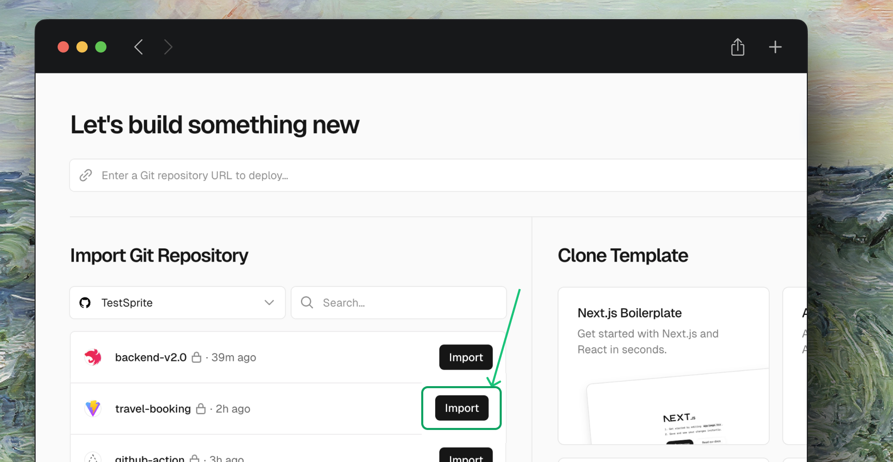
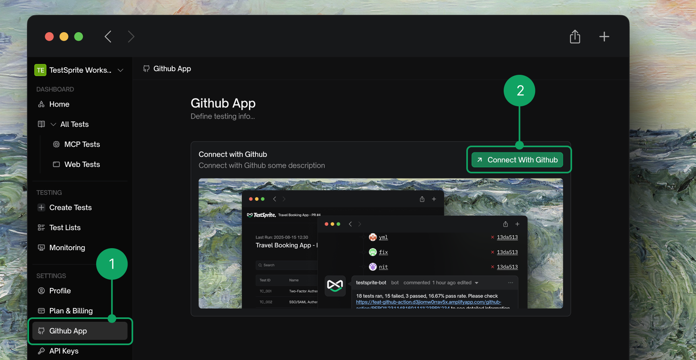
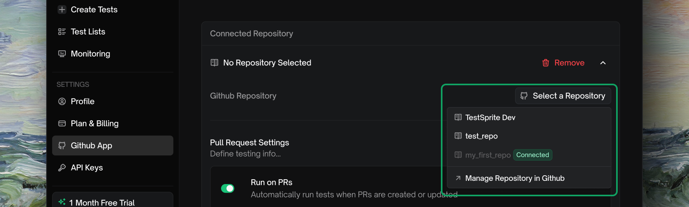
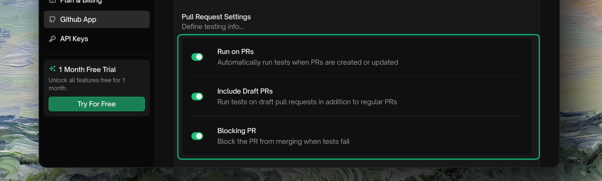
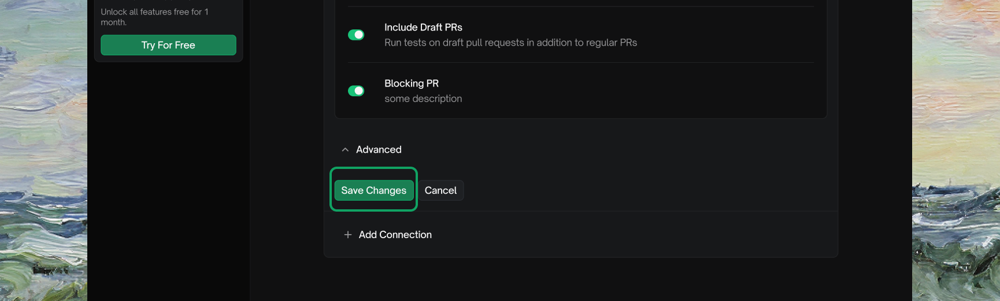
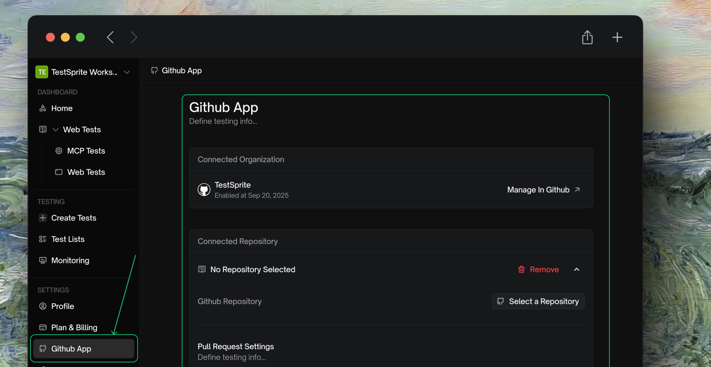
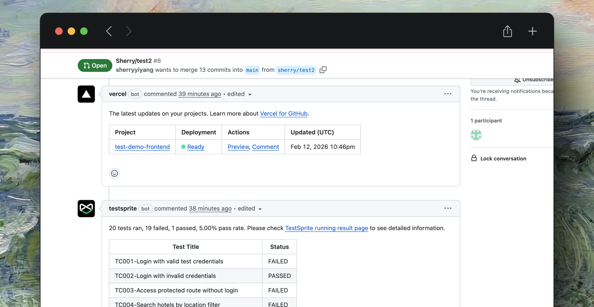

<Frame>
  
</Frame>

## How It Works

Once connected, the TestSprite GitHub App:
1. Detects new pull requests on your connected repository
2. Waits for your deployment platform (Vercel, Netlify, etc.) to deploy a preview
3. Automatically runs your TestSprite tests against the preview URL
4. Posts a comment on the PR with a detailed test results summary

## Prerequisites

<Warning>
**TestSprite MCP Server is required first.** The GitHub integration only **runs** tests — it does not generate them. You must use the [TestSprite MCP Server](/mcp/getting-started/introduction) to generate your test suite before setting up this integration.
</Warning>

### Generate Tests with MCP Server

The TestSprite MCP Server is responsible for generating, executing, and refining your test cases locally. Once your tests are committed to your repository, the GitHub App can run them automatically on every PR.
  <Frame>
    
  </Frame>
<Steps>
  <Step title="Install MCP Server">
    Follow the [MCP Installation Guide](/mcp/getting-started/installation) to set up the TestSprite MCP Server in your IDE.
  </Step>
  <Step title="Generate Tests">
    Use the MCP tools to generate test plans and test code for your project. See [First MCP Test](/mcp/getting-started/first-test) for a step-by-step walkthrough.
  </Step>
  <Step title="Commit Tests to Your Repository">
    Ensure the generated `testsprite_tests/` folder and test files are committed and included in your repository. The GitHub App will use these tests during CI/CD runs.
  </Step>
</Steps>

### Other Requirements

- A **GitHub repository** for your project
- A **deployment platform** connected to your repo (e.g., Vercel, Netlify, Render, Railway, or Fly.io) that auto-deploys on PRs

## Github App vs. Github Action
<Tip>
The GitHub App provides the simplest setup with automatic deployment detection — no workflow files needed.
</Tip>

<CardGroup cols={2}>
  <Card title="GitHub App (Recommended)" icon="github">
      Best for teams using **Vercel, Netlify, Render**, or other managed platforms.
    - **Setup:** Connect in a few clicks via Web Portal
    - **Workflow files:** None required
    - **Deploys:** Auto-detects platform deployments
    - **Config:** Managed in TestSprite Web Portal
  </Card>
  <Card title="GitHub Action" icon="square-github">
      Best for teams with **custom CI/CD pipelines** who need full control.
    - **Setup:** Requires YAML config and repo secrets
    - **Workflow files:** `.github/workflows/ci.yml`
    - **Deploys:** Manual deploy step in workflow
    - **Config:** Defined in repository workflow files
  </Card>
</CardGroup>

## Setup GitHub Integration

<Tabs>
  <Tab title="Github App" icon="Github">
  The TestSprite GitHub App provides a streamlined, no-config integration that automatically detects deployments and runs tests on every pull request. Unlike the <kbd>GitHub Action</kbd> approach, the GitHub App requires no workflow YAML files — just connect your repository through the TestSprite Web Portal.
        <Steps>
            <Step title="Connect Your Deployment Platform">
                Connect your repository to a deployment platform that supports automatic preview deployments on pull requests. Supported platforms include:

                <CardGroup cols={3}>
                  <Card title="Vercel" href="https://vercel.com">
                    <div style={{ display: 'flex', alignItems: 'flex-start', justifyContent: 'flex-start', paddingTop: '8px' }}>
                      
                    </div>
                  </Card>
                  <Card title="Netlify" href="https://netlify.com">
                    <div style={{ display: 'flex', alignItems: 'flex-start', justifyContent: 'flex-start', paddingTop: '8px' }}>
                      
                    </div>
                  </Card>
                  <Card title="Render" href="https://render.com">
                    <div style={{ display: 'flex', alignItems: 'flex-start', justifyContent: 'flex-start', paddingTop: '8px' }}>
                      
                    </div>
                  </Card>
                  <Card title="Railway" href="https://railway.app">
                    <div style={{ display: 'flex', alignItems: 'flex-start', justifyContent: 'flex-start', paddingTop: '8px' }}>
                    
                    </div>
                  </Card>
                  <Card title="Fly.io" href="https://fly.io">
                    <div style={{ display: 'flex', alignItems: 'flex-start', justifyContent: 'flex-start', paddingTop: '8px' }}>
                      
                    </div>
                  </Card>
                </CardGroup>

                These platforms provide a <kbd>Connect Repo</kbd> button that links your GitHub repository and automatically deploys a preview on every PR.
                <Frame>
                  
                </Frame>

                <Tip>
                As long as the deployment platform posts a deployment status on the PR (e.g., the Vercel bot comment), TestSprite can detect it and use the preview URL for testing.
                </Tip>
            </Step>

        <Step title="Connect GitHub in TestSprite Web Portal">
            <Frame>
              
            </Frame>
            1. Log in to the [TestSprite Web Portal](https://www.testsprite.com)
            2. Navigate to <kbd>GitHub App</kbd> in the sidebar under Settings
            3. Click <kbd>Connect With GitHub App</kbd>
            4. Authorize TestSprite to access your GitHub organization
            5. Select the repositories you want to connect

            Once authorized, you will see your connected organization displayed on the GitHub App settings page.
        </Step>

        <Step title="Configure Repository Settings">
            After connecting your organization, configure the integration for each repository:

            1. Select a **Connected Repository** from the dropdown
            <Frame>
              
            </Frame>
            2. Configure the **Pull Request Settings**:
            <Frame>
              
            </Frame>

            | Setting | Description |
            | --- | --- |
            | <kbd>Run on PRs</kbd> | Automatically run tests when PRs are created or updated |
            | <kbd>Include Draft PRs</kbd> | Run tests on draft pull requests in addition to regular PRs |
            | <kbd>Blocking PR</kbd> | Block the PR from merging when tests fail |

            3. Click **Save Changes** to apply your configuration
            <Frame>
              
            </Frame>
        </Step>
        <Step title="Managing Connection">
          You can manage your GitHub App connections from the **GitHub App** settings page in the TestSprite Web Portal.
            <Frame>
              
            </Frame>

            | Action | Description |
            | --- | --- |
            | <kbd>Add Connection</kbd> | Connect additional repositories from your organization |
            | <kbd>Remove</kbd> | Disconnect a repository from TestSprite |
            | <kbd>Manage in GitHub</kbd> | Open GitHub to manage app permissions and repository access |
        </Step>
    </Steps>
  </Tab>
  <Tab title="Github Action" icon="square-github">
  Integrate TestSprite into your CI/CD pipeline by adding a GitHub Actions workflow to your repository. Every time a pull request is created or updated, TestSprite automatically runs your tests against a preview deployment and reports results directly on the PR.

    <Steps>

        <Step title="Set Up Project Deployment">
            Configure a preview deployment so TestSprite can test against a live URL on each PR. Here are some example setups you can use to deploy your app:

            <Tabs>
              <Tab title="Vercel">
                Deploy preview builds to Vercel using the Vercel CLI inside GitHub Actions. You'll need to link your project locally with `vercel link`, then store the generated credentials as GitHub secrets.

                **Secrets required:**

                | Secret | Description |
                | --- | --- |
                | `VERCEL_TOKEN` | Generate from your [Vercel account settings](https://vercel.com/account/tokens) |
                | `VERCEL_ORG_ID` | Found in `.vercel/project.json` after running `vercel link` |
                | `VERCEL_PROJECT_ID` | Found in `.vercel/project.json` after running `vercel link` |

                ```yaml Expandable deploy.yml
                name: Vercel Preview Deployment
                env:
                  VERCEL_ORG_ID: ${{ secrets.VERCEL_ORG_ID }}
                  VERCEL_PROJECT_ID: ${{ secrets.VERCEL_PROJECT_ID }}
                on:
                  pull_request:
                    types: [opened, synchronize, reopened]
                jobs:
                  deploy:
                    runs-on: ubuntu-latest
                    steps:
                      - uses: actions/checkout@v4
                      - name: Install Vercel CLI
                        run: npm install --global vercel@latest
                      - name: Pull Vercel Environment Information
                        run: vercel pull --yes --environment=preview --token=${{ secrets.VERCEL_TOKEN }}
                      - name: Build Project Artifacts
                        run: vercel build --token=${{ secrets.VERCEL_TOKEN }}
                      - name: Deploy to Vercel
                        id: deploy
                        run: echo "url=$(vercel deploy --prebuilt --token=${{ secrets.VERCEL_TOKEN }})" >> $GITHUB_OUTPUT
                    outputs:
                      url: ${{ steps.deploy.outputs.url }}
                ```

                <Accordion title="Additional Resources">
                  <CardGroup cols={2}>
                    <Card title="GitHub Actions with Vercel" icon="book" href="https://vercel.com/kb/guide/how-can-i-use-github-actions-with-vercel">
                      Official Vercel guide for CI/CD with GitHub Actions
                    </Card>
                    <Card title="Vercel CLI Reference" icon="terminal" href="https://vercel.com/docs/cli">
                      Full Vercel CLI documentation
                    </Card>
                  </CardGroup>
                </Accordion>
              </Tab>

              <Tab title="Render">
                Trigger a Render deploy from GitHub Actions using the community `render-deploy` action. This calls the Render API to deploy your service and optionally waits for it to finish.

                **Secrets required:**

                | Secret | Description |
                | --- | --- |
                | `RENDER_API_KEY` | Generate from your [Render account settings](https://dashboard.render.com/u/settings#api-keys) |
                | `RENDER_SERVICE_ID` | Found on your service's settings page in the Render dashboard |

                ```yaml Expandable deploy.yml
                name: Render Preview Deployment
                on:
                  pull_request:
                    types: [opened, synchronize, reopened]
                jobs:
                  deploy:
                    runs-on: ubuntu-latest
                    steps:
                      - uses: JorgeLNJunior/render-deploy@v1.5.0
                        id: deploy
                        with:
                          service_id: ${{ secrets.RENDER_SERVICE_ID }}
                          api_key: ${{ secrets.RENDER_API_KEY }}
                          wait_deploy: true
                ```

                <Accordion title="Additional Resources">
                  <CardGroup cols={2}>
                    <Card title="Deploy to Render (Action)" icon="github" href="https://github.com/marketplace/actions/deploy-to-render">
                      Community GitHub Action for Render deployments
                    </Card>
                    <Card title="Render Deploy Hooks" icon="book" href="https://docs.render.com/deploy-hooks">
                      Official Render deploy hooks documentation
                    </Card>
                  </CardGroup>
                </Accordion>
              </Tab>

              <Tab title="Railway">
                Deploy preview environments on Railway for every pull request using the community `railway-preview-deploy` action. Each PR gets its own isolated environment with a unique URL.

                **Secrets required:**

                | Secret | Description |
                | --- | --- |
                | `RAILWAY_API_TOKEN` | Generate from your Railway account settings |
                | `RAILWAY_PROJECT_ID` | Found in Railway dashboard under Settings > General |

                ```yaml Expandable deploy.yml
                name: Railway Preview Deployment
                on:
                  pull_request:
                    types: [opened, synchronize, reopened, closed]
                jobs:
                  deploy:
                    runs-on: ubuntu-latest
                    if: ${{ github.event.action != 'closed' }}
                    steps:
                      - uses: actions/checkout@v4
                      - name: Deploy to Railway
                        id: deploy
                        uses: ayungavis/railway-preview-deploy@v1.0.2
                        with:
                          railway_api_token: ${{ secrets.RAILWAY_API_TOKEN }}
                          project_id: ${{ secrets.RAILWAY_PROJECT_ID }}
                          environment_name: 'staging'
                          preview_environment_name: 'pr-${{ github.event.pull_request.number }}'
                          branch_name: ${{ github.head_ref }}
                    outputs:
                      url: ${{ steps.deploy.outputs.service_domain }}
                  cleanup:
                    runs-on: ubuntu-latest
                    if: ${{ github.event.action == 'closed' }}
                    steps:
                      - uses: actions/checkout@v4
                      - uses: ayungavis/railway-preview-deploy@v1.0.2
                        with:
                          railway_api_token: ${{ secrets.RAILWAY_API_TOKEN }}
                          project_id: ${{ secrets.RAILWAY_PROJECT_ID }}
                          environment_name: 'staging'
                          preview_environment_name: 'pr-${{ github.event.pull_request.number }}'
                          branch_name: ${{ github.head_ref }}
                          cleanup: 'true'
                ```

                <Accordion title="Additional Resources">
                  <CardGroup cols={2}>
                    <Card title="Railway Preview Deploy Action" icon="github" href="https://github.com/marketplace/actions/railway-preview-deploy-action">
                      Community GitHub Action for Railway preview environments
                    </Card>
                    <Card title="GitHub Actions with Railway" icon="book" href="https://blog.railway.com/p/github-actions">
                      Official Railway blog guide for CI/CD with GitHub Actions
                    </Card>
                  </CardGroup>
                </Accordion>
              </Tab>

              <Tab title="Netlify">
                Deploy preview builds to Netlify using the community `action-netlify-deploy` action. Each PR gets a unique preview URL that you can use for testing.

                **Secrets required:**

                | Secret | Description |
                | --- | --- |
                | `NETLIFY_AUTH_TOKEN` | Generate from [Netlify personal access tokens](https://app.netlify.com/user/applications#personal-access-tokens) |
                | `NETLIFY_SITE_ID` | Found in your Netlify site settings under API ID |

                ```yaml Expandable deploy.yml
                name: Netlify Preview Deployment
                on:
                  pull_request:
                    types: [opened, synchronize, reopened]
                jobs:
                  deploy:
                    runs-on: ubuntu-latest
                    steps:
                      - uses: actions/checkout@v4
                      - uses: jsmrcaga/action-netlify-deploy@v2.0.0
                        with:
                          NETLIFY_AUTH_TOKEN: ${{ secrets.NETLIFY_AUTH_TOKEN }}
                          NETLIFY_SITE_ID: ${{ secrets.NETLIFY_SITE_ID }}
                ```

                The action outputs `NETLIFY_PREVIEW_URL` as an environment variable for use in subsequent steps.

                <Accordion title="Additional Resources">
                  <CardGroup cols={2}>
                    <Card title="Netlify Deploy Action" icon="github" href="https://github.com/marketplace/actions/netlify-deploy">
                      Community GitHub Action for Netlify deployments
                    </Card>
                    <Card title="Netlify CLI Documentation" icon="book" href="https://docs.netlify.com/cli/get-started/">
                      Official Netlify CLI for manual deploy workflows
                    </Card>
                  </CardGroup>
                </Accordion>
              </Tab>

              <Tab title="Fly.io">
                Deploy to Fly.io using the official `flyctl-actions` action from Superfly. The workflow installs `flyctl` and runs `flyctl deploy` against your `fly.toml` configuration.

                **Secrets required:**

                | Secret | Description |
                | --- | --- |
                | `FLY_API_TOKEN` | Generate by running `fly tokens create deploy -x 999999h` locally |

                ```yaml Expandable deploy.yml
                name: Fly.io Preview Deployment
                on:
                  pull_request:
                    types: [opened, synchronize, reopened]
                jobs:
                  deploy:
                    runs-on: ubuntu-latest
                    concurrency: deploy-group
                    steps:
                      - uses: actions/checkout@v4
                      - uses: superfly/flyctl-actions/setup-flyctl@master
                      - name: Deploy to Fly.io
                        id: deploy
                        run: flyctl deploy --remote-only
                        env:
                          FLY_API_TOKEN: ${{ secrets.FLY_API_TOKEN }}
                ```

                Make sure your `fly.toml` is committed to the repository for the action to reference during deployment.

                <Accordion title="Additional Resources">
                  <CardGroup cols={2}>
                    <Card title="Continuous Deployment with GitHub Actions" icon="book" href="https://fly.io/docs/launch/continuous-deployment-with-github-actions/">
                      Official Fly.io guide for CI/CD with GitHub Actions
                    </Card>
                    <Card title="GitHub Action for flyctl" icon="github" href="https://github.com/marketplace/actions/github-action-for-flyctl">
                      Official flyctl GitHub Action
                    </Card>
                  </CardGroup>
                </Accordion>
              </Tab>
            </Tabs>
        </Step>

        <Step title="Generate a TestSprite API Key">
        <Frame>
          
        </Frame>
            1. Log in to the [TestSprite Web Portal](https://www.testsprite.com/dashboard)
            2. Navigate to <kbd>API Keys</kbd> in the sidebar
            3. Click <kbd> New API Key</kbd> and copy the generated key
            4. Add it as a repository secret named `TESTSPRITE_API_KEY` in your repo <kbd>Settings</kbd> → <kbd>Secrets and variables</kbd> → <kbd>Actions</kbd>
        </Step>

        <Step title="Add the GitHub Actions Workflow">
            Create the file `.github/workflows/ci.yml` in your repository with the following configuration:
            <CodeGroup>
            ```yaml Expandable ci.yml
            name: TestSprite CI

            on:
              pull_request:
                types: [opened, synchronize, reopened]

            jobs:
              test:
                needs: deploy
                runs-on: ubuntu-latest
                steps:
                  - name: Checkout
                    id: checkout
                    uses: actions/checkout@v4

                  - name: TestSprite Action
                    id: testsprite
                    uses: TestSprite/run-action@v1
                    with:
                      testsprite-api-key: ${{ secrets.TESTSPRITE_API_KEY }}
                      base_url: ${{ needs.deploy.outputs.url }}
                      blocking: 'true'
            ```
            </CodeGroup>
            <Warning>
            If you set `blocking: 'true'`, the GitHub Action will fail when tests do not pass, which can block PR merges if you have branch protection rules enabled.
            </Warning>

            <Accordion title="Complete workflow examples by platform">
              Full `ci.yml` examples that combine deployment and TestSprite testing in a single workflow.

              <CodeGroup>
                ```yaml Vercel
                name: TestSprite CI
                env:
                  VERCEL_ORG_ID: ${{ secrets.VERCEL_ORG_ID }}
                  VERCEL_PROJECT_ID: ${{ secrets.VERCEL_PROJECT_ID }}
                on:
                  pull_request:
                    types: [opened, synchronize, reopened]
                jobs:
                  deploy:
                    runs-on: ubuntu-latest
                    outputs:
                      url: ${{ steps.deploy.outputs.url }}
                    steps:
                      - uses: actions/checkout@v4
                      - name: Install Vercel CLI
                        run: npm install --global vercel@latest
                      - name: Pull Vercel Environment Information
                        run: vercel pull --yes --environment=preview --token=${{ secrets.VERCEL_TOKEN }}
                      - name: Build Project Artifacts
                        run: vercel build --token=${{ secrets.VERCEL_TOKEN }}
                      - name: Deploy to Vercel
                        id: deploy
                        run: echo "url=$(vercel deploy --prebuilt --token=${{ secrets.VERCEL_TOKEN }})" >> $GITHUB_OUTPUT
                  test:
                    needs: deploy
                    runs-on: ubuntu-latest
                    steps:
                      - uses: actions/checkout@v4
                      - name: TestSprite Action
                        uses: TestSprite/run-action@v1
                        with:
                          testsprite-api-key: ${{ secrets.TESTSPRITE_API_KEY }}
                          base_url: ${{ needs.deploy.outputs.url }}
                          blocking: 'true'
                ```
                ```yaml Render
                name: TestSprite CI
                on:
                  pull_request:
                    types: [opened, synchronize, reopened]
                jobs:
                  deploy:
                    runs-on: ubuntu-latest
                    steps:
                      - uses: JorgeLNJunior/render-deploy@v1.5.0
                        id: deploy
                        with:
                          service_id: ${{ secrets.RENDER_SERVICE_ID }}
                          api_key: ${{ secrets.RENDER_API_KEY }}
                          wait_deploy: true
                  test:
                    needs: deploy
                    runs-on: ubuntu-latest
                    steps:
                      - uses: actions/checkout@v4
                      - name: TestSprite Action
                        uses: TestSprite/run-action@v1
                        with:
                          testsprite-api-key: ${{ secrets.TESTSPRITE_API_KEY }}
                          base_url: # Your Render service URL
                          blocking: 'true'
                ```
                ```yaml Railway
                name: TestSprite CI
                on:
                  pull_request:
                    types: [opened, synchronize, reopened]
                jobs:
                  deploy:
                    runs-on: ubuntu-latest
                    outputs:
                      url: ${{ steps.deploy.outputs.service_domain }}
                    steps:
                      - uses: actions/checkout@v4
                      - name: Deploy to Railway
                        id: deploy
                        uses: ayungavis/railway-preview-deploy@v1.0.2
                        with:
                          railway_api_token: ${{ secrets.RAILWAY_API_TOKEN }}
                          project_id: ${{ secrets.RAILWAY_PROJECT_ID }}
                          environment_name: 'staging'
                          preview_environment_name: 'pr-${{ github.event.pull_request.number }}'
                          branch_name: ${{ github.head_ref }}
                  test:
                    needs: deploy
                    runs-on: ubuntu-latest
                    steps:
                      - uses: actions/checkout@v4
                      - name: TestSprite Action
                        uses: TestSprite/run-action@v1
                        with:
                          testsprite-api-key: ${{ secrets.TESTSPRITE_API_KEY }}
                          base_url: ${{ needs.deploy.outputs.url }}
                          blocking: 'true'
                ```
                ```yaml Netlify
                name: TestSprite CI
                on:
                  pull_request:
                    types: [opened, synchronize, reopened]
                jobs:
                  deploy:
                    runs-on: ubuntu-latest
                    outputs:
                      url: ${{ steps.deploy.outputs.NETLIFY_PREVIEW_URL }}
                    steps:
                      - uses: actions/checkout@v4
                      - uses: jsmrcaga/action-netlify-deploy@v2.0.0
                        id: deploy
                        with:
                          NETLIFY_AUTH_TOKEN: ${{ secrets.NETLIFY_AUTH_TOKEN }}
                          NETLIFY_SITE_ID: ${{ secrets.NETLIFY_SITE_ID }}
                  test:
                    needs: deploy
                    runs-on: ubuntu-latest
                    steps:
                      - uses: actions/checkout@v4
                      - name: TestSprite Action
                        uses: TestSprite/run-action@v1
                        with:
                          testsprite-api-key: ${{ secrets.TESTSPRITE_API_KEY }}
                          base_url: ${{ needs.deploy.outputs.url }}
                          blocking: 'true'
                ```
                ```yaml Fly.io
                name: TestSprite CI
                on:
                  pull_request:
                    types: [opened, synchronize, reopened]
                jobs:
                  deploy:
                    runs-on: ubuntu-latest
                    concurrency: deploy-group
                    steps:
                      - uses: actions/checkout@v4
                      - uses: superfly/flyctl-actions/setup-flyctl@master
                      - name: Deploy to Fly.io
                        run: flyctl deploy --remote-only
                        env:
                          FLY_API_TOKEN: ${{ secrets.FLY_API_TOKEN }}
                  test:
                    needs: deploy
                    runs-on: ubuntu-latest
                    steps:
                      - uses: actions/checkout@v4
                      - name: TestSprite Action
                        uses: TestSprite/run-action@v1
                        with:
                          testsprite-api-key: ${{ secrets.TESTSPRITE_API_KEY }}
                          base_url: # Your Fly.io app URL
                          blocking: 'true'
                ```
              </CodeGroup>
            </Accordion>
        </Step>
    </Steps>
    </Tab>
  </Tabs>

  ## Create a Pull Request
  <Frame>
    
  </Frame>
  Create a pull request on your connected repository. The following will happen automatically:

  1. Your deployment platform deploys a preview of the PR
  2. TestSprite detects the deployment and starts running tests
  3. The **TestSprite bot** posts a comment on the PR with test results

  The comment includes a summary table with each test case and its pass/fail status, plus a link to the detailed TestSprite results page.

  <Info>
  Both methods produce the same test result comments on your pull requests. Choose the approach that best fits your team's workflow.
  </Info>

## Next Steps

<Columns cols={2}>
  <Card title="Test Maintenance" icon="plug" href="/mcp/maintenance/test-maintenance">
    Learn how to maintain and update your test suites over time.
  </Card>
  <Card title="Manage API Keys" icon="key" href="/web-portal/admin/api-keys">
    Create and manage your TestSprite API keys
  </Card>
</Columns>
