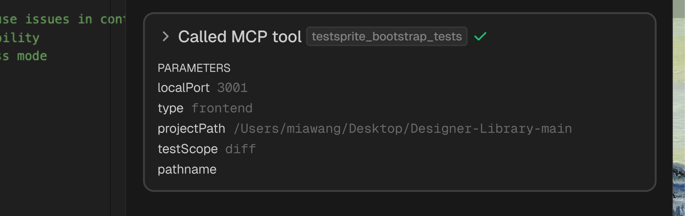
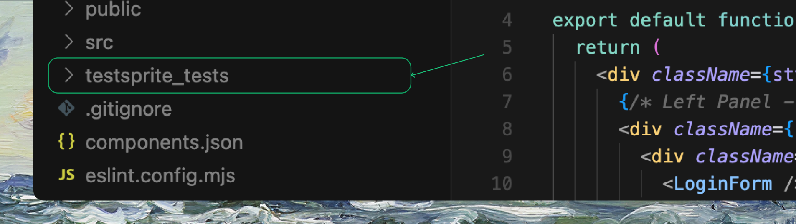

## Keep Tests Healthy with Minimal Effort
Most maintenance is already handled via healing and focused regeneration. Use this page as a hub for quick practices and links.

## Essentials
- Prefer regeneration over manual rewrites for broad changes
- Apply auto-healing for selector drift, waits, and fixtures
- Use diff scope to update only impacted tests
- Keep PRD and acceptance criteria current

## Shift Left (TDD with TestSprite)
Generate and run tests while coding—even before features are complete—to reveal gaps early.

 <Frame>
  
</Frame>
- Use `testScope: "diff"` to target in-progress changes
- Run small subsets frequently via `testIds`
- Let healing suggestions guide selectors, waits, and data setup from the start

<Card title="Create Tests for New Change" href="/mcp/core/create-tests-new-feature" icon="square-plus">
  Learn how to create tests for new features and changes
</Card>

## Common Tasks

<Columns cols={2}>
  <Card title="Create Tests for New Change" href="/mcp/core/create-tests-new-feature" icon="square-plus">
    Update changed flows with new tests
  </Card>
  <Card title="Healing & Observability" href="/mcp/concepts/healing-observability" icon="bandage">
    Fix failing or flaky tests with automatic healing
  </Card>
  <Card title="Add Extra Tests" href="/mcp/core/add-extra-tests" icon="plus-circle">
    Expand coverage with additional test cases
  </Card>
  <Card title="Test Types & Lifecycle" href="/mcp/concepts/test-type-lifecycle" icon="arrow-rotate-right">
    Understand test types and their lifecycle
  </Card>
  <Card title="Import Existing Tests" href="/mcp/maintenance/migration-from-other-platforms" icon="arrow-down-to-line">
    Migrate existing test suites to TestSprite
  </Card>
</Columns>

<Tip>
Rerun quickly: `testsprite_rerun_tests({ projectPath: "/abs/path" })`
</Tip>

## Best Practices
<AccordionGroup>
  <Accordion title="Semantic Selectors & Ready States">
    Use semantic selectors and explicit ready states
  </Accordion>
  <Accordion title="Deterministic Test Data">
    Keep deterministic test data and clean state between cases
  </Accordion>
  <Accordion title="Frequent Commits">
    Commit changes frequently so diff-based updates are accurate
  </Accordion>
  <Accordion title="Run Small Subsets">
    Run a small subset (by `testIds`) while iterating
  </Accordion>
</AccordionGroup>

## Where Artifacts Live
     <Frame>
        
        </Frame>
- Results, PRD, plans, and logs under `testsprite_tests/`
- Reports: Markdown/HTML plus machine-readable JSON for automation

## Related

<Columns cols={2}>
  <Card title="Create Tests for New Projects" href="/mcp/core/create-tests-new-project">
    Learn how to create tests for new projects
  </Card>
  <Card title="Modify or Update Tests" href="/mcp/core/modify-tests">
    Learn how to modify and update existing tests
  </Card>
  <Card title="MCP Testing Workflow" href="/mcp/concepts/workflow">
    Understand the MCP testing workflow
  </Card>
  <Card title="MCP Tools Reference" href="/mcp/core/tools">
    Reference guide for MCP tools and commands
  </Card>
</Columns>
