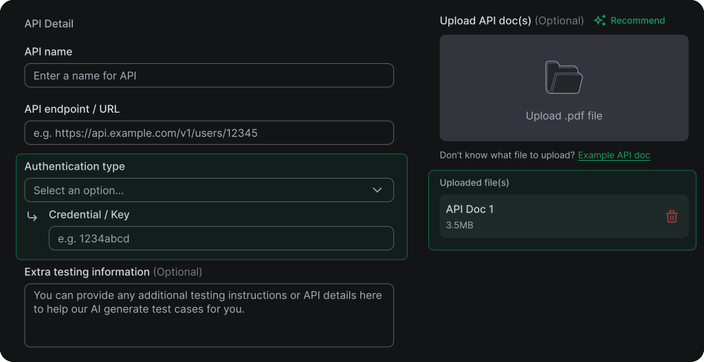
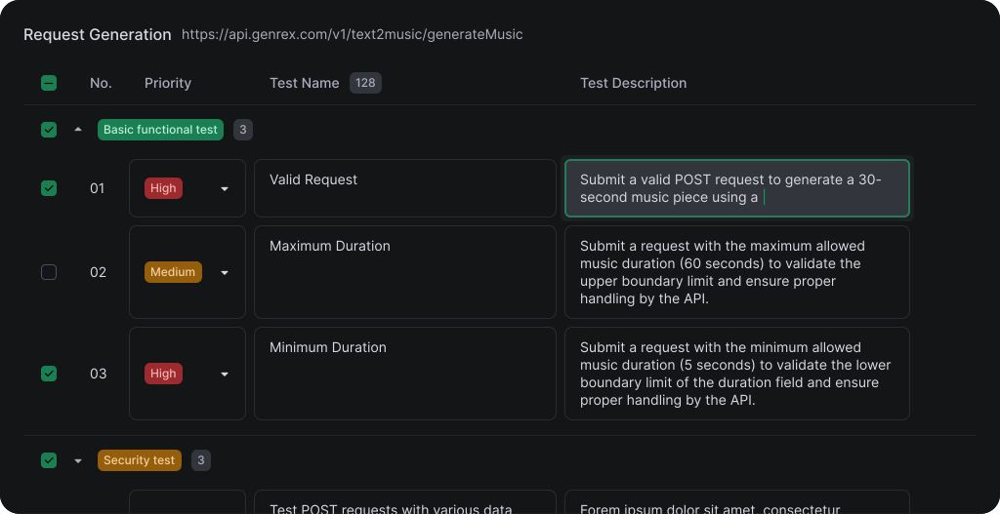
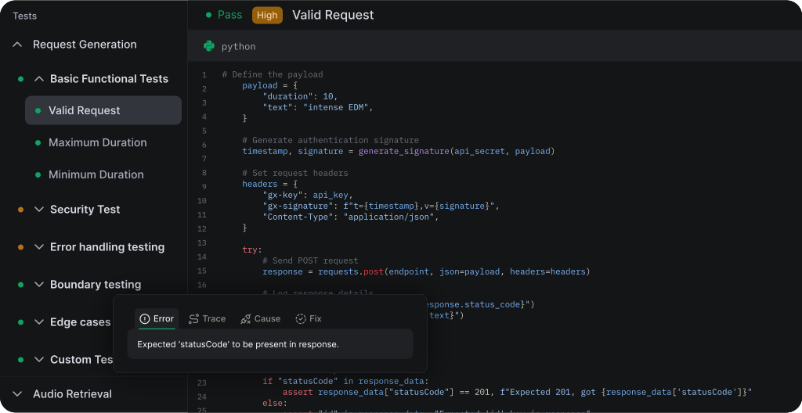
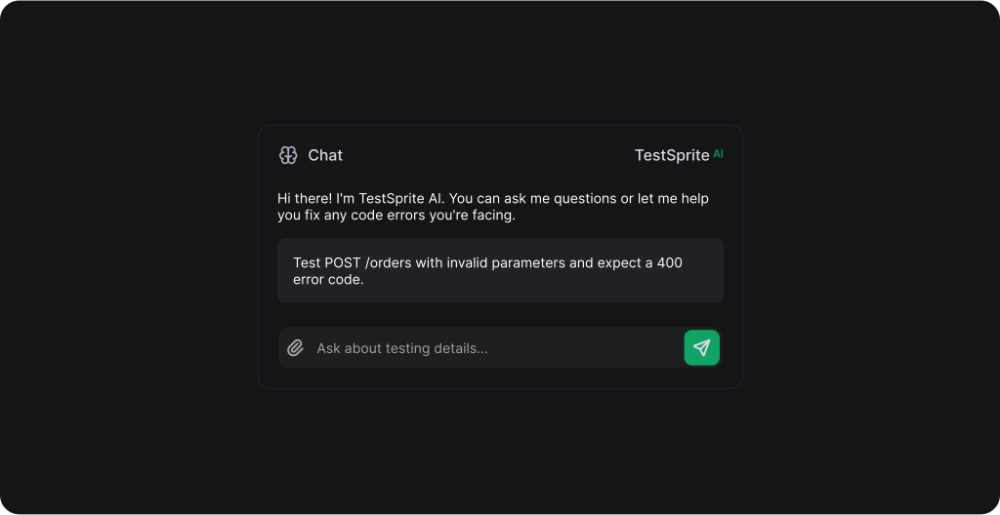

# TestSprite Documentation: Back-End (APIs) Testing

## Overview

Welcome to TestSprite's back-end testing feature! Our goal is to simplify API testing and help you efficiently cover a wide range of scenarios. With TestSprite, you can easily perform end-to-end tests for your RESTful APIs, ensuring reliability and performance without the usual headaches. Whether you are a small team or an enterprise, our tool is designed to meet your testing needs with speed and precision.

### Key Features

- **Fast and Easy Setup**: Get started quickly with minimal documentation—no need for extensive prompts or full codebases.
- **Comprehensive Test Types**: Supports a wide range of tests, including functional testing, error handling, security, authorization & authentication, boundary testing, load & performance testing, edge case testing, response content validation, and concurrency testing.
- **Concise Reports**: Delivers detailed outputs, including error types, potential root causes, and recommended fixes.
- **Natural Language Feedback**: Easily provide feedback on test results and adjustments using natural language.

## Getting Started

To begin using TestSprite for back-end testing, follow these steps:

### Step 1: Set Up Your API Testing Environment

1. Navigate to https://www.testsprite.com/dashboard/testing, click the **Create a Test** button on your **Home** page, or select the **New Test** tab from the left sidebar.
2. Enter a name for your project. Once saved, you'll be automatically directed to the **Backend Testing** step.
3. Provide the necessary details about your APIs. You can also include additional instructions in natural language to help guide how our AI should test your APIs.
4. If applicable, <span style={{ color: "#10A363" }}> **upload any relevant API documentation**</span> to help us better understand and test your APIs.



> Example API documentation: [https://docs.genrex.com/docs/1.0/api-reference/request-generation](https://docs.genrex.com/docs/1.0/api-reference/request-generation)

---

### Step 2: Review Generated Test Plans

1. **Review AI Generated Test Plan**:  

Our AI testing agent generates a comprehensive test plan that includes a variety of test types, such as:

- Functional Testing
- Error Handling Testing
- Security Testing
- Authorization & Authentication Testing
- Boundary Testing
- Load & Performance Testing
- Edge Case Testing
- Response Content Testing
- Concurrency Testing
- And more...

You can expand each test type to view the detailed scenarios generated specifically for your application. Feel free to modify any of the content directly within the table to better suit your specific testing needs.



2. **Select Test Categories and Cases**:  
Based on your needs, you can select the test categories and cases you’d like the AI to implement and execute for your APIs. You also have the option to manually add test cases using natural language. For best results, we recommend selecting all available test cases to ensure comprehensive coverage of your software.

---

### Step 3: Run Your Tests

1. Click **Next** to initiate the execution of your selected test plan.
2. TestSprite will automatically generate the required test code, execute them, and analyze the results.

---

### Step 4: Review Test Results

After running your tests, TestSprite displays a detailed execution report filled with insights and actionable recommendations to help you refine your software. You can also interact with our integrated chatbot to provide feedback, request adjustments to your test code, or ask any questions about the results.

Each failed test case includes a **Detailed Analysis** section with four key tabs that offer deeper insights:

- **Error**: A clear description of the issue encountered during the test, helping you understand what went wrong.
- **Trace**: A full code stack traceback of the error, allowing you to see exactly where and how the issue occurred.
- **Cause**: A thorough analysis of potential causes for the failure, using AI to identify root causes and contributing factors.
- **Fix**: AI-generated suggestions for resolving the issue, including code snippets or configuration adjustments to help you quickly address the problem.



## Advanced Configuration

### Using Natural Language for Questions and Test Adjustments

You can ask questions about the current test cases or suggest adjustments using natural language—no specific format required. For example:



```plaintext
"Test POST /orders with invalid parameters and expect a 400 error code."
```

TestSprite will automatically interpret and update the corresponding test case, making the testing process smoother and more efficient.

## Examples

### Example 1: Generated Test Code

```python
import hashlib
import hmac
import json
import pytest
import requests
import time

# Define the API URL and credentials (use environment variables for added security)
api_url = "https://your-api-url.com/v1/text2music/generateMusic"
api_key = "hide_for_privacy_protection"
api_secret = "hide_for_privacy_protection"

def create_signature(api_secret, data_to_sign):
    return hmac.new(api_secret.encode(), data_to_sign.encode(), hashlib.sha256).hexdigest()

def test_invalid_gx_signature():
    # Construct the payload
    payload = {
        "duration": 10,
        "text": "intense EDM",
    }
    payload_json = json.dumps(payload, separators=(",", ":"))

    # Create correct signature
    timestamp = str(int(time.time() * 1000))
    data_to_sign = f"{timestamp}.{payload_json}"
    correct_signature = create_signature(api_secret, data_to_sign)

    # Tamper the payload
    tampered_payload = payload_json.replace("intense EDM", "soft jazz")

    # Use correct timestamp and an intentionally incorrect signature
    tampered_signature = create_signature(api_secret, f"{timestamp}.{tampered_payload}")

    # Create headers with tampered payload
    headers = {
        "gx-key": api_key,
        "gx-signature": f"t={timestamp},v={tampered_signature}",
        "Content-Type": "application/json",
    }

    # Send POST request with tampered payload
    response = requests.post(api_url, data=tampered_payload, headers=headers)
    
    # Parse the response
    response_data = response.json()

    # Assertions
    assert "statusCode" in response_data, "Expected 'statusCode' in the response"
    assert response_data["statusCode"] == 400, f"Expected statusCode 400, got {response_data['statusCode']}"

test_invalid_gx_signature()

```