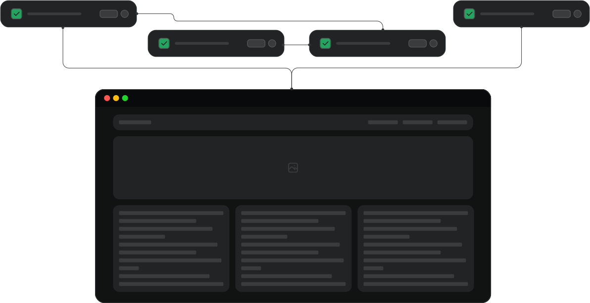

# TestSprite Documentation: Front-End (UI) Testing



## Overview

TestSprite provides a fast, user-friendly solution for automating web application testing. With just a few clicks, you can run tests on various user interactions to ensure your UI performs as expected across different scenarios. It’s the perfect platform for small teams seeking reliable, automated results without the complexity of manual setup.

---

### Key Features

- **Fast Setup**: Get started quickly with minimal configuration, allowing you to focus on testing rather than setup.

- **Comprehensive Test Cases**: Real-time, AI-generated test cases tailored to your website’s actual content and edge cases. Our AI testing agent creates custom tests that validate both UI and UX, covering everything from basic user flows to complex interactions.

- **Web Preview**: Visualize test execution in real-time, making it easy to monitor interactions and identify issues as they occur.

- **Detailed Reports**: Receive in-depth analysis with clear insights, including error tracing, root cause identification, and actionable recommendations to help you resolve issues quickly.

- **Natural Language Feedback**: Easily provide feedback using natural language to refine test results or adjust scenarios, making the testing process intuitive and adaptive.

## Getting Started

To begin using TestSprite for front-end testing, follow these steps:

### Step 1: Set Up Your Front-End Testing Environment

1. **Log in** to your TestSprite account and go to the **Overview** section.
2. Click on **Create New Test**, which will automatically proceed to the **Front-End (UI) Testing** step.
3. Enter the **Web Application Details**:
   - Web application starting URL.
   - Any authentication credentials if needed (e.g., username, password).

    ```json
    {
      "web_app_url": "https://www.example.com",
      "username": "user@example.com",
      "password": "password123"
    }
    ```

4. **Add More URLs** if you have multiple pages to test within the same flow.

---

### Step 2: Configure Test Plans

1. **Review the Test Plan**:  
   Examine the test plan, which includes a variety of test scenarios tailored to your application's needs, such as:

   - **Test the 'Log In' Link Functionality**:  
     Ensure that the 'Log In' link directs users to the correct login page, triggering authentication flows properly and guiding users to their dashboard or profile page after a successful login.

   - **Test the 'Add to Cart' Button in Product Listings**:  
     Verify that clicking the 'Add to Cart' button accurately adds the selected product to the user's shopping cart, updates the cart count, and displays confirmation messages as expected.

   - **Test the 'Close Banner' Button Functionality**:  
     Ensure that clicking the 'Close' button on pop-up banners, promotional messages, or notifications dismisses the banner correctly, without disrupting other page elements.

   - **Verify Link Redirection for Page Load Accuracy**:  
     Confirm that navigation links redirect users to the intended pages, with appropriate loading times and accurate content display, ensuring a smooth browsing experience across different sections of your website.

2. **Select Scenarios to Execute**:  
   Based on your needs, choose the test categories and scenarios you want the AI to implement and execute for your frontend UI components.

---

### Step 3: Run Your Tests

1. Click **Next** to start executing your selected test plan.
2. Monitor progress through the **Web Preview** feature, which displays the tested page as actions are performed.
3. TestSprite will automatically validate UI interactions and generate a detailed report upon completion.

---

### Step 4: Review Test Results

After your test is complete, TestSprite provides a detailed report, for example:

> **Amazon landing page testing results**:
>  - **Total Tests Run**: 20
>  - **Pass/Fail Ratio**: 16 Passed, 4 Failed
>  - **Interaction Success Rate**: 80%

## Advanced Features

### Web Preview for Context

TestSprite includes a **Web Preview** feature that allows you to visualize the testing process:

- Watch as each element is interacted with on your web page.
- Understand how the page responds to various actions.
- Quickly identify UI issues that might otherwise be missed.

### Using Natural Language for Feedback

TestSprite also allows you to **give feedback** using natural language. For example:

```plaintext
"Check if the 'Add to Cart' button works as expected on small screens."
```

TestSprite interprets the feedback and adjusts the test accordingly, making it easier for you to refine test cases without needing to dive into complex configurations.
