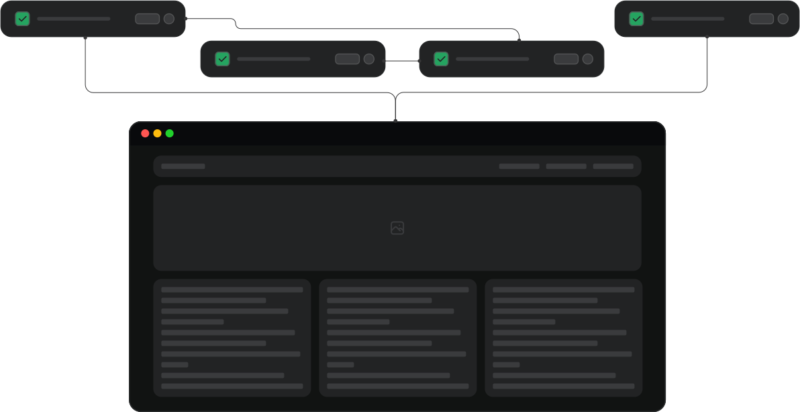
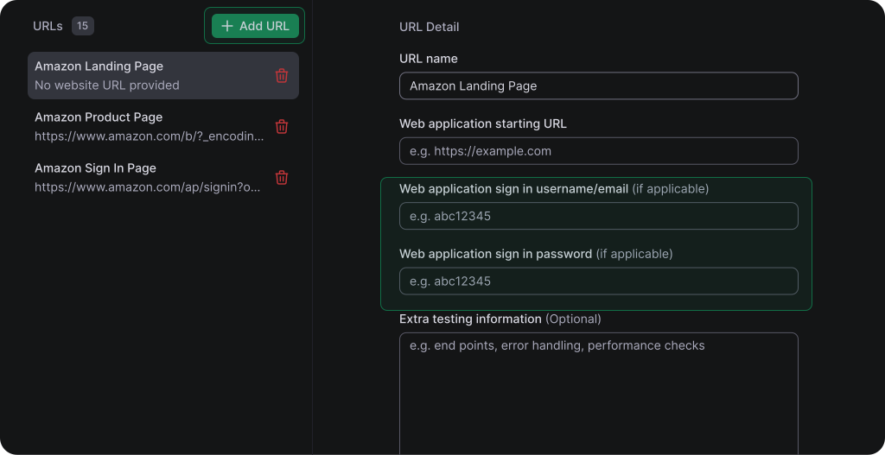
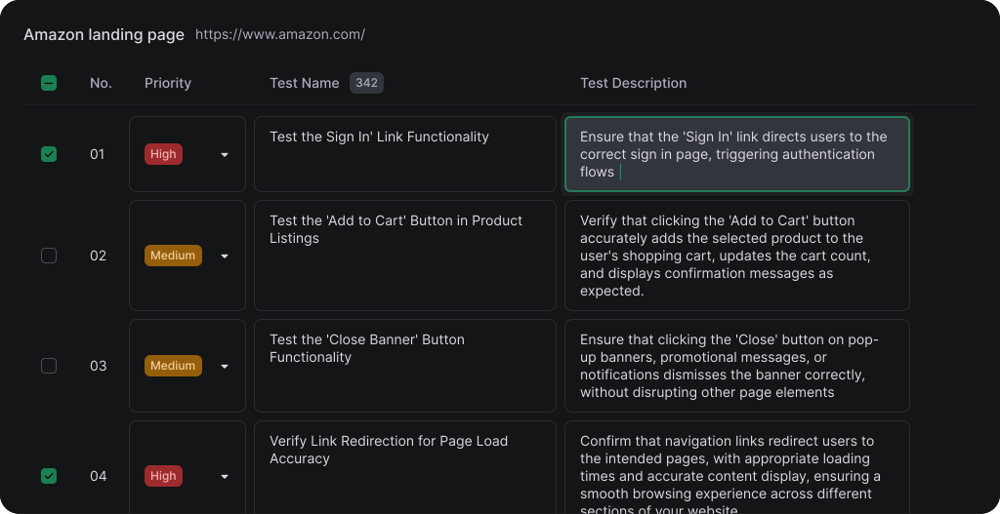

# TestSprite Documentation: Front-End (UI) Testing



## Overview

TestSprite provides a fast, user-friendly solution for automating web application testing. With just a few clicks, you can run tests on various user interactions to ensure your UI performs as expected across different scenarios. It's the perfect platform for small teams seeking reliable, automated results without the complexity of manual setup.

---

### Key Features

- **Fast Setup**  
Get started in <span style={{ color: "#10A363" }}> **minutes**</span> with minimal configuration. Just provide your website URLs, and TestSprite's <span style={{ color: "#10A363" }}> **AI agent**</span> takes it from there—so you can skip the manual setup and focus on what matters most: shipping great software.

- **Customizable, AI-Generated Test Cases**  
TestSprite dynamically creates <span style={{ color: "#10A363" }}> **intelligent, real-time test plans**</span> tailored to your product's actual content and edge cases. You can easily <span style={{ color: "#10A363" }}> **customize**</span> the prompts, adjust scenarios, or manually describe any additional flows you want covered. If our AI agent misses anything, you're always in control.

- **End-to-End Visibility** with <span style={{ color: "#10A363" }}> **Smart Video Playback**</span>  
Every step taken by the AI agent—every button click, form fill, mouse action—is <span style={{ color: "#10A363" }}> **recorded and replayable**</span>. This makes it easy to understand exactly how the test ran, spot UI issues visually, and validate the testing behavior from start to finish.

- **Web-Based Test Execution Preview**  
Watch test execution unfold <span style={{ color: "#10A363" }}> **live in the browser**</span>. Monitor interactions in real time to catch potential issues instantly, and understand exactly how your users will experience the application.

- **Actionable, Detailed Reports**  
Each test run comes with an <span style={{ color: "#10A363" }}> **execution report**</span> including error message, root cause analysis, and suggested fixes. Our AI not only flags issues but also helps you resolve them faster with meaningful insights.

- **Natural Language Feedback Loop**  
Refine tests directly through <span style={{ color: "#10A363" }}> **natural language**</span>. Want to tweak a scenario, add an edge case, or rerun a modified flow? Just tell the AI—no code required. You can even regenerate test cases instantly based on new test prompts.

- **Generated Test Code** (Python + Playwright)  
Alongside visual testing, TestSprite automatically generates <span style={{ color: "#10A363" }}> **reusable test code**</span> (defaulting to Python with Playwright). It's perfect for future regression testing, CI/CD pipelines, or for developers who want full transparency into what's being run under the hood.

## Getting Started

To begin using TestSprite for front-end testing, follow these steps:

### Step 1: Set Up Your Front-End Testing Environment

1. **Log in** to your TestSprite account and go to the **Home** section.
2. Click on **Create a Test**. Once you've completed the backend (API) testing step, you'll be automatically guided to the front-end (UI) Testing step. You can also choose to <span style={{ color: "#10A363" }}> **skip**</span> backend testing if you prefer to start with the front end.
3. Enter the **Web Application Details**:
   - Web application starting URL.
   - Any authentication credentials if needed (e.g., username, password).

    ```json
    {
      "Web application starting URL": "https://www.example.com",
      "Web application sign in username/email (optional)": "user@example.com",
      "Web application sign in password (optional)": "password123"
    }
    ```
4. **Add more URLs**: if you have multiple pages to test within the same flow.
5. **Add Special Testing Instructions** (Optional): 
If you have specific testing requirements or additional context that could help the AI generate a more accurate initial test plan, feel free to include them here. This step is optional but can enhance the quality and relevance of your tests.



---

### Step 2: Configure Test Plans

1. **Review the Draft Test Plan**:  
   **Review** the draft test plan *(Our AI may further refine this after performing a deeper real-time analysis of your application during test case execution)* generated for your application. It contains a set of end-to-end test scenarios specifically tailored to the UI you've provided. A sample draft might look like this:

>   - **Test the 'Log In' Link Functionality**:
>     Ensure that the 'Log In' link directs users to the correct login page, triggering authentication flows properly and guiding users to their dashboard or profile page after a successful login.
>
>   - **Test the 'Add to Cart' Button in Product Listings**:
>     Verify that clicking the 'Add to Cart' button accurately adds the selected product to the user's shopping cart, updates the cart count, and displays confirmation messages as expected.
>
>   - **Test the 'Close Banner' Button Functionality**:
>     Ensure that clicking the 'Close' button on pop-up banners, promotional messages, or notifications dismisses the banner correctly, without disrupting other page elements.
>
>   - **Verify Link Redirection for Page Load Accuracy**:
>     Confirm that navigation links redirect users to the intended pages, with appropriate loading times and accurate content display, ensuring a smooth browsing experience across different sections of your website.

2. **<span style={{ color: "#10A363" }}> **Select & Modify**</span> Scenarios to Execute**:  
Based on your needs, select the test scenarios you'd like the AI to implement and execute for your frontend UI components. You can also <span style={{ color: "#10A363" }}> **modify any Test Description directly**</span> to better align with your specific requirements or improve accuracy.



---

### Step 3: Run Your Tests

1. Click **Next** to start generating and executing your selected test cases.
2. Monitor progress through the **Web Preview** feature, which displays the tested page as actions are performed.
3. TestSprite will automatically validate UI interactions and generate a detailed result upon completion.

---

### Step 4: Review Test Results

After your test is complete, TestSprite provides a detailed report, for example:

> **Amazon landing page testing results**:
>
> 

## Advanced Features

### Web Preview for Context

TestSprite includes a **Web Preview** feature that allows you to visualize the testing process:

- Watch as each element is interacted with on your web page.
- Understand how the page responds to various actions.
- Quickly identify UI issues that might otherwise be missed.

### Using Natural Language to Refine and Regenerate Tests

TestSprite lets you easily refine or modify tests using natural language—no technical configuration required. Simply  <span style={{ color: "#10A363" }}> update the **Test Prompt**</span> to better reflect your intended behavior. For example:

> "Ensure that the 'Sign In' link directs users to the correct sign in page, triggering authemtication flows properly and guiding users to their dashboard or profile page after a successful login."

TestSprite interprets the **new Test Prompt** and adjusts the test accordingly, making it easier for you to refine test cases without needing to dive into complex configurations.

