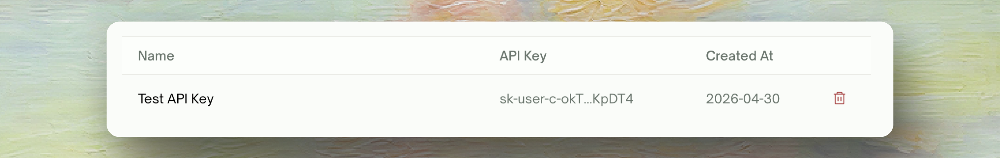
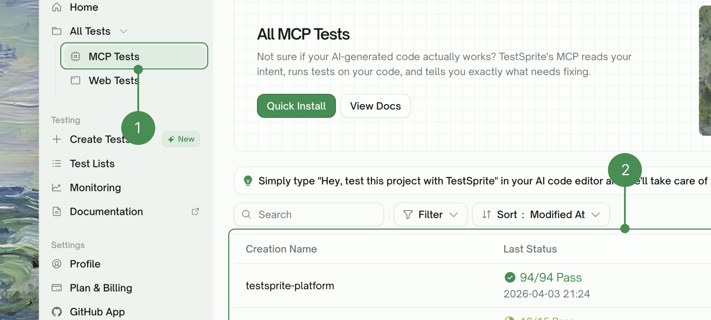

## Two Kinds of API Keys

An API key authenticates the CLI and the MCP Server as you. Two kinds exist:

| | Personal key | Workspace key |
| :--- | :--- | :--- |
| **Prefix** | `sk-user-` | `sk-member-` |
| **How you get one** | Not mintable today — this is the original key kind, from before workspace keys existed | Click **New API Key** on any workspace's API Keys page, including your personal workspace's |
| **Bound to** | You — not to any workspace, so it behaves the same wherever it was created | The workspace whose page minted it |
| **Where it's listed** | Your personal workspace's API Keys page | That workspace's API Keys page |
| **Draws on** | Your personal balance | That workspace's balance |
| **What it creates** | Lands in your personal workspace | Belongs to that workspace |
| **Active-key cap** | 3 active | 2 active per member, per workspace |
| **Revoking** | Revokes it everywhere — it was never workspace-scoped | Revokes that key only; you can mint another for the same workspace |

<Note>
Both kinds are capped, with different limits: 2 active workspace keys per member per workspace (so you can rotate one while the other stays in use), and 3 active personal keys. Going over a cap fails until you revoke one. Revoking is immediate.
</Note>

<Info>
Personal keys predate the workspace-key kind and can no longer be minted. If you already have one, it keeps working exactly as before — every key minted today, from any workspace's API Keys page, is a workspace key.

A shared workspace's API Keys page lists only that workspace's keys. Your personal keys are on your personal workspace's page, where you can also revoke them — they're left off a shared workspace's page because anything they create lands in your personal workspace, not in the shared one.
</Info>

See [Workspaces](../../web-portal/admin/workspaces) for what a workspace is and how personal vs. shared workspaces differ.

## Creating a Key

Every key minted today is a workspace key — there's no separate flow for a personal key. Go to <kbd>Settings > API Keys</kbd> in whichever workspace should own the key and click <kbd>New API Key</kbd>; the key you get back is bound to that workspace, including your personal workspace if that's the page you were on.

<Frame>
  
</Frame>

Provide a **descriptive name** (e.g., "MCP Integration") and optionally set an expiration. Leave it blank and the key does not expire — unless the workspace enforces a maximum lifetime, in which case a longer expiry you request is rejected, and a key created without one is issued with that maximum instead. Click <kbd>Create</kbd>, then use the copy icon to copy the generated key immediately.

<Warning>
  Store it securely. It won't be shown again.
</Warning>

<Frame>

</Frame>

The key is stored hashed; its full value is shown exactly once, at creation, and never again.

## Managing API Keys

   <Frame>
    
    </Frame>

<Tabs>
  <Tab title="Each API Key Shows">
    Each API key displays key information fields that help you identify, track, and manage your keys effectively.

| Field | Description |
| :--- | :--- |
| <kbd>Name</kbd> | Descriptive identifier |
| <kbd>API Key</kbd> | Partially hidden. A personal key shows its first and last few characters (`sk-user-abcde...vwxyz`); a workspace key shows only its leading characters (`sk-member-ab...`), because the rest is never stored in a readable form |
| <kbd>Created At</kbd> | When generated |
| <kbd>Expires</kbd> | Optional at creation. If not set, the key does not expire — unless the workspace enforces a maximum lifetime, in which case it's issued with that maximum |
  </Tab>
  <Tab title="Available Actions">
    Manage your API keys with these actions to control access, monitor usage, and maintain security.

| Action | Description |
| :--- | :--- |
| <kbd>Revoke</kbd> | Immediately disable the key — API requests using it will be rejected |
  </Tab>
</Tabs>

## Viewing MCP Test Results

When you run tests through MCP Server in your IDE, view the results in your Web Portal dashboard.

   Go to <kbd>All Tests > MCP Tests</kbd> and view all tests executed through MCP Server
      <Frame>
    
    </Frame>

Test Information Displayed:

| Field | Description |
| :--- | :--- |
| <kbd>Test Name</kbd> | Description of the executed test |
| <kbd>Execution Time</kbd> | When the test was run |
| <kbd>Duration</kbd> | Test execution time |
| <kbd>Status</kbd> | Passed, Failed, or In Progress |
| <kbd>Test Type</kbd> | Frontend, Backend, or Mixed |

### Test Reports

Click on any test result to view **detailed test execution logs**, **individual test case results**, **error messages and debugging information**, and **performance metrics**.
<Frame>
  
</Frame>
 
<Card title="View Example Test Report" icon="file" href="../../learn/mcp-demo#test-report-example">
  Click to see a detailed example of TestSprite test reports with execution logs and performance metrics.
</Card>

## Next Steps
<Info>Your API key is used in the MCP Server configuration to authenticate with TestSprite's testing engine.</Info>

<CardGroup cols={2}>
  <Card title="Workspaces" href="../../web-portal/admin/workspaces">
    What a workspace is and how personal vs. shared workspaces differ
  </Card>
  <Card title="Start Your First Test" href="../../mcp/getting-started/first-test">
    Get hands-on experience with TestSprite MCP
  </Card>
  <Card title="MCP Server Documentation" href="../../mcp/getting-started/overview">
    Complete TestSprite MCP Server guide
  </Card>
  <Card title="Installation Guide" href="../../mcp/getting-started/installation">
    Step-by-step setup instructions
  </Card>
  <Card title="Workflow Examples" href="../../mcp/concepts/test-type-lifecycle">
    Learn TestSprite MCP Server workflows
  </Card>
</CardGroup>