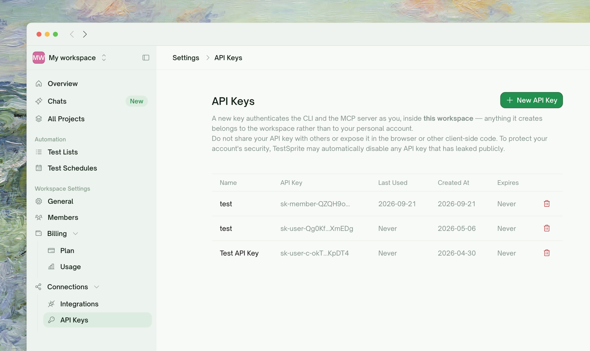
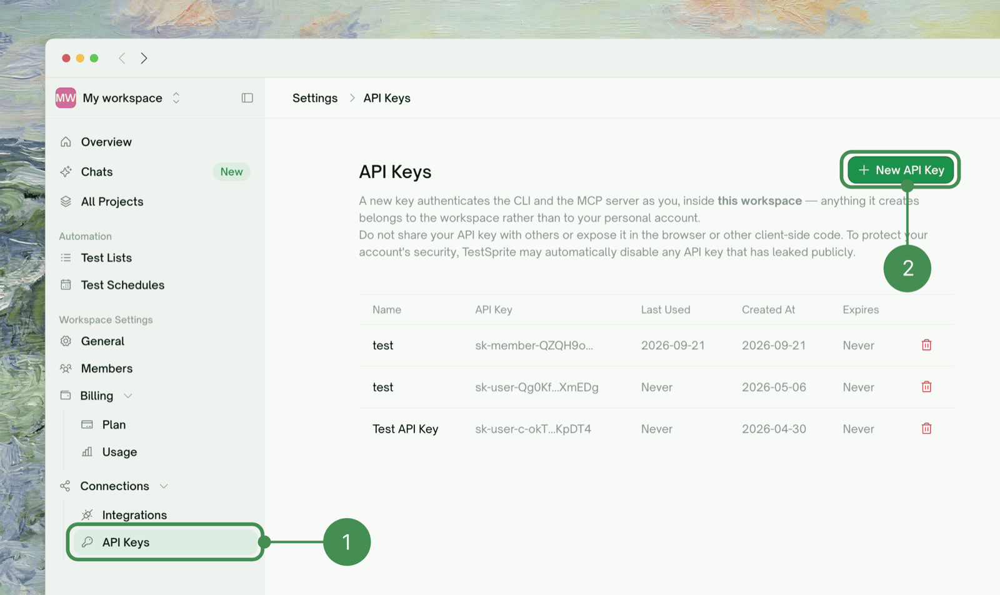
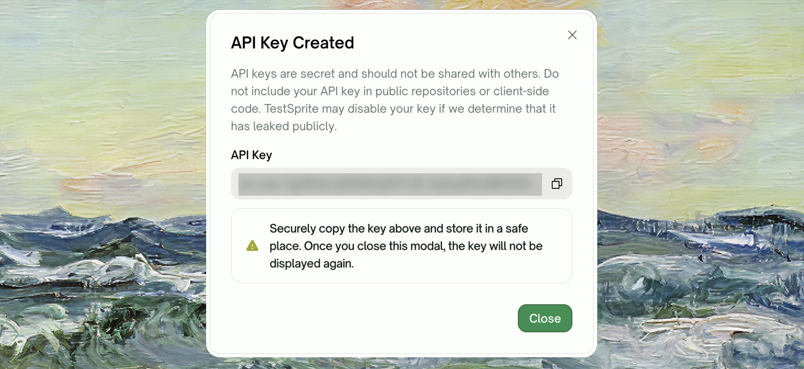
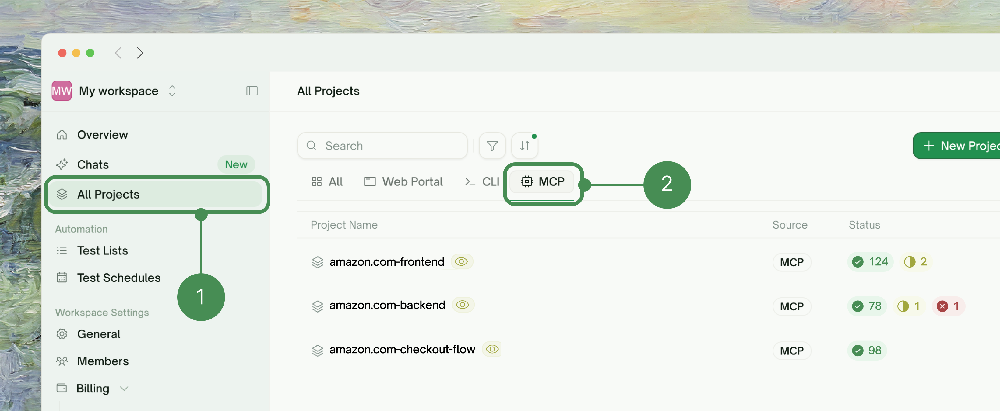
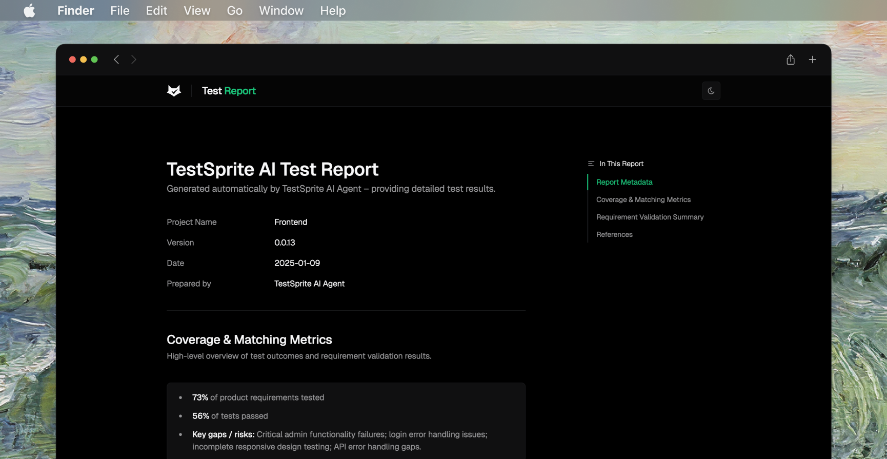

<Frame>
  
</Frame>

## Two Kinds of API Keys

An API key authenticates the CLI and the MCP Server as you. Two kinds exist:

| | Personal key | Workspace key |
| :--- | :--- | :--- |
| **Prefix** | `sk-user-` | `sk-member-` |
| **How you get one** | Not mintable today — this is the original key kind, from before workspace keys existed | Click **New API Key** on any workspace's API Keys page, including your personal workspace's |
| **Bound to** | You — not to any workspace, so it behaves the same wherever it was created | The workspace whose page minted it |
| **Where it's listed** | Your personal workspace's API Keys page | That workspace's API Keys page |
| **Draws on** | Your personal balance | That workspace's balance |
| **What it creates** | Lands in your personal workspace | Belongs to that workspace |
| **Active-key cap** | 3 active | 2 active per member, per workspace |
| **Revoking** | Revokes it everywhere — it was never workspace-scoped | Revokes that key only; you can mint another for the same workspace |

If you already have a personal key, it keeps working as before. The two active workspace keys let you rotate one while the other stays in use; going over a cap fails until you revoke a key, and revoking is immediate.

API keys are available to Members and above. A [Viewer](/web-portal/admin/members-and-roles) is read-only and can't mint or hold keys in that workspace.

## Creating a Key

Go to <kbd>Workspace Settings > Connections > API Keys</kbd> in the workspace that should own the key and click <kbd>New API Key</kbd>. The key is bound to that workspace, including your personal workspace if that's the page you were on.

<Frame>
  
</Frame>

Give it a **descriptive name** (e.g., "MCP Integration") and optionally an expiration. Without one the key doesn't expire, unless the workspace enforces a maximum lifetime: then a longer expiry is rejected, and a key created without one gets that maximum. Click <kbd>Create</kbd>, then copy the key right away.

<Warning>
  Store it securely. The full key is shown only once, at creation.
</Warning>

<Frame>

</Frame>

## Managing API Keys

| Field | Description |
| :--- | :--- |
| <kbd>Name</kbd> | Descriptive identifier |
| <kbd>API Key</kbd> | Partially hidden. A personal key shows its first and last few characters (`sk-user-abcde...vwxyz`); a workspace key shows only its leading characters (`sk-member-ab...`), because the rest is never stored in a readable form |
| <kbd>Created At</kbd> | When generated |
| <kbd>Expires</kbd> | The expiration set at creation, if any |

<kbd>Revoke</kbd> disables a key immediately; requests using it are rejected.

## Viewing MCP Test Results

Projects created through the MCP Server in your IDE show up under <kbd>All Projects > MCP</kbd>.
      <Frame>
    
    </Frame>

| Field | Description |
| :--- | :--- |
| <kbd>Project Name</kbd> | The project the MCP Server created |
| <kbd>Source</kbd> | Where the project was created (**MCP** here) |
| <kbd>Status</kbd> | Pass/fail/blocked counts from its latest results |
| <kbd>Type</kbd> | Frontend or Backend |
| <kbd>Creator</kbd> / <kbd>Created At</kbd> | Who created it, and when |

### Test Reports

Click a project to see its execution logs, per-test results, errors, and performance metrics.
<Frame>
  
</Frame>
 
<Card title="View Example Test Report" icon="file" href="../../learn/mcp-demo#test-report-example">
  A full example report, with execution logs and performance metrics
</Card>

## Next Steps

<CardGroup cols={2}>
  <Card title="Workspaces" icon="users" href="/web-portal/admin/workspaces">
    What a workspace is and how personal vs. shared workspaces differ
  </Card>
  <Card title="CLI Quickstart" icon="terminal" href="/cli/getting-started/quickstart">
    Use your key with the TestSprite CLI
  </Card>
  <Card title="MCP Server Installation" icon="download" href="/mcp/getting-started/installation">
    Use your key with the MCP Server
  </Card>
  <Card title="MCP Server Overview" icon="square-terminal" href="/mcp/getting-started/overview">
    The complete MCP Server guide
  </Card>
</CardGroup>