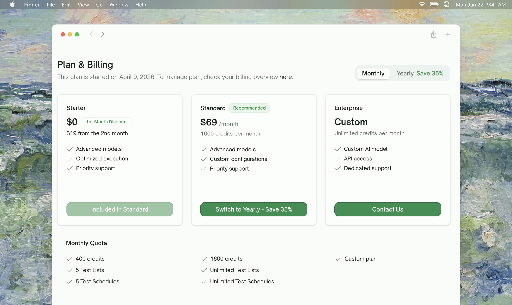

## Overview

Billing for TestSprite is managed at <kbd>Settings → Plan & Billing</kbd>. From this page you can compare plans and switch between monthly and yearly billing. Credits and quotas are tracked automatically and visible from the wizard whenever you're about to consume them.
<Frame>
  
</Frame>

## Plan Tiers

Four tiers are available. Standard is the recommended option for most teams.

<Tabs>
  <Tab title="Free">
    **For first-time users and small experiments.**

    - Foundational AI models
    - Basic testing features
    - Automatic frontend & backend workflows
    - 1 Test List
    - **10-feature lifetime quota for Feature Exploration (Beta)** — see below
    - Community support

    No scheduling, no advanced testing features, no priority support.
  </Tab>
  <Tab title="Starter">
    **For individual developers and small teams.**

    - Advanced AI models
    - Basic + advanced testing features
    - Faster, more efficient test execution
    - 5 Test Lists
    - 5 Test Schedules
    - Priority support

    Includes everything in Free plus the schedule slots needed for continuous monitoring.
  </Tab>
  <Tab title="Standard (Recommended)">
    **For teams running TestSprite in production.**

    - Advanced AI models
    - Proprietary TestSprite model
    - Full testing feature set
    - Scalable execution for large projects
    - **Unlimited** Test Lists
    - **Unlimited** Test Schedules
    - Priority support

    Most teams settle here once they're past evaluation.
  </Tab>
  <Tab title="Enterprise">
    **For large organizations with custom needs.**

    - Custom AI model training
    - Custom configurations
    - Exclusive dedicated support

    Contact sales for pricing and feature scoping.
  </Tab>
</Tabs>

<Note>
For exact monthly/yearly pricing, credit-per-month allocations, and the latest feature matrix, see the live pricing on the [Plan & Billing settings page](https://www.testsprite.com/dashboard/settings/billing) or the [pricing site](https://www.testsprite.com/pricing). Pricing on the settings page is always authoritative.
</Note>

## Paid Features at a Glance

These features unlock at the **Starter** tier and above. Free-plan users see them in-app — locked, with a Pro badge — so the upgrade pathway is always visible.

| Feature | Where it shows up | Detail page |
| :--- | :--- | :--- |
| **Auto-Auth** — auto-refresh login tokens before every backend test run, no manual rotation | Authentication tab on a backend project | [Auto-Auth (Pro)](/web-portal/core/api/auto-auth) |
| **Auto-Heal** — recover UI tests when the page changed but the flow is fine, instead of marking them Failed | Rerun dialog (per test, batch); Schedule creation page | [Auto-Heal (Pro)](/web-portal/core/ui/auto-heal) |
| **Feature Exploration Quota** — explore unlimited features (Free: 10-feature lifetime cap across all UI projects) | UI wizard's exploration step | [Feature Exploration](/web-portal/core/ui/feature-exploration) |
| **Schedule Slots** — schedule Test Lists to run on a cadence (Free: 0; Starter: 5; Standard: unlimited) | Monitoring → New Schedule | [Schedules (Pro)](/web-portal/maintenance/monitoring) |
| **Comparing Runs** — diff scheduled runs to spot what changed (depends on Schedule Slots above) | Schedule run-history table | [Comparing Runs](/web-portal/maintenance/comparing-runs) |
| **Test List Slots** — group tests across projects (Free: 1; Starter: 5; Standard: unlimited) | Test Lists page | [Test Lists](/web-portal/maintenance/test-lists) |
| **Advanced AI Models** — higher-fidelity exploration and code generation | Wizard, in the background | — |
| **Priority Support** — faster response and direct support channels | Email + Discord | — |

<Tip>
**Auto-Auth and Auto-Heal are sibling features for the two test types.** Auto-Auth is backend-only (token refresh on API tests); Auto-Heal is frontend-only (UI drift recovery on UI tests). Both are gated behind the same Starter / Standard threshold.
</Tip>

## Monthly Credits

Each plan grants a monthly credit allowance that funds test runs and other paid actions. The exact credit count per plan is shown on the Plan & Billing page and on the wizard's bottom bar (where it's most relevant — when you're about to spend them).

When credits run out, runs are paused until next month's allowance lands or you upgrade.

<Tip>
The wizard shows a **Credits Remaining** counter at the bottom of the configuration step. If credits are at zero you'll be prompted to upgrade before you can submit.
</Tip>

## Free-Plan Feature Exploration Quota

The Free plan includes a **lifetime cap of 10 features** that TestSprite can explore via the Beta Feature Exploration phase — across all UI projects you create.

<AccordionGroup>
  <Accordion title="Why a lifetime cap rather than monthly">
    Exploration runs at higher cost than a regular test run because it walks your live app interactively. The lifetime cap lets us offer Free-tier exploration without subsidizing unlimited use; teams that need to explore continuously upgrade to Starter (unlimited).
  </Accordion>
  <Accordion title="What counts against the cap">
    Each feature TestSprite explores counts as 1, including features you retry. A feature that fails and is retried twice has consumed 3 of your 10. Reconfiguring credentials on its own does **not** consume quota — only re-exploring does.
  </Accordion>
  <Accordion title="What happens when you hit the cap">
    The wizard surfaces an upgrade prompt and exploration pauses. You can still review what was explored before the cap, generate a plan from those observations, and run tests against fully-explored features — the cap only blocks future exploration.
  </Accordion>
  <Accordion title="How to see remaining quota">
    A banner at the top of the exploration step shows your remaining count.
  </Accordion>
</AccordionGroup>

<Card title="Feature Exploration" href="/web-portal/core/ui/feature-exploration" icon="compass">
  How to use the exploration phase efficiently
</Card>

## Where to Go Next

<Columns cols={2}>
  <Card title="API Keys" href="/web-portal/admin/api-keys" icon="key">
    Generate keys for MCP / external tooling
  </Card>
  <Card title="Feature Exploration" href="/web-portal/core/ui/feature-exploration" icon="compass">
    Where the Free-plan quota matters most
  </Card>
  <Card title="Monitoring & Scheduling" href="/web-portal/maintenance/monitoring" icon="chart-simple">
    Schedule slots vary by plan
  </Card>
  <Card title="Test Lists" href="/web-portal/maintenance/test-lists" icon="list">
    Test List slots vary by plan
  </Card>
</Columns>
