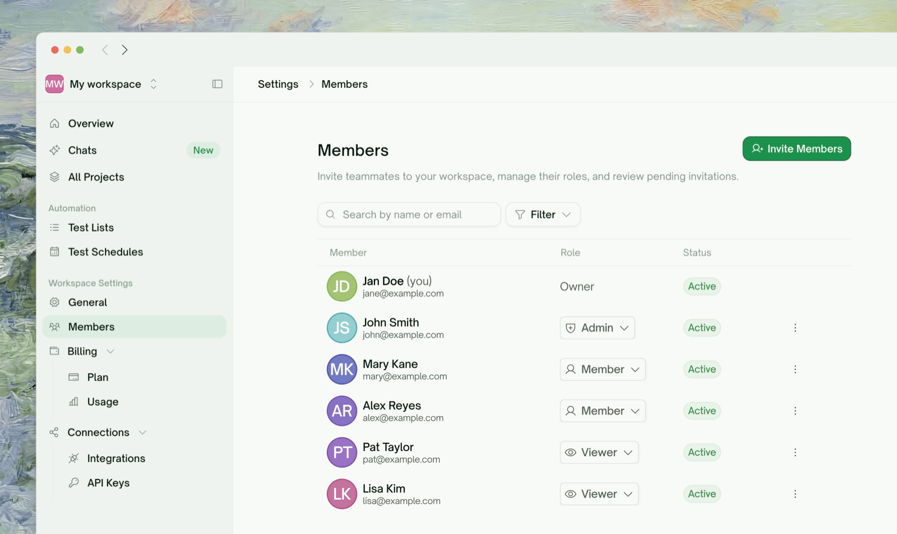
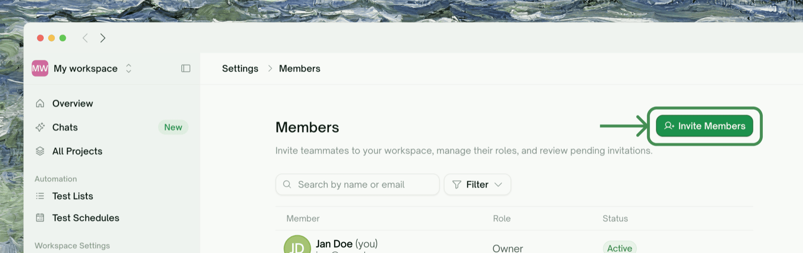
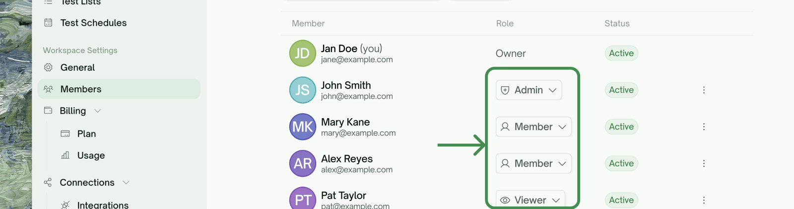
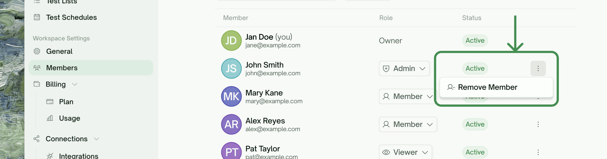

## The Four Roles

<Frame>
  
</Frame>

Every member of a workspace has exactly one role. Roles are per-workspace — the same person can be an Admin in one workspace and a Viewer in another.

| Role | In one line | Takes a paid seat? |
| :--- | :--- | :--- |
| **Owner** | The workspace's creator. Everything Admins can do, plus plan changes and deleting the workspace. One per workspace; the Owner can transfer it to another member. | Yes (covered at creation) |
| **Admin** | Manages the team and the day-to-day: invites and removes members, changes roles, connects integrations, buys credits. | Yes |
| **Member** | Does the testing: creates projects, generates and edits tests, runs them. No people or billing management. | Yes |
| **Viewer** | Read-only. Opens every project, report, and recording — changes nothing. Free on every plan. | No — free |

### Permission matrix

| Can they… | Viewer | Member | Admin | Owner |
| :--- | :-: | :-: | :-: | :-: |
| Open projects, reports, recordings | ✅ | ✅ | ✅ | ✅ |
| Create / edit / run / delete tests and projects | ❌ | ✅ | ✅ | ✅ |
| Mint and manage API keys | ❌ | ✅ | ✅ | ✅ |
| See workspace credit balance and own usage | ✅ (view) | ✅ | ✅ | ✅ |
| Invite members, cancel invitations | ❌ | ❌ | ✅ | ✅ |
| Change a member's role, remove a member | ❌ | ❌ | ✅ | ✅ |
| Rename the workspace | ❌ | ❌ | ✅ | ✅ |
| Connect / disconnect integrations (GitHub, Slack, Jira…) | ❌ | ❌ | ✅ | ✅ |
| Buy credit top-ups, view invoices and usage breakdowns | ❌ | ❌ | ✅ | ✅ |
| Change the plan, open the Stripe billing portal | ❌ | ❌ | ❌ | ✅ |
| Delete the workspace | ❌ | ❌ | ❌ | ✅ |
| Leave the workspace | ✅ | ✅ | ✅ | ❌ (delete instead) |

<Note>
**Viewer is read-only by definition.** A Viewer who tries to change anything gets a clear "Viewer is a read-only role" message — the one exception is leaving the workspace, which anyone can do for themselves. Viewer seats are free on every plan, which makes them the right way to loop in a PM, a manager, or a client who needs to see results but shouldn't touch tests.
</Note>

## Inviting Someone

Invitations live in <kbd>Workspace Settings → Members</kbd>, or use the <kbd>Invite members</kbd> shortcut in the workspace switcher.

<Frame>
  
</Frame>

<Steps>
  <Step title="Enter their email and pick a role">
    Invitations are sent to one email address at a time. Pick the role next to the email field — **Member** is the sensible default for a teammate who'll work on tests; pick **Viewer** for someone who only needs to see results.
    <Frame>
      
    </Frame>
  </Step>
  <Step title="Confirm the seat (paid roles only)">
    Admin and Member invitations add a paid seat, which you confirm before the invitation is sent. **Viewer invitations skip this step entirely: viewer seats are free.**
  </Step>
  <Step title="They accept — by email or link">
    The invitee gets an email with an accept link. You can also copy the same link from the confirmation toast and hand it over directly in Slack or a DM — useful when company email is slow or the message lands in spam.

    Either way, the invitation is **bound to the invited email address**: the recipient must sign in with that exact email to accept. Invitations expire after **7 days**; re-inviting the same address replaces the earlier pending invite.
  </Step>
</Steps>

<AccordionGroup>
  <Accordion title="What if they're already in the workspace?">
    Inviting an existing member at a *higher* role promotes them when they accept. Inviting them at the same or a lower role changes nothing. The dialog warns you before sending if the address already belongs to a member or has a pending invitation.
  </Accordion>
  <Accordion title="Can I invite someone as Owner?">
    No. Ownership can't be assigned by invitation or role change. The current Owner can transfer it instead, from the member's row menu in the roster (<kbd>Transfer ownership</kbd>).
  </Accordion>
  <Accordion title="Why can't I invite anyone in my personal workspace?">
    Personal workspaces support **Viewers only** — read-only guests are free and need no subscription. To collaborate with people who can actually edit and run tests, create a team workspace.
  </Accordion>
</AccordionGroup>

## Changing a Member's Role

Admins and the Owner can change any member's role from the roster in <kbd>Workspace Settings → Members</kbd>, except the Owner's, which is fixed.

<Frame>
  
</Frame>

Switching between Admin and Member is immediate and free. Crossing the Viewer boundary moves a seat too:

- **Member/Admin → Viewer** frees their paid seat.
- **Viewer → Member/Admin** needs a paid seat first. If an empty paid seat exists it's used automatically; otherwise you confirm adding one, and the role changes once that's done.

## Removing a Member — and Leaving

<Frame>
  
</Frame>

- **Admins and the Owner** can remove anyone except the Owner, from the roster's row menu. Removal takes effect immediately: the person loses access, and any API keys they minted in this workspace stop working.
- **Anyone can remove themselves** — leaving a workspace is always allowed, whatever your role. You're switched back to your personal workspace afterward.
- **The Owner can't leave or be removed.** To step away, the Owner transfers ownership first (becoming an Admin), or deletes the workspace.

## Where to Go Next

<Columns cols={2}>
  <Card title="Workspaces" href="/web-portal/admin/workspaces" icon="users">
    Personal vs. team workspaces, switching, and deletion
  </Card>
  <Card title="Sharing a Project" href="/web-portal/admin/sharing" icon="share-nodes">
    The fast path for showing one project to someone new
  </Card>
  <Card title="API Keys" href="/web-portal/admin/api-keys" icon="key">
    Keys are bound to your membership in a workspace
  </Card>
</Columns>
