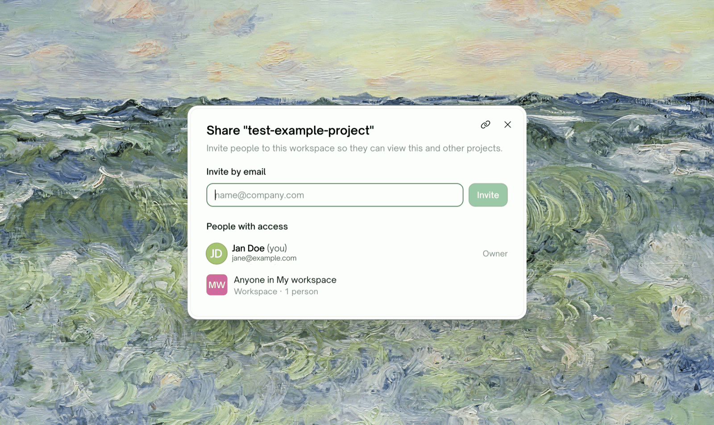
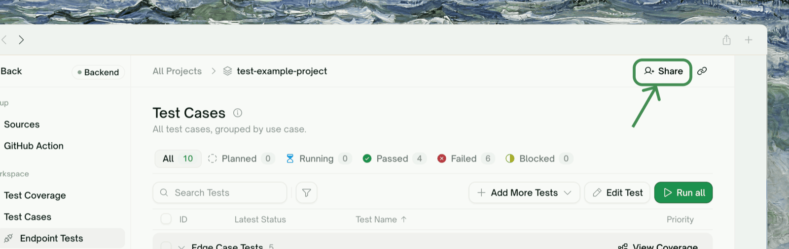
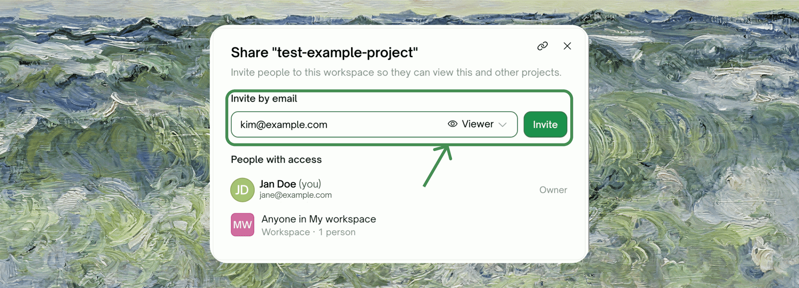
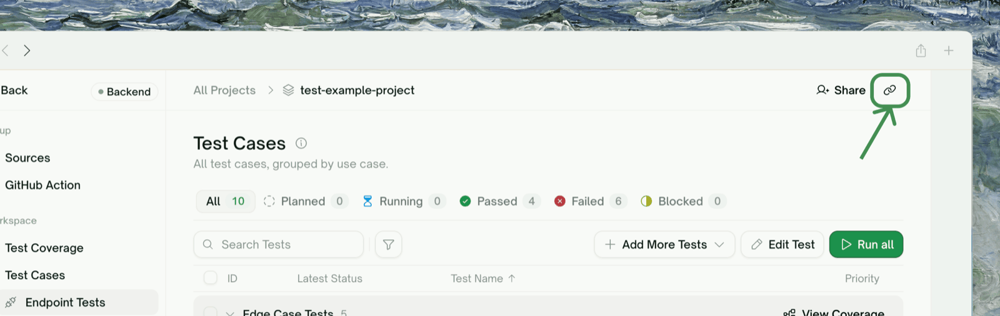

<Frame>
  
</Frame>

## How Sharing Works in TestSprite

TestSprite grants access at the **workspace** level: there are no per-project permissions. "Sharing a project" therefore means **adding someone to the project's workspace** — once they're in, they can open this project (and the workspace's other projects) according to their role.

The <kbd>Share</kbd> button packages that into one step: it invites the person into the workspace and hands you a link to the project so they land in the right place.

<Note>
Because access is workspace-wide, someone you add to see one project can open every project in that workspace. If a project shouldn't be visible to the person you're inviting, keep it in a different workspace.
</Note>

## Sharing from the Portal

The Share action lives in two places:

- On the **project's detail page**, in the header actions.
- On **All Projects**, in each project row's menu.

<Steps>
  <Step title="Open the Share dialog">
    The dialog shows **who can already open this project** — you, and "Anyone in [workspace]" with the member count. Access is granted per workspace, so this list is the whole truth: there's no separate per-project roster.
    <Frame>
      
    </Frame>
  </Step>
  <Step title="Invite by email and pick a role">
    Enter the person's email and choose a role:
    - **Viewer** — read-only, free on every plan. Right for a PM, manager, or client who needs to see plans, reports, and recordings.
    - **Member / Admin**: full working access; adds a paid seat. Only available in team workspaces.

    They get an invitation email; accepting adds them to the workspace. Invitations are bound to the invited email and expire after 7 days.

    <Frame>
      
    </Frame>
  </Step>
  <Step title="Copy the project link">
    Use <kbd>Copy link</kbd> to grab the project's URL and send it alongside — once they've accepted, the link takes them straight to this project.
    <Frame>
      
    </Frame>
  </Step>
</Steps>

### Sharing from a personal workspace

You can share from your personal workspace too — as **Viewer invitations only**, which are free and need no subscription. The first time you do, TestSprite renames your workspace from "My workspace" to your email address so invitees can tell whose workspace they've joined.

If the person needs to *work on* the tests rather than just see them, the dialog points you to creating a team workspace — paid roles don't exist on personal workspaces.

## What the Person Can See and Do

What an invitee can do is exactly their workspace role — see the full matrix in [Members & Roles](/web-portal/admin/members-and-roles). The short version:

| They joined as | They can | They can't |
| :--- | :--- | :--- |
| **Viewer** | Open every project, test, report, run history, and recording in the workspace | Change anything — edits, runs, and deletes are refused with a "read-only role" message |
| **Member** | Everything a Viewer can, plus create, edit, run, and delete tests and projects | Manage people, billing, or integrations |

## Revoking Access

Sharing is revoked the same way it was granted: through workspace membership, in <kbd>Workspace Settings → Members</kbd>:

<Frame>
  
</Frame>

- **Remove the person** from the workspace (Admins and the Owner can). They immediately lose access to every project in it.
- **Cancel a pending invitation** if they haven't accepted yet.
- **Downgrade them to Viewer** if they should keep seeing results but stop changing things — this also frees their paid seat.

## Share vs. Add a Member — Which One?

They're the same mechanism; the difference is intent and starting point:

| Situation | Do this |
| :--- | :--- |
| A stakeholder should *see* results for a project | <kbd>Share</kbd> from the project, invite as **Viewer** (free) |
| A teammate joins the testing effort long-term | <kbd>Workspace Settings → Members</kbd>, invite as **Member** |
| An outsider should see one project but not the rest | Don't share this workspace — the grant is workspace-wide. Create a separate workspace for that project's work |

## Where to Go Next

<Columns cols={2}>
  <Card title="Members & Roles" href="/web-portal/admin/members-and-roles" icon="user-plus">
    The full permission matrix and invitation flow
  </Card>
  <Card title="Workspaces" href="/web-portal/admin/workspaces" icon="users">
    Personal vs. team workspaces and switching
  </Card>
</Columns>
