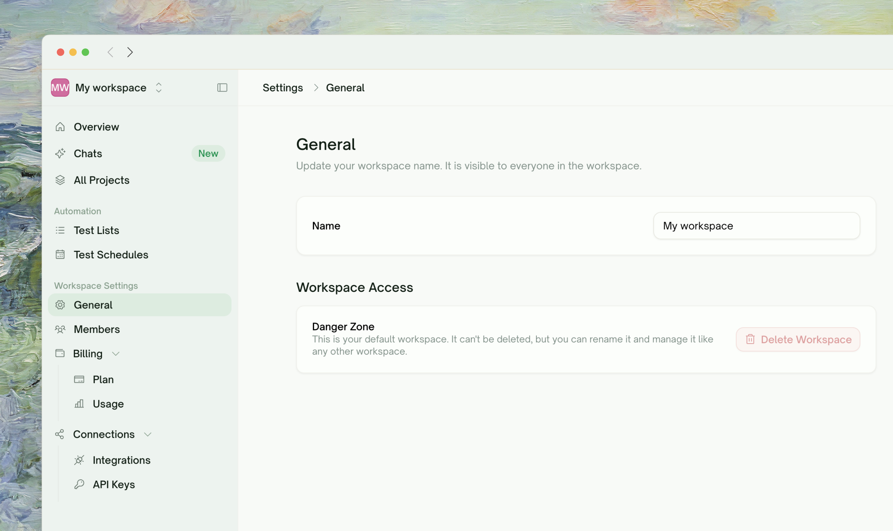
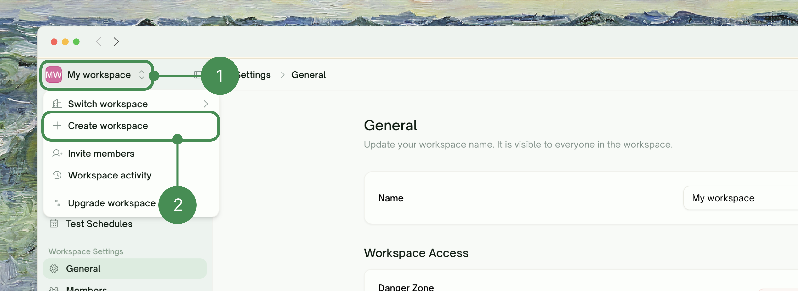
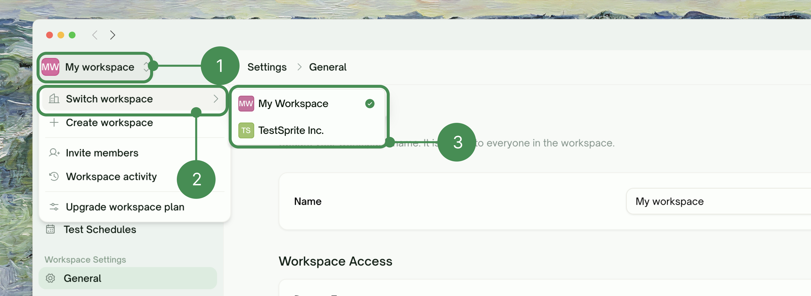
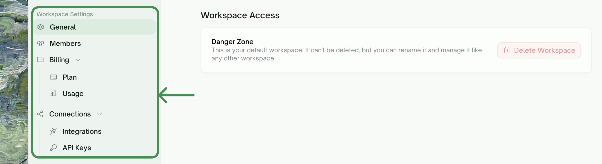
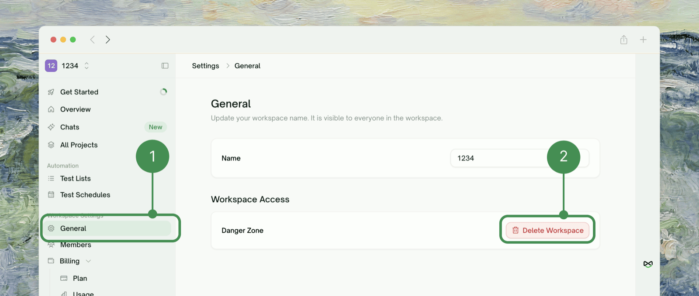

## What a Workspace Is

<Frame>
  
</Frame>

Everything you do in TestSprite (projects, tests, runs, and API keys) belongs to a **workspace**. Every user has a **personal workspace** automatically, and can also belong to one or more **team workspaces**.

The active workspace decides where new work lands: projects you create and keys you mint belong to that workspace, not to you individually. Access is workspace-wide too: everyone in a workspace can open its projects and tests, and what each person can *do* depends on their role (see [Members & Roles](/web-portal/admin/members-and-roles)).

## Personal vs. Team Workspaces

|  | Personal workspace | Team workspace |
| :--- | :--- | :--- |
| **How you get it** | Created automatically at signup | You create it (paid plans only) |
| **Membership** | You, plus optional read-only **Viewers** | Full roster: Owner, Admins, Members, Viewers |
| **Who pays** | Your personal balance | The workspace's own subscription and balance |
| **Collaboration** | Read-only — you can invite Viewers, never paid roles | Full — invite Admins, Members, and Viewers |
| **Can it be deleted?** | No | Yes, by the Owner |

<Info>
When you invite your first Viewer into a personal workspace, TestSprite renames it from "My workspace" to your email address — so invitees can tell whose workspace they're looking at. You can rename a team workspace at any time; personal workspace names are managed for you.
</Info>

## Creating a Team Workspace

<Steps>
  <Step title="Open the workspace switcher">
    Click the workspace name at the top of the left sidebar, then choose <kbd>Create workspace</kbd>.
    <Frame>
      
    </Frame>
  </Step>
  <Step title="Name it">
    Enter a workspace name. The name appears in the switcher and in invitation emails, and you can change it later.
    <Frame>
      
    </Frame>
  </Step>
  <Step title="Pick a plan and confirm payment">
    Choose a plan and billing interval, then complete checkout on the Stripe-hosted page. The workspace is created as soon as the payment goes through, and you land back in the portal inside it.
  </Step>
</Steps>

You are the workspace's **Owner**, the role that can manage its subscription and, if it comes to that, delete it. You can transfer ownership to another member later, from their row menu in <kbd>Workspace Settings → Members</kbd>.

## Switching Workspaces

The workspace switcher lives at the **top of the left sidebar**. Click it and choose <kbd>Switch workspace</kbd> to see every workspace you belong to — your personal workspace first, then team workspaces, with a checkmark on the active one.

<Frame>
  
</Frame>

Switching changes three things at once:

- **Where you are** — you land on the selected workspace's dashboard, and the URL updates to that workspace.
- **What you see** — projects, tests, runs, schedules, and settings all come from the new workspace.
- **What you can do** — your role is per-workspace, so someone who is an Admin in one workspace may be a Viewer in another.

<Tip>
Check the switcher before starting new work. A project created in the wrong workspace can't be moved — and its runs draw on that workspace's balance.
</Tip>

## Workspace Settings

<kbd>Workspace Settings</kbd> inside a workspace collects everything that is workspace-scoped:

<Frame>
  
</Frame>

| Section | What's there | Who sees it |
| :--- | :--- | :--- |
| <kbd>General</kbd> | Workspace name (rename is autosaved) | Rename: Owner and Admins |
| <kbd>Members</kbd> | Roster, invitations, role changes | Everyone; management actions are role-gated |
| <kbd>Billing</kbd> / <kbd>Usage</kbd> | Plan, invoices, credit top-ups, usage breakdowns | Admins and the Owner; plan changes are Owner-only |
| <kbd>Integrations</kbd> | GitHub, Slack, Jira, Linear, Figma connections | Connect/disconnect: Owner and Admins |
| <kbd>API Keys</kbd> | Keys minted in this workspace | Your own keys; Admins and the Owner see all |

## Deleting a Workspace

Only the **Owner** can delete a team workspace, and only from <kbd>Workspace Settings → General</kbd>. Personal workspaces can't be deleted.

<Frame>
  
</Frame>

<Warning>
Deletion is permanent and cascades: **all projects, tests, results, schedules, members, and API keys in the workspace are removed and cannot be recovered.** The subscription is canceled as part of the deletion, so nothing keeps billing afterward — past invoices remain available in your billing history.
</Warning>

The portal asks you to type the workspace name to confirm before anything is deleted.

## Where to Go Next

<Columns cols={2}>
  <Card title="Members & Roles" href="/web-portal/admin/members-and-roles" icon="user-plus">
    Invite teammates and understand the four roles
  </Card>
  <Card title="Sharing a Project" href="/web-portal/admin/sharing" icon="share-nodes">
    Show a project to someone outside the roster
  </Card>
  <Card title="API Keys" href="/web-portal/admin/api-keys" icon="key">
    Personal vs. workspace keys, creation, expiry, and revocation
  </Card>
</Columns>
