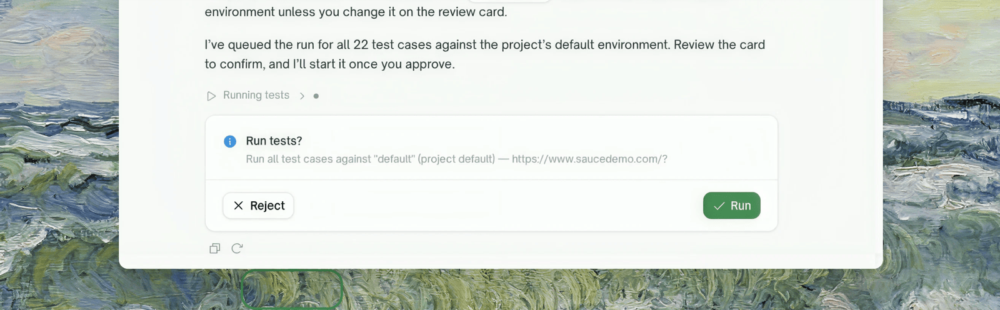

The chat splits everything it can do into two kinds. **Reading** — listing tests, checking a run, searching sources — happens immediately, no permission needed. **Changing state** — creating, editing, deleting, running — is proposed first: the chat posts a card describing exactly what it wants to do, and nothing happens until you resolve it.

<Frame>
  
</Frame>

## What a card shows

- **The action** and its full payload — the exact values that will be used, not a summary. A run card names the environment it will hit; a delete card spells out what is destroyed ("project X, its 43 test cases, and their run history").
- **Pre-filled fields you can correct** before approving, where the action supports it.

## Three ways to resolve a card

| You do | What happens |
| :--- | :--- |
| <kbd>Approve</kbd> | The action executes with the shown payload. If it fails, the failure is reported in the conversation — approving is safe to click once and only runs once. |
| <kbd>Reject</kbd> | Nothing executes. The chat moves on. |
| **Just type** | Typing is a first-class answer. State a correction ("use staging instead") and the chat re-proposes with the new values — a correction is *not* a rejection. Answer a question in plain text and the card is settled without clicking it. |

One typed sentence can settle several open things at once — you're never forced through cards one field at a time.

## Question cards

When the chat needs information it can't infer — a URL, a choice between options, a credential — it asks with a **question card**: single/multi select, free text, or password. Multiple questions render as a stepper ("1 of 3"), and selects include an "Other" option where a custom answer makes sense.

<Note>
**Secrets are always collected through password fields** — masked, never echoed back into the conversation, and never readable back out of a saved configuration (you'll see `password set` instead of the value). Leading/trailing spaces are kept, since they can be part of a secret.
</Note>

## Where to Go Next

<Columns cols={2}>
  <Card title="AI Chat Overview" href="/web-portal/ai-chat/overview" icon="comments">
    What the chat can do and how project focus works
  </Card>
</Columns>
