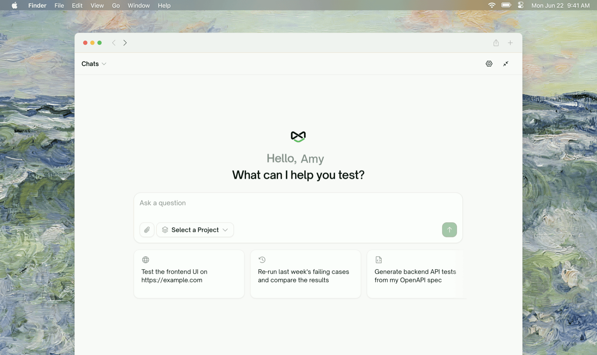
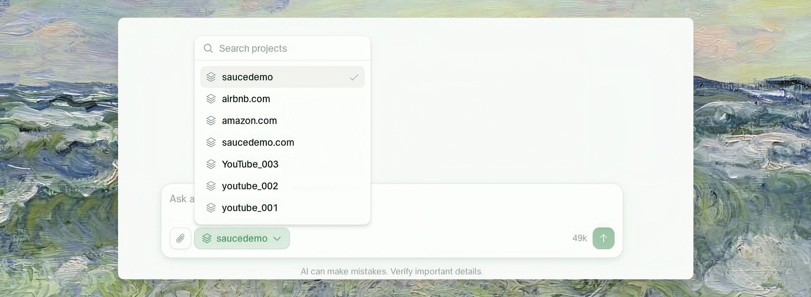

<Frame>
  
</Frame>

AI Chat is a full copilot for the Web Portal: anything you can do by clicking through the dashboard, you can also ask for in a sentence. It answers questions from your project's live data, and for anything that changes state it proposes the action first and waits for your approval (see [Approving Actions](/web-portal/ai-chat/approving-actions)).

## What it can do

| Area | Examples |
| :--- | :--- |
| <kbd>Projects</kbd> | Create a project from a URL + PRD, switch which project the chat is focused on, delete projects |
| <kbd>Sources</kbd> | Upload documents and test files, connect a GitHub repo, add Figma designs or Linear/Jira tickets, re-run app exploration, crawl pages |
| <kbd>Test cases</kbd> | Generate use cases, add a batch of test cases for a feature, author specific cases by hand, edit or delete cases, check plan quality |
| <kbd>Runs</kbd> | Run a project or test list, revise a test's steps and re-run it |
| <kbd>Results</kbd> | "Why did this fail?" — it reads the run, the per-test result, and the actual executed steps before answering |
| <kbd>Setup</kbd> | Environments (URLs, variables, sign-in configuration), test lists, monitoring schedules |

Three prompts you can paste right now:

```text
Create a frontend project for https://app.example.com — I'll upload the PRD next.
```

```text
Add test cases covering checkout and payments.
```

```text
Why did TC-012 fail in the last run?
```

## The vocabulary

The chat uses the same terms as the rest of the portal:

- **Sources** — everything you feed a project: documents, code, designs, tickets, crawled pages.
- **Use cases** — the feature map ("Features" and the "Use cases" under each) that coverage is organized around.
- **Test coverage** — the live set of test cases and their current status.
- **Test run** — one execution. A run is frozen history; a test case's status reflects its *latest* run.

## Project focus

A conversation is focused on **one project at a time**. Open the chat from a project page and that project is the focus; ask it to switch ("let's work on the Amazon project") and a divider row like *"Switched focus to Amazon."* marks the change.

The chat re-reads the focused project every turn, so changes you make outside the conversation show up in its next answer. The project selector in the composer always shows the current focus; click it to search and switch:

<Frame>
  
</Frame>

## Conversations

- Every conversation belongs to the workspace it was started in.
- Titles are generated from your first message; rename or delete a conversation from the conversation list.
- You can attach images and files to a message. An attachment is read on the turn you send it — quote the relevant part in a later message if you need to come back to it.

## Where to Go Next

<Columns cols={2}>
  <Card title="Approving Actions" href="/web-portal/ai-chat/approving-actions" icon="clipboard-check">
    How proposal cards work — approve, reject, or just answer by typing
  </Card>
  <Card title="Testing Lifecycle" href="/web-portal/concepts/testing-lifecycle" icon="map">
    The concept map the chat's workflow follows
  </Card>
  <Card title="Key Terms" href="/web-portal/concepts/key-terms" icon="book">
    The core vocabulary
  </Card>
</Columns>
