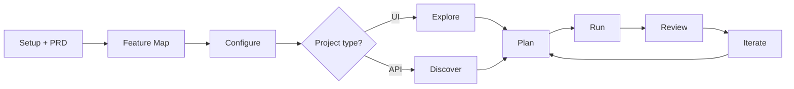

## Overview

Every test in the Web Portal moves through a predictable lifecycle. The shape is similar for UI and API projects, but UI projects include an extra **Exploration** phase up front that grounds the rest of the run in real product behavior.

This page walks both flows side by side so you know what's happening at every step and where to intervene if you want to refine, retry, or stop.

<Card>

</Card>

<Note>
**TestSprite is spec-driven.** Uploading a PRD (or any spec-shaped document) is **strongly recommended** — it's how TestSprite builds a feature map of what your product is supposed to do, which materially improves plan quality. The PRD step happens at project creation, before configuration. If you skip it, the lifecycle still runs end-to-end but planning falls back to your URL inputs and (for UI) live exploration alone.
</Note>

## UI Testing Lifecycle

<Steps>
  <Step title="Project Setup + PRD">
    Click <kbd>Create Tests</kbd> from the dashboard sidebar. Name the project and **upload a PRD** (strongly recommended) — that's all this step asks for.
  </Step>

  <Step title="Feature Map">
    If a PRD was uploaded, TestSprite produces a structured **feature map** — features and the use cases under each — rendered as a flow graph. This is what grounds the rest of the lifecycle. Re-extract if something is missing. Skip-eligible: if no PRD was uploaded, the wizard jumps straight to the next step.
  </Step>

  <Step title="Configure">
    Provide a starting URL, optionally a test account (username + password), and any extra context that helps TestSprite focus on the right parts of your app.

    <Tip>Test accounts are optional but **strongly recommended** — without them, TestSprite can only explore what's visible without sign-in.</Tip>
  </Step>

  <Step title="Explore (Beta)">
    TestSprite breaks your product into a list of features and visits each one in your live app — clicking, navigating, signing in — while you watch a live preview. Each feature shows <kbd>Exploring</kbd> while running, then ends in <kbd>Done</kbd>, <kbd>Failed</kbd>, or <kbd>Blocked</kbd>.

    You can retry individual features, reconfigure credentials, or continue with whatever was captured.

    <Card title="Feature Exploration" href="/web-portal/core/ui/feature-exploration" icon="compass">
      Deep dive on the exploration phase
    </Card>
  </Step>

  <Step title="Plan">
    TestSprite drafts a test plan from what was explored. Plans for fully-explored features reference real flows observed during exploration; plans for couldn't-be-explored features fall back to your PRD or description.

    Review the draft, rewrite descriptions in natural language to refine focus, deselect any cases you don't want, and continue.
  </Step>

  <Step title="Run">
    TestSprite generates the tests, executes each one against your live app, and records video plus step-by-step screenshots. The Web Preview panel streams what's happening in real time.

    Pass / fail is determined automatically based on the assertions in each test.
  </Step>

  <Step title="Review">
    Each test gets its own report page with the recorded video, step-by-step screenshots, a verdict, and (for failures) an AI-authored explanation of the suspected cause and a suggested fix.

    On the project detail page, the **Use Case Flow** view shows how features connect with status icons on each step, and the **Site Exploration** tab archives every feature recording for later browsing.
  </Step>

  <Step title="Iterate">
    Refine the plan and re-run. Three ways to do that:
    - **Edit a test description** in natural language — TestSprite regenerates the steps to match
    - **Chat with the test report** in natural language to ask why a test failed or how to fix it
    - **Re-run a single failing test** to confirm a fix without re-executing the whole suite

    <Card title="Refining Tests" href="/web-portal/core/working-with-test/refining-tests" icon="pen-to-square">
      Walkthrough of every refinement path
    </Card>
  </Step>
</Steps>

## API Testing Lifecycle

<Steps>
  <Step title="Project Setup + PRD">
    Click <kbd>Create Tests</kbd>, name your project, and **upload a PRD** (strongly recommended). PRDs aren't only for UI — they let TestSprite plan to the *intent* of each endpoint, not just its shape.
  </Step>

  <Step title="Feature Map">
    If a PRD was uploaded, TestSprite produces a feature map of features + use cases. The plan step uses this to scope tests by intent. Skip-eligible if no PRD was uploaded.
  </Step>

  <Step title="Configure">
    Provide the base URL and your API documentation (OpenAPI / Swagger / Postman or any free-form reference). Add auth credentials per API (Bearer Token, API Key, Basic Token, or None) and any natural-language instructions about what to focus on.
  </Step>

  <Step title="Discover">
    TestSprite reads your endpoint list from the uploaded docs and probes the base URL to confirm shapes. You can review the discovered list, edit method/path/auth-type per family, and add endpoints manually before continuing.
  </Step>

  <Step title="Plan">
    API projects skip exploration and go straight to plan generation. TestSprite drafts comprehensive test cases organized by category — typically functional / happy path, authorization & auth, error handling & edge cases, and (where relevant) boundary / load and security probes.

    Review, deselect, edit, or add cases via natural language before running.
  </Step>

  <Step title="Run">
    TestSprite generates the tests, executes each one against your APIs, captures every HTTP request and response, and shows live progress as endpoints are hit.

    Tests that need values from upstream tests (e.g. an `orderId` from a prior `POST /orders`) automatically capture and pass those **dynamic variables** through.
  </Step>

  <Step title="Review">
    On the **Test Report** tab, each API test shows pass/fail status, the request and response bodies, and assertion details. Failed tests carry an AI-authored cause-and-fix analysis.

    The **Data Flow** tab visualizes every call TestSprite made by endpoint, the **Dynamic Variables** tab shows what got captured and reused, and the **Integration Tests** tab shows multi-step chains assembled from related endpoints.
  </Step>

  <Step title="Cleanup">
    After tests finish, TestSprite reviews any resources the suite created (records, files, sessions) and tries to clean them up. The **Cleanup** tab shows which resources were captured and the status of each teardown.

    <Info>Cleanup runs automatically — you'll see a brief "Running cleanup sweep" indicator before the run is marked complete.</Info>
  </Step>

  <Step title="Iterate">
    Refine and re-run the same way as UI tests: edit descriptions, chat with the AI about a failure, or use natural-language requests like *"Test POST /orders with invalid parameters and expect 400."* TestSprite interprets and updates the relevant test case.
  </Step>
</Steps>

## UI vs API: What's Different

| Phase | UI Testing | API Testing |
| :--- | :--- | :--- |
| **Exploration** | Yes — live walk through your app, three outcome statuses per feature | None — planning is from documentation/instructions directly |
| **Plan grounding** | Real screens and copy observed during exploration | Your API docs, instructions, and any uploaded specifications |
| **Execution artifacts** | Video recordings, step-by-step screenshots, console output | HTTP requests/responses, status codes, response bodies |
| **Failure analysis** | AI cause-and-fix with screenshot of the failing step | AI cause-and-fix with the offending request/response diff |
| **Cleanup** | Not applicable — no persistent resources created | Automatic post-run sweep of created records / files / sessions |
| **Run-over-run diffs** | Compare via the schedule run history's Changes column | Same — Changes column on schedule run history |

## Where to Go Next

<Columns cols={2}>
  <Card title="UI Testing" href="/web-portal/core/ui/ui-testing" icon="window-maximize">
    Walkthrough of the UI flow
  </Card>
  <Card title="API Testing" href="/web-portal/core/api/api-testing" icon="terminal">
    Walkthrough of the API flow
  </Card>
  <Card title="Test Detail" href="/web-portal/core/working-with-test/test-detail" icon="layout">
    Every tab after the run finishes
  </Card>
  <Card title="Comparing Runs" href="/web-portal/maintenance/comparing-runs" icon="git-compare">
    Run-over-run change tracking
  </Card>
</Columns>
