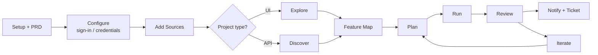

Every project moves through the same phases, and either way the plan is grounded in how your product actually behaves: UI projects **explore** your live app, and API projects **discover** endpoints from your docs and probe them against your live API.

<Card>

```mermaid
flowchart LR
    A[Setup + PRD] --> N[Configure<br/>sign-in / credentials]
    N --> S[Add Sources]
    S --> B{Project type?}
    B -->|UI| C[Explore]
    B -->|API| H[Discover]
    C --> M[Feature Map]
    H --> M
    M --> D[Plan]
    D --> E[Run]
    E --> F[Review]
    F --> T[Notify + Ticket]
    F --> G[Iterate]
    G --> D
```
</Card>

## The Phases

| Phase | What happens | Learn more |
| :--- | :--- | :--- |
| **Setup** | Create the project with <kbd>New Project</kbd>, set how TestSprite signs in, and add sources: your PRD (**strongly recommended**), and for API projects your API docs | [Project Sources](/web-portal/setup/project-sources) |
| **Explore / Discover** | UI: agents walk your live app. API: TestSprite reads your endpoints from the docs and probes them against your live API | [Feature Exploration](/web-portal/core/ui/feature-exploration), [API Discovery](/web-portal/core/api/api-discovery) |
| **Feature map** | Features and use cases, shown on <kbd>Test Coverage</kbd>, where you can edit them | [Coverage Map](/web-portal/core/working-with-test/coverage-map) |
| **Plan** | After you click <kbd>Plan Tests</kbd>, the testing agent plans test cases scoped to the feature map. You keep, edit, or remove them | [UI](/web-portal/core/ui/ui-plan-gen), [API](/web-portal/core/api/api-plan-gen) |
| **Run** | Tests are generated and run in the cloud. API tests pass captured values to the tests that depend on them | [Dependency Chains](/web-portal/core/api/dependency-chains) |
| **Review** | A verdict per test, with recordings (UI) or requests and responses (API), and a suggested cause and fix for failures | [Test Detail Page](/web-portal/core/working-with-test/test-detail) |
| **Notify** | Post run summaries to Slack and turn failures into tickets | [Slack](/web-portal/integrations/slack-notifications), [Ticketing](/web-portal/integrations/ticketing) |
| **Iterate** | Edit a test's description, ask in <kbd>Chats</kbd>, or re-run a single test to confirm a fix | [Managing Test Cases](/web-portal/core/working-with-test/managing-test-cases) |

## UI vs API: What's Different

| Phase | UI Testing | API Testing |
| :--- | :--- | :--- |
| **Exploration** | Agents walk your live app, page by page | TestSprite calls your endpoints and records the real responses (**Probe response** and **Raw call records** on <kbd>Test Coverage</kbd>) |
| **Plan grounding** | Real screens and copy observed during exploration | Your API docs and instructions, plus the responses observed from your live API |
| **Execution artifacts** | Video recordings, step-by-step screenshots, console output | HTTP requests/responses, status codes, response bodies |
| **Authentication** | Sign-in to your app: test account credentials, OTP (one-time password) login, or SSO (single sign-on) such as Google | Credentials on the requests: a token, API key, or a refresh grant TestSprite renews before each run |
| **Failure analysis** | AI cause-and-fix with screenshot of the failing step | AI cause-and-fix with the offending request/response diff |
| **Cleanup** | Not applicable, no persistent resources created | Automatic post-run sweep of created records, files, and sessions |

## Where to Go Next

<Columns cols={2}>
  <Card title="UI Quickstart" href="/web-portal/core/ui/quickstart" icon="window-maximize">
    The UI flow, click by click
  </Card>
  <Card title="API Quickstart" href="/web-portal/core/api/quickstart" icon="terminal">
    The API flow, click by click
  </Card>
</Columns>
