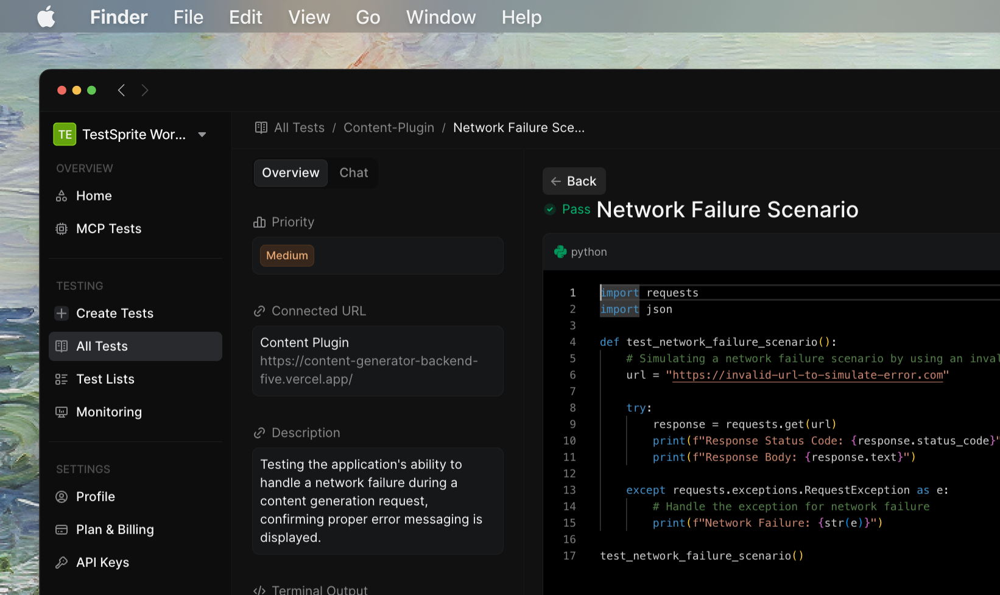
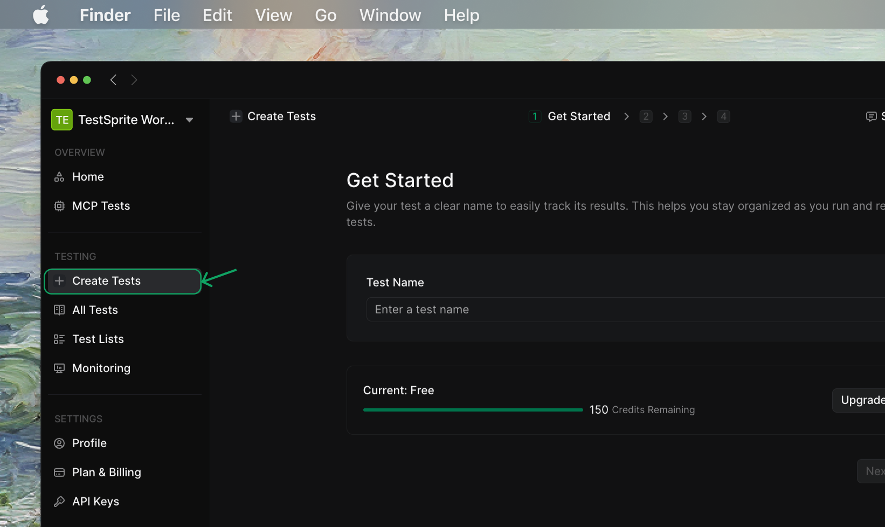
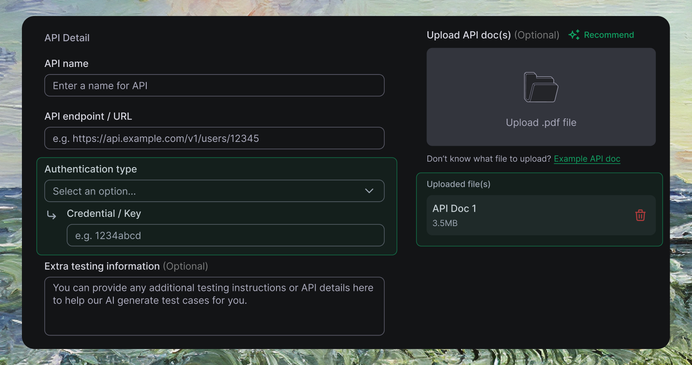
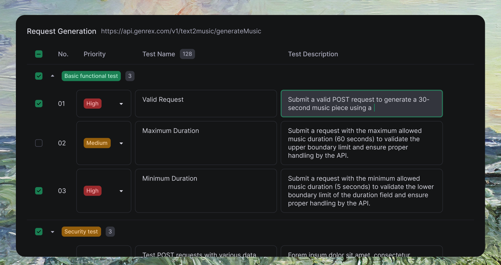
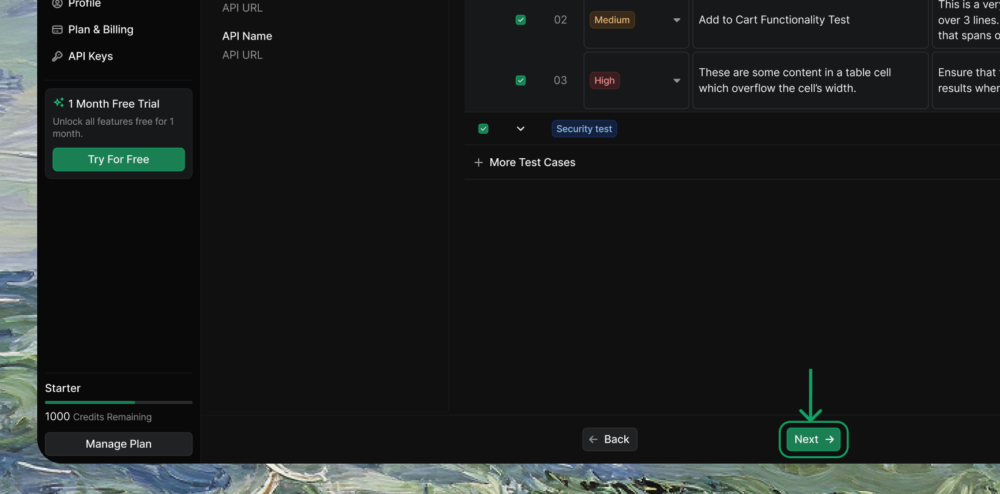
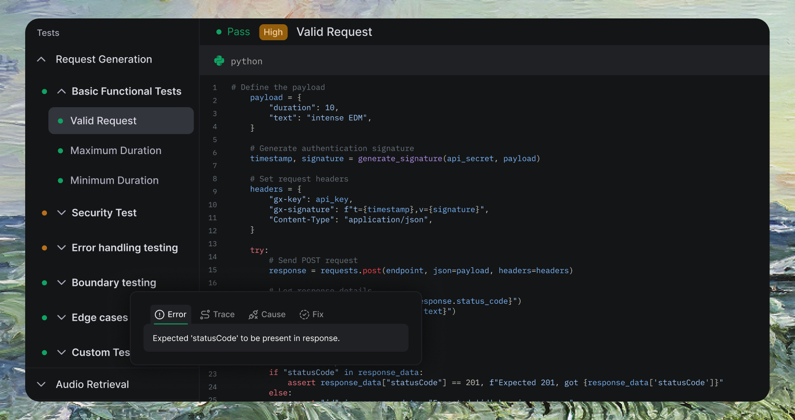
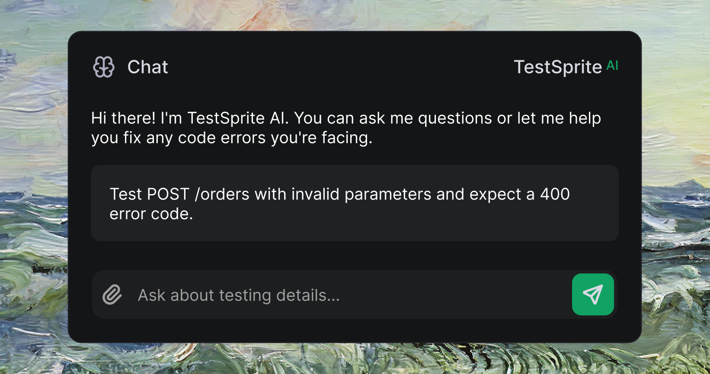

      <Frame>
      
      </Frame>


## Key Features

| Feature | Description |
| :--- | :--- |
| <kbd>Fast Setup</kbd> | Get started quickly with minimal documentation—no extensive prompts or full codebases needed |
| <kbd>Comprehensive Testing</kbd> | Covers functional, security, performance, error handling, and edge case testing automatically |
| <kbd>Smart Reports</kbd> | Detailed outputs with error types, root causes, and recommended fixes |
| <kbd>Natural Language</kbd> | Provide feedback and adjustments using plain English—no technical commands required |

## Getting Started

To begin using TestSprite for back-end testing, follow these steps:


### Step 1: Set Up Your API Testing Environment

      <Frame>
      
      </Frame>

<Steps>
  <Step title="Create New Test">
    Navigate to [TestSprite Dashboard  <Icon icon="arrow-up-right-from-square" size={12} />](https://www.testsprite.com/dashboard/testing) and click <kbd>Create a Test</kbd> from the sidebar
  </Step>
  <Step title="Name Your Project">
    Enter a project name - you'll be automatically directed to Backend Testing
  </Step>
  <Step title="Provide API Details">
    Add your API information and natural language instructions to guide our AI testing
    <Note> We highly recommend **upload API documentation** to help our AI better understand your APIs</Note>
    <Frame>
    
    </Frame>
  </Step>
</Steps>

<Accordion title="Example API Documentation">
[GenRex API Reference  <Icon icon="arrow-up-right-from-square" size={12} />](https://docs.genrex.com/docs/1.0/api-reference/request-generation) - Shows how comprehensive API docs help our AI generate better tests
</Accordion>


### Step 2: Review Generated Test Plans
<Info>
You can expand each test type to view detailed scenarios and modify content directly to suit your specific needs.
</Info>

    <Frame>
    
    </Frame>

<Steps>
  <Step title="Review AI Generated Test Plan">
    Our AI creates a comprehensive test plan covering multiple test types for your APIs
  </Step>
  <Step title="Select Test Categories">
    Choose which test categories and cases to implement, or select all for comprehensive coverage
  </Step>
</Steps>


**AI generates these test types automatically:**

| Test Type | Description |
| :--- | :--- |
| <kbd>Core Testing</kbd> | Functional testing, error handling, and response content validation |
| <kbd>Security & Auth</kbd> | Security testing, authorization, authentication, and boundary testing |
| <kbd>Performance</kbd> | Load testing, performance analysis, edge cases, and concurrency testing |

<Tip>
**Best practice:** Select all available test cases to ensure comprehensive coverage. You can also add custom test cases using natural language.
</Tip>


### Step 3: Run Your Tests

    <Frame>
    
    </Frame>

<Steps>
  <Step title="Initiate Test Execution">
    Click <kbd>Next</kbd> to start running your selected test plan
  </Step>
  <Step title="AI Generates & Executes">
    TestSprite automatically generates test code, executes tests, and analyzes results
  </Step>
</Steps>


### Step 4: Review Test Results

    <Frame>
    
    </Frame>

<Steps>
  <Step title="View Execution Report">
    TestSprite displays detailed insights and actionable recommendations to refine your software
  </Step>
  <Step title="Interact with AI Chatbot">
    Provide feedback, request adjustments, or ask questions about test results
  </Step>
</Steps>


**Detailed Analysis for Failed Tests:**

| Feature | Description |
| :--- | :--- |
| <kbd>Error & Trace</kbd> | Clear issue description and full code stack traceback showing exactly where problems occurred |
| <kbd>Cause & Fix</kbd> | AI-powered root cause analysis with suggested solutions and code snippets for quick resolution |


## Advanced Configuration

### Using Natural Language for Questions and Test Adjustments

<Info>
Ask questions or suggest test adjustments using natural language—no specific format required.
</Info>


    <Frame>
    
    </Frame>
    <br />

<Accordion title="Example Natural Language Request">
```plaintext
"Test POST /orders with invalid parameters and expect a 400 error code."
```

TestSprite automatically interprets and updates the corresponding test case, making testing smoother and more efficient.
</Accordion>


## Examples

See what TestSprite's AI generates for your APIs:

TestSprite automatically generates comprehensive security tests like this one that validates API signature handling:


```python Expandable Sample Security Test
import hashlib
import hmac
import json
import pytest
import requests
import time

# Define the API URL and credentials (use environment variables for added security)
api_url = "https://your-api-url.com/v1/text2music/generateMusic"
api_key = "hide_for_privacy_protection"
api_secret = "hide_for_privacy_protection"

def create_signature(api_secret, data_to_sign):
    return hmac.new(api_secret.encode(), data_to_sign.encode(), hashlib.sha256).hexdigest()

def test_invalid_gx_signature():
    # Construct the payload
    payload = {
        "duration": 10,
        "text": "intense EDM",
    }
    payload_json = json.dumps(payload, separators=(",", ":"))

    # Create correct signature
    timestamp = str(int(time.time() * 1000))
    data_to_sign = f"{timestamp}.{payload_json}"
    correct_signature = create_signature(api_secret, data_to_sign)

    # Tamper the payload
    tampered_payload = payload_json.replace("intense EDM", "soft jazz")

    # Use correct timestamp and an intentionally incorrect signature
    tampered_signature = create_signature(api_secret, f"{timestamp}.{tampered_payload}")

    # Create headers with tampered payload
    headers = {
        "gx-key": api_key,
        "gx-signature": f"t={timestamp},v={tampered_signature}",
        "Content-Type": "application/json",
    }

    # Send POST request with tampered payload
    response = requests.post(api_url, data=tampered_payload, headers=headers)
    
    # Parse the response
    response_data = response.json()

    # Assertions
    assert "statusCode" in response_data, "Expected 'statusCode' in the response"
    assert response_data["statusCode"] == 400, f"Expected statusCode 400, got {response_data['statusCode']}"

test_invalid_gx_signature()
```


This test validates that your API properly rejects requests with invalid signatures, ensuring security integrity.