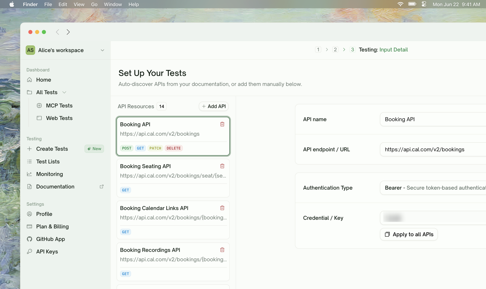
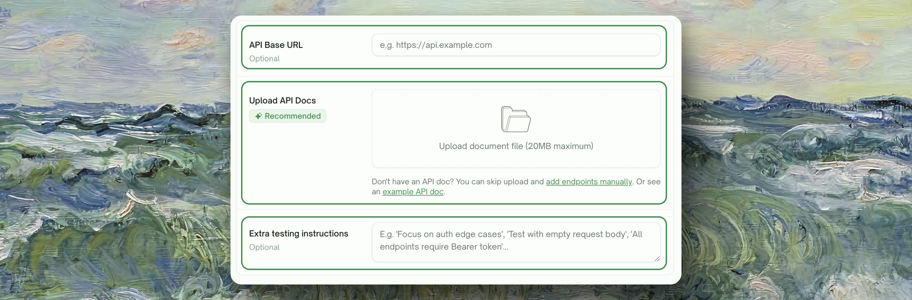
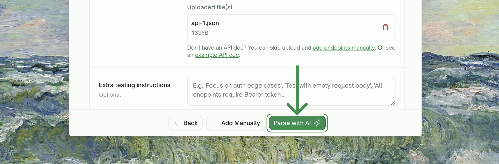
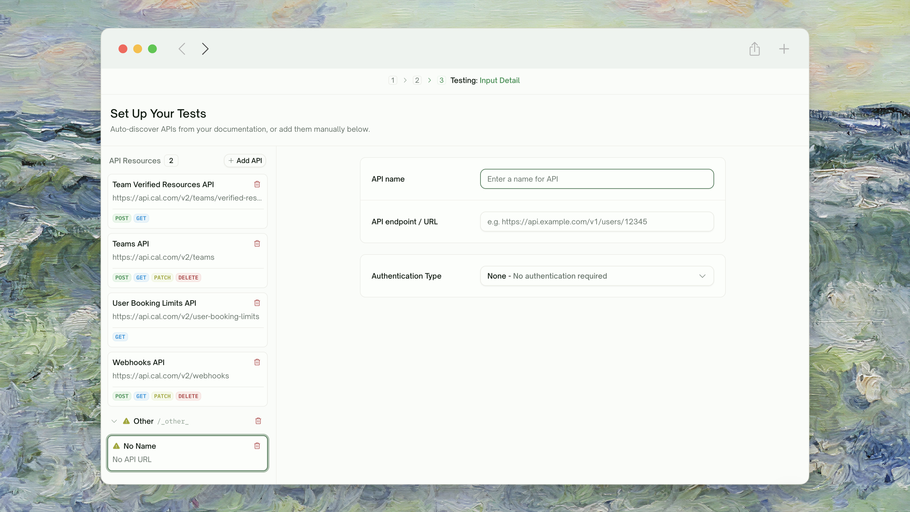

<Frame>
  
</Frame>

## What API Discovery Does

Before TestSprite can generate a single test, it needs to know **what endpoints exist**. API Discovery is the phase that builds that list from the inputs you provide:
<Frame>
  
</Frame>
| Input | What it provides |
| :--- | :--- |
| <kbd>API documentation</kbd> | OpenAPI / Swagger / Postman collections, or any free-form reference document (markdown, PDF, plain text) |
| <kbd>Base URL</kbd> | Used to confirm endpoint behavior against your live API |
| <kbd>Natural-language hints</kbd> | Typed into the configuration form — "Skip the admin endpoints" / "Focus on the checkout flow" |

The output is a structured endpoint list grouped by resource family, with the HTTP method, path template, request shape, and response shape captured for each.

<Info>
**Discovery happens on the configuration step of the wizard.** You re-trigger it by editing the inputs (uploaded docs, base URL, hints) and clicking <kbd>Parse with AI</kbd> again before you submit. Once the project is created, you can [Add endpoints manually](#adding-endpoints-manually); discovering a fundamentally new set of endpoints means starting a new project.
</Info>

## When Discovery Runs

You trigger discovery by clicking <kbd>Parse with AI</kbd> at the bottom of the configuration step (after you've uploaded your docs and provided a base URL). The endpoint list panel and detail panel both flip to a skeleton-placeholder state while it runs; when it completes, a toast confirms how many APIs and endpoints were found and the panels populate with the grouped result.
<Frame>
  
</Frame>
A typical discovery run takes 30 seconds to 3 minutes depending on how many endpoints exist and how responsive your API is.

## What Gets Discovered

For each endpoint TestSprite finds, it captures:

| Field | Description |
| :--- | :--- |
| <kbd>Method</kbd> (GET / POST / PUT / PATCH / DELETE) | The HTTP method for the endpoint |
| <kbd>Path template</kbd> (e.g. `/users/{id}/orders`) | The path with placeholders normalized |
| <kbd>Request shape</kbd> | Body schema, query params, required headers |
| <kbd>Response shape</kbd> | Expected status codes and body schema |
| <kbd>Auth requirement</kbd> | Whether this endpoint requires authentication, and what type |
| <kbd>Resource family</kbd> | Endpoints grouped together by resource (e.g. `/users/*` → Users family) |

These all feed into [Plan Generation](/web-portal/core/api/api-plan-gen), which uses the request/response shapes to write tests that match your real API rather than guessing at field names.

## Reviewing the Discovered Endpoint List

Once discovery completes, the page shows your endpoints in a grouped, expandable table. Each resource family is a collapsible group; expand to see the per-endpoint rows.

<Frame>
  
</Frame>

For each row you can:

<Steps>
  <Step title="Remove an endpoint">
    Click the **×** at the end of the row. Endpoints removed at this step won't get tests generated for them. Useful for internal-only endpoints, deprecated paths, or anything outside your test scope.
  </Step>
  <Step title="Adjust the method or path">
    Click the row to edit. TestSprite's discovery is mostly accurate, but if the path template is off (e.g. `{userId}` got captured as a literal value), you can correct it here.
  </Step>
  <Step title="Set the auth type per family">
    Use the **Authentication Type** dropdown on each API family. Choices are **Basic**, **Bearer**, **API-key**, or **None**. Setting it once at the family level applies to every endpoint in that family.
  </Step>
</Steps>

## Adding Endpoints Manually

Sometimes Discovery misses an endpoint — it might be private, undocumented, or otherwise unreachable from the inputs you provided. Click **Add Manually** at the bottom of the configuration step (or use the inline "add endpoints manually" link under the upload card):

<Frame>
  
</Frame>

Manually-added endpoints sit alongside the discovered ones in the list. You can paste a sample request body to give TestSprite a head start on the request shape.

## Auth Configuration During Discovery

The auth configuration here is **discovery-time only** — TestSprite uses it to confirm endpoint behavior during discovery. It's separate from the auth that gets used during the actual test runs:

| Discovery-time auth (this page) | Test-run-time auth |
| :--- | :--- |
| Provided once at project creation | Configured per-family on the **Authentication** sidebar tab, used for actual test execution |
| Single bearer token / API key / basic-auth pair | Per-API-family Static Credentials, or [Auto-Auth (Pro)](/web-portal/core/api/auto-auth) for token refresh |
| If credentials expire, fix them in the configuration step and re-trigger Parse with AI | Static credentials need manual rotation; Auto-Auth handles rotation automatically |

<Tip>
**Use the same test account for both.** Discovery and test runs both call your real API with real credentials. Provide a long-lived test account that has permissions across the full API surface — Auto-Auth on the test-run side handles token rotation, but the test user identity should be one you control.
</Tip>

## Adjusting Discovery via Natural Language

The configuration form has an "Extra testing instructions" textarea — anything you say there shapes both discovery and downstream plan generation. Some patterns that work well:

<CodeGroup>
```text Skip
Skip anything under /admin/ — we don't test admin endpoints from this account.
```

```text Auth
The auth header is X-Custom-Auth, not Authorization.
```

```text Exclude
GET /metrics is a Prometheus exporter — exclude it from testing.
```

```text Base URL
The base URL responds with 200 to GET / so don't treat that as a real endpoint.
```
</CodeGroup>

The uploaded docs are your primary signal. The textarea is for explaining the things that *aren't* in your docs but matter for testing.

## Iterating on Discovery Before You Submit

Discovery is iterative *while you're still in the configuration step* — adjust the inputs (upload a better OpenAPI spec, fix the base URL, refine the natural-language hints, update the credentials) and click <kbd>Parse with AI</kbd> again. Each Parse run replaces the discovered list with a fresh result, so the order of operations is: get the inputs right, parse, review, optionally edit per-endpoint or [add manually](#adding-endpoints-manually), then continue to plan generation.

Once the project is created, the discovered set is locked in for that project. To pick up endpoints that have shipped since the initial scan, [add them manually](#adding-endpoints-manually) on the configuration step (if you haven't yet submitted) or start a new project.

## When Discovery Doesn't Find Things It Should

<AccordionGroup>
  <Accordion title="Endpoint behind auth that discovery couldn't satisfy">
    Discovery uses the credentials from your config form. If your endpoint requires more elaborate auth (HMAC signing, mutual TLS, geographic IP restriction), the endpoint may be dropped or marked unconfirmed. Add it manually with a sample body, or expose a non-auth health endpoint TestSprite can hit.
  </Accordion>
  <Accordion title="Endpoint with stateful preconditions">
    `POST /orders/{id}/cancel` requires an existing order, and discovery can't satisfy that on its own. Add the endpoint manually; the integration-test phase will figure out the dependency chain.
  </Accordion>
  <Accordion title="GraphQL or RPC-style endpoints">
    TestSprite is REST-first; GraphQL discovery is best-effort. For Apollo/Relay-style APIs we recommend uploading a `.graphql` schema file as part of the documentation upload. Pure RPC (gRPC, JSON-RPC) is not supported in v1.
  </Accordion>
  <Accordion title="Endpoints that aren't documented">
    If an endpoint isn't in your uploaded docs and doesn't follow common REST conventions (e.g. `/api/v2/foo.action`), discovery might miss it. Add manually.
  </Accordion>
</AccordionGroup>

## Where to Go Next

<Columns cols={2}>
  <Card title="Plan Generation & Editing" href="/web-portal/core/api/api-plan-gen" icon="list-check">
    The next wizard phase — turn discovered endpoints into a test plan
  </Card>
  <Card title="Auto-Auth (Pro)" href="/web-portal/core/api/auto-auth" icon="arrows-rotate">
    Configure test-run-time auth (separate from discovery-time auth)
  </Card>
  <Card title="API Testing — Overview" href="/web-portal/core/api/api-testing" icon="terminal">
    Step back to the journey map
  </Card>
  <Card title="Refining Tests" href="/web-portal/core/working-with-test/refining-tests" icon="pen">
    Use natural language after generation, too
  </Card>
</Columns>
