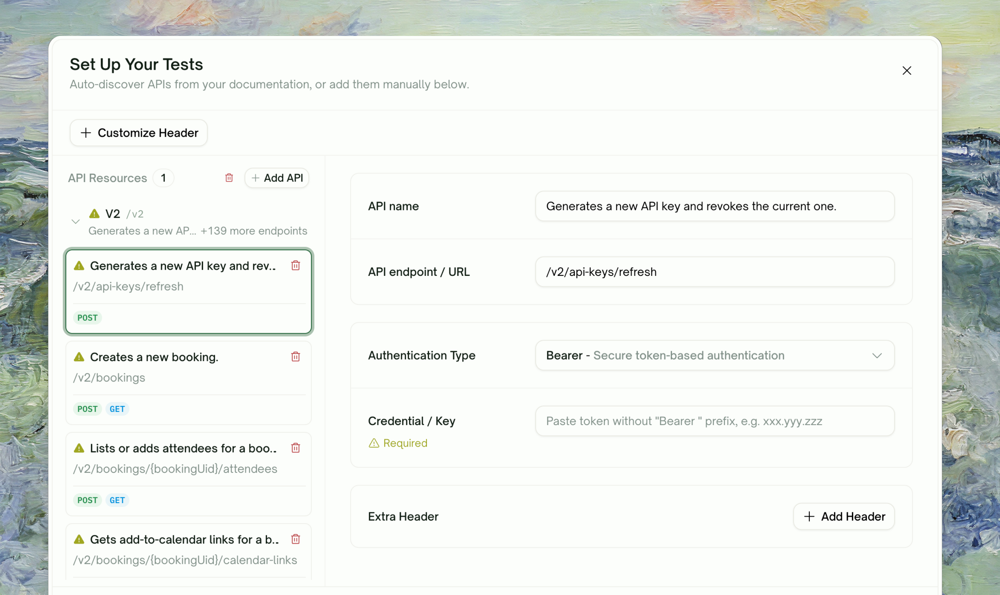
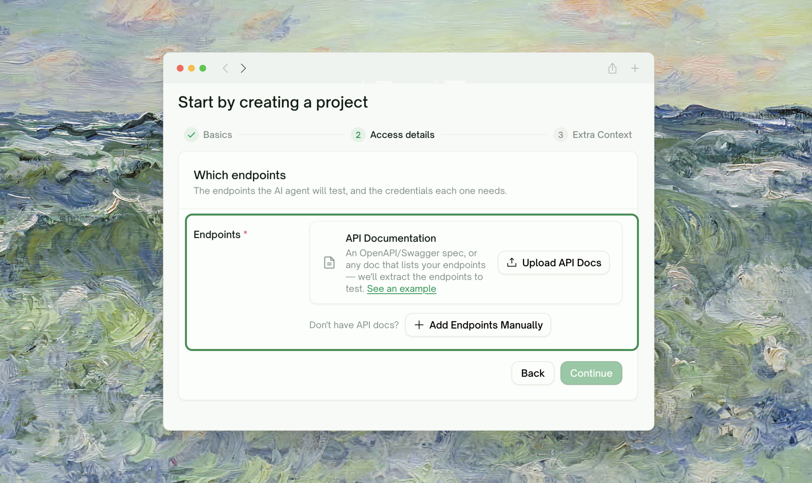
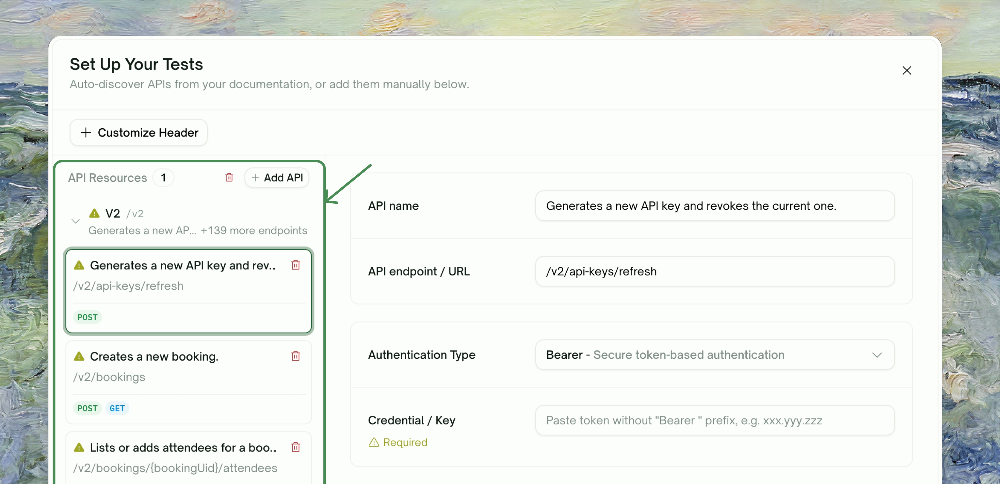
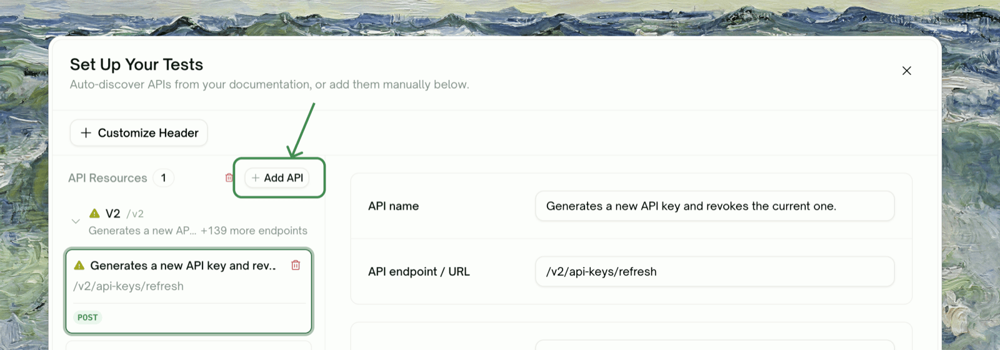

<Frame>
  
</Frame>

API Discovery builds the list of endpoints TestSprite will test. It reads your API docs and calls the endpoints against your live API, so plans are grounded in real responses.

## How It Works

1. On the **Access details** step of New Project, enter your **Base Endpoint** and click <kbd>Upload API docs</kbd>: OpenAPI, Swagger, a Postman collection, or any free-form reference (markdown, PDF, plain text).
2. Discovery starts right away. A toast shows how many APIs and endpoints were found; a typical run takes 30 seconds to 3 minutes.
3. Review the endpoints in the **Set Up Your Tests** dialog, then save them.

<Frame>
  
</Frame>

Each endpoint comes with its method, path, request and response shapes, and auth requirement. [Plan Generation](/web-portal/core/api/api-plan-gen) uses those shapes, so tests use your real field names. To see the calls TestSprite made, open an endpoint on <kbd>Test Coverage</kbd> and expand **Probe response** or **Raw call records**.

<Info>
Discovery happens only while you create the project. After that, the endpoint list is locked; to test a fundamentally different set of endpoints, start a new project.
</Info>

## Reviewing the Endpoints

Endpoints are grouped by resource family (for example, everything under `/users/*`). For each one you can:

- **Remove it** with the trash icon. Removed endpoints get no tests.
- **Fix the path** by clicking the row, if a placeholder like `{userId}` was captured as a literal value.
- **Set the auth type** (**Basic**, **Bearer**, **API-key**, or **None**). Use <kbd>Customize Header</kbd> to set it for many endpoints at once.

<Frame>
  
</Frame>

To start over with a better spec, upload it and confirm **Re-extract Endpoints**. This replaces the whole list, including your edits.

## Adding Endpoints Manually

If discovery missed an endpoint, click <kbd>Add API</kbd> in the **Set Up Your Tests** dialog. With no docs at all, use <kbd>Add Endpoints Manually</kbd> on the Access details step.

<Frame>
  
</Frame>

## Auth

The auth you set here is what your test runs start with. After the project is created, change it per endpoint with **Customize Header** in **Project Settings → Test Execution → Environment**, or set up [Auto-Auth](/web-portal/core/api/auto-auth) for tokens that expire. Give TestSprite a long-lived test account with access to your whole API, since discovery and test runs both call it.

Anything your docs don't say, such as an unusual auth header or endpoints to skip, goes in **Extra Instructions** on the Extra Context step.

## Troubleshooting

- **An endpoint behind complex auth is missing** (HMAC signing, mutual TLS, IP restrictions). Add it manually.
- **An endpoint needs existing data**, like `POST /orders/{id}/cancel`. Add it manually; [integration tests](/web-portal/core/api/integration-tests) work out the dependency chain.
- **An undocumented endpoint with an unusual path** (for example `/api/v2/foo.action`) wasn't found. Add it manually.
- **GraphQL or RPC APIs.** TestSprite is REST-first. GraphQL discovery is best-effort, so upload your `.graphql` schema with your docs. Pure RPC (gRPC, JSON-RPC) isn't supported.

## Where to Go Next

<Columns cols={2}>
  <Card title="Plan Generation & Editing" href="/web-portal/core/api/api-plan-gen" icon="list-check">
    Turn the endpoints into a test plan
  </Card>
  <Card title="Auto-Auth" href="/web-portal/core/api/auto-auth" icon="arrows-rotate">
    Keep tokens fresh on every run
  </Card>
</Columns>
