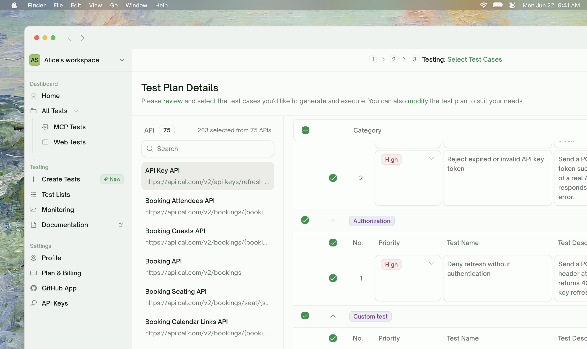
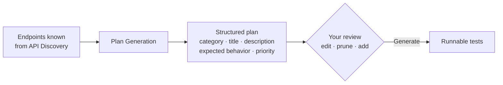
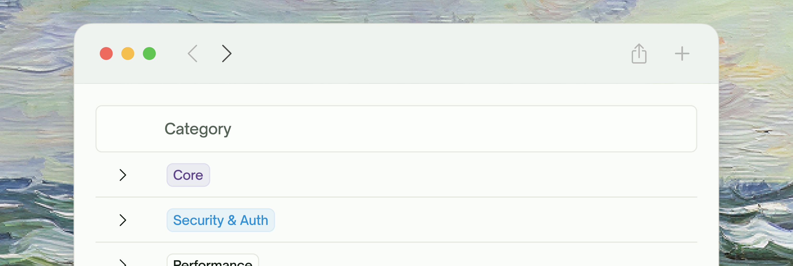
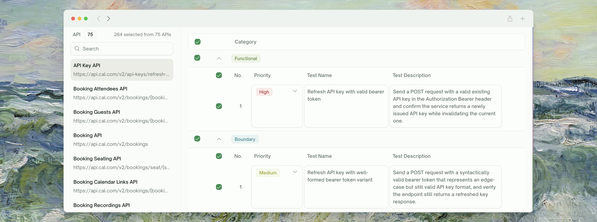
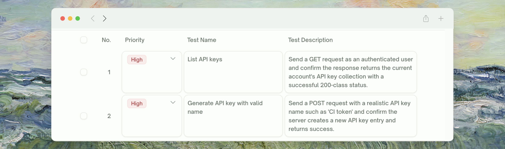
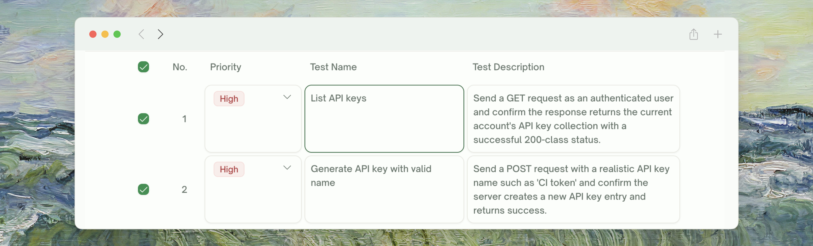
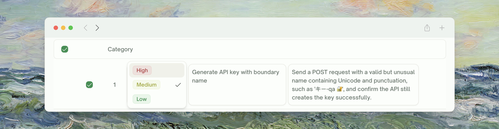
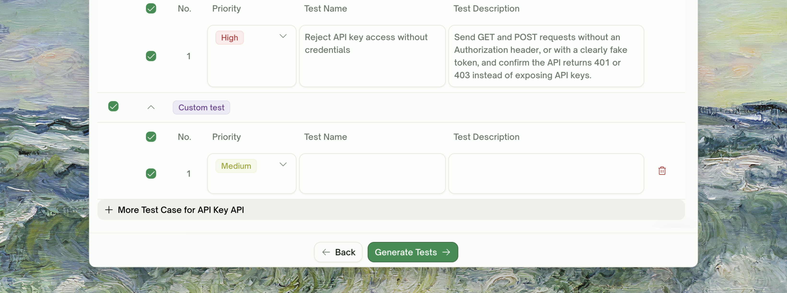

<Frame>
  
</Frame>

## What Plan Generation Does

Plan Generation is the bridge between "TestSprite knows your endpoints" and "TestSprite has runnable tests". For every endpoint that survived [API Discovery](/web-portal/core/api/api-discovery), this phase produces a **structured plan**: a list of test cases grouped by category, each with a title, description, expected behavior, and priority.

<Card>

</Card>

The plan is a *contract* between you and TestSprite. You can read it, edit it, prune it, and add to it **before** any tests are generated. Catching a misunderstanding at the plan stage saves an entire round of generation and review.

<Info>
**Nothing executes during plan generation.** No HTTP calls are made to your API at this step. Plan generation reads from your discovered endpoints, your PRD, and your natural-language hints.
</Info>

## What Goes Into the Plan

| Input | Where it comes from | What plan generation does with it |
| :--- | :--- | :--- |
| <kbd>Discovered endpoints</kbd> | [API Discovery](/web-portal/core/api/api-discovery) | One sub-plan per endpoint, with shape-appropriate tests |
| <kbd>PRD / docs upload</kbd> | Configuration step | Anchors the description and asserted behavior in what the endpoint is *for* |
| <kbd>Response shapes from discovery</kbd> | Discovery phase | Used as ground truth for response shape, so tests reference real field names |
| <kbd>Extra testing instructions</kbd> | Configuration step | "Skip the admin endpoints", "Always assert response time < 200ms" — these get woven in |

## The Plan Structure

Each endpoint gets a **sub-plan** organized by category. Categories are picked based on what the endpoint does — common ones include:

<Frame>
  
</Frame>

- **Functional / happy path** — valid inputs, expected response shape, basic error paths (404, 400 on bad input)
- **Authorization & authentication** — unauthenticated → 401, wrong-user → 403, ownership checks, token handling, signature tampering
- **Error handling & edge cases** — missing required fields, malformed input, type coercion traps, unicode / null / encoding edges
- **Boundary & load** — oversized payloads, max array lengths, rate-limit edges, concurrent-write contention
- **Security probes** — privilege escalation, common attack patterns relevant to the endpoint

Not every category applies to every endpoint. A small CRUD endpoint might produce 3–8 tests across a couple of categories; a complex endpoint with security implications can produce 15+. The count varies with what the endpoint *does*, not a fixed budget.

## Reviewing the Plan

The plan view is grouped by category; each row is collapsible.

<Steps>
  <Step title="Expand a category to see the tests in it">
    Each row inside shows the test title (a one-liner) and a short description. Click the row body to expand the description into full detail.
    <Frame>
      
    </Frame>
  </Step>
  <Step title="Untick anything you don't want">
    The checkbox at the start of each row controls whether the test will be generated. Untick irrelevant or duplicative cases. Whole categories can be untick-all'd via the category header checkbox.
        <Frame>
      
    </Frame>
  </Step>
  <Step title="Edit titles and descriptions in place">
    Click the title to rename. Click the description to edit. Your edits shape the test that gets generated.
      <Frame>
      
    </Frame>
  </Step>
  <Step title="Reorder by priority if you want">
    Each test has a priority. Higher-priority tests run first. The default ordering is usually fine; reorder if you have a particular flow you want to verify before everything else.
      <Frame>
      
    </Frame>
  </Step>
</Steps>

<Tip>
**Don't be precious about pruning.** Selecting all is usually right on a first run — you get full coverage. If a category produces too many tests for your liking, untick the ones you find low-value rather than disabling the whole category. The high-leverage tests in any category tend to be 60% of what's there.
</Tip>

## Adding Tests in Natural Language

The bottom of the plan list has a chat input — "Add a test in natural language". TestSprite parses the request, figures out which endpoint(s) it applies to, and writes a new plan row for it.
      <Frame>
      
    </Frame>
<CodeGroup>
```text Targeted addition
Add a test for POST /orders that posts an order with quantity=0 and expects a 400.
```

```text Cross-cutting concern
For every GET endpoint, add a test that it responds in under 500ms.
```

```text Domain-specific edge
Test that POST /users with an email already used by another user returns 409 Conflict, not 200.
```
</CodeGroup>

<Info>
**The added test is the same shape as auto-generated rows.** It gets a category, title, description, and priority; you can edit, prune, or reorder it just like the rest.
</Info>

## Refining the Plan via Natural Language

Beyond Add-a-test, the chat panel on the right side supports broader refinements:

      <Frame>
      
    </Frame>

<CodeGroup>
```text Drop
Drop all tests that use an admin token — we're testing the customer-facing surface only.
```

```text Scope
For the GET /users tests, only test the happy path and the unauthorized case. Skip the perf and edge categories.
```

```text Tighten
The /payments endpoints are PCI-scoped — make sure every Security test verifies that no card numbers leak in error responses.
```
</CodeGroup>

TestSprite parses the request, applies it to the affected rows (which can be a few or hundreds depending on scope), and the plan re-renders. You can review and undo the change before clicking **Generate Tests**.

## What "Generate Tests" Actually Triggers

Clicking **Generate Tests** advances the wizard to test generation. The plan is locked in at click-time — subsequent edits would require regenerating.

<Card title="Endpoint Tests Generation" href="/web-portal/core/api/endpoint-tests" icon="cube">
  The next phase — each plan row becomes a runnable test
</Card>

## Plan Generation and Free-Plan Limits

Plan Generation itself is **free for all plans**. You can generate plans on any number of endpoints, on any plan tier. The limit applies downstream — at test generation time, where each generated test consumes one credit.

<Card title="Subscription Plans" href="/web-portal/admin/billing-and-plans" icon="credit-card">
  See plan tiers, credit allocations, and upgrade options
</Card>

<Info>
**This is intentional**. Plan generation is where you decide what's worth testing; you should have unlimited room to explore options before spending credits on the actual tests.
</Info>

## When Plan Generation Looks Wrong

<AccordionGroup>
  <Accordion title="A test asserts on a field that doesn't exist">
    Discovery didn't fully observe this endpoint's response, so plan generation inferred the shape from your docs. Either:
    - Re-run [API Discovery](/web-portal/core/api/api-discovery) once the endpoint is reachable, then regenerate the plan
    - Or correct the test description in place to match the real shape — generation will follow your edit
  </Accordion>
  <Accordion title="An obvious test wasn't generated">
    Two common causes:
    - The endpoint wasn't in the discovered set ([revisit Discovery](/web-portal/core/api/api-discovery))
    - The test was judged redundant or out-of-scope. Add a "Make sure to cover X" instruction in the chat.
  </Accordion>
  <Accordion title="Tests are too generic — they don't reflect our domain">
    You probably haven't given enough domain context. Use the "Extra testing instructions" textarea on the configuration step or upload a richer PRD — describe your domain rules ("orders have a status enum: pending, confirmed, shipped, delivered, cancelled") so the plan reflects them in titles and assertions.
  </Accordion>
  <Accordion title="The Security category is overkill for an internal-only API">
    Untick the Security category at its header. The default sizing assumes external exposure; for internal services 1–2 auth checks are usually enough.
  </Accordion>
  <Accordion title="Plan generation returned 0 tests for an endpoint">
    Discovery captured the endpoint, but the plan judged it unsafe to test (missing auth pattern, unclear response shape). Look at the Discovery row for that endpoint — if it shows "Unconfirmed" status, fix the discovery issue and re-run.
  </Accordion>
</AccordionGroup>

## Where to Go Next

<Columns cols={2}>
  <Card title="Endpoint Tests Generation" href="/web-portal/core/api/endpoint-tests" icon="cube">
    The next phase — turn the plan into runnable tests
  </Card>
  <Card title="Integration Tests Generation" href="/web-portal/core/api/integration-tests" icon="link">
    Auto-assembled multi-step chains
  </Card>
  <Card title="Refining Tests" href="/web-portal/core/working-with-test/refining-tests" icon="pen">
    Natural-language refinement after tests are generated
  </Card>
</Columns>
