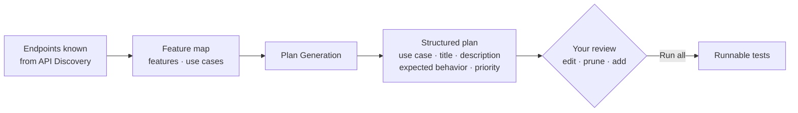

<Frame>
  
</Frame>

## What Plan Generation Does

For every endpoint that survived [API Discovery](/web-portal/core/api/api-discovery), TestSprite's testing agent produces a **structured plan**: test cases grouped by use case, each with a title, description, expected behavior, and priority. You can read, edit, prune, and add to the plan **before** any tests are generated, which is the cheapest place to catch a misunderstanding.

<Card>

```mermaid
flowchart LR
    A[Endpoints known<br/>from API Discovery] --> M[Feature map<br/>features · use cases] --> B[Plan Generation]
    B --> C[Structured plan<br/>use case · title · description<br/>expected behavior · priority]
    C --> D{Your review<br/>edit · prune · add}
    D -->|Run all| E[Runnable tests]
```
</Card>

<Info>
**Nothing executes during plan generation.** No HTTP calls are made to your API at this step.
</Info>

## What Goes Into the Plan

| Input | Where it comes from | What plan generation does with it |
| :--- | :--- | :--- |
| <kbd>Feature map</kbd> | [Test Coverage](/web-portal/core/working-with-test/coverage-map) | Groups and scopes the tests by use case |
| <kbd>Discovered endpoints</kbd> | [API Discovery](/web-portal/core/api/api-discovery) | One sub-plan per endpoint, with shape-appropriate tests |
| <kbd>PRD / docs upload</kbd> | New Project form | Anchors the description and asserted behavior in what the endpoint is *for* |
| <kbd>Response shapes from discovery</kbd> | Discovery phase | Used as ground truth, so tests reference real field names |
| <kbd>Extra Instructions</kbd> | New Project form | "Skip the admin endpoints", "Always assert response time < 200ms"; these get woven in |

## The Plan Structure

Each endpoint gets a **sub-plan** covering the categories of tests that fit what it does. Common ones:

<Frame>
  
</Frame>

- **Functional / happy path**: valid inputs, expected response shape, basic error paths (404, 400 on bad input)
- **Authorization & authentication**: unauthenticated → 401, wrong-user → 403, ownership checks, token handling, signature tampering
- **Error handling & edge cases**: missing required fields, malformed input, type coercion traps, unicode / null / encoding edges
- **Boundary & load**: oversized payloads, max array lengths, rate-limit edges, concurrent-write contention
- **Security probes**: privilege escalation, common attack patterns relevant to the endpoint

Not every category applies to every endpoint. A small CRUD endpoint might get 3–8 tests; a complex endpoint with security implications can get 15+.

## Reviewing the Plan

Click <kbd>Plan Tests</kbd> on **Test Coverage** and TestSprite's testing agent plans the tests. They open in **Review proposed tests**, grouped by use case; pick a use case on the left to see its tests.

<Steps>
  <Step title="Pick a use case to see the tests in it">
    Each row shows the test title and a short description. Click the row body to expand it.
    <Frame>
      
    </Frame>
  </Step>
  <Step title="Untick anything you don't want">
    The checkbox on each row controls whether the test is generated. A use case's **Select All** checkbox toggles all of its tests.
    <Frame>
      
    </Frame>
  </Step>
  <Step title="Edit titles and descriptions in place">
    Click the title to rename it, or the description to edit it. Your edits shape the generated test.
    <Frame>
      
    </Frame>
  </Step>
  <Step title="Reorder by priority if you want">
    Each test has a priority, and higher-priority tests run first. Reorder if there's a flow you want verified before everything else.
    <Frame>
      
    </Frame>
  </Step>
</Steps>

<Tip>
On a first run, keeping everything selected is usually right. If a use case has more tests than you want, untick individual low-value ones rather than the whole use case.
</Tip>

## Adding Tests in Natural Language

Click <kbd>+ More Test Case for &lt;use case&gt;</kbd> below the list to add a blank row, then write its name and description in natural language. TestSprite generates the test from what you write. Added rows work like the others: you can edit, prune, or reorder them.

<Frame>
  
</Frame>

<CodeGroup>
```text Targeted addition
POST /orders with quantity=0 is rejected with a 400.
```

```text Domain-specific edge
POST /users with an email already used by another user returns 409 Conflict, not 200.
```
</CodeGroup>

## What "Run all" Actually Triggers

Clicking **Run all** (or **Run N tests**) adds the selected tests and starts generating and running them. The plan is locked in at that point; later edits require regenerating. Next: [Endpoint Tests](/web-portal/core/api/endpoint-tests).

## When Plan Generation Looks Wrong

<AccordionGroup>
  <Accordion title="A test asserts on a field that doesn't exist">
    Discovery didn't fully observe this endpoint's response, so the shape was inferred from your docs. Correct the test description to match the real shape, and generation will follow your edit.
  </Accordion>
  <Accordion title="An obvious test wasn't generated">
    Either the endpoint wasn't in the discovered set ([revisit Discovery](/web-portal/core/api/api-discovery)), or the test was judged redundant or out of scope. Add it yourself with <kbd>+ More Test Case</kbd>.
  </Accordion>
  <Accordion title="Tests are too generic — they don't reflect our domain">
    Give more domain context in **Extra Instructions** (in **Project Settings → General**) or a richer PRD, e.g. "orders have a status enum: pending, confirmed, shipped, delivered, cancelled".
  </Accordion>
  <Accordion title="The Security category is overkill for an internal-only API">
    Untick the security tests in the review. The default sizing assumes external exposure; for internal services 1–2 auth checks are usually enough.
  </Accordion>
  <Accordion title="Plan generation returned 0 tests for an endpoint">
    The endpoint was discovered but judged unsafe to test (missing auth pattern, unclear response shape). Add the test yourself with <kbd>+ More Test Case</kbd>.
  </Accordion>
</AccordionGroup>

## Where to Go Next

<Columns cols={2}>
  <Card title="Endpoint Tests" href="/web-portal/core/api/endpoint-tests" icon="cube">
    The next phase: turn the plan into runnable tests
  </Card>
  <Card title="Integration Tests Generation" href="/web-portal/core/api/integration-tests" icon="link">
    Auto-assembled multi-step chains
  </Card>
  <Card title="Managing Test Cases" href="/web-portal/core/working-with-test/managing-test-cases" icon="pen">
    Natural-language refinement after tests are generated
  </Card>
</Columns>
