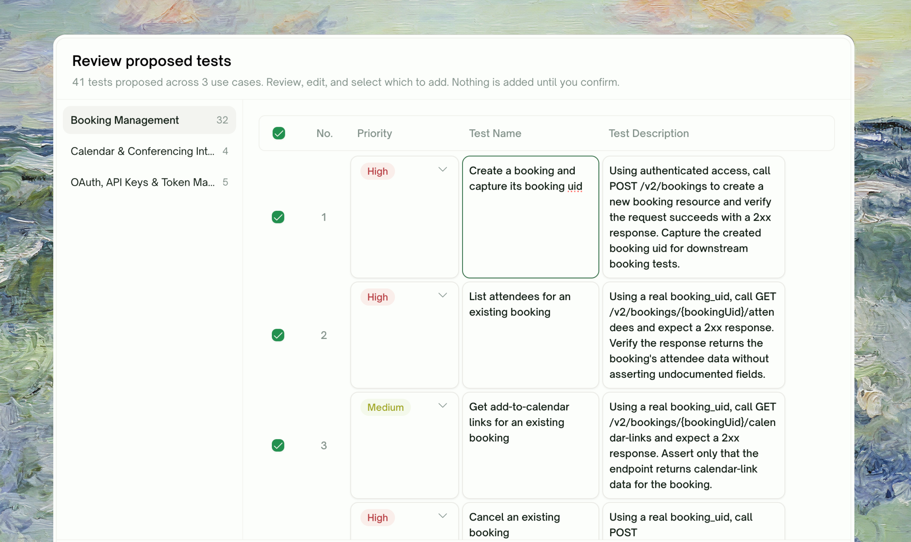
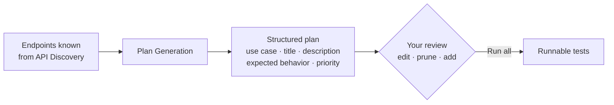
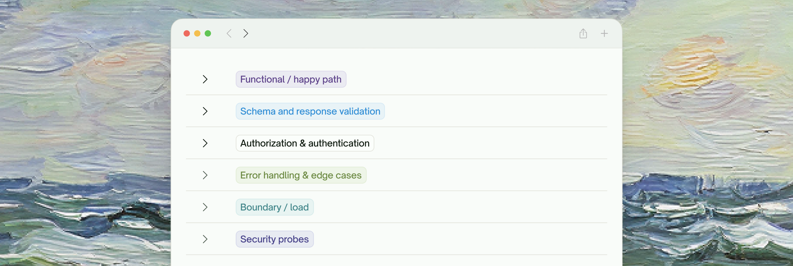
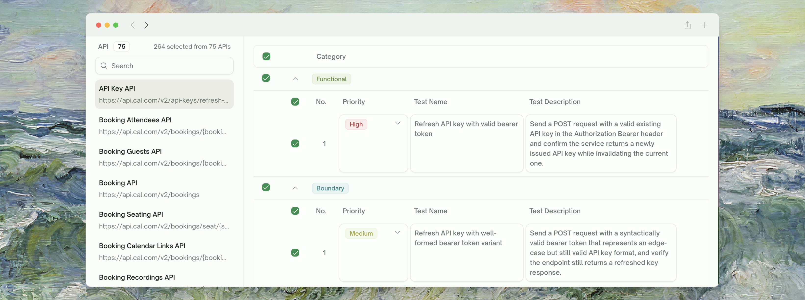
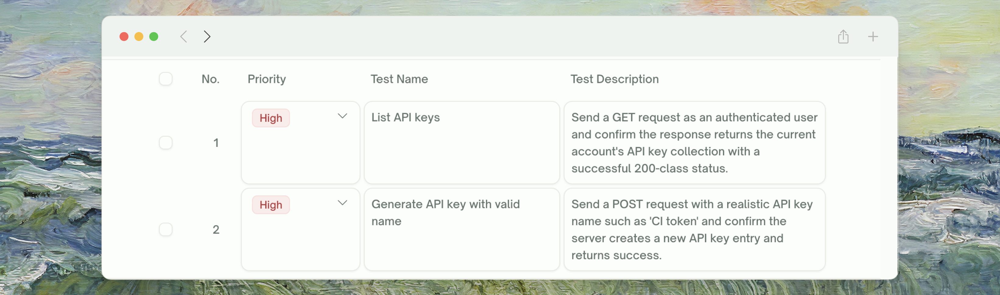
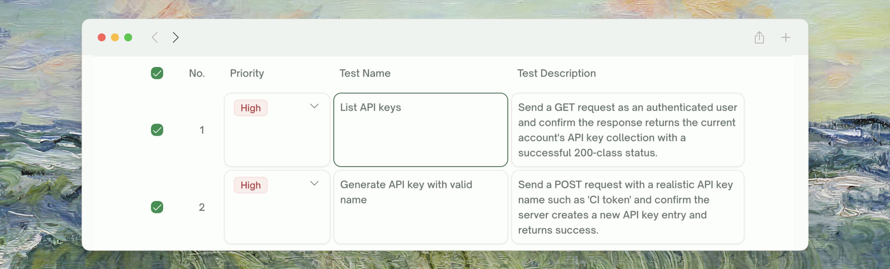
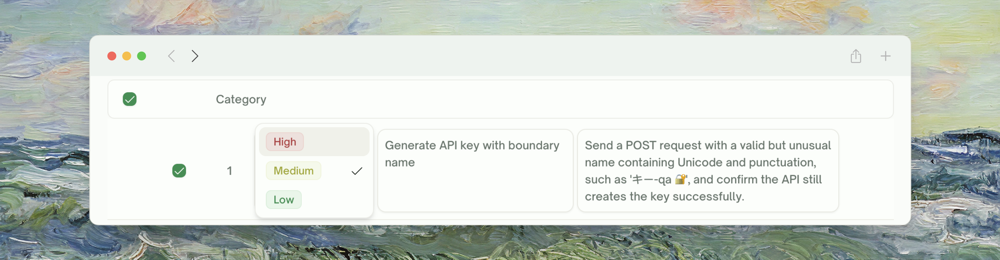
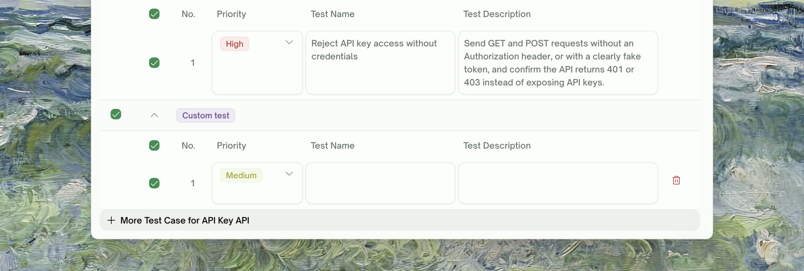

<Frame>
  
</Frame>

## What Plan Generation Does

Plan Generation is the bridge between "TestSprite knows your endpoints" and "TestSprite has runnable tests". For every endpoint that survived [API Discovery](/web-portal/core/api/api-discovery), this phase produces a **structured plan**: a list of test cases grouped by use case, each with a title, description, expected behavior, and priority.

<Card>

```mermaid
flowchart LR
    A[Endpoints known<br/>from API Discovery] --> B[Plan Generation]
    B --> C[Structured plan<br/>use case · title · description<br/>expected behavior · priority]
    C --> D{Your review<br/>edit · prune · add}
    D -->|Run all| E[Runnable tests]
```
</Card>

The plan is a *contract* between you and TestSprite. You can read it, edit it, prune it, and add to it **before** any tests are generated. Catching a misunderstanding at the plan stage saves an entire round of generation and review.

<Info>
**Nothing executes during plan generation.** No HTTP calls are made to your API at this step. Plan generation reads from your discovered endpoints, your PRD, and your natural-language hints.
</Info>

## What Goes Into the Plan

| Input | Where it comes from | What plan generation does with it |
| :--- | :--- | :--- |
| <kbd>Discovered endpoints</kbd> | [API Discovery](/web-portal/core/api/api-discovery) | One sub-plan per endpoint, with shape-appropriate tests |
| <kbd>PRD / docs upload</kbd> | New Project form | Anchors the description and asserted behavior in what the endpoint is *for* |
| <kbd>Response shapes from discovery</kbd> | Discovery phase | Used as ground truth for response shape, so tests reference real field names |
| <kbd>Extra Instructions</kbd> | New Project form | "Skip the admin endpoints", "Always assert response time < 200ms"; these get woven in |

## The Plan Structure

Each endpoint gets a **sub-plan** covering several categories of tests, picked based on what the endpoint does. Common ones include:

<Frame>
  
</Frame>

- **Functional / happy path** — valid inputs, expected response shape, basic error paths (404, 400 on bad input)
- **Authorization & authentication** — unauthenticated → 401, wrong-user → 403, ownership checks, token handling, signature tampering
- **Error handling & edge cases** — missing required fields, malformed input, type coercion traps, unicode / null / encoding edges
- **Boundary & load** — oversized payloads, max array lengths, rate-limit edges, concurrent-write contention
- **Security probes** — privilege escalation, common attack patterns relevant to the endpoint

Not every category applies to every endpoint. A small CRUD endpoint might produce 3–8 tests across a couple of categories; a complex endpoint with security implications can produce 15+. The count varies with what the endpoint *does*, not a fixed budget.

## Reviewing the Plan

Click <kbd>Plan Tests</kbd> on **Test Coverage** to generate the plan. It opens in **Review proposed tests**, grouped by use case. Pick a use case on the left to see its tests.

<Steps>
  <Step title="Pick a use case to see the tests in it">
    Each row inside shows the test title (a one-liner) and a short description. Click the row body to expand the description into full detail.
    <Frame>
      
    </Frame>
  </Step>
  <Step title="Untick anything you don't want">
    The checkbox at the start of each row controls whether the test will be generated. Untick irrelevant or duplicative cases. A whole use case can be untick-all'd via its **Select All** checkbox.
        <Frame>
      
    </Frame>
  </Step>
  <Step title="Edit titles and descriptions in place">
    Click the title to rename. Click the description to edit. Your edits shape the test that gets generated.
      <Frame>
      
    </Frame>
  </Step>
  <Step title="Reorder by priority if you want">
    Each test has a priority. Higher-priority tests run first. The default ordering is usually fine; reorder if you have a particular flow you want to verify before everything else.
      <Frame>
      
    </Frame>
  </Step>
</Steps>

<Tip>
**Don't be precious about pruning.** Selecting all is usually right on a first run, since you get full coverage. If a use case produces too many tests for your liking, untick the ones you find low-value rather than disabling the whole use case. The high-leverage tests in any use case tend to be 60% of what's there.
</Tip>

## Adding Tests in Natural Language

Below the list, click <kbd>+ More Test Case for &lt;use case&gt;</kbd> to add a blank row to that use case, then write its name and description in natural language. TestSprite generates the test from what you write.
      <Frame>
      
    </Frame>
<CodeGroup>
```text Targeted addition
POST /orders with quantity=0 is rejected with a 400.
```

```text Domain-specific edge
POST /users with an email already used by another user returns 409 Conflict, not 200.
```
</CodeGroup>

<Info>
**The added test is the same shape as auto-generated rows.** It gets a use case, title, description, and priority; you can edit, prune, or reorder it just like the rest.
</Info>

## What "Run all" Actually Triggers

Clicking **Run all** (or **Run N tests**) adds the selected tests and starts generating and running them. The plan is locked in at click-time; subsequent edits would require regenerating.

<Card title="Endpoint Tests" href="/web-portal/core/api/endpoint-tests" icon="cube">
  The next phase — each plan row becomes a runnable test
</Card>

## When Plan Generation Looks Wrong

<AccordionGroup>
  <Accordion title="A test asserts on a field that doesn't exist">
    Discovery didn't fully observe this endpoint's response, so plan generation inferred the shape from your docs. Correct the test description in place to match the real shape, and generation will follow your edit.
  </Accordion>
  <Accordion title="An obvious test wasn't generated">
    Two common causes:
    - The endpoint wasn't in the discovered set ([revisit Discovery](/web-portal/core/api/api-discovery))
    - The test was judged redundant or out-of-scope. Add it yourself with <kbd>+ More Test Case</kbd>.
  </Accordion>
  <Accordion title="Tests are too generic — they don't reflect our domain">
    You probably haven't given enough domain context. Use **Extra Instructions** (in **Project Settings → General**) or upload a richer PRD. Describe your domain rules ("orders have a status enum: pending, confirmed, shipped, delivered, cancelled") so the plan reflects them in titles and assertions.
  </Accordion>
  <Accordion title="The Security category is overkill for an internal-only API">
    Untick the security tests in the review. The default sizing assumes external exposure; for internal services 1–2 auth checks are usually enough.
  </Accordion>
  <Accordion title="Plan generation returned 0 tests for an endpoint">
    Discovery captured the endpoint, but the plan judged it unsafe to test (missing auth pattern, unclear response shape). Add the test yourself with <kbd>+ More Test Case</kbd>.
  </Accordion>
</AccordionGroup>

## Where to Go Next

<Columns cols={2}>
  <Card title="Endpoint Tests" href="/web-portal/core/api/endpoint-tests" icon="cube">
    The next phase — turn the plan into runnable tests
  </Card>
  <Card title="Integration Tests Generation" href="/web-portal/core/api/integration-tests" icon="link">
    Auto-assembled multi-step chains
  </Card>
  <Card title="Refining Tests" href="/web-portal/core/working-with-test/refining-tests" icon="pen">
    Natural-language refinement after tests are generated
  </Card>
</Columns>
