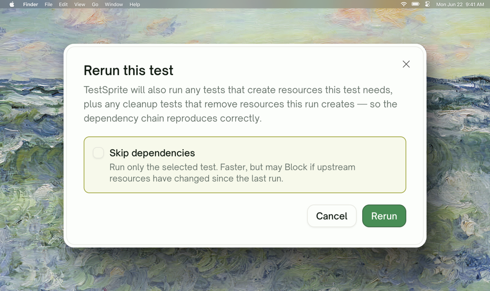
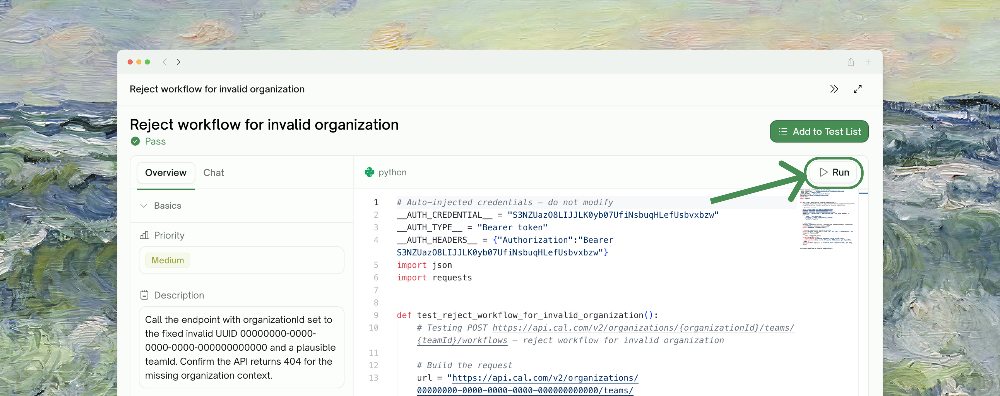
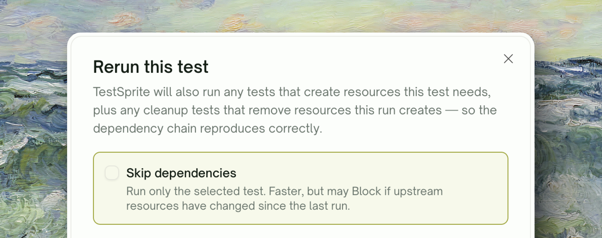
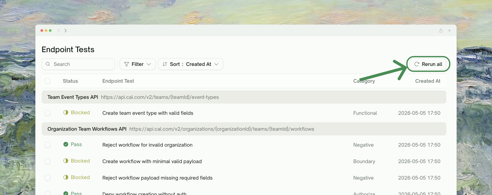

<Frame>
  
</Frame>

## Three Rerun Surfaces

API testing supports three rerun paths:

| Surface | What it does | When to use |
| :--- | :--- | :--- |
| <kbd>Single test rerun</kbd> | Re-execute one test | Confirm a fix on a specific failing test |
| <kbd>Rerun all</kbd> (batch) | Re-execute every test in the project | After API change, dep upgrade, or environment update |
| <kbd>Scheduled rerun</kbd> | Auto-run on cadence (Pro Schedule slot) | Continuous monitoring of API health |

The API-specific knob is **Skip dependencies** — covered below.

<Info>
**Auto-Heal does not apply to API testing.** Auto-Heal is exclusive to UI tests because UIs drift in ways HTTP APIs don't. The corresponding Pro feature for backend testing is [Auto-Auth](/web-portal/core/api/auto-auth) — keeping tokens fresh across long-running schedules.
</Info>

## Single Test Rerun

From a test's detail page, click **Rerun**. A confirmation dialog opens with one important toggle: **Skip dependencies**.
<Frame>
  
</Frame>
### What "Skip dependencies" means

Most API tests in TestSprite have **upstream dependencies** — variables they consume from earlier tests in a chain. A normal rerun re-runs the producers first, getting fresh captures, then runs the consumer.
<Frame>
  
</Frame>
**Skip dependencies** does only the consumer. The captured values from the previous run are reused — no fresh producer call is made.

```
Without Skip deps           With Skip deps
─────────────────          ──────────────────
1. POST /users (rerun)     1. (skipped — uses cached user_id)
   captures user_id
2. POST /orders            2. POST /orders (only this runs)
   uses captured user_id      uses cached user_id from prior run
```

### When to skip dependencies

| Scenario | Skip? |
| :--- | :--- |
| Refining one test's assertion, the upstream is fine | <Icon icon="check" /> Skip — saves 30s, costs 0 credits more |
| Quick iteration loop on a failing consumer | <Icon icon="check" /> Skip — fast feedback |
| Confirming the same data path still works | <Icon icon="check" /> Skip — re-execution against cached state is meaningful |
| After cleanup ran (the captured records are gone) | <Icon icon="xmark" /> Don't skip — captured IDs no longer valid |
| After a long delay where the captured values may have expired | <Icon icon="xmark" /> Don't skip — captures might be stale |
| You changed something upstream and want to verify the chain | <Icon icon="xmark" /> Don't skip — you need fresh producer state |

<Tip>
**Default is "do not skip" — the safer choice.** Tick the box deliberately when you've thought about it.
</Tip>

## Rerun All (Batch)

From the project test list, the **Rerun all** button at the top right re-executes every test in the project. The Skip-dependencies toggle applies project-wide:
<Frame>
  
</Frame>
| Setting | What happens |
| :--- | :--- |
| <kbd>Skip off</kbd> | Every chain runs from scratch — fresh user records, fresh orders, fresh sessions |
| <kbd>Skip on</kbd> | Producers are skipped where their captures from the previous run are still valid; consumers run alone |

For batch reruns, **Skip off is almost always the right choice**. The whole point of a batch rerun is to verify the system end-to-end against current state — skipping producers leaves you running consumers against potentially-stale captures.

## Scheduled Reruns

Schedules run on a cadence (daily, weekly, cron expression). For API projects, scheduled reruns:
<Frame>
  
</Frame>
- Run with Skip dependencies = OFF by default (every chain rebuilds)
- Use [Auto-Auth](/web-portal/core/api/auto-auth) when configured (token-refresh during the run)
- Trigger Auto Cleanup after the run (so each scheduled run leaves a clean environment)

Schedule creation is on a separate page — see [Schedule Monitoring](/web-portal/maintenance/monitoring) for the configuration flow.

## What Happens to Cleanup on Rerun

Every Rerun (single, batch, or scheduled) triggers [Auto Cleanup](/web-portal/core/api/auto-cleanup) at the end. The DELETE chains rebuild from the captured records of *the rerun*, not the previous run.

If Skip dependencies was ON and a producer didn't run, the captures from before are still tracked — and cleanup will delete those records. So even Skip-dependencies reruns leave a clean environment.

## Cascading: Rerun a Producer = Rerun Its Consumers

If you rerun a producer test (one that captures variables consumed downstream), the rerun automatically cascades to consumers. They're re-executed with the producer's fresh captured values.

This means:

- Reruning POST /users (a producer) → automatically reruns POST /orders, GET /orders/{id}, DELETE /orders/{id}
- Rerunning DELETE /orders/{id} (a leaf consumer) → only that test reruns; its upstream stays as-is

See [Dependency Chains](/web-portal/core/api/dependency-chains) for how producer/consumer relationships are identified.

## Rerun Outcomes

After a rerun, the test row updates with the new outcome. The previous run's data is preserved for [Comparing Runs](/web-portal/maintenance/comparing-runs) — you can diff "before rerun" against "after rerun" to see exactly what changed.

| Outcome on rerun | What it means | What you do |
| :--- | :--- | :--- |
| Was Failed → now Passed | Your fix worked, or the flake resolved | Move on |
| Was Passed → now Failed | Regression; either your fix broke something else, or the API changed | Investigate via test detail page |
| Still Failed (same error) | Fix didn't take | Refine more, or rerun with Skip dependencies for fast iteration |
| Still Failed (different error) | You fixed one bug and uncovered another | Tackle the new error |

## Free vs Paid

| | Free | Paid |
| :--- | :--- | :--- |
| Single test rerun | <Icon icon="check" /> | <Icon icon="check" /> |
| Skip dependencies toggle | <Icon icon="check" /> | <Icon icon="check" /> |
| Rerun all (batch) | <Icon icon="check" /> | <Icon icon="check" /> |
| Scheduled reruns | <Icon icon="xmark" /> | <Icon icon="check" /> Schedule slots |
| Auto-Auth on rerun | <Icon icon="xmark" /> | <Icon icon="check" /> |

## Edge Cases & Troubleshooting

<AccordionGroup>
  <Accordion title="I rerun with Skip deps and the test says 'Variable not found'">
    The cached values from the previous run are no longer usable — typically because Cleanup already wiped the records, or enough time has passed that the values are stale. Rerun without Skip dependencies (uncheck the box) to recreate the upstream resources.
  </Accordion>
  <Accordion title="Rerun cascade goes deep — too many tests rerun">
    The producer you reran has many downstream consumers across multiple chains. If you only want to re-execute one specific consumer, click into that test directly and rerun it (with Skip deps if its captures are still valid).
  </Accordion>
  <Accordion title="A test takes very long to rerun">
    The test depends on producers that themselves depend on upstream tests. A deep chain means reruns of leaf tests can take several minutes. Use Skip deps if the chain state is intact.
  </Accordion>
  <Accordion title="Rerun shows a different result than the same code did the first time">
    Three causes:
    - Real flake in the API (intermittent issue at your end)
    - Captured state changed (a record was modified between runs)
    - Auth token expired between runs ([use Auto-Auth](/web-portal/core/api/auto-auth))
  </Accordion>
  <Accordion title="The rerun button is disabled">
    Likely the test is still Generating or in an active run. Wait for the row to settle into Idle / Passed / Failed before rerunning.
  </Accordion>
</AccordionGroup>

## Where to Go Next

<Columns cols={2}>
  <Card title="Dependency Chains" href="/web-portal/core/api/dependency-chains" icon="diagram-project">
    Understand cascade order
  </Card>
  <Card title="Auto-Auth (Pro)" href="/web-portal/core/api/auto-auth" icon="arrows-rotate">
    Token refresh keeps reruns alive
  </Card>
  <Card title="Comparing Runs" href="/web-portal/maintenance/comparing-runs" icon="code-compare">
    Diff before/after a rerun
  </Card>
  <Card title="Schedule Monitoring" href="/web-portal/maintenance/monitoring" icon="clock">
    Set up automated reruns on a cadence
  </Card>
</Columns>
