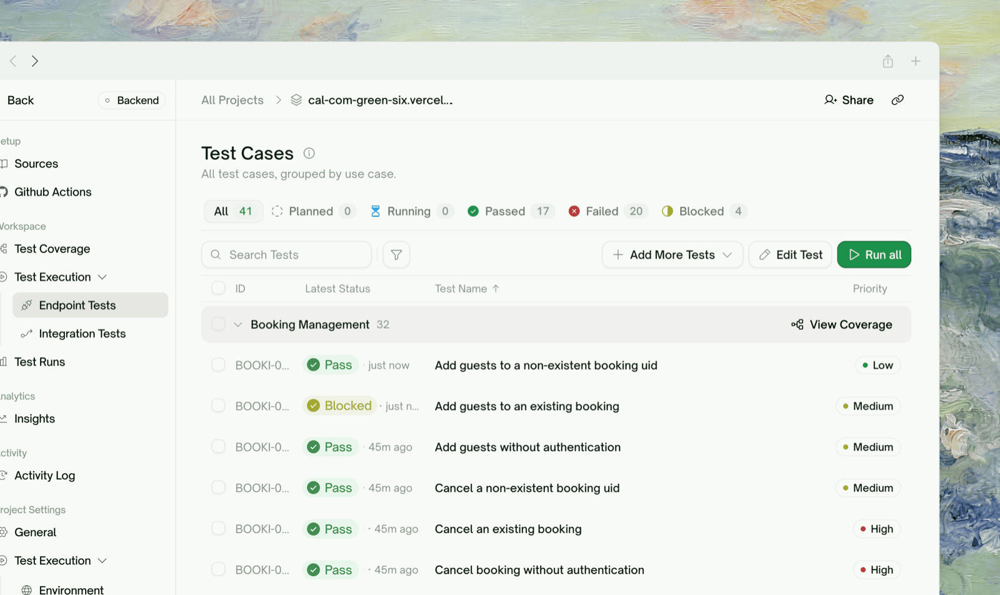
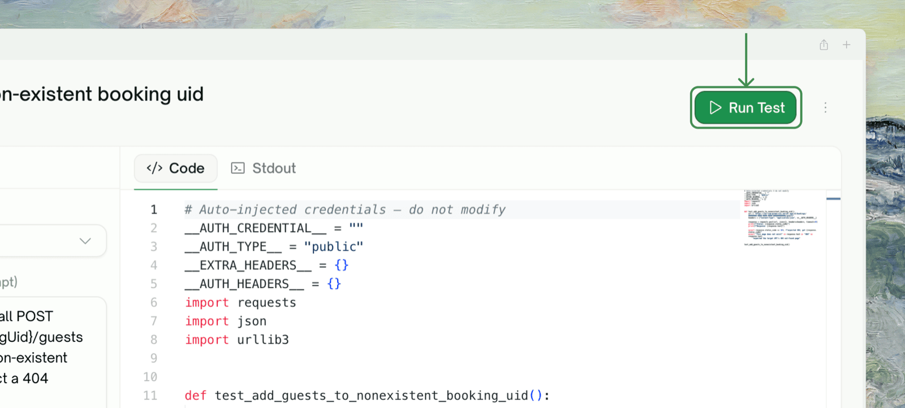
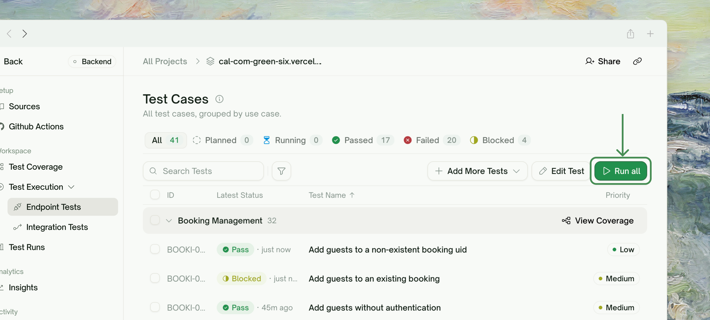

<Frame>
  
</Frame>

## Three Rerun Surfaces

API testing supports three rerun paths:

| Surface | What it does | When to use |
| :--- | :--- | :--- |
| <kbd>Single test rerun</kbd> | Re-execute one test | Confirm a fix on a specific failing test |
| <kbd>Run all</kbd> (batch) | Re-execute every test in the project | After API change, dep upgrade, or environment update |
| <kbd>Scheduled rerun</kbd> | Auto-run on cadence | Continuous monitoring of API health |

<Info>
**Auto-Heal does not apply to API testing.** Auto-Heal is exclusive to UI tests because UIs drift in ways HTTP APIs don't. The corresponding feature for backend testing is [Auto-Auth](/web-portal/core/api/auto-auth), which keeps tokens fresh across long-running schedules.
</Info>

## Single Test Rerun

From a test's detail page, click **Run test**.
<Frame>
  
</Frame>
Most API tests in TestSprite have **upstream dependencies** — variables they consume from earlier tests in a chain. A normal rerun re-runs the producers first, getting fresh captures, then runs the consumer.

## Rerun All (Batch)

From the project test list, the **Run all** button at the top right re-executes every test in the project.
<Frame>
  
</Frame>

## Scheduled Reruns

Schedules run on a cadence (hourly, daily, weekly, monthly). For API projects, scheduled reruns:
<Frame>
  
</Frame>
- Rebuild every chain
- Use [Auto-Auth](/web-portal/core/api/auto-auth) when configured (token-refresh during the run)
- Trigger Auto Cleanup after the run (so each scheduled run leaves a clean environment)

Schedule creation is on a separate page. See [Test Schedules](/web-portal/maintenance/monitoring) for the configuration flow.

## What Happens to Cleanup on Rerun

Every Rerun (single, batch, or scheduled) triggers [Auto Cleanup](/web-portal/core/api/auto-cleanup) at the end. The DELETE chains rebuild from the captured records of *the rerun*, not the previous run.

## Cascading: Rerun a Producer = Rerun Its Consumers

If you rerun a producer test (one that captures variables consumed downstream), the rerun automatically cascades to consumers. They're re-executed with the producer's fresh captured values.

This means:

- Reruning POST /users (a producer) → automatically reruns POST /orders, GET /orders/{id}, DELETE /orders/{id}
- Rerunning DELETE /orders/{id} (a leaf consumer) → only that test reruns; its upstream stays as-is

See [Dependency Chains](/web-portal/core/api/dependency-chains) for how producer/consumer relationships are identified.

## Rerun Outcomes

After a rerun, the test row updates with the new outcome. The previous run's data is preserved for [Comparing Runs](/web-portal/maintenance/comparing-runs) — you can diff "before rerun" against "after rerun" to see exactly what changed.

| Outcome on rerun | What it means | What you do |
| :--- | :--- | :--- |
| Was Failed → now Passed | Your fix worked, or the flake resolved | Move on |
| Was Passed → now Failed | Regression; either your fix broke something else, or the API changed | Investigate via test detail page |
| Still Failed (same error) | Fix didn't take | Refine more |
| Still Failed (different error) | You fixed one bug and uncovered another | Tackle the new error |

## Edge Cases & Troubleshooting

<AccordionGroup>
  <Accordion title="Rerun cascade goes deep — too many tests rerun">
    The producer you reran has many downstream consumers across multiple chains. If you only want to re-execute one specific consumer, click into that test directly and rerun it.
  </Accordion>
  <Accordion title="A test takes very long to rerun">
    The test depends on producers that themselves depend on upstream tests. A deep chain means reruns of leaf tests can take several minutes.
  </Accordion>
  <Accordion title="Rerun shows a different result than the same code did the first time">
    Three causes:
    - Real flake in the API (intermittent issue at your end)
    - Captured state changed (a record was modified between runs)
    - Auth token expired between runs ([use Auto-Auth](/web-portal/core/api/auto-auth))
  </Accordion>
  <Accordion title="The rerun button is disabled">
    Likely the test is still Queued or Running. Wait for the row to settle into Passed / Failed before rerunning.
  </Accordion>
</AccordionGroup>

## Where to Go Next

<Columns cols={2}>
  <Card title="Dependency Chains" href="/web-portal/core/api/dependency-chains" icon="diagram-project">
    Understand cascade order
  </Card>
  <Card title="Auto-Auth" href="/web-portal/core/api/auto-auth" icon="arrows-rotate">
    Token refresh keeps reruns alive
  </Card>
  <Card title="Comparing Runs" href="/web-portal/maintenance/comparing-runs" icon="code-compare">
    Diff before/after a rerun
  </Card>
  <Card title="Test Schedules" href="/web-portal/maintenance/monitoring" icon="clock">
    Set up automated reruns on a cadence
  </Card>
</Columns>
