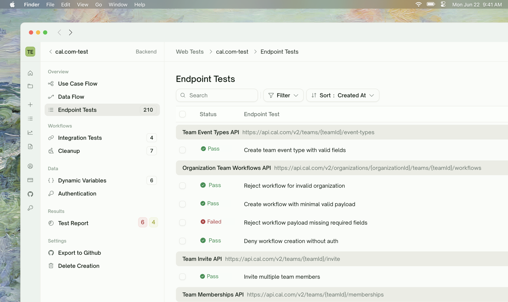
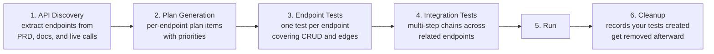
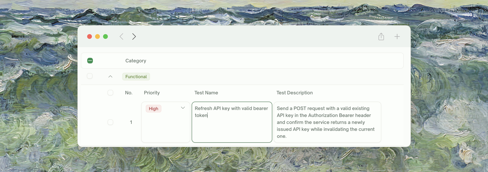

<Frame>
  
</Frame>

API Testing in TestSprite is a journey from "here's my API" to "here's a regression suite I trust". Each phase has its own dedicated docs page; this page is the map.

## Key Features

| Feature | Description |
| :--- | :--- |
| <kbd>Fast Setup</kbd> | Get started with minimal documentation — no extensive prompts or full codebases needed |
| <kbd>Endpoint + Integration Tests</kbd> | Per-endpoint coverage *and* multi-step chains where one test's response feeds the next |
| <kbd>Dynamic Variables</kbd> | Capture values from one response, inject into the next request — TestSprite wires the dependencies for you |
| <kbd>Auto Cleanup</kbd> | After every run, TestSprite deletes the records your tests created so your test workspace stays clean |
| <kbd>Data Flow Visualization</kbd> | A grouped, navigable view of every HTTP call TestSprite made — request, response, timing, dependencies |
| <kbd>Auto-Auth (Pro)</kbd> | Configure your login flow once; we fetch a fresh token before every run |
| <kbd>Smart Reports</kbd> | Detailed outputs with error types, root causes, and recommended fixes |
| <kbd>Natural Language Refinement</kbd> | Adjust any test in natural language — no code required |

## The API Testing Journey

<Card>

</Card>

Each step gets its own page. Click through in order if you're new — or skip ahead to the area that's currently giving you trouble.

<CardGroup cols={2}>
  <Card title="API Discovery" href="/web-portal/core/api/api-discovery" icon="magnifying-glass">
    How TestSprite finds your endpoints from PRD, code, and live probes
  </Card>
  <Card title="Plan Generation & Editing" href="/web-portal/core/api/api-plan-gen" icon="list-check">
    Review the plan, edit cases, add scenarios in natural language
  </Card>
  <Card title="Endpoint Tests" href="/web-portal/core/api/endpoint-tests" icon="cube">
    Per-endpoint test generation with verification before tests land in your suite
  </Card>
  <Card title="Integration Tests" href="/web-portal/core/api/integration-tests" icon="link">
    Multi-step chains where one step's output feeds the next
  </Card>
</CardGroup>

## What Lives Where

The Web Portal sidebar for an API project organizes pages by what you're trying to do, not by chronology. Once a project is set up, you'll mostly bounce between these:

| Sidebar location | What you see | Detail page |
| :--- | :--- | :--- |
| **Overview → Use Case Flow** | A diagram of your features and the endpoints touched by each | (covered as a section in [API Discovery](/web-portal/core/api/api-discovery)) |
| **Overview → Data Flow** | Every HTTP call from the most recent run, grouped by endpoint, with producer/consumer wiring | [Data Flow](/web-portal/core/api/data-flow) |
| **Overview → Endpoint Tests** | The flat list of per-endpoint tests, status chips, last-run results | [Endpoint Tests](/web-portal/core/api/endpoint-tests) |
| **Workflows → Integration Tests** | The list of multi-step chains that exercise sequences of endpoints | [Integration Tests](/web-portal/core/api/integration-tests) |
| **Workflows → Cleanup** | Auto-generated DELETE chains that wipe records the tests created | [Auto Cleanup](/web-portal/core/api/auto-cleanup) |
| **Data → Dynamic Variables** | The producer-consumer graph — what each test produces and what depends on it | [Dynamic Variables](/web-portal/core/api/dynamic-variables) |
| **Data → Authentication** | Auto-Auth config + Static Credentials per API family | [Auto-Auth (Pro)](/web-portal/core/api/auto-auth) |
| **Results → individual test detail pages** | Per-test request/response, error trace, refine + rerun controls | [Test Detail](/web-portal/core/working-with-test/test-detail) |

<Tip>
**The sidebar's order is the recommended order for first-time setup.** Walk top-to-bottom on a new project: see the use-case overview, look at the endpoint tests TestSprite generated, peek at the integration chains it identified, check what values flow between tests under Dynamic Variables, configure auth, then run.
</Tip>

## Quick Start

<Card title="Quickstart" href="/web-portal/core/api/quickstart" icon="play">
  Walk through your first API project end-to-end — from project creation to a passing HTTP suite — in about 10 minutes.
</Card>

## What a Plan Covers

Generated plans group test cases by category — TestSprite picks categories that make sense for your API based on what was discovered. Common ones you'll see:

- **Functional / happy path** — does each endpoint behave correctly with valid inputs?
- **Schema and response validation** — does the response shape match what's expected?
- **Authorization & authentication** — are protected routes actually protected? token handling correct?
- **Error handling & edge cases** — malformed inputs, missing fields, boundary values, type mismatches
- **Boundary / load** — what happens at high request rates or with oversized payloads
- **Security probes** — privilege escalation, signature tampering, common API attack patterns

Not every category applies to every API. Categories shown on your plan reflect what TestSprite considered relevant given your endpoints, docs, and PRD.

<Tip>
**Best practice on first run**: keep all categories selected. Once you have a baseline, you can prune categories that don't apply (e.g., drop security probes for a strictly-internal service).
</Tip>

## Refining Tests in Natural Language

Every test row has a chat affordance. You can say things like:
    <Frame>
    
    </Frame>

<CodeGroup>
```text Refine
Test POST /orders with invalid parameters and expect a 400 error code.
```

```text Add
Add a test for the rate-limit edge — burst 100 calls in 1 second, expect at least one 429.
```

```text Edit
For the GET /users/{id} test, drop the assertion on `created_at` — it's a timestamp and flaps.
```
</CodeGroup>

TestSprite interprets the request, regenerates the affected test code, and re-runs. See [Refining Tests](/web-portal/core/working-with-test/refining-tests) for what the chat can and can't do, and the alternatives when chat isn't the right tool.

## Frontend's Sibling Page

If you're testing a website (UI / browser flows) rather than an HTTP API, the frontend equivalent of this page is [UI Testing — Overview](/web-portal/core/ui/ui-testing). Most of the wizard, refinement, and rerun concepts are mirrored — what changes is the underlying execution model (HTTP calls vs. browser actions).

## Where to Go Next

<Columns cols={2}>
  <Card title="API Discovery" href="/web-portal/core/api/api-discovery" icon="magnifying-glass">
    Walk through the wizard's first phase — endpoint extraction
  </Card>
  <Card title="Auto-Auth (Pro)" href="/web-portal/core/api/auto-auth" icon="arrows-rotate">
    Stop pasting expiring tokens before every run
  </Card>
  <Card title="Data Flow" href="/web-portal/core/api/data-flow" icon="diagram-project">
    Visualize every HTTP call from the most recent run
  </Card>
  <Card title="Subscription Plans" href="/web-portal/admin/billing-and-plans" icon="credit-card">
    Free includes API testing — paid unlocks Auto-Auth and more
  </Card>
</Columns>
