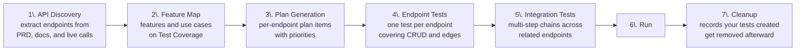
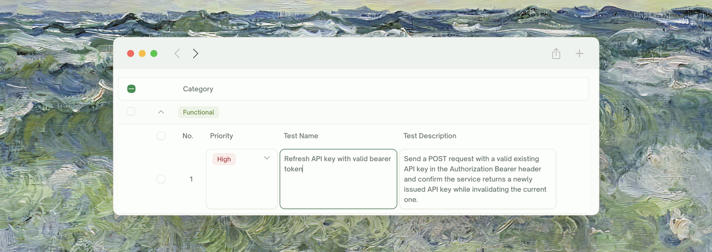

<Frame>
  
</Frame>

API Testing takes you from "here's my API" to "here's a regression suite I trust". This page is the map; each phase has its own page.

## Key Features

| Feature | Description |
| :--- | :--- |
| <kbd>Endpoint + Integration Tests</kbd> | Per-endpoint coverage *and* multi-step chains where one test's response feeds the next |
| <kbd>Dynamic Variables</kbd> | Values captured from one response and injected into the next request |
| <kbd>Auto Cleanup</kbd> | After every run, TestSprite deletes the records your tests created |
| <kbd>Auto-Auth</kbd> | Configure your login flow once; TestSprite fetches a fresh token before every run |
| <kbd>Smart Reports</kbd> | Error types, root causes, and recommended fixes for every failure |
| <kbd>Natural Language Refinement</kbd> | Adjust any test in natural language, no code required |

## The API Testing Journey

<Card>

```mermaid
flowchart LR
    A["1\. API Discovery<br/>extract endpoints from<br/>PRD, docs, and live calls"]
    M["2\. Feature Map<br/>features and use cases<br/>on Test Coverage"]
    B["3\. Plan Generation<br/>per-endpoint plan items<br/>with priorities"]
    C["4\. Endpoint Tests<br/>one test per endpoint<br/>covering CRUD and edges"]
    D["5\. Integration Tests<br/>multi-step chains across<br/>related endpoints"]
    E["6\. Run"]
    F["7\. Cleanup<br/>records your tests created<br/>get removed afterward"]

    A --> M --> B --> C --> D --> E --> F
```
</Card>

<CardGroup cols={2}>
  <Card title="API Discovery" href="/web-portal/core/api/api-discovery" icon="magnifying-glass">
    How TestSprite finds your endpoints
  </Card>
  <Card title="Plan Generation & Editing" href="/web-portal/core/api/api-plan-gen" icon="list-check">
    Review the plan, edit cases, add your own
  </Card>
  <Card title="Endpoint Tests" href="/web-portal/core/api/endpoint-tests" icon="cube">
    One runnable test per plan row
  </Card>
  <Card title="Integration Tests" href="/web-portal/core/api/integration-tests" icon="link">
    Multi-step chains where one step's output feeds the next
  </Card>
</CardGroup>

New to API testing? Start with the [Quickstart](/web-portal/core/api/quickstart), about 10 minutes from project creation to a passing suite.

## What a Plan Covers

Plans group test cases into categories that fit your API: functional / happy path, schema validation, authorization, error handling and edge cases, boundary / load, and security probes. Not every category applies to every API. See [Plan Generation & Editing](/web-portal/core/api/api-plan-gen#the-plan-structure) for what each covers.

<Tip>
On a first run, keep every category selected. Once you have a baseline, prune the ones that don't apply (for example, security probes for a strictly internal service).
</Tip>

## Refining Tests in Natural Language

Edit a test's description and click **Regenerate**, or ask in **Chats**. For example:

<Frame>
  
</Frame>

<CodeGroup>
```text Refine
Test POST /orders with invalid parameters and expect a 400 error code.
```

```text Add
Add a test for the rate-limit edge — burst 100 calls in 1 second, expect at least one 429.
```

```text Edit
For the GET /users/{id} test, drop the assertion on `created_at` — it's a timestamp and flaps.
```
</CodeGroup>

TestSprite regenerates the affected test code and re-runs it. See [Managing Test Cases](/web-portal/core/working-with-test/managing-test-cases) for every refinement path.

Testing a website instead? See [UI Testing](/web-portal/core/ui/ui-testing). The wizard, refinement, and rerun concepts mirror this page; the tests run browser actions instead of HTTP calls.

## Where to Go Next

<Columns cols={2}>
  <Card title="API Discovery" href="/web-portal/core/api/api-discovery" icon="magnifying-glass">
    The first phase: endpoint extraction
  </Card>
  <Card title="Auto-Auth" href="/web-portal/core/api/auto-auth" icon="arrows-rotate">
    Stop pasting expiring tokens before every run
  </Card>
  <Card title="Data Flow" href="/web-portal/core/api/dynamic-variables#the-data-flow-section-on-a-test" icon="diagram-project">
    See the values each test captures and consumes
  </Card>
</Columns>
