<Frame>
  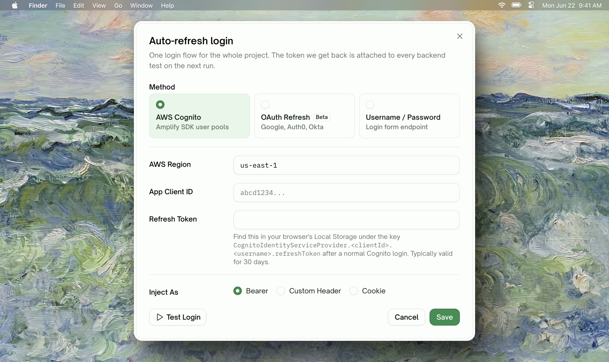
</Frame>

## What Auto-Auth Does

Backend APIs almost always sit behind some form of token-based auth — an OAuth `Bearer`, an AWS Cognito access token, a custom session cookie. Tokens expire. When they do, every test in the run fails until someone pastes a fresh value into the credentials form.

**Auto-Auth removes the manual rotation.** You configure your project's login flow once. Before every test run TestSprite obtains a fresh token and uses it across every backend test in the run.

<Info>
**One config per project, not per API.** A single configured login flow covers every backend test in the project. There is no per-endpoint auth configuration to manage.
</Info>

## When to Use This

- Your API uses **bearer tokens, session cookies, or OAuth refresh flows** that expire on a schedule (most modern APIs)
- You're tired of pasting credentials before every scheduled run, or your nightly schedule keeps breaking on Monday morning because Friday's token expired
- You want **scheduled reruns** to run cleanly without human attendance

If your API has no auth, or auth is a static long-lived API key (think Stripe `sk_live_…`), you don't need Auto-Auth — Static Credentials cover that case fine. See [Static Credentials](#if-you-cant-use-auto-auth-static-credentials) at the bottom.

## Prerequisites

- A **Starter** or **Standard** subscription (Auto-Auth is a Pro feature). Free-plan projects see a paywall card with an Upgrade CTA where the configuration would normally appear.
- A backend project with at least one API under test
- Login credentials your API accepts (username/password, OAuth client credentials + refresh token, or AWS Cognito refresh token)

<Card title="Subscription Plans" href="/web-portal/admin/billing-and-plans" icon="credit-card">
  Plan tiers, what each unlocks, and how to upgrade
</Card>

## Quick Start

<Steps>
  <Step title="Open the Authentication tab">
    From your project's left sidebar, click **Authentication**. The Auto-refresh login card sits at the top of the page.
  <Frame>
    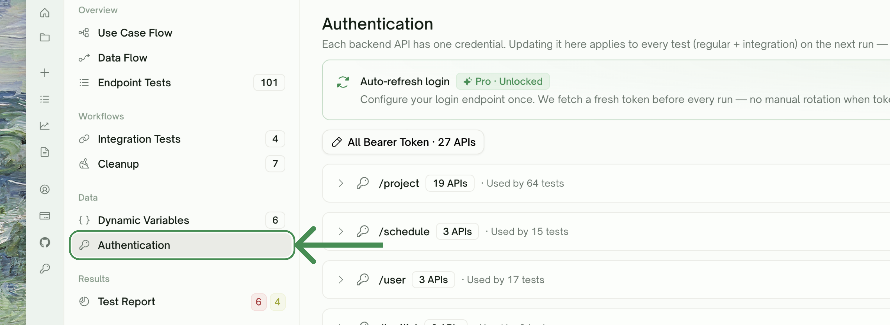
  </Frame>
  </Step>
  <Step title="Click Configure">
    Opens the configuration modal. Pick your login method — AWS Cognito, OAuth Refresh, or Username / Password.
    <Frame>
    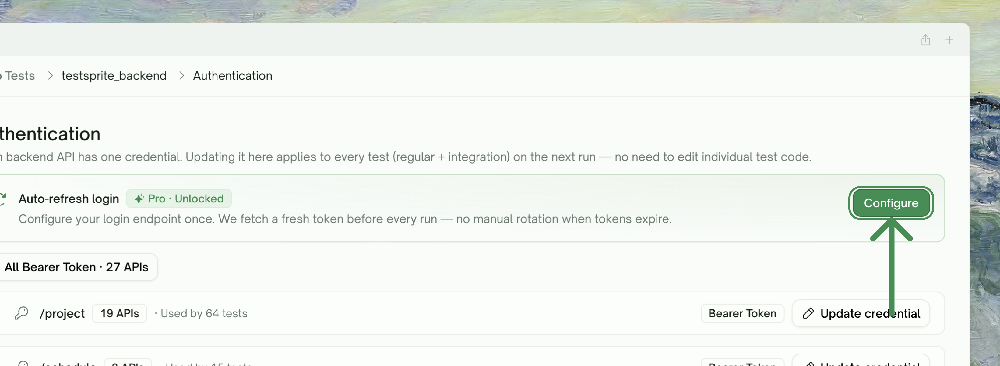
  </Frame>
  </Step>
  <Step title="Fill in the fields and Test Login">
    The form changes based on the method you chose. Click **Test Login** to verify your config works *before* you save — the result panel below the buttons shows the masked token (or a structured error) so you can fix the config without going through a full test run.
      <Frame>
    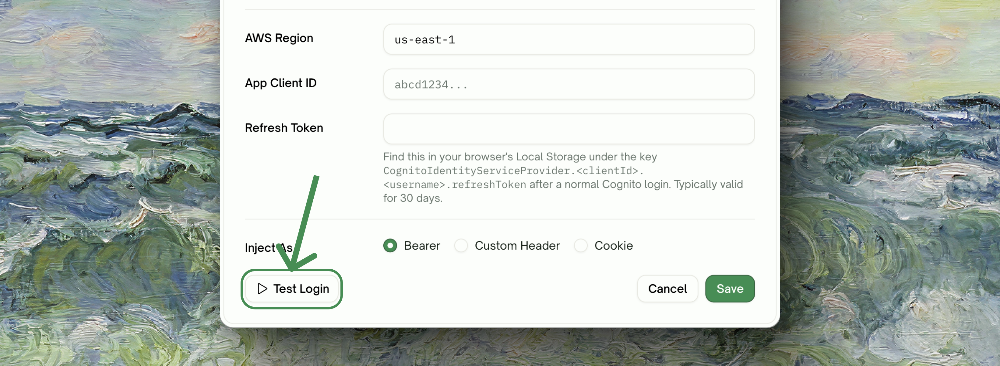
  </Frame>
  </Step>
  <Step title="Save">
    Saving runs one final verification. If it succeeds, the card flips its toggle on and shows a green **Verified · Xm ago** badge — your next test run will use a fresh token. If verification fails, the config persists with the toggle off plus a clear error so you can fix and retry.
    <Frame>
    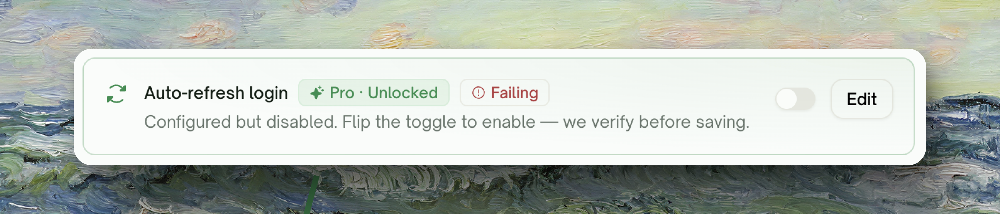
  </Frame>
  </Step>
</Steps>

---

## Choosing a Method

The configuration modal offers three methods. Pick the one that matches your API.
    <Frame>
    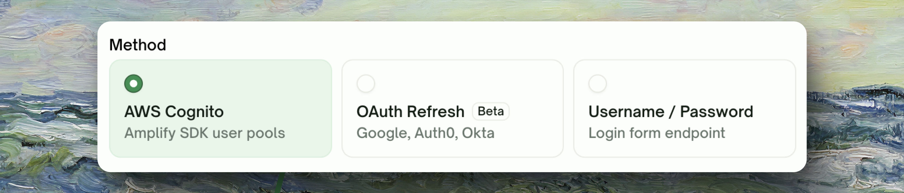
  </Frame>
| Method | When to use | What you provide |
| :--- | :--- | :--- |
| **AWS Cognito** | Your app uses AWS Cognito user pools (Amplify SDK, common for AWS-hosted apps) | Region, App client ID, Refresh token |
| **OAuth Refresh** *(Beta)* | Standard OAuth 2.0 refresh-token grant — Google, Auth0, Okta, custom OAuth servers | Token endpoint, Client ID, Client secret, Refresh token, optional scope, path to access token |
| **Username / Password** | Your API has a `/login` (or similar) endpoint that takes a username + password and returns a token | Login URL, HTTP method, Content-Type, request body template, username, password, path to access token |

<Tip>
**Not sure which to pick?** AWS Cognito and OAuth Refresh are the recommended starting points if your provider supports them. Username/Password is the simplest mental model but requires your API to expose a password-grant style endpoint, which is less common in modern apps.
</Tip>

---

## AWS Cognito

<Frame>
  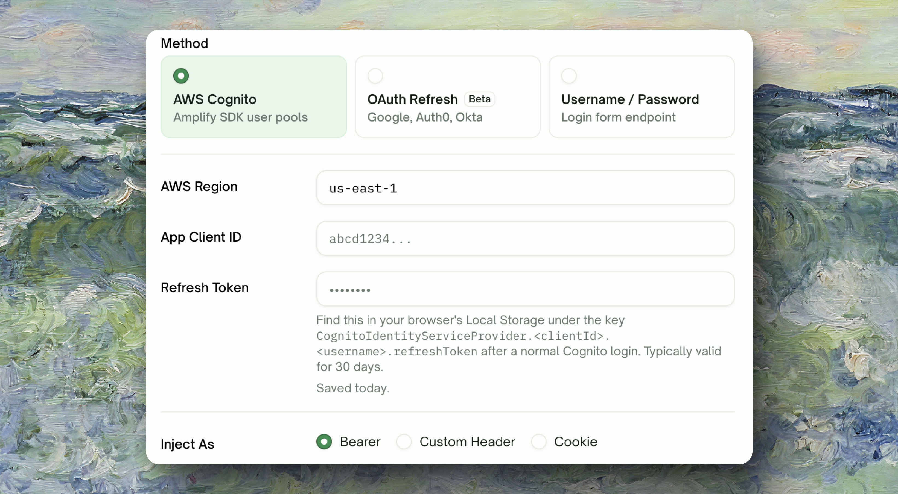
</Frame>

### What it does

TestSprite uses your stored Cognito refresh token to obtain a fresh access token before each test run. The access token is then attached to your test requests.

### Fields

| Field | Description |
| :--- | :--- |
| <kbd>AWS Region</kbd> | The AWS region your Cognito user pool lives in. Defaults to `us-east-1`. |
| <kbd>App Client ID</kbd> | The Cognito App client ID (under your User Pool → App integration → App clients). |
| <kbd>Refresh Token</kbd> | A long-lived refresh token issued by Cognito for a real user. See "How to obtain a refresh token" below. |

### How to obtain a refresh token

A refresh token is issued when a user successfully signs in. The simplest way to capture one for testing:

<Steps>
  <Step title="Open your app's sign-in page in a browser">
    Sign in as the test user account you want TestSprite to use.
  </Step>
  <Step title="Open DevTools → Application → Local Storage / Cookies">
    Cognito Amplify stores the tokens under keys like `CognitoIdentityServiceProvider.<clientId>.<username>.refreshToken`. The value is the refresh token string.
  </Step>
  <Step title="Copy the refresh token into the Auto-Auth form">
    Paste it into the Refresh Token field and Test Login.
  </Step>
</Steps>

<Note>
**Token capture varies by app.** Some apps store tokens in cookies or in-memory only. If you're not sure, ask your auth team for a fresh refresh token issued for a test account — the format is a long opaque string.
</Note>

### 30-day expiry warning

AWS Cognito refresh tokens are capped at **30 days from issue** by default (this can be configured per app client in AWS, but 30 is the AWS default). When your stored refresh token gets close to expiry, the Authentication tab surfaces a yellow warning badge:

| When you see it | What it means |
| :--- | :--- |
| **Refresh token expires in 7d** (and counting down) | You have ≤ 7 days before the token will stop working. Capture a fresh one and update the field. |
| **Refresh token expired** | The token is past 30 days. Auto-Auth runs will fail until you update it. |

<Warning>
**OAuth refresh tokens generally don't hard-cap.** The 30-day warning fires only for AWS Cognito. Google / Auth0 / Okta refresh tokens typically last until revoked, so we skip the warning to avoid false alarms.
</Warning>

---

## OAuth Refresh (Beta)

<Frame>
  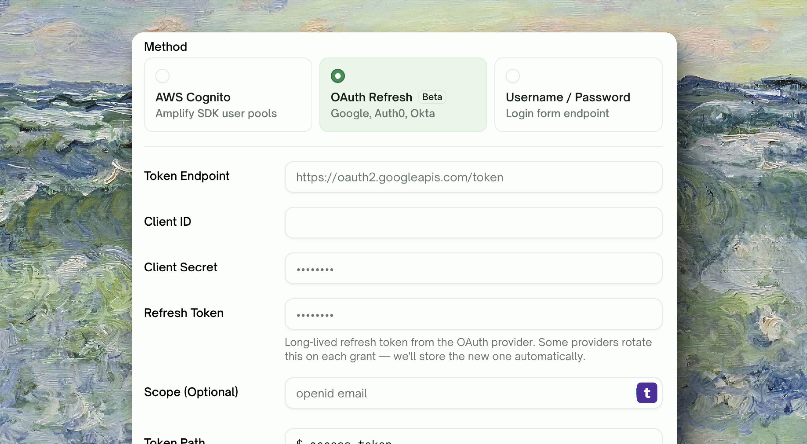
</Frame>

### What it does

TestSprite uses your OAuth provider's standard refresh-token grant to obtain a fresh access token before each test run, and reads the access token out of your provider's response.

### Fields

| Field | Description |
| :--- | :--- |
| <kbd>Token Endpoint</kbd> | The provider's token URL — e.g. `https://oauth2.googleapis.com/token`, `https://your-tenant.auth0.com/oauth/token`. |
| <kbd>Client ID</kbd> | Your OAuth app's client ID. |
| <kbd>Client Secret</kbd> | Your OAuth app's client secret. Stored encrypted; never echoed back to the browser. |
| <kbd>Refresh Token</kbd> | A refresh token issued for the test user. Stored encrypted; never echoed back to the browser. |
| <kbd>Scope (Optional)</kbd> | Space-delimited scopes to request, if your provider needs them — e.g. `openid email`. Usually omit unless Test Login fails with a scope-related error. |
| <kbd>Token Path</kbd> | Path to the access token in the response body. Default `$.access_token` works for almost all providers. Override only if your provider returns a non-standard shape. |

### Where to get a refresh token

Each provider's flow is different. The most common path:

1. Register a new "OAuth app" in your provider's console (Google Cloud Console, Auth0 Dashboard, Okta Admin)
2. Set the redirect URI to something local like `http://localhost:1234/callback`
3. Use the provider's playground or a small script to walk through the authorization-code flow once and capture the refresh token

<Tip>
**Auth0 hint**: in the Auth0 Dashboard, create a Machine-to-Machine app authorized for your test API. The M2M app's `client_credentials` grant returns short-lived access tokens directly — Auto-Auth's `OAuth Refresh` method also handles this since the token endpoint, client ID, and client secret are the same fields. Set scope to whatever your API requires.
</Tip>

---

## Username / Password

<Frame>
  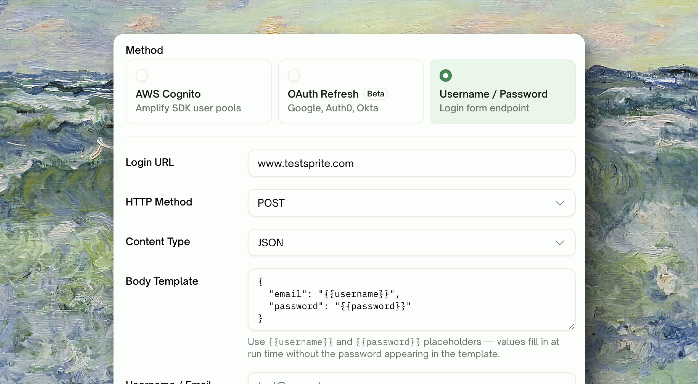
</Frame>

### What it does

TestSprite calls the login endpoint you specify with your username and password, and reads the token out of the JSON response using the path you provide.

### Fields

| Field | Description |
| :--- | :--- |
| <kbd>Login URL</kbd> | The full URL of your login endpoint — e.g. `https://api.example.com/auth/login`. |
| <kbd>HTTP Method</kbd> | `POST` (default) or `PUT`. |
| <kbd>Content Type</kbd> | `JSON` (default, sends `application/json`) or `Form-urlencoded` (`application/x-www-form-urlencoded`). |
| <kbd>Body Template</kbd> | The request body, with `{{username}}` and `{{password}}` placeholders. The default is `{"email":"{{username}}","password":"{{password}}"}`. Edit if your API expects different field names — for example `{"identifier":"{{username}}","secret":"{{password}}"}`. |
| <kbd>Username / Email</kbd> | The username/email of your test user. |
| <kbd>Password</kbd> | The password of your test user. Stored encrypted; never echoed back to the browser. |
| <kbd>Token Path</kbd> | Path to the token in the response — `$.access_token`, `$.token`, `$.data.jwt`, etc. Default `$.access_token`. |

### Body template tips

`{{username}}` and `{{password}}` are placeholders that get filled in with your stored credentials. You can shape the body however your API needs:

<CodeGroup>
```json Standard JSON
{ "email": "{{username}}", "password": "{{password}}" }
```

```json Different field names
{ "identifier": "{{username}}", "secret": "{{password}}" }
```

```json Extra fields expandable
{
  "username": "{{username}}",
  "password": "{{password}}",
  "tenant": "test-org",
  "scope": "api"
}
```

```text Form-urlencoded
username={{username}}&password={{password}}&grant_type=password
```
</CodeGroup>

<Warning>
**Form-encoded requires Content Type to match**: switch the **Content Type** picker to `Form-urlencoded` if your body uses `key=value` form. The default JSON content type with a form-encoded body fails on most servers with a 400.
</Warning>

---

## Token Injection

Once TestSprite has the token, it has to attach it to your test requests in the right way. The **Inject As** field at the bottom of the modal controls this.

<Frame>
  
</Frame>

| Inject As | Where the token goes | When to use |
| :--- | :--- | :--- |
| <kbd>Bearer</kbd> *(default)* | `Authorization: Bearer <token>` header | Standard for OAuth, Cognito, JWT-based APIs (>90% of cases) |
| <kbd>Custom Header</kbd> | `<Header-Name>: <token>` | Your API expects a custom header — e.g. `X-Auth-Token`, `X-API-Key` |
| <kbd>Cookie</kbd> | `Cookie: <name>=<token>` | Session-cookie based APIs that don't read tokens from `Authorization` |

When you pick **Custom Header** or **Cookie**, a second field appears asking for the header name (e.g. `X-Auth-Token`) or cookie name (e.g. `session`).

<Tip>
**If unsure, start with Bearer.** Switch to Custom Header / Cookie only if Test Login succeeds (token retrieval works) but actual test runs fail with 401s — that's the signal your token is being delivered to the wrong place.
</Tip>

---

## Test Login: Verify Before You Rely

The **Test Login** button at the bottom of the modal runs a single end-to-end refresh against your config and shows you exactly what came back.

<Frame>
  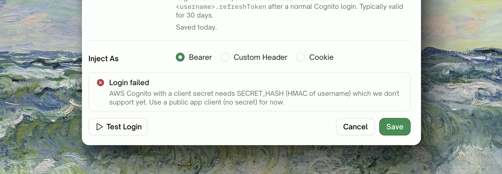
</Frame>

The result panel reports one of:

| State | What it means | What to do |
| :--- | :--- | :--- |
| <kbd>Success</kbd> + masked token | Your config retrieved a valid-looking token from the provider | Click **Save** — the same call will run before every test run from now on |
| <kbd>Failure: auth</kbd> | The provider rejected your credentials (401/403) | Wrong refresh token, wrong client secret, expired credential. Update the field and retry |
| <kbd>Failure: parse</kbd> | Got a 200 from the provider but the token path didn't find a token in the response | Check the **Token path** field — defaults work for most providers, but if yours returns `{"data":{"jwt":"…"}}` you'd need `$.data.jwt` |
| <kbd>Failure: network</kbd> | Couldn't reach the provider URL | Wrong endpoint URL, DNS issue, or your endpoint is behind a network not reachable from TestSprite's egress |

<Info>
**Test Login uses the in-progress values from the form**, not whatever was previously saved. The card outside still shows the previously-saved state until you click **Save**.
</Info>

---

## Health States on the Authentication Tab

Once configured, the Auto-refresh card shows one of five states. Knowing what each means saves debugging time. The card always shows a green **Pro · Unlocked** badge on Pro plans; the state badge sits next to it.

<AccordionGroup>
  <Accordion title="Verified · Xm ago" icon="circle-check">
    Auto-Auth is on and the most recent refresh — either Test Login or a real test run — succeeded. **Healthy state.** A fresh token will be fetched before your next test run.
  </Accordion>
  <Accordion title="Pending verification" icon="rotate">
    Auto-Auth is on but no successful refresh has happened yet (you turned it on without running Test Login). The first refresh will fire before your next test run. **Suggest running Test Login** so you find out it works without losing a real run.
  </Accordion>
  <Accordion title="Failing" icon="circle-exclamation" defaultOpen={false}>
    Auto-Auth is on but the most recent refresh attempt errored. **Tests in this project will be blocked until you fix it** — better to fail fast than to silently run with an expired token. Click **Edit** to see the last error, fix the field that's wrong (often an expired refresh token), Test Login, then Save.
  </Accordion>
  <Accordion title="Configured but disabled">
    A working config is saved but the toggle is off. Tests will run *without* the auto-refreshed token (they'll fall back to whatever Static Credentials you have). Flip the toggle to re-enable — we run a verification check before flipping the switch on.
  </Accordion>
  <Accordion title="Not configured">
    No config saved yet. Click **Configure** to start.
  </Accordion>
</AccordionGroup>

---

## Day-2 Operations

### Edit a saved config

Click **Edit** on the card. The modal opens with all non-secret fields pre-populated. Secret fields (password, client secret, refresh token) show `••••••••` as a placeholder and are **preserved if you leave them blank**. Type a new value to overwrite.

<Frame>
  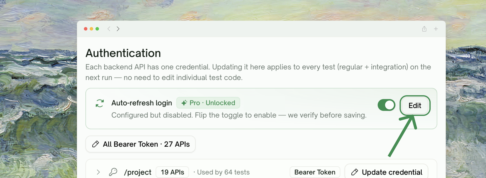
</Frame>

<Info>
**Secrets are never echoed back to the browser.** Leaving the field blank is the "keep what's stored" gesture.
</Info>

### Temporarily disable

Flip the toggle on the card off. The config stays saved; new test runs skip Auto-Auth and fall back to your Static Credentials (if any). Flip back on — TestSprite verifies the config still works before re-enabling.

<Frame>
  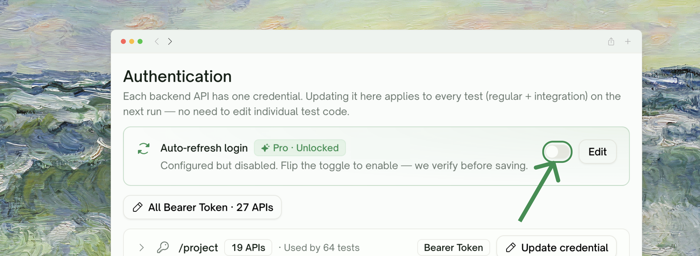
</Frame>
### Delete a config

Use **Edit** → clear all fields → **Save**. Or contact support if you want a hard delete.

---

## Security

- **Encrypted at rest**: secrets (password, client secret, refresh token) are stored encrypted.
- **Never echoed back to the browser**: saved secrets render as `••••••••` placeholders in the form. Leaving the field blank keeps the stored value.
- **Server-side only**: Test Login and the actual token refresh both run on the server. Your secrets never traverse the browser-to-API path.
- **No credential logging**: full request bodies are not logged.

---

## If You Can't Use Auto-Auth: Static Credentials

If Auto-Auth's three methods don't fit your API — for example, you have a long-lived API key that never expires, or your auth flow requires a hardware token, or you're on the Free plan and don't want to upgrade — you can still run backend tests by **pasting credentials manually**.


<Frame>
  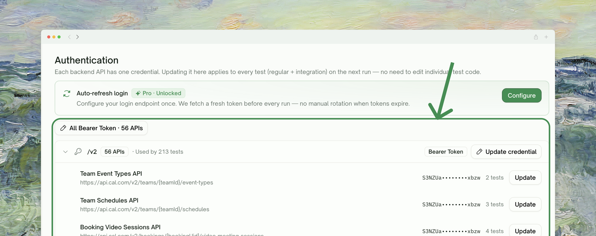
</Frame>
The **Authentication** tab on your project shows, in addition to the Auto-Auth card, a per-API-family credentials section where you can:

- Paste a token, API key, or session string per API family (Users, Orders, Payments, etc.)
- Apply the same value to multiple APIs sharing an auth type via the **All `<auth-type>` · N APIs** bulk-update buttons (e.g. "All Bearer · 3 APIs")
- Rotate (overwrite) without removing the test cases that use them

<Frame>
  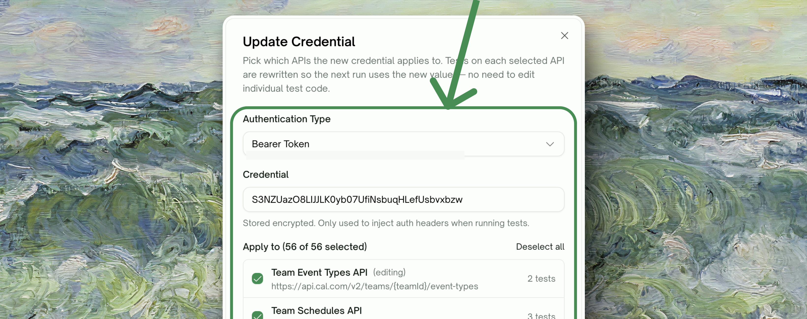
</Frame>

The catch: **you have to paste a fresh value when the token expires**. For test schedules that run nightly with short-lived tokens, this becomes a daily chore — which is exactly the pain Auto-Auth removes.

<Card title="Comparing Static Credentials vs Auto-Auth" icon="scale-balanced">

| | Static Credentials | Auto-Auth |
| :--- | :--- | :--- |
| Plan | Free + paid | Paid only |
| Setup effort | Paste & save | Configure once + Test Login |
| Token expiry | You re-paste manually | Refreshed automatically |
| Works for scheduled runs | Only until token expires | Yes — every run gets a fresh token |
| Multi-API setup | Per-family credentials | One config covers the whole project |

</Card>

---

## Troubleshooting

<AccordionGroup>
  <Accordion title="Test Login says 'auth' failure but my credentials are correct">
    Three usual culprits, in order of likelihood:
    1. **Refresh token has expired or been revoked.** AWS Cognito caps at 30 days; OAuth providers revoke on password change, app uninstall, or admin action. Capture a fresh refresh token and update the field.
    2. **Client ID / client secret mismatch.** Double-check you copied them from the right OAuth app — different environments (dev/prod) have different client IDs.
    3. **Account is disabled or locked.** Try signing in to your app with the test user's credentials in a browser; if the manual sign-in fails, fix that first.
  </Accordion>
  <Accordion title="Test Login says 'parse' failure">
    The provider returned a 200 but the **Token path** didn't find a token in the response.
    - Default `$.access_token` works for AWS Cognito, Auth0, Okta, Google, most standards-compliant providers
    - If your response shape is `{"data":{"jwt":"…"}}`, set token path to `$.data.jwt`
    - If your response shape is `{"token":"…"}`, set token path to `$.token`
    - Use the failing response body in the error toast as your reference
  </Accordion>
  <Accordion title="Test Login succeeds but real test runs return 401">
    Token retrieval works but the token isn't being delivered to your API in the way it expects.
    - Check the **Inject As** picker: try **Bearer** first; if that fails, try **Custom Header** with the header name your API documentation specifies (e.g. `X-Auth-Token`); if that fails, try **Cookie**
    - For Cookie injection, the cookie name field expects just the name (e.g. `session`), not `Cookie: session=…`
  </Accordion>
  <Accordion title="The Pro · Unlocked badge is gone after I enabled the toggle, and the card now says 'Failing'">
    Save-time verification flipped your toggle back to off because the verification refresh failed. Open **Edit**, read the error surfaced below the dialog title, fix the underlying issue, Test Login to confirm, then Save again.
  </Accordion>
  <Accordion title="My API uses a custom token header AND requires a custom Content-Type">
    Auto-Auth handles those independently — the **Inject As** field controls how the *fetched* token is attached to your test requests, while the login endpoint's Content-Type is the **Content Type** field in the Username/Password method (or implicit for OAuth/Cognito). They don't conflict.
  </Accordion>
  <Accordion title="What if my CI/CD rotates the test user's password regularly?">
    For Username/Password method: the password rotation breaks Auto-Auth until you update the password field. For OAuth/Cognito: refresh tokens generally survive password rotation (until explicitly revoked) — switching to OAuth Refresh or Cognito eliminates this churn.
  </Accordion>
</AccordionGroup>

---

## Where to Go Next

<Columns cols={2}>
  <Card title="API Discovery" href="/web-portal/core/api/api-testing" icon="magnifying-glass">
    How TestSprite finds your endpoints from PRD + code
  </Card>
  <Card title="Integration Tests" href="/web-portal/core/api/api-testing#integration-tests" icon="link">
    Multi-step chained tests with dynamic variables
  </Card>
  <Card title="Rerun (with/without Dependencies)" href="/web-portal/core/api/api-testing#rerun" icon="arrow-rotate-right">
    Re-run a chain or just the failed step
  </Card>
  <Card title="Subscription Plans" href="/web-portal/admin/billing-and-plans" icon="credit-card">
    See what each tier unlocks
  </Card>
</Columns>
