<Frame>
  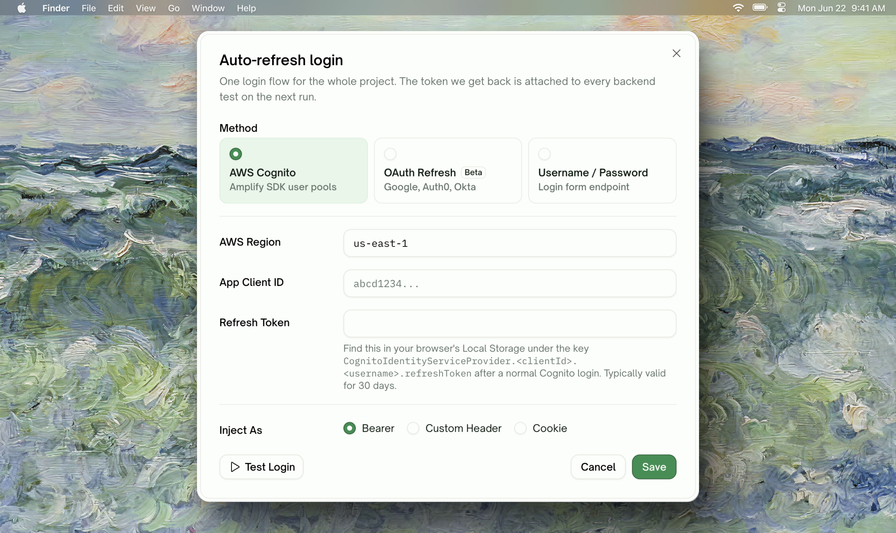
</Frame>

## What Auto-Auth Does

Backend APIs usually sit behind tokens that expire: an OAuth `Bearer`, an AWS Cognito access token, a session cookie. When one expires, every test in the run fails until someone pastes a fresh value.

With Auto-Auth you configure the environment's login flow once, and TestSprite obtains a fresh token before every test run. **One config per environment**: it covers every backend test that runs against that environment, with no per-endpoint auth to manage.

## When to Use This

- Your API uses **bearer tokens, session cookies, or OAuth refresh flows** that expire (most modern APIs)
- You want **scheduled runs** to keep working unattended, instead of breaking when last week's token expires

If your API has no auth, or uses a long-lived static key (think Stripe `sk_live_…`), you don't need Auto-Auth. Use [Static Credentials](#if-you-cant-use-auto-auth-static-credentials) instead.

## Prerequisites

- A plan that includes Auto-Auth. On plans without it, you see a paywall card with an Upgrade CTA where the configuration would normally appear.
- A backend project with at least one API under test
- Login credentials your API accepts: username/password, OAuth client credentials + refresh token, or an AWS Cognito refresh token

## Quick Start

<Steps>
  <Step title="Open your environment">
    Go to **Project Settings → Test Execution → Environment** and click the environment your tests run against. The Auto-refresh login card is in the **Edit Environment** dialog.
  <Frame>
    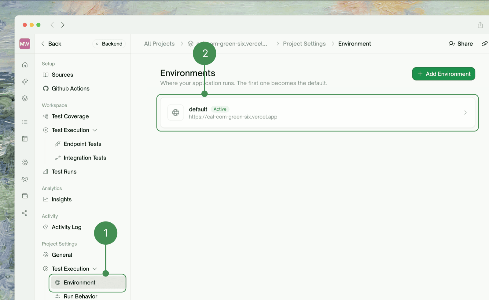
  </Frame>
  </Step>
  <Step title="Click Configure">
    Pick your login method: AWS Cognito, OAuth Refresh, or Username / Password.
    <Frame>
    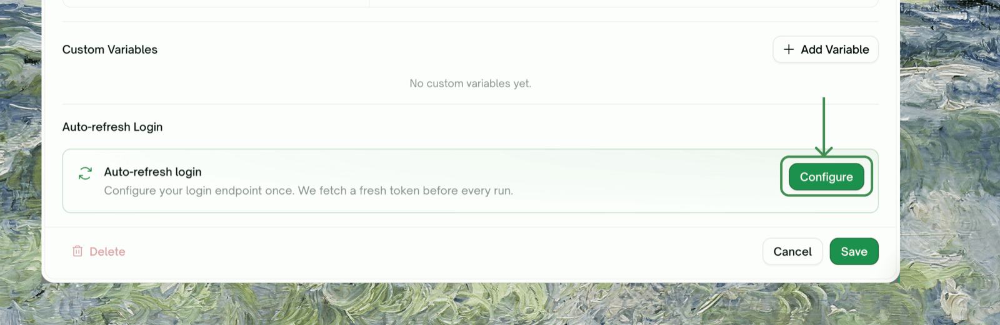
  </Frame>
  </Step>
  <Step title="Fill in the fields and Test Login">
    The form depends on the method. Click **Test Login** to check your config *before* saving: the result panel shows the masked token, or a structured error you can fix without a full test run.
      <Frame>
    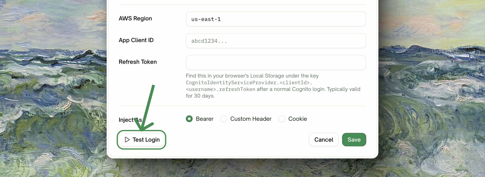
  </Frame>
  </Step>
  <Step title="Save">
    Saving runs one final verification. If it passes, the toggle turns on and the card shows **Verified · Xm ago**; your next run uses a fresh token. If it fails, the config is saved with the toggle off and an error to fix.
    <Frame>
    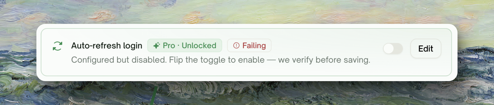
  </Frame>
  </Step>
</Steps>

---

## Choosing a Method

<Frame>
  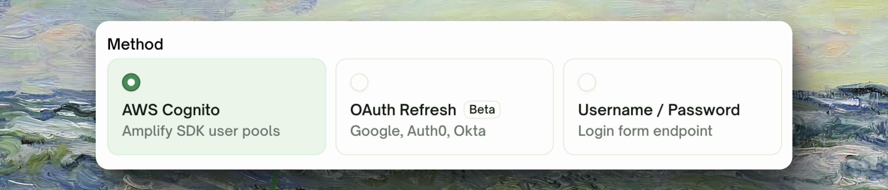
</Frame>

| Method | When to use | What you provide |
| :--- | :--- | :--- |
| **AWS Cognito** | Your app uses AWS Cognito user pools (Amplify SDK, common for AWS-hosted apps) | Region, App client ID, Refresh token |
| **OAuth Refresh** *(Beta)* | Standard OAuth 2.0 refresh-token grant: Google, Auth0, Okta, custom OAuth servers | Token endpoint, Client ID, Client secret, Refresh token, optional scope, path to access token |
| **Username / Password** | Your API has a `/login` (or similar) endpoint that takes a username + password and returns a token | Login URL, HTTP method, Content-Type, request body template, username, password, path to access token |

<Tip>
Start with **AWS Cognito** or **OAuth Refresh** if your provider supports them. **Username / Password** is simplest, but needs a password-grant style endpoint, which modern apps expose less often.
</Tip>

---

## AWS Cognito

<Frame>
  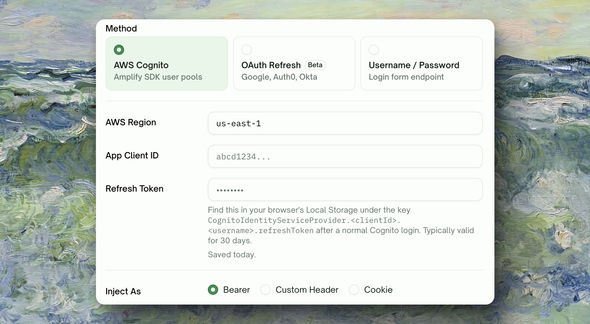
</Frame>

TestSprite uses your stored Cognito refresh token to get a fresh access token before each run, and attaches it to your test requests.

| Field | Description |
| :--- | :--- |
| <kbd>AWS Region</kbd> | The AWS region your Cognito user pool lives in. Defaults to `us-east-1`. |
| <kbd>App Client ID</kbd> | The Cognito App client ID (under your User Pool → App integration → App clients). |
| <kbd>Refresh Token</kbd> | A long-lived refresh token issued by Cognito for a real user. See below. |

### How to obtain a refresh token

<Steps>
  <Step title="Open your app's sign-in page in a browser">
    Sign in as the test user account you want TestSprite to use.
  </Step>
  <Step title="Open DevTools → Application → Local Storage / Cookies">
    Cognito Amplify stores the tokens under keys like `CognitoIdentityServiceProvider.<clientId>.<username>.refreshToken`. The value is the refresh token string.
  </Step>
  <Step title="Copy the refresh token into the Auto-Auth form">
    Paste it into the Refresh Token field and Test Login.
  </Step>
</Steps>

<Note>
Some apps keep tokens in cookies or in memory only. If you can't find it, ask your auth team for a refresh token issued for a test account (a long opaque string).
</Note>

### 30-day expiry warning

AWS Cognito refresh tokens expire **30 days from issue** by default (configurable per app client in AWS). As yours nears expiry, the Auto-refresh login card shows a yellow warning:

| When you see it | What it means |
| :--- | :--- |
| **Refresh token expires in 7d** (and counting down) | You have ≤ 7 days before the token will stop working. Capture a fresh one and update the field. |
| **Refresh token expired** | The token is past 30 days. Auto-Auth runs will fail until you update it. |

<Warning>
The warning is Cognito-only. Google, Auth0, and Okta refresh tokens usually last until revoked, so OAuth Refresh configs don't get it.
</Warning>

---

## OAuth Refresh (Beta)

<Frame>
  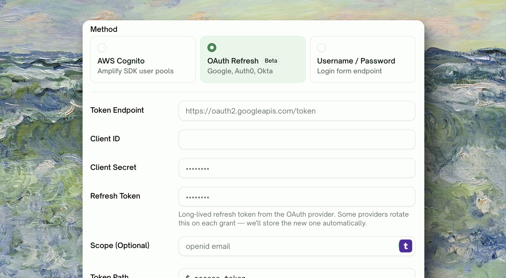
</Frame>

TestSprite uses your provider's standard refresh-token grant to get a fresh access token before each run, and reads it from the provider's response.

| Field | Description |
| :--- | :--- |
| <kbd>Token Endpoint</kbd> | The provider's token URL, e.g. `https://oauth2.googleapis.com/token`, `https://your-tenant.auth0.com/oauth/token`. |
| <kbd>Client ID</kbd> | Your OAuth app's client ID. |
| <kbd>Client Secret</kbd> | Your OAuth app's client secret. Stored encrypted; never echoed back to the browser. |
| <kbd>Refresh Token</kbd> | A refresh token issued for the test user. Stored encrypted; never echoed back to the browser. |
| <kbd>Scope (Optional)</kbd> | Space-delimited scopes, e.g. `openid email`. Usually omit unless Test Login fails with a scope-related error. |
| <kbd>Token Path</kbd> | Path to the access token in the response body. The default `$.access_token` works for almost all providers. |

### Where to get a refresh token

Each provider differs. The most common path:

1. Register an "OAuth app" in your provider's console (Google Cloud Console, Auth0 Dashboard, Okta Admin)
2. Set the redirect URI to something local like `http://localhost:1234/callback`
3. Use the provider's playground or a small script to walk through the authorization-code flow once and capture the refresh token

<Tip>
**Auth0:** create a Machine-to-Machine app authorized for your test API. Its `client_credentials` grant returns short-lived access tokens directly, and OAuth Refresh handles it with the same token endpoint, client ID, and client secret fields. Set scope to whatever your API requires.
</Tip>

---

## Username / Password

<Frame>
  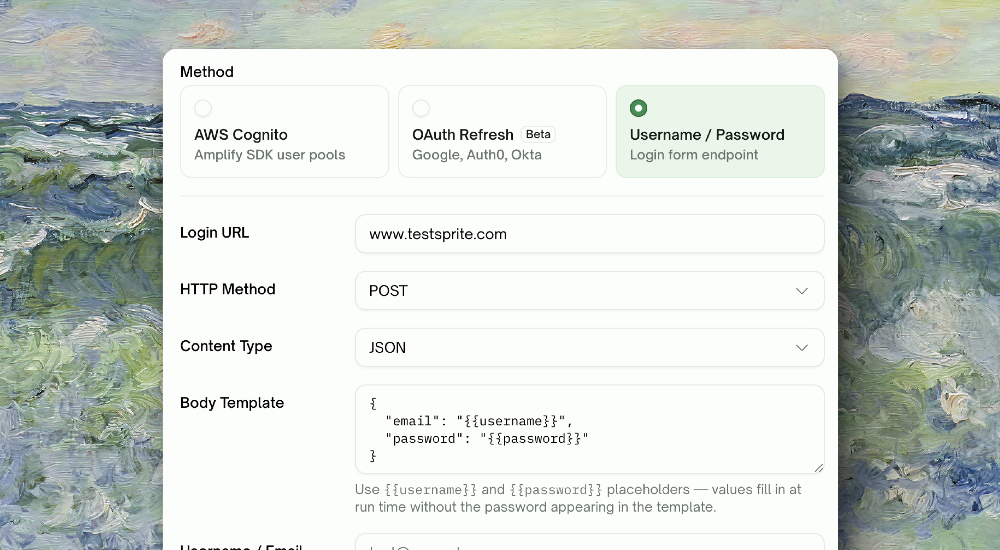
</Frame>

TestSprite calls your login endpoint with the username and password, and reads the token from the JSON response using the path you provide.

| Field | Description |
| :--- | :--- |
| <kbd>Login URL</kbd> | The full URL of your login endpoint, e.g. `https://api.example.com/auth/login`. |
| <kbd>HTTP Method</kbd> | `POST` (default) or `PUT`. |
| <kbd>Content Type</kbd> | `JSON` (default, sends `application/json`) or `Form-urlencoded` (`application/x-www-form-urlencoded`). |
| <kbd>Body Template</kbd> | The request body, with `{{username}}` and `{{password}}` placeholders. The default is `{"email":"{{username}}","password":"{{password}}"}`. Edit it if your API expects different field names. |
| <kbd>Username / Email</kbd> | The username/email of your test user. |
| <kbd>Password</kbd> | The password of your test user. Stored encrypted; never echoed back to the browser. |
| <kbd>Token Path</kbd> | Path to the token in the response: `$.access_token`, `$.token`, `$.data.jwt`, etc. Default `$.access_token`. |

### Body template examples

`{{username}}` and `{{password}}` are filled in with your stored credentials. Shape the body however your API needs:

<CodeGroup>
```json Standard JSON
{ "email": "{{username}}", "password": "{{password}}" }
```

```json Different field names
{ "identifier": "{{username}}", "secret": "{{password}}" }
```

```json Extra fields expandable
{
  "username": "{{username}}",
  "password": "{{password}}",
  "tenant": "test-org",
  "scope": "api"
}
```

```text Form-urlencoded
username={{username}}&password={{password}}&grant_type=password
```
</CodeGroup>

<Warning>
**Form-encoded bodies need a matching Content Type.** Set **Content Type** to `Form-urlencoded`; a `key=value` body sent as JSON fails on most servers with a 400.
</Warning>

---

## Token Injection

The **Inject As** field at the bottom of the modal controls how the token is attached to your test requests.

<Frame>
  
</Frame>

| Inject As | Where the token goes | When to use |
| :--- | :--- | :--- |
| <kbd>Bearer</kbd> *(default)* | `Authorization: Bearer <token>` header | Standard for OAuth, Cognito, JWT-based APIs (>90% of cases) |
| <kbd>Custom Header</kbd> | `<Header-Name>: <token>` | Your API expects a custom header, e.g. `X-Auth-Token`, `X-API-Key` |
| <kbd>Cookie</kbd> | `Cookie: <name>=<token>` | Session-cookie based APIs that don't read tokens from `Authorization` |

**Custom Header** and **Cookie** add a field for the header name (e.g. `X-Auth-Token`) or cookie name (e.g. `session`). Start with Bearer; switch only if Test Login succeeds but real test runs return 401.

---

## Test Login: Verify Before You Rely

**Test Login** runs one end-to-end refresh with the values currently in the form (not the saved ones) and shows what came back. The card keeps showing the saved state until you click **Save**.

<Frame>
  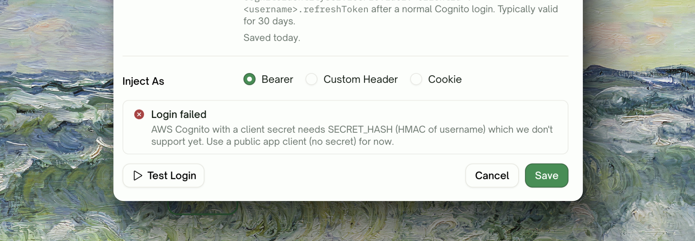
</Frame>

| State | What it means | What to do |
| :--- | :--- | :--- |
| **Login succeeded** + masked token | Your config retrieved a valid-looking token from the provider | Click **Save**. The same call will run before every test run from now on |
| **Login failed (HTTP 401/403)** | The provider rejected your credentials (401/403) | Wrong refresh token, wrong client secret, expired credential. Update the field and retry |
| **Login failed** (no token found) | Got a 200 from the provider but the token path didn't find a token in the response | Check the **Token path** field. Defaults work for most providers, but if yours returns `{"data":{"jwt":"…"}}` you'd need `$.data.jwt` |
| **Login failed** (no HTTP status) | Couldn't reach the provider URL | Wrong endpoint URL, DNS issue, or your endpoint is behind a network not reachable from TestSprite's egress |

---

## Health States on the Auto-refresh Card

| State | Meaning | What to do |
| :--- | :--- | :--- |
| **Verified · Xm ago** | On, and the last refresh (Test Login or a real run) succeeded | Nothing. A fresh token is fetched before your next run |
| **Pending verification** | On, but no successful refresh yet | Run **Test Login** so you find out it works without losing a real run |
| **Failing** | On, but the last refresh errored. **Tests that run against this environment are blocked until you fix it**, rather than silently running with an expired token | Click **Edit**, read the last error (often an expired refresh token), fix it, Test Login, then Save |
| **Configured but disabled** | A working config is saved, but the toggle is off. Tests fall back to your Static Credentials | Flip the toggle on; TestSprite verifies the config first |
| **Not configured** | No config saved yet | Click **Configure** |

---

## Day-2 Operations

### Edit a saved config

Click **Edit** on the card. Non-secret fields are pre-filled. Secret fields (password, client secret, refresh token) show `••••••••` and are **kept if you leave them blank**; type a new value to overwrite.

<Frame>
  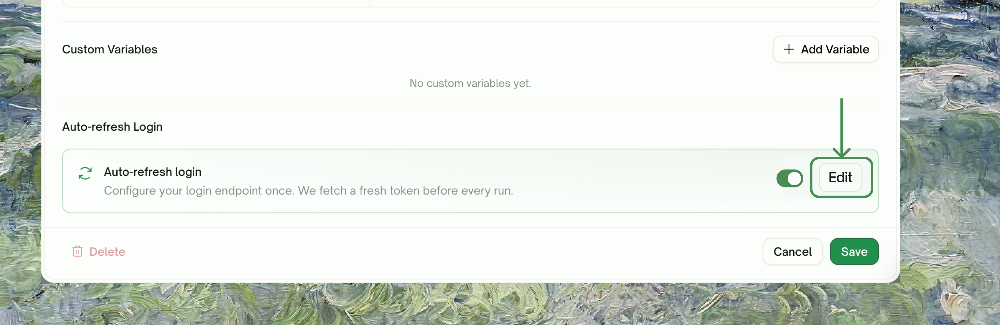
</Frame>

### Temporarily disable

Flip the toggle off. The config stays saved, and new runs fall back to your Static Credentials (if any). When you flip it back on, TestSprite verifies the config still works.

<Frame>
  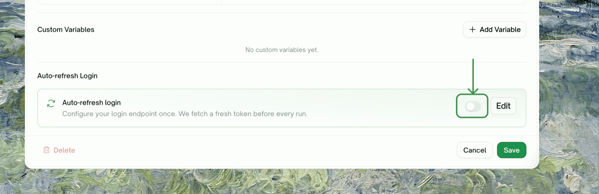
</Frame>

### Delete a config

Use **Edit** → clear all fields → **Save**. Or contact support if you want a hard delete.

---

## Security

- **Encrypted at rest**: secrets (password, client secret, refresh token) are stored encrypted.
- **Never echoed back to the browser**: saved secrets render as `••••••••` placeholders. Leaving the field blank keeps the stored value.
- **Server-side only**: Test Login and the actual token refresh both run on the server. Your secrets never traverse the browser-to-API path.
- **No credential logging**: full request bodies are not logged.

---

## If You Can't Use Auto-Auth: Static Credentials

If none of the three methods fits your API (say, a long-lived API key that never expires, or an auth flow that needs a hardware token), paste credentials manually instead.

<Frame>
  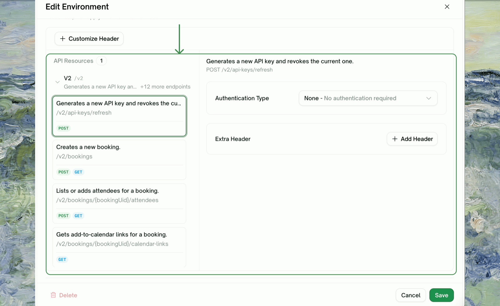
</Frame>

**Customize Header**, in the same **Edit Environment** dialog, lets you:

- Paste a token, API key, or session string per endpoint, with its **Authentication Type**
- Apply the same value to multiple APIs at once: create a credential set, click **Apply**, and pick the APIs (or **Select all**)
- Rotate (overwrite) a value without removing the test cases that use it

The catch: **you paste a fresh value every time the token expires**. For nightly schedules with short-lived tokens, that's a daily chore, which is what Auto-Auth removes.

| | Static Credentials | Auto-Auth |
| :--- | :--- | :--- |
| Setup effort | Paste & save | Configure once + Test Login |
| Token expiry | You re-paste manually | Refreshed automatically |
| Works for scheduled runs | Only until token expires | Yes, every run gets a fresh token |
| Multi-API setup | Per-endpoint credentials | One config covers the whole environment |

---

## Troubleshooting

<AccordionGroup>
  <Accordion title="Test Login fails with HTTP 401/403 but my credentials are correct">
    In order of likelihood:
    1. **The refresh token expired or was revoked.** Cognito caps it at 30 days; OAuth providers revoke on password change, app uninstall, or admin action. Capture a fresh one.
    2. **Client ID / secret mismatch.** Check you copied them from the right OAuth app; dev and prod usually have different client IDs.
    3. **The account is disabled or locked.** Sign in to your app as the test user in a browser; fix that first if it fails.
  </Accordion>
  <Accordion title="Test Login fails and no token was found">
    The provider returned a 200, but **Token path** didn't match. The default `$.access_token` works for Cognito, Auth0, Okta, Google, and most standards-compliant providers. For `{"data":{"jwt":"…"}}` use `$.data.jwt`; for `{"token":"…"}` use `$.token`. The response body in the result panel shows the real shape.
  </Accordion>
  <Accordion title="Test Login succeeds but real test runs return 401">
    The token is fetched but delivered where your API doesn't look for it. Try **Inject As** → **Bearer**, then **Custom Header** with the header name from your API docs (e.g. `X-Auth-Token`), then **Cookie**. The cookie name field takes just the name (e.g. `session`), not `Cookie: session=…`.
  </Accordion>
  <Accordion title="The toggle flipped back off after I enabled it, and the card now says 'Failing'">
    The save-time verification failed, so the toggle was turned back off. Open **Edit**, read the error below the dialog title, fix it, Test Login, then Save again.
  </Accordion>
  <Accordion title="My API uses a custom token header AND requires a custom Content-Type">
    They don't conflict. **Inject As** controls how the fetched token is attached to your test requests; **Content Type** (Username/Password method) is only for the login call.
  </Accordion>
  <Accordion title="What if my CI/CD rotates the test user's password regularly?">
    With Username/Password, each rotation breaks Auto-Auth until you update the password. OAuth and Cognito refresh tokens generally survive password rotation (until revoked), so switching to one of those removes the churn.
  </Accordion>
</AccordionGroup>

---

## Where to Go Next

<Columns cols={2}>
  <Card title="API Discovery" href="/web-portal/core/api/api-discovery" icon="magnifying-glass">
    How TestSprite finds your endpoints from your API docs
  </Card>
  <Card title="Integration Tests" href="/web-portal/core/api/integration-tests" icon="link">
    Multi-step chained tests with dynamic variables
  </Card>
  <Card title="Rerun" href="/web-portal/core/api/api-rerun" icon="arrow-rotate-right">
    Re-run a chain or a single test
  </Card>
</Columns>
