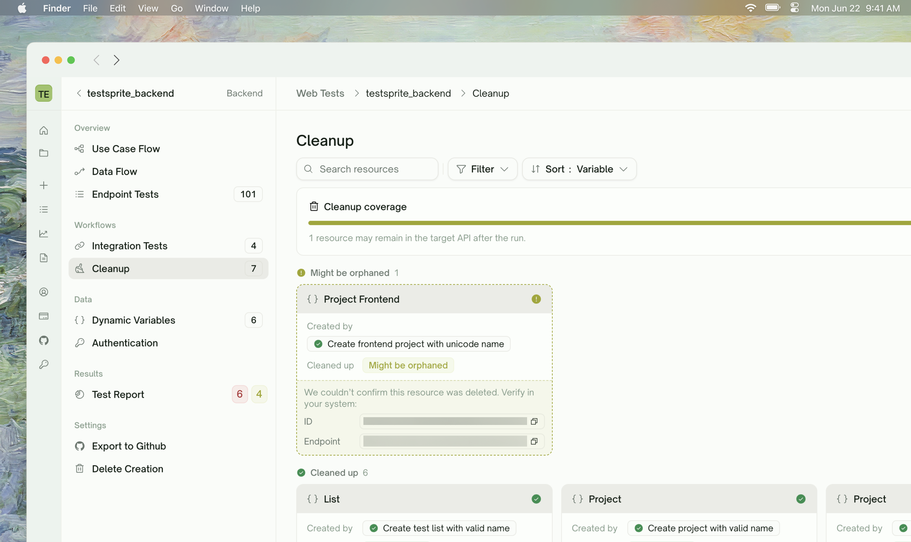
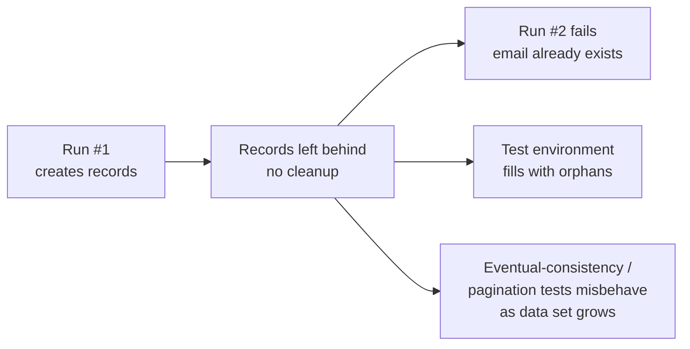
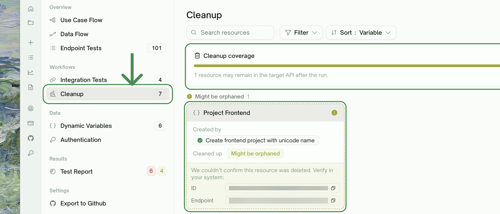

<Frame>
  
</Frame>

## What Auto Cleanup Does

Every run of your API tests creates real records on your test environment — users, orders, sessions, files, whatever your domain has. Without cleanup:

<Card>

</Card>

**Auto Cleanup runs after every test run** and removes the records the run created. You don't configure it manually — TestSprite identifies which records were created and removes them in an order that respects their dependencies.

<Info>
**Cleanup runs even when tests pass.** The point is to leave your test environment in a known-empty state, not to reverse failed runs. After Run → Cleanup → done, your environment looks identical to what it did before Run started.
</Info>

## How Cleanup Works

After a run finishes, TestSprite identifies the records created during the run and issues DELETE calls in the order that respects their dependencies — children first, then parents. You can't delete a user before its orders are gone (FK constraint), so TestSprite removes orders before users.

## What Counts as a Cleanup-Relevant Record

Not every value produced during a run triggers cleanup. A `total_amount` is just a value used downstream — there's nothing to delete. An `order_id` is a record handle — deletion is needed.

TestSprite identifies cleanup-relevant records by recognizing handles to resources created during the run (typically IDs returned by POST or PUT calls with a matching DELETE endpoint).

These flagged records appear in [Dynamic Variables](/web-portal/core/api/dynamic-variables) with their **Deleted by** column populated, and feed into the cleanup chain.

## The Cleanup Tab

<kbd>Sidebar → Workflows → Cleanup</kbd>. This view shows what got deleted (or attempted) after the most recent run.

<Frame>
  
</Frame>

The page renders captured resources as cards split into two sections:

| Section | What you see |
| :--- | :--- |
| <kbd>Might be orphaned</kbd> | Resources we couldn't confirm were deleted — surfaced first so you can act on them. Each card shows the captured ID and source endpoint so you can verify or delete manually. |
| <kbd>Cleaned up</kbd> | Resources confirmed gone — either via a planned cleanup test that Passed or via the auto-sweep DELETE returning 2xx/404. |

Each card shows:

| Field | What it shows |
| :--- | :--- |
| <kbd>Resource label</kbd> | The variable name that triggered the cleanup (e.g., `order_id`) |
| <kbd>Created by</kbd> | The test that produced the variable in the first place |
| <kbd>Cleaned up</kbd> | The cleanup test (with status chip), or an `Auto-cleaned` badge for sweep-only cleanups, or a `Might be orphaned` badge when neither confirmed deletion |

A progress bar at the top of the panel summarizes how many of the captured resources have been cleaned up.

## When Cleanup Runs

Cleanup runs after the test run completes — once all endpoint and integration tests finish, TestSprite issues the DELETE calls. Cleanup typically completes in 5–60 seconds depending on resource count. The dashboard stays usable during cleanup; the run isn't fully "done" until cleanup finishes.

## When Cleanup Fails

A cleanup DELETE can fail for several reasons. TestSprite handles each differently:

| Failure | What it does | What you should do |
| :--- | :--- | :--- |
| <kbd>404 Not Found</kbd> | Treated as success — the resource is gone | Nothing — the record was already cleaned up by a cascade or another mechanism |
| <kbd>5xx server error</kbd> | Retried briefly | If retries also fail, the resource lands in **Might be orphaned** |
| <kbd>4xx other than 404</kbd> (e.g., 403, 409) | Marks the cleanup test Failed | Click into the cleanup test to see the response body and figure out why DELETE was rejected |
| <kbd>Auth expired mid-cleanup</kbd> | Refreshes via [Auto-Auth](/web-portal/core/api/auto-auth) if configured, otherwise marks the cleanup test Failed | If you're using Static Credentials and your token expired mid-run, switch to Auto-Auth |

To retry failed cleanups, rerun the failing cleanup test from its detail page, or trigger a fresh **Rerun all** — every Rerun runs Auto Cleanup again at the end.

## Manual Cleanup

If TestSprite couldn't auto-clean a resource (no matching DELETE endpoint discovered), the resource appears under **Might be orphaned** in the Cleanup tab, with the ID and source endpoint surfaced for manual verification. Two paths:

1. **Add a DELETE endpoint to discovery** — re-run [API Discovery](/web-portal/core/api/api-discovery) once your DELETE endpoints are reachable
2. **Manually delete and dismiss** — clean up via your own backend tooling, then dismiss the cleanup row

You can also explicitly opt records out of auto-cleanup in chat: "Don't auto-clean up the records created by POST /audit-logs — they need to stay for audit retention".

## Cleanup and Test Independence

Cleanup is what makes test runs **idempotent** — every run starts from the same empty-environment state and produces the same outcome.

<CardGroup cols={2}>
  <Card title="Without cleanup" icon="circle-xmark">
    - Run 1 passes (clean slate)
    - Run 2 fails on POST /users (email collision with run 1's user)
    - Run 3 has a different shape entirely (depending on what survived)
  </Card>
  <Card title="With cleanup — matters most for" icon="circle-check">
    - **Scheduled runs**: nightly schedules accumulate fast without cleanup

    - **CI integration**: CI runs on every PR; without cleanup, the test environment fills with PR-sized garbage

    - **Eventual-consistency tests**: an unbounded growing data set changes pagination/sort order
  </Card>
</CardGroup>

## Edge Cases & Troubleshooting

<AccordionGroup>
  <Accordion title="Cleanup left some records behind">
    Most likely causes:
    - **No DELETE endpoint discovered** — surfaced under "Might be orphaned" in the Cleanup tab. Add the endpoint manually on the configuration step (or in a new project) so cleanup has a verb to invoke.
    - **DELETE endpoint failed with 4xx** — the cleanup test row shows Failed with response body. Often an auth or permission issue with the test account.
    - **Resource has deeply nested children** — TestSprite handles direct dependencies, but deep nesting (4+ levels) can sometimes need a hint. Refine in chat: "DELETE /comments must run before DELETE /posts must run before DELETE /users".
  </Accordion>
  <Accordion title="Cleanup is deleting records I want to keep">
    Refine: "Don't auto-clean up the seed-data user `system@testsprite.com`". TestSprite will skip cleanup for resources matching that filter.
  </Accordion>
  <Accordion title="Cleanup runs are slow (>5 minutes)">
    Three causes:
    - **Many resources** — 1000+ created records, each one a separate DELETE call. Either prune your test plan to create less, or accept the cost.
    - **DELETE endpoint is slow** — your /resource/{id} DELETE itself takes 5+ seconds. Investigate why on your API side.
    - **Many failures being retried** — check the Cleanup tab for the failure pattern.
  </Accordion>
  <Accordion title="Cleanup didn't run at all">
    Two checks:
    - The run finished with all tests Passed or Failed (not Pending). Cleanup runs after run completion; if the run is still in progress, cleanup hasn't started.
    - At least one cleanup-relevant record exists. If your tests don't produce record IDs, there's nothing to clean up.
  </Accordion>
  <Accordion title="My cleanup DELETEs are getting rate-limited">
    Cleanup issues DELETEs in parallel for resources of the same type. If your API has aggressive rate limits on DELETE, this can trip them. Refine: "Issue cleanup DELETEs serially, not in parallel" — TestSprite will sequence them.
  </Accordion>
</AccordionGroup>

## Where to Go Next

<Columns cols={2}>
  <Card title="Dynamic Variables" href="/web-portal/core/api/dynamic-variables" icon="brackets-curly">
    Values produced by one test and used by another
  </Card>
  <Card title="Dependency Chains" href="/web-portal/core/api/dependency-chains" icon="diagram-project">
    How run order is determined
  </Card>
  <Card title="Auto-Auth (Pro)" href="/web-portal/core/api/auto-auth" icon="arrows-rotate">
    Keeps auth alive across long-running cleanups
  </Card>
  <Card title="Data Flow" href="/web-portal/core/api/data-flow" icon="diagram-project">
    See cleanup DELETEs in the same view as the run's other calls
  </Card>
</Columns>
