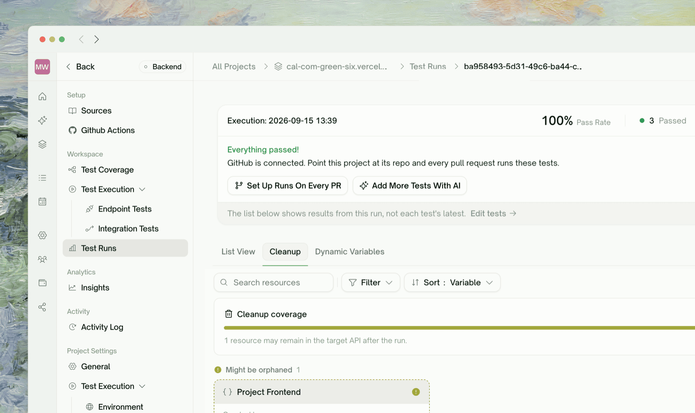
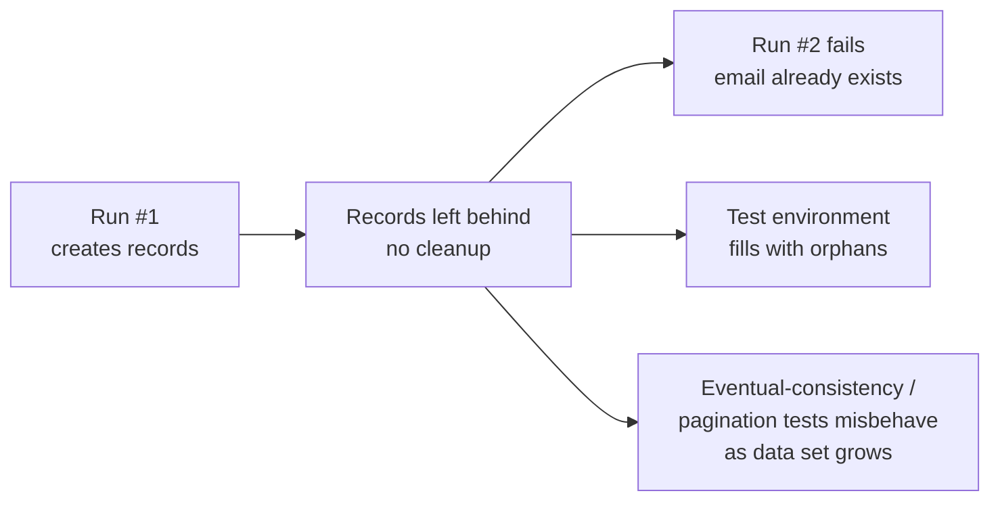

<Frame>
  
</Frame>

## What Auto Cleanup Does

Every API test run creates real records in your test environment: users, orders, sessions, files. Left behind, they break later runs:

<Card>

```mermaid
flowchart LR
    A[Run #1<br/>creates records] --> B[Records left behind<br/>no cleanup]
    B --> C1[Run #2 fails<br/>email already exists]
    B --> C2[Test environment<br/>fills with orphans]
    B --> C3[Eventual-consistency /<br/>pagination tests misbehave<br/>as data set grows]
```
</Card>

**Auto Cleanup runs after every test run**, whether tests passed or failed, and removes the records that run created. There's nothing to configure. TestSprite issues the DELETE calls in dependency order, children first and then parents (orders before the user they belong to), so each run starts from the same empty state. This matters most for scheduled runs and CI, where leftovers pile up fast.

Which records count is decided by their [dynamic variables](/web-portal/core/api/dynamic-variables): handles to created resources, like an `order_id`, get cleaned up; plain values, like a `total_amount`, don't.

## The Cleanup Tab

Open <kbd>Test Runs → a run → Cleanup</kbd> to see what was deleted (or attempted) after that run. Captured resources show as cards in two sections:

| Section | What you see |
| :--- | :--- |
| <kbd>Might be orphaned</kbd> | Resources we couldn't confirm were deleted, shown first so you can act on them. Each card shows the captured ID and source endpoint so you can verify or delete manually. |
| <kbd>Cleaned up</kbd> | Resources confirmed gone, either via a planned cleanup test that Passed or via the auto-sweep DELETE returning 2xx/404. |

Each card shows:

| Field | What it shows |
| :--- | :--- |
| <kbd>Resource label</kbd> | The variable name that triggered the cleanup (e.g., `order_id`) |
| <kbd>Created by</kbd> | The test that produced the variable in the first place |
| <kbd>Cleaned up</kbd> | The cleanup test (with status chip), or an `Auto-cleaned` badge for sweep-only cleanups, or a `Might be orphaned` badge when neither confirmed deletion |

A progress bar at the top summarizes how many captured resources have been cleaned up.

## When Cleanup Runs

Once all endpoint and integration tests finish, TestSprite issues the DELETE calls. Cleanup usually takes 5–60 seconds depending on resource count. The dashboard stays usable meanwhile, but the run isn't fully done until cleanup finishes.

## When Cleanup Fails

| Failure | What it does | What you should do |
| :--- | :--- | :--- |
| <kbd>404 Not Found</kbd> | Treated as success: the resource is gone | Nothing. A cascade or another mechanism already removed it |
| <kbd>5xx server error</kbd> | Retried briefly | If retries also fail, the resource lands in **Might be orphaned** |
| <kbd>4xx other than 404</kbd> (e.g., 403, 409) | Marks the cleanup test Failed | Open the cleanup test to see the response body and why DELETE was rejected |
| <kbd>Auth expired mid-cleanup</kbd> | Refreshes via [Auto-Auth](/web-portal/core/api/auto-auth) if configured, otherwise marks the cleanup test Failed | If you're using Static Credentials and your token expired mid-run, switch to Auto-Auth |

To retry, rerun the failing cleanup test from its detail page, or **Re-run all**. Every rerun runs Auto Cleanup again at the end.

## Manual Cleanup

If a resource couldn't be auto-cleaned (no matching DELETE endpoint was discovered), it appears under **Might be orphaned** with its ID and source endpoint. You can:

1. **Add a DELETE endpoint to discovery**: re-run [API Discovery](/web-portal/core/api/api-discovery) once your DELETE endpoints are reachable
2. **Delete it yourself** with your own backend tooling

To keep certain records, opt them out in chat: "Don't auto-clean up the records created by POST /audit-logs; they need to stay for audit retention".

## Edge Cases & Troubleshooting

<AccordionGroup>
  <Accordion title="Cleanup left some records behind">
    Most likely causes:
    - **No DELETE endpoint discovered**: shown under "Might be orphaned". Add the endpoint manually on the configuration step (or in a new project) so cleanup has a verb to invoke.
    - **DELETE endpoint failed with 4xx**: the cleanup test shows Failed with the response body. Often an auth or permission issue with the test account.
    - **Deeply nested children** (4+ levels) can need a hint. Refine in chat: "DELETE /comments must run before DELETE /posts must run before DELETE /users".
  </Accordion>
  <Accordion title="Cleanup is deleting records I want to keep">
    Refine: "Don't auto-clean up the seed-data user `system@testsprite.com`". TestSprite will skip cleanup for resources matching that filter.
  </Accordion>
  <Accordion title="Cleanup runs are slow (>5 minutes)">
    - **Many resources**: 1000+ created records means 1000+ DELETE calls. Prune the plan to create less, or accept the cost.
    - **Slow DELETE endpoint**: if each DELETE takes 5+ seconds, investigate on your API side.
    - **Many retries**: check the Cleanup tab for the failure pattern.
  </Accordion>
  <Accordion title="Cleanup didn't run at all">
    - The run must be finished (tests Passed or Failed, none Running). Cleanup starts after the run completes.
    - At least one cleanup-relevant record must exist. If your tests don't produce record IDs, there's nothing to clean up.
  </Accordion>
  <Accordion title="My cleanup DELETEs are getting rate-limited">
    Cleanup issues DELETEs in parallel for resources of the same type. If your API rate-limits DELETE, refine: "Issue cleanup DELETEs serially, not in parallel".
  </Accordion>
</AccordionGroup>

## Where to Go Next

<Columns cols={2}>
  <Card title="Dynamic Variables" href="/web-portal/core/api/dynamic-variables" icon="brackets-curly">
    See which test deleted each captured value, next to where it came from
  </Card>
  <Card title="Dependency Chains" href="/web-portal/core/api/dependency-chains" icon="diagram-project">
    How run order is determined
  </Card>
  <Card title="Auto-Auth" href="/web-portal/core/api/auto-auth" icon="arrows-rotate">
    Keeps auth alive across long-running cleanups
  </Card>
</Columns>
