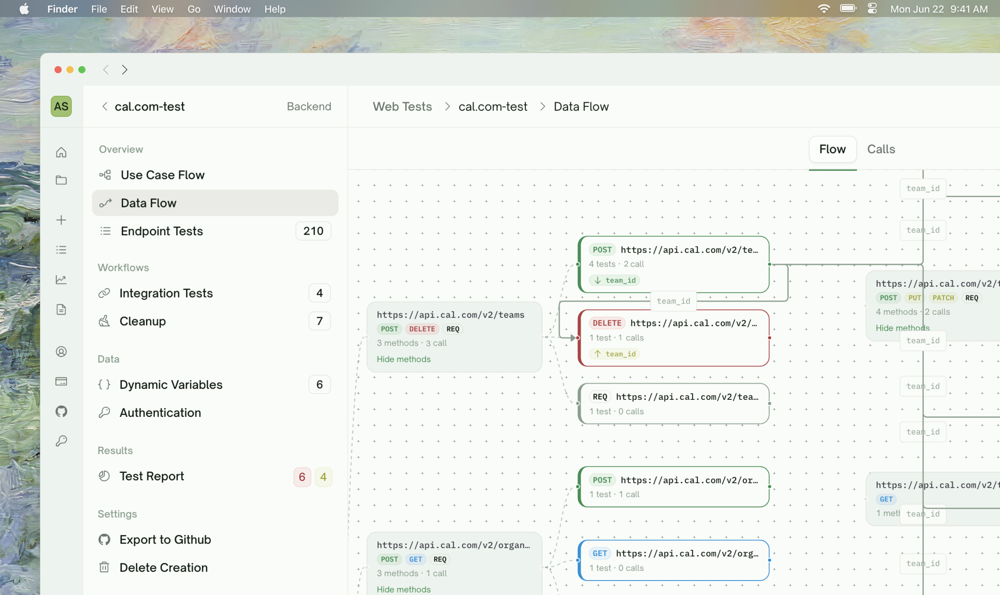
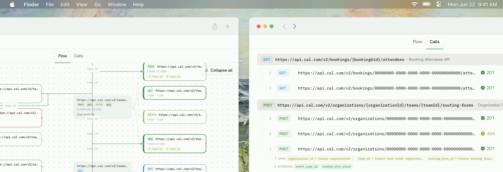
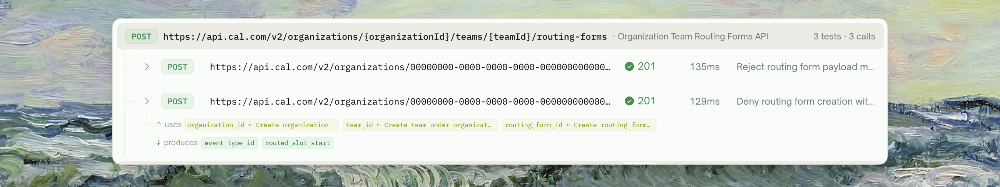

<Frame>
  
</Frame>
## What Data Flow Shows

Data Flow is the **forensic view** of a test run. Every HTTP call TestSprite made to your API — every planned test, every capture extraction, every cleanup DELETE — appears here, grouped by endpoint, in chronological order within each endpoint group.
<Frame>
  
</Frame>
Three things make this view useful:

1. **Volume at a glance** — "83 tests, 247 calls, 7 endpoints" tells you how much traffic the run produced
2. **Producer/consumer wiring** — each card shows what variables it produced and which ones it consumed (clicking a consumer's badge scrolls to the producer card)
3. **Observed behaviors** — beyond the planned tests, this view also shows other API calls that occurred during the run, so you have full visibility into what your API was actually asked to do

## Where to Find It

Sidebar → **Overview → Data Flow** (BE projects only). The tab appears once a run has completed; before any run it shows an empty-state inviting you to run your tests first.

## How the View Is Organized

The page is a list, grouped by endpoint. Each group is collapsible.

```
GET /users/{id}          [3 calls · 3 passed]
  ├── test_get_user_returns_user            [Passed · ↓ user_id]
  ├── test_get_user_404_on_unknown_id        [Passed]
  └── test_get_user_unauthenticated_401      [Passed]

POST /orders             [4 calls · 3 passed · 1 failed]
  ├── test_create_order_for_user             [Passed · ↑ user_id · ↓ order_id]
  ├── test_create_order_with_invalid_amount  [Passed]
  ├── test_create_order_perf_burst           [Failed · ↑ user_id]
  └── ▼ Other observed behaviors (3)
```

Within each endpoint group:

- **Top section: planned test calls.** One card per test that was planned to run. Status chip, request/response preview, captured/consumed variable badges.
- **Bottom section: "Other observed behaviors".** Collapsed by default. Includes calls made during discovery, auth verification calls, and anything else that hit this endpoint during the run.

## The Producer/Consumer Badges

Each card that produces or uses a value has badges in its header:

<Frame>
  
</Frame>

| Badge | Meaning |
| :--- | :--- |
| <kbd>↓ produces user_id</kbd> | This call captured `user_id` from its response |
| <kbd>↑ uses user_id</kbd> | This call consumed `user_id` from upstream |
| <kbd>↓ produces user_id, order_id</kbd> | This call captured multiple variables |
| <kbd>↑ uses user_id ← Create user</kbd> | Consumer badge with producer test name visible — click to scroll to producer |

Clicking a producer's <kbd>↓ produces X</kbd> badge highlights all the consumers of X across the page. Clicking a consumer's <kbd>↑ uses X ← Producer Test</kbd> scrolls and highlights the producer card.

This makes <kbd>where did this value come from?</kbd> and <kbd>where did this value go?</kbd> both one-click navigations.

## Per-Call Detail

Click any call row to expand the detail panel:

| Section | Content |
| :--- | :--- |
| <kbd>Request</kbd> | Method + URL chip |
| <kbd>Query</kbd> | Query-string parameters parsed from the URL (when present) |
| <kbd>Body</kbd> | Request body sent (when present) |
| <kbd>Response</kbd> | Response body, with status code + duration shown on the row itself |

The row header above the expansion shows the call's HTTP status code, latency in ms, and the producing test's title. Captures and consumes for that call surface as inline `↑ uses` / `↓ produces` badges directly under the row.

## Status on Each Row

Each call row shows the HTTP status code returned by the API, color-coded by class:

| Indicator | Meaning |
| :--- | :--- |
| <kbd>Green status (2xx)</kbd> | Successful response |
| <kbd>Yellow status (4xx)</kbd> | Client error |
| <kbd>Red status (5xx)</kbd> | Server error |
| <kbd>—</kbd> | No response recorded (e.g. network error) |

Calls that didn't come from a planned test (such as discovery or auth-verification calls) are grouped under the **Other observed behaviors** subsection and rendered with a slightly muted style.

## Why "Other Observed Behaviors" Exists

The full list of HTTP calls TestSprite made during a run is bigger than just your planned tests:

- Calls made during initial discovery
- Auth-verification calls when [Auto-Auth](/web-portal/core/api/auto-auth) refreshes a token
- Cleanup DELETEs after the run
- Mid-run calls when an integration chain has implicit prerequisites

These are all real traffic to your API; you should see them. **But they're not "tests"** — exposing them in the main test list would be confusing. Hence the collapsed subsection.

## What Data Flow Tells You That Test Detail Doesn't

Test Detail shows you one test in depth. Data Flow shows you the **shape of the run as a whole**:

- "Why did my test environment have 47 records leftover after this run?" → look at the Cleanup section, find which DELETEs failed
- "Why is this test slow?" → look at the call card's response time alongside its peers — outlier?
- "Did my new endpoint actually get hit?" → check that endpoint's group exists with traffic
- "Why does my POST /orders test reference a user_id I didn't think was created?" → click the "↑ uses user_id" badge and find the producer

It's the diagnostic view of choice when "individual tests work but the run as a whole feels off".

## Two Views: Flow and Calls

The page header has a **Flow / Calls** toggle:

| View | What it shows |
| :--- | :--- |
| <kbd>Flow</kbd> | Endpoint-grouped graph view — collapse/expand each endpoint to see method-level nodes; producer/consumer arrows wire dependent calls together |
| <kbd>Calls</kbd> | The endpoint-grouped, expandable list described above — request/response detail per row, with `↑ uses` / `↓ produces` badges showing dependency wiring |

Both views read from the same recorded calls. Use Flow to scan the topology of the run; use Calls to inspect a specific request/response pair.

## Edge Cases & Troubleshooting

<AccordionGroup>
  <Accordion title="An endpoint I know was called doesn't appear in Data Flow">
    Two possibilities:
    - **The call happened during discovery, not during the run.** Check the "Other observed behaviors" subsection of any matching endpoint group.
    - **The call was made by a test that's still Pending.** Data Flow only renders completed calls; in-flight tests don't show until they finish.
  </Accordion>
  <Accordion title="A producer/consumer relationship I expected isn't shown">
    Either:
    - The variable name on each side doesn't match exactly (case-sensitive)
    - One side wasn't declared in the plan (open the test and refine if needed)
    - The producer's test failed and never produced the value
  </Accordion>
  <Accordion title="Many calls have the same producer/consumer arrows — visual noise">
    Common with chains like POST /users → 30 different consumer tests. The arrows don't render as 30 lines; they collapse into the Used By list on the producer card. Click "↓ produces user_id" to see the highlighted consumers.
  </Accordion>
  <Accordion title="The 'Other observed behaviors' subsection is huge">
    Typically the first run on a new project shows more activity here. Subsequent runs are cleaner. If it's still large later on, check whether [API Discovery](/web-portal/core/api/api-discovery) re-ran for this run.
  </Accordion>
  <Accordion title="Cleanup DELETE counts in Data Flow don't match my Cleanup tab">
    The Data Flow view shows every DELETE that fired during the cleanup sweep, including successful ones. Compare with the Cleanup tab's totals — they should match. If they don't, please [contact support](https://discord.gg/QQB9tJ973e).
  </Accordion>
</AccordionGroup>

## Where to Go Next

<Columns cols={2}>
  <Card title="Dynamic Variables" href="/web-portal/core/api/dynamic-variables" icon="brackets-curly">
    The captured-variables tab — same data, tabular shape
  </Card>
  <Card title="Test Detail" href="/web-portal/core/working-with-test/test-detail" icon="file-magnifying-glass">
    Drill into one test from a Data Flow card
  </Card>
  <Card title="Auto Cleanup" href="/web-portal/core/api/auto-cleanup" icon="broom">
    Cleanup DELETE calls visible in Data Flow
  </Card>
  <Card title="Comparing Runs" href="/web-portal/maintenance/comparing-runs" icon="code-compare">
    Diff two Data Flow snapshots side-by-side
  </Card>
</Columns>
