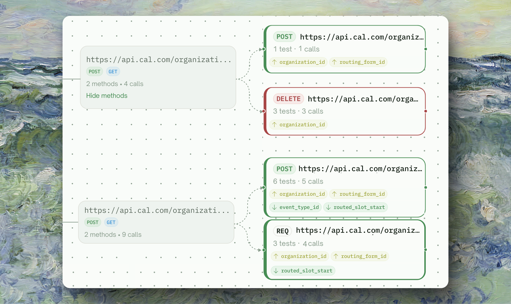
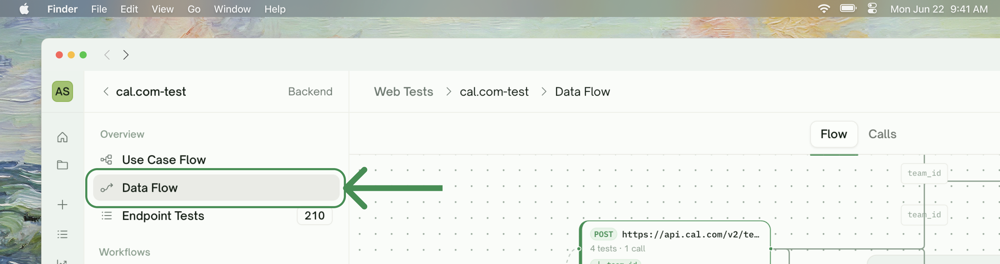
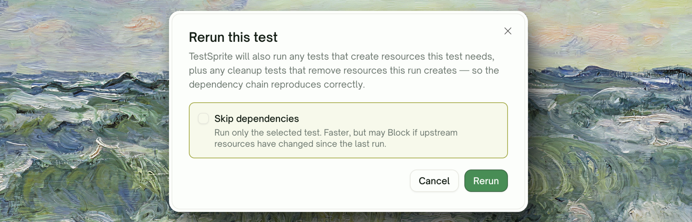

<Frame>
  
</Frame>

## What Dependency Chains Are

When tests share dynamic variables, they form a chain of producers and consumers:

| Endpoint | Produces | Uses |
| :--- | :--- | :--- |
| POST /users | `user_id` | — |
| POST /orders | `order_id` | `user_id` |
| GET /orders/`{id}` | — | `order_id` |
| DELETE /orders/`{id}` | — | `order_id` |

A producer always runs before the tests that use its values. TestSprite identifies these relationships and orders the run accordingly.

<Card title="Auto Cleanup" href="/web-portal/core/api/auto-cleanup" icon="broom">
  Cleanup runs in the order that respects these dependencies — children first, then parents
</Card>

## How TestSprite Runs Your Tests

Independent tests run in parallel; tests that depend on others wait until the values they need are available. The result: a 50-test plan with several dependency layers completes in roughly the time of the slowest layer, not 50× the average.

## Test Status During a Run

Each test row reflects one of these statuses:

| Status | Meaning |
| :--- | :--- |
| <kbd>Pending</kbd> | Waiting for an earlier step to finish; not yet executed |
| <kbd>Running</kbd> | Currently making the HTTP call |
| <kbd>Pass</kbd> | Finished, assertions held |
| <kbd>Failed</kbd> | Finished, assertions didn't hold |
| <kbd>Blocked</kbd> | An earlier test failed; this test was never run because the value it needs isn't available |

<Info>
**Blocked is not Failed.** Failed means "the test ran and the assertion didn't hold". Blocked means "the test never got to run because something earlier in the chain broke". Distinguishing these is critical when you're triaging a flaky run — Blocked tests are not bugs in your API; they're symptoms of the upstream Failed test.
</Info>

## Where to See the Dependency Graph

The producer-consumer relationships are rendered in two places — visually in Data Flow, and in tabular form in Dynamic Variables (every variable's row has "Captured From" (producer) and "Used By" (consumers)).

<Frame>
  
</Frame>

For an integration chain specifically, click into the chain's detail page — the step list there shows that one chain in run order.

<CardGroup cols={2}>
  <Card title="Data Flow" href="/web-portal/core/api/data-flow" icon="diagram-project">
    Visual graph of every HTTP call, with producer/consumer wiring shown
  </Card>
  <Card title="Dynamic Variables" href="/web-portal/core/api/dynamic-variables" icon="brackets-curly">
    Tabular view — every captured variable with its producer and consumers
  </Card>
</CardGroup>

## Circular Dependencies

If two tests need values from each other, the chain can't be assembled. TestSprite surfaces this as a "Could not assemble — circular dependency between X and Y" error and you'll need to refine in chat.

In practice this is rare and usually points to an actual API design issue.

## Multiple Producers for the Same Variable

If two tests both produce the same variable name (e.g., both POST /users and POST /admins produce `user_id`), TestSprite picks one consistently for downstream consumers. To disambiguate:

<CodeGroup>
```text Disambiguate
The user_id used by POST /orders should come from POST /users, not POST /admins.
```

```text Rename
Rename the value produced by POST /admins to admin_user_id to avoid the conflict with POST /users.
```
</CodeGroup>

## When an Earlier Test Fails

When a test fails, anything that depends on its values is Blocked:

```
POST /users         → assertion failed (status was 500)         [Failed]
POST /orders        → needs user_id, can't run                  [Blocked]
GET /orders/{id}    → needs order_id, can't run                 [Blocked]
DELETE /orders/{id} → needs order_id, can't run                 [Blocked]
```

The Cleanup tab also reflects this — you can't clean up a record that was never created, so the matching cleanup is marked Skipped.

To recover: fix the failing test (or fix your API), then **rerun the chain**. TestSprite re-runs the failing test and any Blocked downstream tests automatically.

<Card title="Rerun (with/without Dependencies)" href="/web-portal/core/api/api-rerun" icon="arrow-rotate-right">
  Per-test vs per-chain rerun options
</Card>

## Skip-Dependencies Rerun

Sometimes you've already verified an earlier test is fine and you just want to rerun a later one in isolation — without re-creating the upstream resources. The Rerun dialog has a **Skip dependencies** option for this:

<Frame>
  
</Frame>

When **Skip dependencies** is checked, the test runs against the variable values **from the previous run** — no new upstream call is made. This is fast but only valid if those values are still meaningful (e.g., the user/order/session still exists in your test environment).

When NOT to skip dependencies:

- After cleanup ran (the records are gone)
- After a long delay where the resources may have expired
- When testing a flow that genuinely depends on freshly-created upstream state

When fine to skip:

- You're refining the test itself (rewriting an assertion)
- You're confident upstream state is intact
- You want a fast iteration loop on a single failing test

## Edge Cases & Troubleshooting

<AccordionGroup>
  <Accordion title="A test is Blocked but I can't tell which upstream caused it">
    Click into the Blocked test. The error trace tells you which variable was missing. Search the Dynamic Variables tab for that name and find the producer — its status will be Failed.
  </Accordion>
  <Accordion title="My run has many small chains and I want them all to run in parallel">
    They already do. Independent chains run fully in parallel. If you're seeing serial behavior, it's likely because all your tests share an upstream (typical: every test uses a `user_id` from the same POST /users producer). Refine in chat to produce a small pool of users instead.
  </Accordion>
  <Accordion title="Producer succeeded but consumer says variable was not found">
    Variable resolution issue, not a dependency issue. See [Dynamic Variables — Troubleshooting](/web-portal/core/api/dynamic-variables#edge-cases-and-troubleshooting).
  </Accordion>
  <Accordion title="The dependency graph shows tests I expected to be related as disconnected">
    They might not share a variable name. Check the Dynamic Variables tab — if there's no shared name between two tests, they're treated as independent. Refine in chat: "POST /sessions should produce user_id, GET /me should use user_id".
  </Accordion>
  <Accordion title="A chain ran out of order (a later step ran before its dependency)">
    Should not happen — but if it does, the chain's understanding of producer/consumer is off. Look at the chain's order in the Integration Tests tab; if it's wrong, refine in chat: "The chain order should be POST /users → POST /sessions → POST /orders".
  </Accordion>
</AccordionGroup>

## Where to Go Next

<Columns cols={2}>
  <Card title="Dynamic Variables" href="/web-portal/core/api/dynamic-variables" icon="brackets-curly">
    Values produced by one test and used by another
  </Card>
  <Card title="Auto Cleanup" href="/web-portal/core/api/auto-cleanup" icon="broom">
    Records created during a run get removed afterward
  </Card>
  <Card title="Data Flow" href="/web-portal/core/api/data-flow" icon="diagram-project">
    Visualize what actually happened during the run
  </Card>
  <Card title="Integration Tests" href="/web-portal/core/api/integration-tests" icon="link">
    Multi-step chains where one test's output feeds the next
  </Card>
</Columns>
