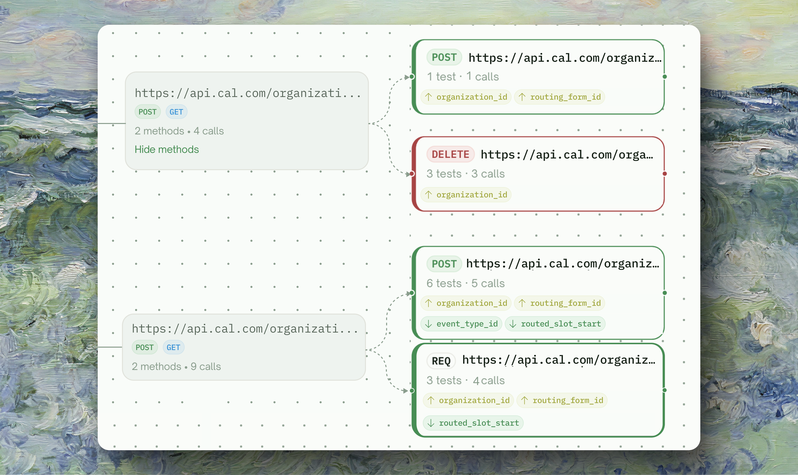

<Frame>
  
</Frame>

## What Dependency Chains Are

When tests share [dynamic variables](/web-portal/core/api/dynamic-variables), they form a chain of producers and consumers:

| Endpoint | Produces | Uses |
| :--- | :--- | :--- |
| POST /users | `user_id` | — |
| POST /orders | `order_id` | `user_id` |
| GET /orders/`{id}` | — | `order_id` |
| DELETE /orders/`{id}` | — | `order_id` |

A producer always runs before the tests that use its values, and TestSprite orders the run accordingly. [Auto Cleanup](/web-portal/core/api/auto-cleanup) follows the same dependencies in reverse: children first, then parents.

## How TestSprite Runs Your Tests

Independent tests run in parallel; tests that depend on others wait until the values they need are available. A 50-test plan with several dependency layers finishes in roughly the time of its slowest layer, not 50× the average.

## Test Status During a Run

| Status | Meaning |
| :--- | :--- |
| <kbd>Queued</kbd> | Waiting for an earlier step to finish; not yet executed |
| <kbd>Running</kbd> | Currently making the HTTP call |
| <kbd>Passed</kbd> | Finished, assertions held |
| <kbd>Failed</kbd> | Finished, assertions didn't hold |
| <kbd>Blocked</kbd> | An earlier test failed; this test was never run because the value it needs isn't available |

<Info>
**Blocked is not Failed.** A Blocked test never ran, so it isn't a bug in your API. It's a symptom of a Failed test upstream; start triage there.
</Info>

## Where to See the Dependency Graph

Each test's [Data Flow section](/web-portal/core/api/dynamic-variables#the-data-flow-section-on-a-test) shows what it captures and consumes. A run's [Dynamic Variables](/web-portal/core/api/dynamic-variables) tab lists every variable with its **Source** (producer) and **Used by** (consumers). For one integration chain, its detail page shows the steps in run order.

## Circular Dependencies

If two tests need values from each other, the chain can't be assembled. TestSprite reports "Could not assemble — circular dependency between X and Y", and you'll need to refine in chat. This is rare and usually points to an API design issue.

## Multiple Producers for the Same Variable

If two tests produce the same variable name (e.g., both POST /users and POST /admins produce `user_id`), TestSprite picks one consistently for downstream consumers. To disambiguate:

<CodeGroup>
```text Disambiguate
The user_id used by POST /orders should come from POST /users, not POST /admins.
```

```text Rename
Rename the value produced by POST /admins to admin_user_id to avoid the conflict with POST /users.
```
</CodeGroup>

## When an Earlier Test Fails

Anything that depends on a failed test's values is Blocked:

```
POST /users         → assertion failed (status was 500)         [Failed]
POST /orders        → needs user_id, can't run                  [Blocked]
GET /orders/{id}    → needs order_id, can't run                 [Blocked]
DELETE /orders/{id} → needs order_id, can't run                 [Blocked]
```

The matching cleanup is marked Skipped too, since the record was never created. Fix the failing test (or your API), then [rerun the chain](/web-portal/core/api/api-rerun): TestSprite re-runs the failing test and its Blocked downstream tests.

## Edge Cases & Troubleshooting

<AccordionGroup>
  <Accordion title="A test is Blocked but I can't tell which upstream caused it">
    Open the Blocked test; the error trace names the missing variable. Search the Dynamic Variables tab for it to find the producer, which will be Failed.
  </Accordion>
  <Accordion title="My run has many small chains and I want them all to run in parallel">
    They already do. If runs look serial, your tests probably all share one upstream (typically a `user_id` from a single POST /users). Refine in chat to produce a small pool of users instead.
  </Accordion>
  <Accordion title="Producer succeeded but consumer says variable was not found">
    That's a variable resolution issue, not a dependency issue. See [Dynamic Variables: Troubleshooting](/web-portal/core/api/dynamic-variables#edge-cases-and-troubleshooting).
  </Accordion>
  <Accordion title="The dependency graph shows tests I expected to be related as disconnected">
    They probably don't share a variable name, so they're treated as independent. Refine in chat: "POST /sessions should produce user_id, GET /me should use user_id".
  </Accordion>
  <Accordion title="A chain ran out of order (a later step ran before its dependency)">
    This shouldn't happen. If it does, check the chain's order in the Integration Tests tab and refine in chat: "The chain order should be POST /users → POST /sessions → POST /orders".
  </Accordion>
</AccordionGroup>

## Where to Go Next

<Columns cols={2}>
  <Card title="Dynamic Variables" href="/web-portal/core/api/dynamic-variables" icon="brackets-curly">
    Values produced by one test and used by another
  </Card>
  <Card title="Auto Cleanup" href="/web-portal/core/api/auto-cleanup" icon="broom">
    Records created during a run get removed afterward
  </Card>
  <Card title="Integration Tests" href="/web-portal/core/api/integration-tests" icon="link">
    Multi-step chains where one test's output feeds the next
  </Card>
  <Card title="Rerun" href="/web-portal/core/api/api-rerun" icon="arrow-rotate-right">
    Per-test and per-chain reruns
  </Card>
</Columns>
